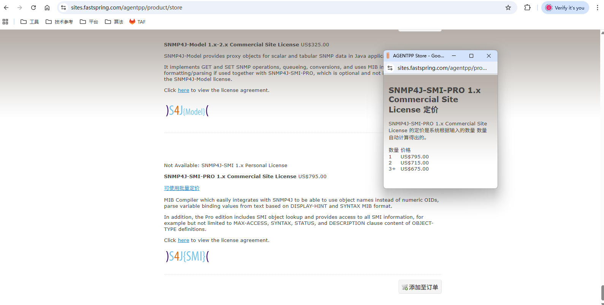
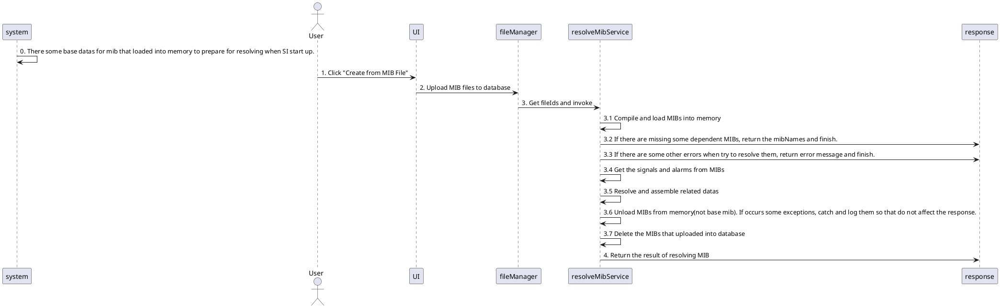
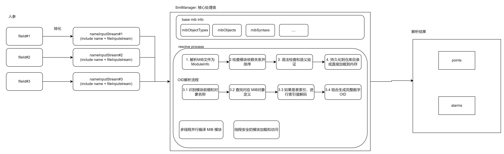
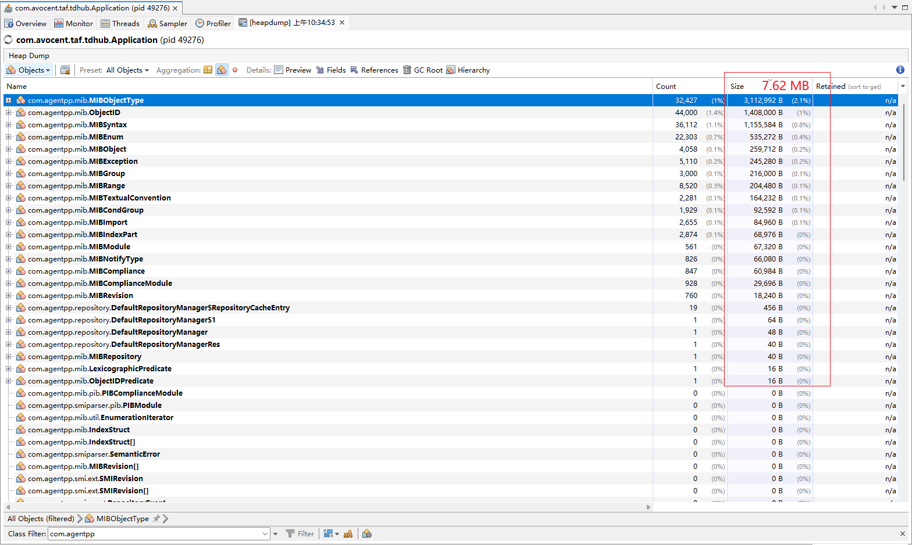

# Resolve mib design

## audit record

| version | timestamp | author | notes       |
|---------|-----------|--------|-------------|
| 1.0.0   | 2025.9.18 | juntao | since SI4.1 |

## business background

1. SI4.1 需要支持用户创建模板, 从 .template 文件, .mib 文件等导入创建模板
2. 本文针对从 .mib 文件导入创建模板, 支持一次性同时导入多个 MIB(指的是 主MIB + 多个依赖 MIB)

备注:
 - 厂商的 MIB 文件, 有时候需要依赖自家的底层 MIB文件(里面定义了私有的数据结构), 才能够解析成功 (比如导入 CISCO-APS-MIB.mib 需要先导入 CISCO-SMI-MIB.mib)
 - 同时所有的 MIB 文件解析, 都需要依赖国际标准的基础 MIB(SNMPv2-SMI.mib等)才能解析
 - CISCO-APS-MIB.mib:
```text
   IMPORTS
        MODULE-IDENTITY, NOTIFICATION-TYPE,
        OBJECT-TYPE,
        Gauge32, Counter32, Integer32,
        transmission
          FROM SNMPv2-SMI
          
        TEXTUAL-CONVENTION, RowStatus,
             TimeStamp
          FROM SNMPv2-TC

        SnmpAdminString
          FROM SNMP-FRAMEWORK-MIB

        InterfaceIndex
          FROM IF-MIB

        MODULE-COMPLIANCE, OBJECT-GROUP, NOTIFICATION-GROUP
          FROM SNMPv2-CONF

        ciscoExperiment FROM CISCO-SMI;
    cApsMIB MODULE-IDENTITY
       LAST-UPDATED    "200112261200Z"
       ORGANIZATION    "Cisco Systems, inc"
       CONTACT-INFO
                       "Cisco Systems, Inc.
                        Customer Service
                        Postal: 170 W. Tasman Drive
                                San Jose, CA  95134-1706
                                USA
                        Tel: +1 800 553-NETS
                        Email: gsr-netman@cisco.com"

       DESCRIPTION
           "This management information module supports the
            configuration and management of SONET linear APS groups.
...
```
 - geist_v5.mib
 ```text
VERTIV-V5-MIB DEFINITIONS ::= BEGIN

IMPORTS
DisplayString, TruthValue, MacAddress FROM SNMPv2-TC
SnmpAdminString FROM SNMP-FRAMEWORK-MIB
MODULE-IDENTITY, OBJECT-TYPE, enterprises, Integer32,
Gauge32, NOTIFICATION-TYPE, OBJECT-IDENTITY FROM SNMPv2-SMI
sysName FROM SNMPv2-MIB;

vertiv MODULE-IDENTITY
	LAST-UPDATED "202310160000Z"
	ORGANIZATION "Vertiv"
	CONTACT-INFO "geistsupport@vertiv.com"
	DESCRIPTION
		"The MIB for Vertiv products"
...
```

## requirement description

### business requirement

[US1095 Add Template-Create from MIB file](https://rally1.rallydev.com/#/329266204304d/myrally?detail=%2Fuserstory%2F822958289495%2Fdetails&fdp=true)

### figma

https://www.figma.com/design/lOfuSSMW64Ho5fTTw8Zgpa/Next-Site-v4.1?node-id=108-39366&t=wJ6UzSUUEkSkEBFI-0

## prerequisite knowledge
### SNMP

[SNMP 介绍](https://support.huawei.com/enterprise/zh/doc/EDOC1100087025) <br>

### Mib

1. MIB (Management Information Base) 文件的编写完全遵循 ASN.1 规范(Abstract Syntax Notation One) <br>
2. ASN.1 提供了一套标准化的抽象语法规则, 用于描述数据的组织形式, 确保不同厂商设备和管理系统之间能无歧义地交换信息 <br>
3. 同时 MIB 对于 ASN.1 有专属的扩展 SMI(Structure of Management Information), 可以扩展 ASN.1 里面的数据类型等 <br>
4. MIB 实际上是 "ASN.1 + SMI宏" <br>
   最常用的宏为 [ MODULE-IDENTITY, OBJECT IDENTIFIER, OBJECT-TYPE, NOTIFICATION-TYPE, TRAP-TYPE (SNMPv1) ] <br>
   宏详细举例见 ##notes mib marco <br>
   数据类型见 ##notes mib dataType <br>

| 类型名称                      | 主要作用                                  | 主要作用                                                    |
|---------------------------|---------------------------------------|---------------------------------------------------------|
| MODULE-IDENTITY           | 定义整个 MIB 模块的“身份证”                     | 整本书的封面和版权页                                              |
| OBJECT IDENTIFIER         | 定义 OID 树中的一个节点（分支或叶子）                 | 书中的章节号                                                  |
| OBJECT-TYPE               | 定义具体的、可被管理的对象（数据点）                    | 章节下的具体段落内容                                              |
| OBJECT-IDENTITY           | 定义某个 OID 节点的辅助信息                      | 对某个章节号的文字说明                                             |
| TEXTUAL-CONVENTION        | 创建具有特定语义的自定义数据类型                      | 自定义一套排版术语（如“重点框”）                                       |
| NOTIFICATION-TYPE         | 定义设备主动上报的事件（Trap/Inform）              | 书中的特别公告或警报                                              |
| TRAP-TYPE (SNMPv1)        | SNMPv1 中的事件定义, 功能类似 NOTIFICATION-TYPE | 旧版的公告格式                                                 |
| OBJECT-GROUP              | 将多个相关的 OBJECT-TYPE 对象分组               | 将相关段落编成一个主题单元                                           |
| NOTIFICATION-GROUP        | 将多个相关的 NOTIFICATION-TYPE 事件分组         | 将相关公告编成一个系列                                             |
| MODULE-COMPLIANCE         | 声明实现该 MIB 模块需要满足的最低一致性要求              | 本书的阅读指南或必备知识                                            |
| AGENT-CAPABILITIES        | 描述特定 SNMP 代理对该 MIB 模块的实际实现能力          | 某个出版社对本书内容的实际印刷说明                                       |
| 表结构宏组合 (SEQUENCE + INDEX) | 把同种类/分支的信号配置集中定义                      | 比如: (输出口1电流, 输出口2电流...) 或 (输出口1电流, 输出口1电压, 输出口1功率...) 等 |

### Technology selection

#### 手搓 MIB解析代码
1. 需要很了解 Mib 文件所遵循的 ASN.1 规范 和 SMI 等知识, 处理所有场景, 开发难度大, 需要时间长, 同时出现问题的概率也大
2. 解析代码由我们直接维护
3. 不建议

#### Net-SNMP
1. 需要在机器环境上安装工具, "sudo yum install net-snmp net-snmp-utils"
2. 需要在 Java 环境中通过 JNI 调用 C 库 Net-SNMP, 并且编译本地库
3. 同时输出的是 Mib 文件中的文本内容, 需要我们这边自己手动创建 Bean 等接收, 分析和处理等
4. 会引入额外的工具, 使用难度也不小
5. 不建议

#### Mibble
1. 项目地址: https://github.com/cederberg/mibble
2. 使用 GPLv2 协议, 需要在 SI 中强依赖 Mibble 代码(导入 jar 依赖, 直接调用接口等), 属于 "衍生作品", 需开源 SI 代码, 或购买 license
3. license 为一次性费用(1500+欧元), 提供以下内容:
    - 完整源代码可用性, 并被授予进行专有更改的权限
    - 许可分发, 基于、使用或包含 Mibble 代码的软件可以二进制或源代码形式分发, 但第三方(即客户)无权进一步分发
    - 无需版税, 永不过期
4. 看到最新代码为 2017/2/20, 没有再维护和开发

[buy license](https://www.mibble.org/store/index.html) <br>


#### SNMP4J-SMI-PRO
1. 官网地址: https://agentpp.com/api/java/snmp4jsmipro.html
2. 核心功能:
   1. 标准化解析: 将 ASN.1 规范的 MIB 文件编译成 Java 对象模型
   2. 依赖管理: 自动解析并处理 MIB 文件之间的复杂依赖关系, 无需手动按顺序加载
   3. SMI支持: 全面支持 SMIv1 和 SMIv2 结构, 确保对绝大多数公有和私有 MIB 的良好兼容性 (SMIv1 && SMIv2 知识见 ##notes "SMIv1 && SMIv2")
   4. 纯 Java 编写的后端工程, 除解析 MIB 外无其他明显功能
   5. API 内部逻辑比较复杂, 学习曲线陡峭
3. 付费项目, 商业付费许可证
   1. 获得在一个特点办公地点(Site, 邮政地址)内永久使用该软件源代码和目标代码的权利; 795$;
   2. 一次性费用, 包含当前购买版本下的所有小版本, 比如 1.X.X, 对于新版本 2.X.X 需要再付费(目前他们没有再做大版本的计划);
   3. 可以基于它开发并无限制分发自己的应用程序, 但不能直接重新分发 SNMP4J-SMI-PRO 的源代码(不做任何更改);
   4. 购买后会获取到 90days 的支持, 包含安装和基础使用; 如果需要更多支持则需要购买年度支持包 (SNMP4J Annual Support package for $975);
   5. SNMP4J-SMI-PRO 要求实际开发和控制(打包编译) 的地方都要买 license(如果不是开发和编译不是同个地方则需要买两个 license), 并不是按照最终成品运行的服务器数量收费的;
4. 代码并没有分享出来, 官网提供了 jar 包的下载, 但可以从 changelog 看出还有维护代码, 最近的一次 bug 修复为 2025/5/17 (https://www.snmp4j.org/smi/pro/CHANGES.txt)

[buy license](https://sites.fastspring.com/agentpp/product/store) <br>


目前对于 Mibble 和 SNMP4J-SMI-PRO 都已经做完 poc 代码了.
   - 两者都能成功解析 MIB, 但是 Mibble 只能在加载工程内置路径下的依赖 MIB(除非修改源码), SNMP4J-SMI-PRO 可以加载外部的依赖 MIB
   - SNMP4J-SMI-PRO 能解析出更加全面的内容, 相比来说, 在使用上比 Mibble 好用
   - SNMP4J-SMI-PRO 还有维护, 而 Mibble 在 2017 年后并没有代码提交, 以及 Github 上面显示只有四位贡献者
   - SNMP4J-SMI-PRO 相比来说比 Mibble 要便宜
   - 目前 zero engine 使用 SNMP4J 来获取实时信号值和接收告警, SNMP4J 系列工程是在 Java 生态中主流的解决方案

建议选择 SNMP4J-SMI-PRO <br>
下面是基于 SNMP4J-SMI-PRO 进行的考虑和详细设计 <br>
注: SNMP4J-SMI-PRO 解析 MIB 情况见 ##notes "使用 SNMP4J-SMI-PRO 解析 MIB" <br>

## function description

1. 支持解析上传的 Mib 文件(.mib), 接口为内部 service 层调用

## detailed design

### 解析 Mib

注: 只负责 service 层的逻辑, 下面时序图只是为了展示整个流程



#### SNMP4J-SMI-PRO 解析 MIB 的内部流程如下



## interface doc
1. 解析 MIB
- public TemplateData resolveMibService(String mibFileId, List<String> allMibFileIds)
- mibFileId: 
  - 值存在(不为 null 且不为 空串)时, 用户知道他真正需要解析的是哪个 MIB, 并且把复选框勾上了, SI 只会解析主体 MIB 里面的信号和告警;
  - 值不存在(为 null 或为 空串)时, 意味着用户并不知道主体 MIB, 没有勾选复选框, SI 会解析上传的所有 MIB 里面的全部信号和告警, 并且按照 MIB名称分组返回;
- allMibFileIds: mibFileId 值不存在时, 表示用户上传的所有 MIB; 否则只表示主体 MIB 所依赖的 MIB 列表;
- 接口处理完后, 不管解析成功或者失败(异常等), 都会删除用户上传的所有 MIB 数据库信息, 但如果用户上传的是 RFC-1212 这种基础MIB, 则不会删除此文件;
- 举例: 如果用户选择了5个 MIB(A, B, C, D, E), 选择了 A 作为 primary MIB, 则 mibFileId = A, allMibFileIds = [A, B, C, D, E]
   - 比如: mibFileId = B, allMibFileIds = [A, C, D, E] 这种情况下会报错. 
     - 因为在加载到 A 的时候, 因为其本身需要依赖MIB [B] 里面的信息, 但这个时候还没有加载 B, 所以会找不到相关信息, 报错 缺少依赖
     - 所以 allMibFileIds 需要包含所有的 MIB, 不能排除 primary MIB

## data model

1. TemplateData:
    - baseInfo: 模板的基础信息, 类型为 TemplateBaseInfo
    - datas: 从 MIB 或 EA模板解析出来的信息, 数组 list, 类型为 ResolvedData

2. TemplateBaseInfo:
    - name: 模板名称, 取值为 MIB 中的 "DEFINITIONS ::= BEGIN" 定义的名称
    - protocol: 协议, 目前默认为 "SNMP"
    - deviceType: 设备类型, 目前返回 ""
    - manufacturer: 所属厂商, 取类型为 "MODULE-IDENTITY" 节点的 "ORGANIZATION" 属性值返回
    - model: 设备型号, 目前返回 ""
    - interfaceCardType: 通讯卡, 目前返回 ""
    - description: 描述, 取类型为 "MODULE-IDENTITY" 节点的 "DESCRIPTION" 属性值返回 
    - 
    - 从 MIB 获取不到则会返回 "" 给到前端
    - 入参 mibFileId存在时, name 属性值为这个 MIB 对应的名字; 否则则在 allMibFileIds 里面尝试解析并确定一个 MIB 给到 name

3. ResolvedData:
   - name: MIB 名称或者 EA模板名称
   - signals: 解析出来的信号, 数组 list, 类型为 PointDefinition; 对于 MIB, 数据解析来源主要为 MIB 文件中的 [OBJECT-TYPE] 节点;
   - alarms: 解析出来的告警, 数组 list, 类型为 AlarmDefinition; 对于 MIB, 数据解析来源主要为 MIB 文件中的 [NOTIFICATION-TYPE, TRAP-TYPE] 节点;
   - 
   - mibBaseInfo: MIB 的基础信息, 类型为 TemplateBaseInfo

4. PointDefinition:
    - name: 信号的原始名称, 比如 "pduOutletMeterInstCo2"
    - oid: 信号的 OID, 比如 "1.3.6.1.4.1.21239.5.2.3.6.1.25"
    - group: 该信号属于哪个分组下, 比如 "deviceInfo", "pduPhaseTable" 等
      - 判断逻辑: 当前 OID 最匹配 "OBJECT IDENTIFIER" 类型的节点名称
      - 例子: geist_v5.mib: 
        - productVersion("1.3.6.1.4.1.21239.5.2.1.2") 同时匹配 deviceInfo("1.3.6.1.4.1.21239.5.2.1") 和 imd("1.3.6.1.4.1.21239.5.2") 等等
        - 但 deviceInfo 比起 imd 匹配的更多, 所以 productVersion 的 group 为 deviceInfo
        - Table-Entry-Signal, 则对于 Signal 来说, 取 Table 这一层作为 group 更为容易理解
        - 没有找到匹配的, 则给默认值 "--"; 容错手段, 目前没有找不到 group 的情况;
    - branchIndex: 分支范围, 类型为 IndexRange // 计算字段, 和创建模板时的集合类型的测点有关
    - 
    - writable: 是否可写, boolean, 默认为 false, 计算字段, 由 originalAccess 转化
    - access: 信号的访问权限, [Read, Write, ReadWrite], 计算字段, 由 originalAccess 转化
    - 
    - valueType: 信号的值类型, [Integer, Float, String], 计算字段, 由 originalValueType 转化
      - Integer: 对应 MIB文件中的原始类型为: ["INTEGER", "Integer32", "Unsigned32", "Counter", "Counter32", "Counter64", "Gauge", "Gauge32", "TimeTicks", "TimeStamp", """TestAndIncr", "TruthValue", "RowStatus" 等等] 
      - Float: 解析不出来, 在这里不处理; 但需要在用户填写了 scaling 和 decimalPlace 后设置为 Float
      - String: 对应 MIB文件中的原始类型为: ["OCTET STRING", "DisplayString", "SnmpAdminString","OBJECT IDENTIFIER","AutonomousType", "VariablePointer", "RowPointer","IpAddress", "PhysAddress", "MacAddress", "NetworkAddress","Opaque",~~"NULL"~~,~~"BITS"~~,"DateAndTime", "SnmpUDPAddress", "SnmpOSIAddress", "SnmpIPXAddress" 等等]
      - 目前拥有位于 [BITS] 原始类型的信息会被过滤掉, 不处理, 可以通过日志观察到, 比如 "TEST-BITS-DIRECT : filter out unsupported signal: [name = testBits, originSyntax = BITS]"
    - valueCategory(线框图上是Type): 值分类 [Numeric, Enumerated, String], 计算字段, 由 originalValueType 转化
      - 取值基于上述属性 valueType, 其中 Integer 分为 Numeric 和 Enumerated, String 对应 String
    - pointCategory: 信号类型, [Sample, Config, Control], 计算字段, 由 access + valueCategory 计算
      - 规则为 [Read -> Sample, ReadWrite/Write + Numeric -> Config, ReadWrite/Write + Enumeration/String -> Control]
    - 
    - mappings: 枚举, 数组 list, 类型为 PointEnum
    - hourStorage: 是否存储, boolean, 默认为 false
    - 
    - scaling: 缩放, float, 默认为 1.0 [值为 100, 则表示需要把采集值(原始值) * 100; 值为 0.1666.., 则表示需要把采集值 / 6]
    - decimalPlace: 小数点后几位, int, 默认为 0
    - 
    - unit: 信号单位, 来自 originUnit, 由前端处理
    -
    - programmaticName: taf 体系下的可编程名字, pName
    - 
    - description: 描述, 比如 "Instantaneous CO2 emission for outlet, in grams per hour"
    -
    - originSyntax: 原始值类型, 比如 "Integer32 ranges(0..59)", "INTEGER enums([close(1), suspend(2), open(3)])" 等等

5. MibPointDefinition extends PointDefinition: // 仅计算用, 不返回
    - status: 信号的状态, [current: 可用, deprecated: 废弃, obsolete 过时, mandatory 强制实现(在旧规范SMIv1中使用)]
      - 过滤出 current/mandatory 或者 status 字段本身都没有定义 的信号进行下一步分析或者过滤(根据 access, valueType, valueCategory等)
    - originalAccess: 信号的原始访问权限, [read-only, write-only, read-write, read-create, not-accessible, not-implemented, accessible-for-notify等等]
      - read-only -> Read, write-only -> Write, read-write, read-create -> ReadWrite
      - 其他类型 not-accessible, accessible-for-notify等等目前不处理, 过滤掉, 不返回给前端, 只打印日志
      - read-create: SNMP4J-SMI-PRO 并没有处理, 会直接报错不是期望的 ACCESS/MAX-ACCESS
    - originalValueType: 信号的原始数据类型, 比如 "Integer32 ranges(0..59)", "INTEGER enums([close(1), suspend(2), open(3)])"
      - 只处理
         - 枚举
         - 整型及可以转化为整型的原始数据类型(忽略大小写)(["INTEGER", "Integer32", "Unsigned32", "Counter", "Counter32", "Counter64", "Gauge", "Gauge32", "TimeTicks", "TimeStamp", """TestAndIncr", "TruthValue", "RowStatus"])
         - 字符串及可以转化为字符串的原始数据类型(忽略大小写)(["OCTET STRING", "DisplayString", "SnmpAdminString","OBJECT IDENTIFIER","AutonomousType", "VariablePointer", "RowPointer","IpAddress", "PhysAddress", "MacAddress", "NetworkAddress","Opaque",~~"NULL"~~,~~"BITS"~~,"DateAndTime", "SnmpUDPAddress", "SnmpOSIAddress", "SnmpIPXAddress"])
         - 目前拥有位于 [BITS] 原始类型的信息会被过滤掉, 不处理, 可以通过日志观察到, 比如 "TEST-BITS-DIRECT : filter out unsupported signal: [name = testBits, originSyntax = BITS]"
         - TEXTUAL-CONVENTION 节点是厂家自定义的值类型, 如果在当前 MIB 文件中能找到, 也进行解析, 规则和上述前三点一致
      - 非上述类型的, 也直接过滤掉, 不返回给前端, 打印日志
    - ranges: 整型取值范围, 类型为 IndexRange
    - originUnit: MIB 中定义的单位, String, 比如: "watts", "%", "watt-hours" 等, 这里解析出来的一般是单位名称, 需要前端根据名称在内置的单位列表中(来自unit.xlsx)匹配, 找不到则置空;

6. PointEnum:
    - originalValue: 原始值, 比如 1, 2 等
    - mappingValue: 映射值, 比如 "close", "suspend" 等

7. IndexRange:
    - min: 最小值
    - max: 最大值
    - 判断逻辑: 
      - MIB 文件中 "OBJECT-TYPE" 类型节点的值类型(SYNTAX) 为自身文件定义的另外一个 "OBJECT-TYPE"类型节点
      - 常见为 XXXTable 与 XXXEntry, 这时候可以看到 XXXEntry 下有字段"INDEX", IndexRange 就取 XXXIndex 的 SYNTAX 的取值范围
      - 如果 1.有这个结构(XXXTable -> XXXEntry), 但是找不到 XXXIndex, 则 min 和 max 都赋值为 1
      - 如果 2.有结构(XXXTable -> XXXEntry -> XXXIndex), 但是 XXXIndex 里面的值类型(SYNTAX) 没有定义明确范围(比如 INTEGER), 则 min 为 1, max 为 100 todo
      - 例子: geist_v5.mib: pduMainTable -> pduMainEntry -> pduMainIndex --> SYNTAX Integer32(1..100)
      - 注意: 这个过程有可能同时存在两个或以上的 Index 字段, 比如 CISCO-APS-MIB: cApsCommandTable -> CApsCommandEntry 
        - -> INDEX {cApsChanConfigGroupName, cApsChanConfigNumber} -> 这个时候则取索引字段里面有范围的随机一个, 如果都不是的话则同没有定义明确范围的情况, min 为 1, max 为 100

8. AlarmDefinition: 
    - name: 告警的原始名称, 比如 "pduSourceCurrentCrestFactorCLEAR"
    - oid: 告警 oid, 活跃和清除告警都是同一个(Unity/RDU120/RDU101)
    - description: 告警的描述, 比如 "Source current crest factor clear trap"
    - alarmSeverity: 告警等级, [Information, Warning, Critical]
    - programmaticName: taf 体系下的可编程名字, pName
    - [注] 以下 9 ~ 11 在解析 MIB 响应里面并不会返回, 只是为了在页面选择和设置值后, 后端可以接收(给到琨奇处理)
   
9. PduAlarmDefinition: extends AlarmDefinition
   - activeOid: 活跃告警的 OID, 比如 "1.3.6.1.4.1.21239.5.2.32767.0.10119"
   - clearOid: 清除告警的 OID, 比如 "1.3.6.1.4.1.21239.5.2.32767.0.20119"
   - thresholdType: 告警类型, [1: 过低, 2: 过高, -1: None]

10. ThirdPartAlarmDefinition: extends AlarmDefinition
    - enterpriseOid: enterpriseOid, 比如 "1.3.6.1.4.1.21239.5.2.32767"
    - activeSpecificTrap: 活跃告警的 OID, 比如 "1.3.6.1.4.1.21239.5.2.32767.10119"
    - clearSpecificTrap: 清除告警的 OID, 比如 "1.3.6.1.4.1.21239.5.2.32767.20119"
    - activeTrapRules: 辨别活跃告警的规则, 如果满足则是活跃告警, 数组 list, 类型是 TrapCriteriaRule 
    - clearTrapRules: 辨别清除告警的规则, 如果满足则是清除告警, 数组 list, 类型是 TrapCriteriaRule

11. TrapCriteriaRule:
    - bindingsOid: 信号oid 
    - conditionType: 触发类型, [equals, not equals, contains, exists]
    - value: 信号对应的值
    - ignoreCase: 是否忽略大小写, boolean, 默认为 false

12. TemplateResolvedFailInfo extends TemplateData:
    - failInfos: 每个文件解析失败的原因, 数组 list, 类型为 ResolvedTemplateInfo

13. ResolvedTemplateInfo:
    - fileId: 文件 Id
    - errorKey: 失败原因 key, 从多语言网站出来; 对于解析 MIB 来说, 包含 ["Dependent file XXX is missing...", "File cannot be parsed or parsing error occurs"]
    - dependentMibName: 没导入的依赖 MIB 名称
    - ~~fileName: 解析失败的文件名称~~
    - ~~details: 提示信息里面占位符的填充值, 数组 list, 类型为 String;~~
      - ~~按照顺序依次填充到上面 errorKey 的占位符里面~~
      - ~~比如: details[0] = "CISCO-SMI", 最后的效果是 "Dependent file CISCO-SMI is missing..."~~
   
### security requirement

#### snmp4j-smi-pro 的 license key
解析MIB 的实现代码需要使用这个 license key, 目前只是用 反射 绕过校验 <br>
校验源码大体如下: <br>
```java
public final class SmiManager implements OIDTextFormat, VariableTextFormat, SmiCompiler {
    private SmiManager(String licenseKey) {
        // 省略代码
        this.limited = true;
        this.proEdition = false;
        // ...
        // licenseKey 为 null, 则后续获取 MIB 数据逻辑会直接返回异常
        if (licenseKey == null) {
            this.limited = true;
        } else {
            try {
                // licenseKey 错误, 则直接把当前程序结束 (会直接把 SI 也关闭了)
                String[] licFragments = licenseKey.split("/");
                if (licFragments[0].startsWith("bf 6 5d 61 f ec b0 b4")) {
                    System.err.println("Invalid license, aborting!");
                    System.exit(1);
                }

                byte[] lic = Val.fromHexString(licFragments[0].trim());
                if (!this.getTime(lic, licFragments[1].trim().getBytes())) {
                    try {
                        Thread.sleep(10000L);
                    } catch (Exception var5) {
                    }

                    System.err.println("Invalid license, aborting!");
                    System.exit(1);
                }
            } catch (Exception var6) {
                System.err.println("Invalid license, aborting!");
                System.exit(1);
            }

            this.limited = false;
        }
    }
}
```

存在两个问题:
1. 单个/多个 license key 存储在哪里？
   1. 代码硬编码？
   2. 配置文件？
   3. 数据库？ 
   4. ?
   5. 加密后存储到配置文件
2. license key 需要加密么？- 需要
3. 以上两个问题, 属于安全问题, 需要解决;  - 加密后存储到运行时的配置文件, application-prod.properties 
4. 同时, 需要详细考虑在 SI 容器化的情况下怎么实现,  需要设计文档 - 由梁雷组修正 SI 的安全问题过程中解决


#### 基础 MIB 压缩包

1. 解析 MIB 必须要有基础 MIB(至少国际标准的, 比如 SNMPv2.mib), 这些 MIB 可以打包成一个压缩包, 供程序启动后读取并且加载到内存中, 所以这些 MIB 存储在哪里?
   1. 放在插件里面, resource 目录下? 插件启动则把这些基础 MIB 加载到内存?
   2. 存储到数据库(fs.files: 文件信息, fs.chunks 文件内容)? SI 初始化的时候加载到数据库, 插件启动的时候从数据库加载到内存(db.fs.files({"metadata.filePath" : "/baseMIB"}))?
   3. 服务器上的某个位置? /opt/trellissmartinfrasight/data? 备份恢复业务是否需要兼容？
   4. 目前选择方案1, 即放到插件里面, 随着插件启动再加载到内存, 不存储到数据库; 
      1. 可以通过吃包来新增基础依赖MIB, 也可以减少数据库数据 

2. 依赖 MIB 导入后是否需要保存起来, 相同模块的会被覆盖 --- 不保存
3. 是否需要在 SI4.1 先只支持某些主流的第三方厂商(或支持得比较好), 其他的不一定能保证? 划定范围？--- 不限制范围
4. 国际标准的 MIB 来源选择 SNMP4J-SMI-PRO 里面自带的 "SMIv2.zip" 和 "RFCs.zip". (是 SNMP4J-SMI-PRO 收集的分别关于 IANA 和 IETF组织的, 相关知识见 ##notes "IANA && IETF")
   1. 两个压缩包总共 4.5M, 554个 MIB, 编译并且加载到内存的时候为 30s~1min, heap dump 之后占用大概 7.6M
   2. 不会因为加载了大量基础MIB, 而占用了大量的内存

 <br>


#### 其他问题考虑 [todo]
1. 第三方的 MIB 创建出来的 模板 怎么验证 信号, 告警等是否正常？是否需要有设备？
2. 是否支持多用户并发操作, 即同时进行解析MIB 和创建模板?
3. 单个用户解析MIB, 目前是一次性最多上传 10个MIB文件, 每个文件最大为 2MB, 是否有性能问题? 


## 错误码设计

### SI 解析 MIB 错误码
  - 需要产品经理新增错误提示信息(包括多语言)
  - 解析失败时, 会根据返回的解析错误码, 打印日志, 再把错误码转换成 SI的错误码返回给到前端展示

| 编号 | 错误码  | 使用范围          | 备注                                                                                                            |
|----|------|---------------|---------------------------------------------------------------------------------------------------------------|
| 1  | 依赖缺失 | 缺少依赖 MIB      | 可提示错误信息给用户, 导入 依赖 MIb 后重试                                                                                     |
| 2  | 解析错误 | 除 #1 外的所有异常场景 | #1 的场景可以在导入 依赖 MIB 后重试. <br/> 其他场景, 大多数是 MIB 编写有问题, 用户修正不了, <br/> 就算修正了, 也不能保证后续使用时没问题, <br/> 这个时候只能让用户手动创建模板 |

分别为:
1. DATA.F.FILE_PARSE_FAILED
   1.1 英文: File cannot be parsed or parsing error occurs.
   1.2 中文: 文件无法解析或发生解析错误。
2. DATA.D.DEPENDENT_FILE_MISSING: 
   1.1 英文: Dependent file {{bb}} is missing, please try again and make sure all the dependent MIB files are selected.
   1.2 中文: 依赖文件 {{bb}} 丢失，请重试并确保选择所有依赖 MIB 文件。
   1.3 具体为 SNMP4J-SMI-PRO 返回的错误码: [1100: IMPORT_UNKNOWN, 1111: MISSING_IMPORT]

### SNMP4J-SMI-PRO 错误码

#### 快速参考表

| 错误码范围         | 主要类别   | 常见原因示例                                |
|---------------|--------|---------------------------------------|
| **0-99**      | 基础错误   | 文件未找到、I/O错误、未知错误                      |
| **1000-1099** | 语法错误   | DISPLAY-HINT解析错误、DateAndTime类型错误、非法子句 |
| **1100-1199** | 导入错误   | 模块未找到、循环导入、重复导入、缺少必要导入                |
| **1200-1299** | 一致性错误  | 语法/状态/访问权限不一致、创建要求子句使用不当              |
| **1500-1599** | 引用错误   | 引用未定义的对象、语法或名称                        |
| **1600-1699** | 引用错误   | 引用的对象类型错误（不是表/组/OBJECT-TYPE）          |
| **1700-1799** | 类型错误   | 使用了不兼容或不支持的类型                         |
| **1800-1899** | 表/索引错误 | 表定义不一致、索引无效或缺失、索引长度问题、标量对象误用为索引       |
| **2000-2099** | 注册错误   | OID重复注册、非法注册位置                        |
| **3000-3099** | 默认值错误  | 默认值超出范围、大小无效或不合法                      |
| **4000-4099** | 语法错误   | 无效的语法精化、范围定义错误、DISPLAY-HINT使用不当       |
| **5000-5199** | 组错误    | 对象未包含在组中、组中包含非法访问权限的对象、通知变体访问权限问题     |
| **6000-6099** | PIB错误  | PIB索引类型错误、标签无效或缺失、引用无效、唯一性约束问题        |

#### 错误码详细信息
- 见 ##note SNMP4J-SMI-PRO 错误码详细信息

## performance requirement
可能耗时长的时间为 加载基础 MIB 到内存这一过程(需要考虑加载基础 MIB 的来源, 范围, 数量等). <br>
解析 MIB 都是基于内存操作, 很快的.

## upgrade
不考虑从 SI4.1 之前的版本升级到 SI4.1

## affection
新功能, 无其他影响

## risk
SNMP4J-SMI-PRO 中 解析MIB 的具体实现逻辑(源码)很复杂, 出现问题需要时间仔细排查

## notes
### SNMP4J-SMI-PRO 解析:
1. 特殊字符:
   1. MIB 中包含特殊字符的时候会解析失败, 比如 [@, ...? 待研究todo]; 但如果是 [-, _], 能解析成功
   2. 报错信息如: Resolve mib: driver11.driver failed, errorNumber: 50, message: [driver11.driver] [0050]: Lexical error at line 139, column 8.  Encountered: "@" (64), after : ""
2. 文件编码:
   1. 某些格式的文件解析会报错, 比如 [UTF-16 BE, ...? 待研究todo]; 但如果是 [ANSI, UTF-8] 能正常解析
   2. 包含中文也会报错; 如: Resolve mib: driver13.driver failed, errorNumber: 50, message: [driver13.driver] [0050]: Lexical error at line 160, column 18.  Encountered: "\u6d4b" (27979), after : "\""

### 使用 SNMP4J-SMI-PRO 解析 MIB

| MIB                                                                          | 厂商                           | 依赖厂商私有 MIB                                                                         | 是否可以解析成功                   | 备注 |
|------------------------------------------------------------------------------|------------------------------|------------------------------------------------------------------------------------|----------------------------|----|
| LIEBERT-SERIES-300-UPS-MIB.mib                                               | Vertiv                       |                                                                                    | 是                          |    |
| geist_oneview.mib                                                            | Vertiv                       |                                                                                    | 是                          |    |
| geist_v5.mib                                                                 | Vertiv                       |                                                                                    | 是                          |    |
| VERTIV-Liebert-EXS-MIB.mib                                                   | Vertiv                       |                                                                                    | 是                          |    |
| VERTIV-V5-MIB.mib                                                            | Vertiv                       |                                                                                    | 是                          |    |
| DELL-SNMP-UPS-MIB.mib                                                        | Dell                         |                                                                                    | 是                          |    |
| DellrPDU-MIB.mib                                                             | Dell                         |                                                                                    | 是                          |    |
| POWERCONNECT5012-MIB.mib                                                     | Dell                         |                                                                                    | 是                          |    |
| CISCO-APS-MIB.mib                                                            | CISCO                        | CISCO-SMI.mib                                                                      | 导入依赖后, 成功解析                |    |
| HUAWEI-L2VPN-PW-APS-MIB.mib                                                  | Huawei                       | HUAWEI-MIB, <br/> HUAWEI-VPLS-EXT-MIB, <br/> HUAWEI-PWE3-MIB                       | 导入依赖后, 成功解析                |    |
| NORTEL-NMI-GROUPS-MIB.mib                                                    | Nortel(北岛网络)                 | NORTEL-MIB.mib, <br/> NORTEL-GENERIC-MIB.mib, <br/> NORTEL-NMI-CONFORMANCE-MIB.mib | 导入依赖后, 成功解析                |    |
| SOCOMECUPS-MIB.mib                                                           | Socomec(索克曼)                 |                                                                                    | 是                          |    |
| SOCOMECUPS-MIB-v2.mib                                                        | Socomec(索克曼)                 |                                                                                    | 是                          |    |
| H3C-UPS-MIB.mib                                                              | h3c(新华三)                     | HUAWEI-3COM-OID-MIB.mib                                                            | 是                          |    |
| HH3C-UPS-MIB.mib                                                             | h3c(新华三)                     | HH3C-OID-MIB.mib                                                                   | 是                          |    |
| GESINGLEUPS-MIB.mib                                                          | General Electric (GE) (通用电气) |                                                                                    | 是                          |    |
| GEPARALLELUPS-MIB.mib                                                        | General Electric (GE) (通用电气) |                                                                                    | 是                          |    |
| gxe.mib <br/> gxe2.mib <br/> ita2.mib <br/> VERTIV-Liebert-IndustryS-Mib.mib | Vertiv                       |                                                                                    | 解析错误, 错误码为 1000            |    |
| DeltaUPS-MIB.mib                                                             | Delta(台达)                    |                                                                                    | 解析错误, 错误码为 1000            |    |
| HUAWEI-SITE-MONITOR-MIB.mib                                                  | Huawei                       |                                                                                    | 词法错误, 错误码为 50              |    |
| GE-PARALLELUPS.mib <br/>  GE-SINGLEUPS.mib                                   | General Electric (GE) (通用电气) |                                                                                    | 解析错误, 错误码为 1000            |    |
| RIELLOUPS-MIB.mib                                                            | Riello (雷乐士)                 | RIELLO-MIB.mib                                                                     | 标识符在同一个模块中被重复定义, 错误码为 1020 |    |
| APCUPS-MIB.mib                                                               | APC(施耐德电气)                   |                                                                                    | 解析错误, 错误码为 1000            |    |


### mib marco
#### MODULE-IDENTITY: 模块的身份证
```text
MY-COMPANY-MIB DEFINITIONS ::= BEGIN
IMPORTS MODULE-IDENTITY FROM SNMPv2-SMI;

myCompanyMIB MODULE-IDENTITY
    LAST-UPDATED "202310010000Z" -- 最后更新日期
    ORGANIZATION "My Company Inc." -- 组织名称
    CONTACT-INFO "support@mycompany.com" -- 联系信息
    DESCRIPTION "This MIB module defines the management objects for My Company's devices."
    REVISION "202310010000Z" -- 修订记录
    DESCRIPTION "Initial version."
    ::= { enterprises 12345 } -- 分配到的企业OID
END
```

#### OBJECT-TYPE: 定义管理对象
```text
sysDescr OBJECT-TYPE
    SYNTAX DisplayString -- 数据类型, 通常是字符串
    MAX-ACCESS read-only -- 访问权限, 此为只读
    STATUS current -- 状态,当前有效
    DESCRIPTION "A textual description of the entity."
    ::= { system 1 } -- OID位置, 在 system 组下的第一个节点
```

#### OBJECT IDENTIFIER && OBJECT-IDENTITY
- OBJECT IDENTIFIER 是一种 ASN.1 数据类型, 用于声明一个 OID 节点.
- OBJECT-IDENTITY 是一个宏, 用于为已存在的 OID 节点提供详细的描述性信息.
```text
-- 使用 OBJECT IDENTIFIER 声明一个节点
myProducts OBJECT IDENTIFIER ::= { myCompanyMIB 1 }

-- 使用 OBJECT-IDENTITY 为节点提供描述
routerProductLine OBJECT-IDENTITY
    STATUS current
    DESCRIPTION "The root of the OID subtree for Router products."
    ::= { myProducts 1 }
```

#### NOTIFICATION-TYPE: 定义事件通知
```text
linkDown NOTIFICATION-TYPE
    OBJECTS { ifIndex, ifAdminStatus, ifOperStatus } -- 通知中携带的相关对象
    STATUS current
    DESCRIPTION "A linkDown trap signifies that the SNMP entity has detected a failure in one of the communication links."
    ::= { snmpTraps 2 }
```

#### TRAP-TYPE: SNMPv1 的 trap
```text
linkDown TRAP-TYPE
    ENTERPRISE    snmp        -- 陷阱所属的企业（这里指标准snmp）
    VARIABLES     { ifIndex, ifAdminStatus, ifOperStatus }  -- 陷阱消息中携带的变量
    DESCRIPTION   "A linkDown trap signifies that the SNMP entity has detected a failure in one of the communication links."
    ::= 2  -- 陷阱的特定编号, 与ENTERPRISE共同构成唯一标识
```

#### TEXTUAL-CONVENTION: 定义文本约定
```text
-- 定义一个表示百分比的类型
Percent ::= TEXTUAL-CONVENTION
    DISPLAY-HINT "d-2" -- 显示提示, 例如值100表示1.00%
    STATUS current
    SYNTAX Integer32 (0..10000) -- 语法, 实际存储是整数,范围0-10000
    DESCRIPTION "This type represents a percentage value with two decimal places of accuracy. For example, a value of 1234 represents 12.34%."
```

#### OBJECT-GROUP: 类似一个类里面包含了多个属性
```text
systemGroup OBJECT-GROUP
    OBJECTS {
        sysDescr,      -- 系统描述
        sysObjectID,    -- 设备厂商OID
        sysUpTime,      -- 系统运行时间
        sysContact,     -- 联系人信息
        sysName,        -- 系统名称
        sysLocation     -- 物理位置
    }
    STATUS      current
    DESCRIPTION "The system group provides basic identification and management information about the managed device."
    ::= { snmpMIBGroups 1 }  -- 该组在组OID树中的位置
```

#### NOTIFICATION-GROUP: 一次定义多个 trap
```text
linkNotifications NOTIFICATION-GROUP
    NOTIFICATIONS { linkDown, linkUp }  -- 该组包含的两个通知
    STATUS        current
    DESCRIPTION   "A collection of trap notifications related to the operational state of network interfaces."
    ::= { snmpMIBGroups 2 }
```

#### MODULE-COMPLIANCE
- 定义了如果一台设备声称“支持本MIB模块”, 那么它的 SNMP 代理至少必须实现哪些内容
```text
snmpMIBCompliance MODULE-COMPLIANCE
    STATUS        current
    DESCRIPTION   "The compliance statement for SNMPv2-MIB."

    MODULE        -- 对本模块（即SNMPv2-MIB本身）的合规性要求
        MANDATORY-GROUPS {
            systemGroup,        -- 必须实现系统组
            snmpGroup           -- 必须实现SNMP统计信息组
        }
    GROUP         linkNotifications  -- 可选组:如果设备支持接口状态监控, 则应实现此组
        DESCRIPTION "This group is optional but recommended for devices with network interfaces."

    ::= { snmpMIBCompliances 1 }
```

#### AGENT-CAPABILITIES
- 详细描述了特定型号的设备或某个特定版本的软件是如何实现标准MIB模块的, 特别是当它的实现与标准MIB有细微差别或有额外扩展时
```text
acmeRouter1000Capabilities AGENT-CAPABILITIES
    PRODUCT-RELEASE   "ACME Router 1000 Series - Firmware v5.0"  -- 适用的产品版本
    STATUS           current
    DESCRIPTION      "Agent capabilities for the ACME Router 1000 series running firmware v5.0."

    SUPPORTS         SNMPv2-MIB  -- 声明支持哪个MIB模块
        INCLUDES {
            systemGroup,
            snmpGroup
        }
        VARIATION    sysDescr  -- 对sysDescr对象的实现说明
            SYNTAX       OCTET STRING (SIZE (0..500))  -- 本设备限制描述信息最大500字节
            DESCRIPTION  "The system description is limited to 500 characters on this device."

        VARIATION    sysObjectID
            SYNTAX       OBJECT IDENTIFIER
            DEFAULT       { acmeProducts 1000 }  -- 本设备的默认OID值
            DESCRIPTION  "Uniquely identifies the ACME Router 1000 series."

    SUPPORTS         IF-MIB  -- 声明支持另一个MIB模块
        INCLUDES {
            ifGeneralGroup
        }
        -- 可能还有针对IF-MIB的VARIATION...

    ::= { acmeCapabilities 1 }
```

#### 表结构宏组合 (SEQUENCE + INDEX)
- 定义表结构, 包含表(容器),行,列(多个列组合成一行)
```text
-- 定义表对象（非叶子节点）
cpuTable OBJECT-TYPE
    SYNTAX      SEQUENCE OF CpuEntry  -- 表类型
    MAX-ACCESS  not-accessible        -- 表本身不可直接访问
    ::= { systemMetrics 2 }
    
-- 定义行结构
cpuEntry OBJECT-TYPE
    SYNTAX      CpuEntry
    INDEX       { cpuIndex }          -- 索引列
    ::= { cpuTable 1 }
    
-- 定义行数据类型
CpuEntry ::= SEQUENCE {
    cpuIndex      INTEGER,       -- 索引列
    cpuUtil       Gauge32,
    cpuThreshold  INTEGER
}

-- 定义具体列对象
cpuIndex OBJECT-TYPE
    SYNTAX      INTEGER
    MAX-ACCESS  read-only
    ::= { cpuEntry 1 }

cpuUtil OBJECT-Type
    SYNTAX     Gauge32
    ::= { cpuTable 2 }
......
```

### mib dataType
#### basic syntax: 基本数据类型
| 类型         | 数据形式          | 典型示例与说明                                      |
|------------|---------------|----------------------------------------------|
| Integer    | 整数            | sysUpTime.0 = 12345(系统启动了多久, 单位: 时间滴答)       |
| String     | 文本字符串         | sysName.0 = "Core-Switch-01"                 |
| Hex String | 十六进制字符串       | ifPhysAddress.1 = "00:1A:2B:3C:4D:5E", MAC地址 |
| Object ID  | 对象表示符         | sysObjectID.0 = 1.3.6.1.4.1.9.1.123(设备厂商OID) |
| Null       | 空值            | 在 SET 操作中作为占位符; 非标准写法, 一般不支持                 |
| IpAddress  | IP地址          | ipAdEntAddr.1 = 192.168.1.1(IP地址表中的地址项)      |
| Counter    | 只增不减的计数器(32位) | ifInOctets.1 = 20485763(接口流入字节数, 溢出归零)       |
| Counter64  | 只增不减的计数器(32位) | 用于高速接口的流量统计, 避免32位计数器溢出过快                    |
| Gauge      | 可增可减的计量器(32位) | tcpCurrEstab.0 = 25(当前TCP连接数, 可升可降)          |
| TimeTicks  | 时间戳(百分之一秒)    | sysUpTime.0 = 123456(系统运行时间, 单位:0.01秒)       |
| Opaque     | 特殊数据容器        | 用于向后兼容, 传递任意编码的数据                            | 

#### smi syntax: 在 SMI 中定义的类型
| 类型                    | 数据形式                                      | 典型示例与说明                                                                                                                              |
|-----------------------|-------------------------------------------|--------------------------------------------------------------------------------------------------------------------------------------|
| INTEGER/Integer32     | 32位有符号整数, 可定义枚举值或取值范围                     | tcpConnState = established(5)(TCP连接状态)                                                                                               |
| OCTET STRING          | 字节序列. 可表示文本或任意二进制数据                       | sysDescr.0 = "Cisco IOS Software..."(系统描述字符串)                                                                                        |
| OBJECT IDENTIFIER     | 对象标识符, 表示MIB树中的唯一路径.                      | sysObjectID.0 = 1.3.6.1.4.1.9.1.123(设备厂商OID)                                                                                         |
| Counter32 / Counter64 | 非负整数, 只增不减, 溢出后归零. 用于计数.                  | ifInOctets.1 = 20485763(接口流入总字节数)                                                                                                    |
| Gauge32               | 非负整数, 可增可减. 用于测量瞬时值.                      | tcpCurrEstab.0 = 25(当前TCP连接数)                                                                                                        |
| IpAddress             | 32位IPv4地址.                                | ipAdEntAddr.1 = 192.168.1.1(IP地址表中的一项)                                                                                               |
| TimeTicks             | 时间长度, 单位是百分之一秒(0.01秒).                    | sysUpTime.0 = 12345678(系统运行时间,即123456.78秒)                                                                                           |
| BITS                  | 位枚举类型, 表示一组标志位(掩码 bitmask)                | 比如: SYNTAX  BITS { linkUp(0), -- 链路状态Up;  autoNegotiate(1), -- 自动协商开启; testing(2) -- 处于测试模式} <br/> 返回 3(二进制为 011), 则表示 链路Up并且开启了自动协商 |
| Unsigned32            | 32位无符号整数.                                 | 用于需要大范围正整数的场景.                                                                                                                       |
| NULL                  | 空值, 占位符                                   | 在SET操作中作为占位符, 或表示无值.                                                                                                                 |
| Opaque                | 不透明类型, 用于向后兼容, 可传递任意编码数据.                 | 特殊用途,较少见                                                                                                                             |
| NetworkAddress        | (SNMPv1中定义, 用于表示网络地址, 实践中通常用 IpAddress替代) | 为兼容性保留, 现代MIB较少使用                                                                                                                    |

#### textual-convention syntax
- 被 TEXTUAL-CONVENTION 扩展的常见类型, 为基本数据类型赋予明确语义, 极大增强了可读性和精确性

| 类型                                                   | 数据形式                    | 典型示例与说明                                                                         |
|------------------------------------------------------|-------------------------|---------------------------------------------------------------------------------|
| DisplayString                                        | OCTET STRING            | 专用于可读文本信息, 通常限制长度（如255字符）, 源自NVT ASCII字符集                                       |
| PhysAddress                                          | OCTET STRING            | 表示物理层或介质层的地址, 如MAC地址.                                                           |
| MacAddress                                           | OCTET STRING (SIZE (6)) | 特指IEEE 802标准的MAC地址, 并明确了“规范”字节序（LSB first）                                      |
| TruthValue                                           | INTEGER                 | 表示布尔值, 枚举为 true(1)和 false(2), 比直接使用INTEGER更直观.                                  |
| RowStatus                                            | INTEGER                 | 用于动态管理表行的创建、删除和状态维护, 是SNMP表操作的核心, 状态包括 active(1), notInService(2), destroy(6)等. |
| TimeTicks                                            | Unsigned32              | 表示时间长度, 单位是百分之一秒（0.01秒）, 常用于系统运行时间等.                                            |
| DateAndTime                                          | OCTET STRING            | 表示日期和时间, 有特定的编码格式.                                                              |
| TestAndIncr                                          | INTEGER (0..2147483647) | 用于原子操作, 防止多个管理站同时修改一个对象时产生冲突. 设置值时必须匹配当前值, 成功后值会自动递增或归零                         |
| AutonomousType                                       | OBJECT IDENTIFIER       | 表示一个可独立扩展的类型标识符, 例如指向一个包含更多MIB定义的子树                                             |
| VariablePointer                                      | OBJECT IDENTIFIER       | 指向一个特定的对象实例（如 sysContact.0）                                                     |
| RowPointer                                           | OBJECT IDENTIFIER       | 指向一个概念行, 其值是该行中第一个可访问列对象的实例名（如 ifIndex.3）                                       |
| SnmpUDPAddress<br/>SnmpOSIAddress<br/>SnmpIPXAddress | OCTET STRING            | 用于表示特定网络协议族的地址. 这些类型在现代MIB中较少使用, 主要为向后兼容                                        |

### SMIv1 && SMIv2
#### SMI 和 MIB 的关系
1. SMI 如同语法规则, 比如英语的语法规则, 规定了句子如何构成(主谓bin), 单词有哪些词性(名词, 动词等). 
   1. 规定了如何定义管理对象, 比如一个对象必须包含名称, 语法(数据类型), 访问权限(只读, 读写等) 和状态描述等.
2. MIB 如同具体内容, 像一本用英语写出的字典, 里面包含了所有具体的单词(管理对象)及其解释. 
   1. MIB 就是使用 SMI 定义的规则, 来描述一个网络设备上所有可以被管理的参数集合, 例如接口状态, 系统名称, CPU利用率

#### SMIv1 && SMIv2 核心差异

| 特性对比     | SMIv1              | SMIv2                                                      |
|----------|--------------------|------------------------------------------------------------|
| 核心定位     | 基础框架, 定义了管理信息的基本结构 | 增强框架, 提供了更精确, 更丰富的建模能力                                     |
| 标准化状态    | 完整标准(STD 16), 但已过时 | 完整标准(STD 58), 现代网络管理的事实标准                                  |
| 模块化与版本控制 | 支持较弱               | 强力支持                                                       |
| 关键增强点    | 基础数据类型和对象定义        | 引入64位计数器（Counter64）、文本约定（Textual Conventions）等,极大丰富了数据类型体系 |
| 协议兼容性    | 主要服务于 SNMPv1       | 更好地支持 SNMPv2 和 SNMPv3                                      |
| 当前应用场景   | 遗留系统或非常老旧的设备       | 所有新开发的 MIB 模块和网络设备                                         |

#### SMIv2 为什么需要
1. 数据类型的局限:随着网络速度的提升,32位的计数器（Counter32）可能会在短时间内回绕（从最大值归零）,导致流量统计失真. SMIv2 引入了 Counter64,彻底解决了这个问题.
2. 语义精确性:SMIv1 的 OCTET STRING类型可以表示任何字节流,但无法区分它是纯文本、MAC地址还是IP地址. SMIv2 的文本约定 功能允许开发者创建具有更明确语义的新类型（如 DisplayString, PhysAddress）,提高了可读性和工具兼容性 .
3. 工程化管理:SMIv2 增强了模块化能力, 使得大型、复杂的MIB定义可以像编程一样分模块开发和管理, 并明确了模块的版本信息, 这对于多厂商环境下的协同工作至关重要.
   1. 所有标准MIB对象都位于一个全球统一的树形结构中. 企业的私有MIB则需要在 iso(1).org(3).dod(6).internet(1).private(4).enterprises(1).{企业编号}这个节点下进行扩展.
   2. 例如, H3C公司的企业编号是 25506, 其所有私有MIB对象都从 1.3.6.1.4.1.25506开始. SMIv2 的模块化特性使得管理这些企业私有的、庞大的OID子树变得可行和规范.

### IANA && IETF

| 特性        | IANA(互联网号码分配局)                      | IETF(互联网工程任务组)                             |
|-----------|-------------------------------------|--------------------------------------------|
| 核心职责      | 协议参数的 "户籍管理员"                       | 协议标准的 "立法机构"                               |
| 主要产出      | 维护各种协议中使用的编号注册表                     | 制定互联网技术标准, 发布 RFC 文档, 定义协议的语法和行为           |
| 与 MIB 的关系 | 分配和管理 MIB 树中的顶级节点(如为各企业分配私有 OID 前缀) | 定义 SMI(管理信息结构) 语法, 并制定像 MIB-II 等的标准 MIB 模块 |
| 简单类比      | 提供一本全球通用的标准化字段                      | 提供编写字典所需的语法规则和通用词汇表                        |

#### 常用到的基础 MIB
1. SMIv2 基础框架（SNMPv2-SMI）: 这是最底层的“语法规则”MIB。它定义了构成MIB的基本数据类型（如Integer32、IpAddress、OID等）和结构。这是必须最先加载的MIB。
2. SMIv2 文本约定（SNMPv2-TC）: 在基础数据类型之上, 它定义了一些常用的、具有特定语义的派生类型（如DisplayString、PhysAddress等）, 使MIB文件更易读和规范。
3. SNMPv2 通用定义（SNMPv2-CONF）: 包含用于一致性声明的宏定义。
4. MIB-II（RFC1213-MIB）: 这是最核心的“通用词汇表”, 定义了网络设备的标准管理对象。绝大多数设备MIB都会引用MIB-II中定义的对象。
5. IANA维护的协议参数MIB: 例如 IANAifType-MIB, 它定义了各种网络接口类型的标准枚举值。当MIB中需要描述接口类型时, 就会引用这里定义的值。
6. 其他IETF标准MIB: 根据您管理的设备类型, 可能还需要加载诸如 IF-MIB（接口信息精细管理）、IP-MIB、TCP-MIB、UDP-MIB等


### SNMP4J-SMI-PRO 错误码详细信息 (来源: com.agentpp.smiparser.SMIParseException)
| 错误码      | 常量名称                                    | 类别    | 详细说明                         |
|----------|-----------------------------------------|-------|------------------------------|
| **0**    | UNKNOWN                                 | 未知错误  | 未分类的未知错误                     |
| **10**   | FILE_NOT_FOUND                          | 文件错误  | MIB文件未找到                     |
| **20**   | IO_ERROR                                | 文件错误  | MIB文件读取时发生I/O错误              |
| **50**   | LEXICAL_ERROR                           | 词法错误  | MIB文件包含词法错误（如非法字符）           |
| **1000** | PARSE                                   | 语法错误  | 通用解析错误                       |
| **1001** | PARSE_DISPLAYHINT                       | 语法错误  | DISPLAY-HINT子句解析错误           |
| **1002** | PARSE_EXTUTCTIME                        | 语法错误  | DateAndTime类型解析错误            |
| **1010** | IDENTIFIER_TOO_LONG                     | 标识符错误 | 标识符长度超过SMI规范限制               |
| **1020** | DUPLICATE_IDENTIFIER                    | 标识符错误 | 标识符在同一个模块中被重复定义              |
| **1050** | ILLEGAL_CLAUSE                          | 语法错误  | 使用了非法或位置错误的子句                |
| **1100** | IMPORT_UNKNOWN                          | 导入错误  | 导入的模块未找到                     |
| **1101** | CIRCULAR_IMPORT                         | 导入错误  | 检测到循环导入依赖                    |
| **1102** | DUPLICATE_IMPORT_SOURCE                 | 导入错误  | 重复导入同一个模块                    |
| **1110** | WRONG_IMPORT                            | 导入错误  | 导入的对象类型错误                    |
| **1111** | MISSING_IMPORT                          | 导入错误  | 缺少必要的导入                      |
| **1112** | INCONSISTENT_IMPORT                     | 导入错误  | 导入的对象与本地定义冲突                 |
| **1113** | DUPLICATE_IMPORT                        | 导入错误  | 重复导入同一个对象                    |
| **1114** | ILLEGAL_IMPORT                          | 导入错误  | 非法导入（如从不可导入的模块导入）            |
| **1150** | MODULE_ORDER                            | 模块错误  | 模块加载顺序错误                     |
| **1200** | INCONSISTENT_SYNTAX                     | 一致性错误 | 对象语法不一致                      |
| **1201** | INCONSISTENT_STATUS                     | 一致性错误 | 对象状态不一致                      |
| **1202** | INCONSISTENT_ACCESS                     | 一致性错误 | 对象访问权限不一致                    |
| **1210** | CONDITIONAL_GROUP_IS_ALSO_MANDATORY     | 组错误   | 条件组同时被标记为强制组                 |
| **1211** | VARIATION_NOT_IN_GROUP                  | 组错误   | 变体未包含在组中                     |
| **1212** | ILLEGAL_ACCESS_FOR_NOTIFY_VARIATION     | 组错误   | 通知变体设置了非法访问权限                |
| **1220** | CREATION_REQUIRES_NOT_ALLOWED           | 表错误   | 创建要求子句使用不当                   |
| **1221** | CREATION_REQUIRES_ONLY_READCREATE_COLS  | 表错误   | 创建要求仅适用于READ-CREATE列         |
| **1500** | UNDEF_SYNTAX                            | 引用错误  | 引用了未定义的语法                    |
| **1501** | UNDEF_OBJECT                            | 引用错误  | 引用了未定义的对象                    |
| **1502** | UNDEF_NAME                              | 引用错误  | 引用了未定义的名称                    |
| **1600** | REFERENCE_IS_NOT_A_TABLE                | 引用错误  | 引用的对象不是表                     |
| **1601** | REFERENCE_IS_NOT_GROUP                  | 引用错误  | 引用的对象不是组                     |
| **1602** | REFERENCE_IS_NOT_OBJECTTYPE             | 引用错误  | 引用的对象不是OBJECT-TYPE           |
| **1700** | WRONG_TYPE                              | 类型错误  | 使用了错误的类型                     |
| **1800** | INCONSISTENT_TABLE                      | 表错误   | 表定义不一致                       |
| **1801** | INCONSISTENT_TABLE_DEF                  | 表错误   | 表定义内部不一致                     |
| **1810** | INVALID_INDEX                           | 索引错误  | 无效的索引定义                      |
| **1811** | MISSING_INDEX                           | 索引错误  | 缺少必要的索引                      |
| **1812** | INVALID_INDEX_LENGTH                    | 索引错误  | 索引长度无效                       |
| **1813** | INVALID_INDEX_IMPLIED_LENGTH            | 索引错误  | 隐含索引长度无效                     |
| **1820** | NEGATIVE_INDEX                          | 索引错误  | 索引值为负数                       |
| **1850** | SCALAR_INDEX                            | 索引错误  | 标量对象被用作索引                    |
| **1851** | SCALAR_WITH_INDEX                       | 索引错误  | 标量对象包含索引定义                   |
| **2000** | DUPLICATE_REGISTRATION                  | 注册错误  | 重复的OID注册                     |
| **2010** | ILLEGAL_REGISTRATION                    | 注册错误  | 非法的OID注册                     |
| **3000** | DEFAULT_VALUE_OUT_OF_RANGE              | 默认值错误 | 默认值超出范围                      |
| **3001** | DEFAULT_VALUE_SIZE_OUT_OF_RANGE         | 默认值错误 | 默认值大小超出范围                    |
| **3002** | DEFAULT_VALUE_INVALID                   | 默认值错误 | 无效的默认值                       |
| **3003** | DEFAULT_VALUE_ILLEGAL                   | 默认值错误 | 非法的默认值                       |
| **4000** | INVALID_SYNTAX_REFINEMENT               | 语法错误  | 无效的语法精化                      |
| **4010** | INVALID_RANGE                           | 语法错误  | 无效的范围定义                      |
| **4100** | DISPLAYHINT_NOT_ALLOWED                 | 语法错误  | 不允许使用DISPLAY-HINT            |
| **4101** | DISPLAYHINT_WRONG_TYPE                  | 语法错误  | DISPLAY-HINT用于不支持的类型         |
| **5000** | NOT_IN_GROUP                            | 组错误   | 对象未包含在任何组中                   |
| **5100** | NOACCESS_IN_GROUP                       | 组错误   | 组中包含MAX-ACCESS为no-access的对象  |
| **5101** | NOACCESS_IN_NOTIFICATION                | 通知错误  | 通知中包含MAX-ACCESS为no-access的对象 |
| **6000** | PIB_INDEX_NOT_INSTANCEID                | PIB错误 | PIB索引不是InstanceID类型          |
| **6001** | INVALID_PIB_TAG                         | PIB错误 | 无效的PIB-TAG                   |
| **6002** | INVALID_PIB_REFERENCE                   | PIB错误 | 无效的PIB-REFERENCE             |
| **6003** | MISSING_PIB_TAG                         | PIB错误 | 缺少PIB-TAG                    |
| **6004** | MISSING_PIB_REFERENCE                   | PIB错误 | 缺少PIB-REFERENCE              |
| **6005** | UNIQUENESS_CONTAINS_PIB_INDEX           | PIB错误 | 唯一性约束包含PIB索引                 |
| **6006** | UNIQUENESS_CONTAINS_DUPLICATE_ATTRIBUTE | PIB错误 | 唯一性约束包含重复属性                  |
| **6007** | INSTALL_ERRORS_NUMBER_OUT_OF_RANGE      | PIB错误 | 安装错误数量超出范围                   |
