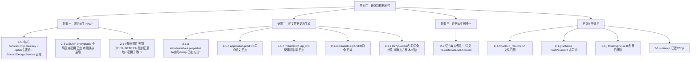
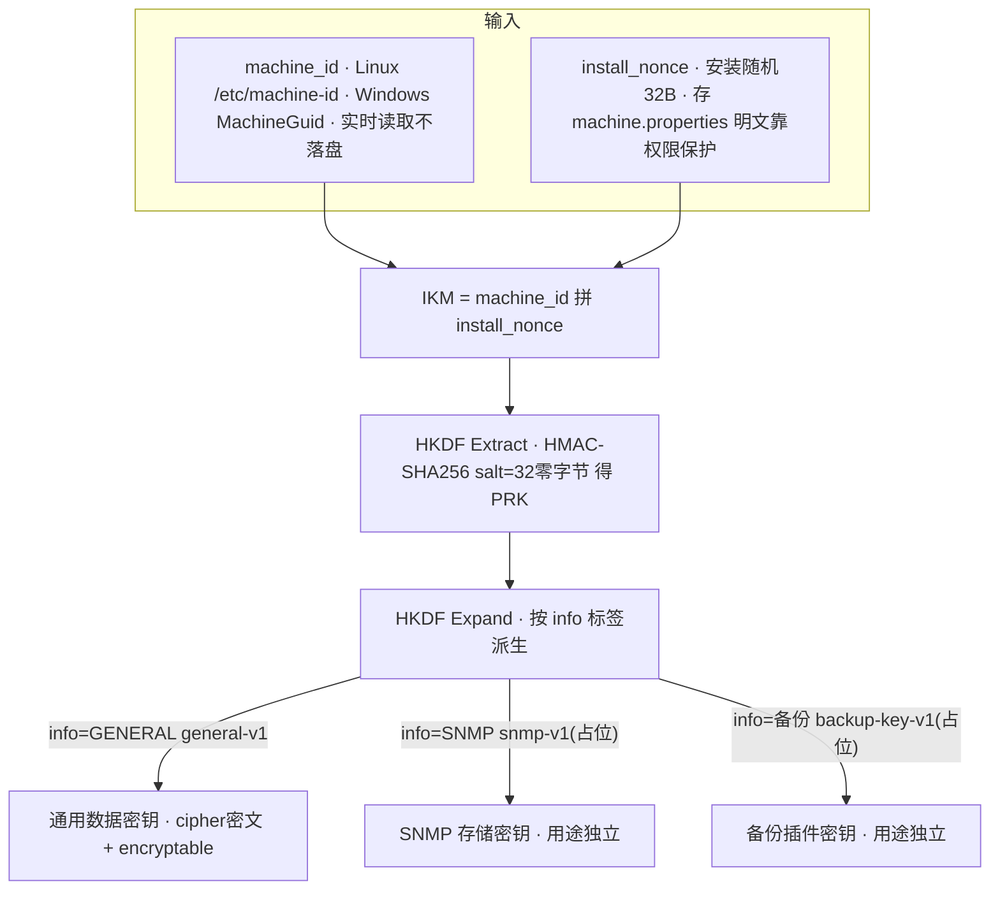
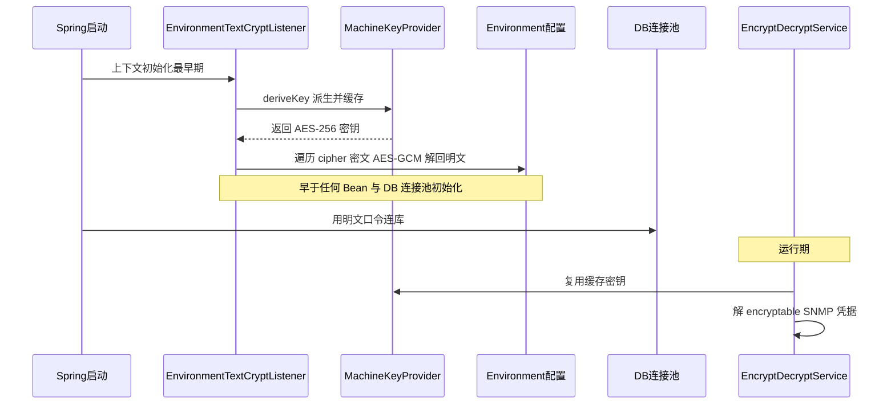
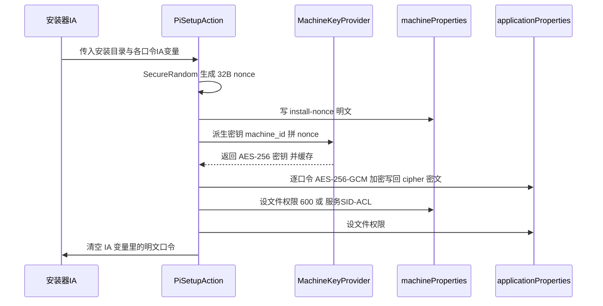
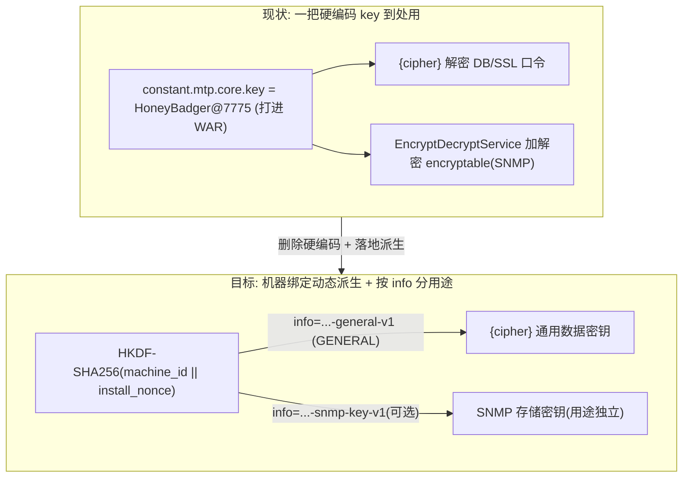
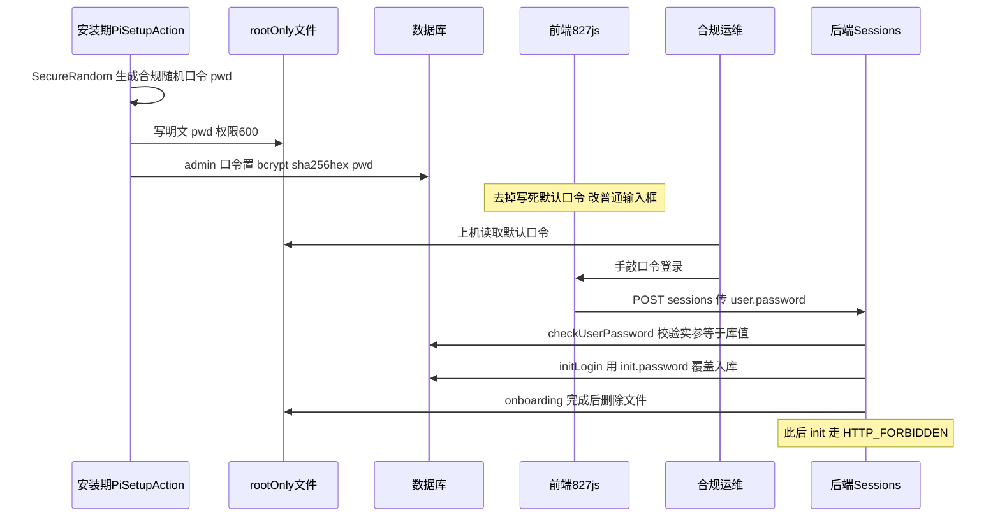
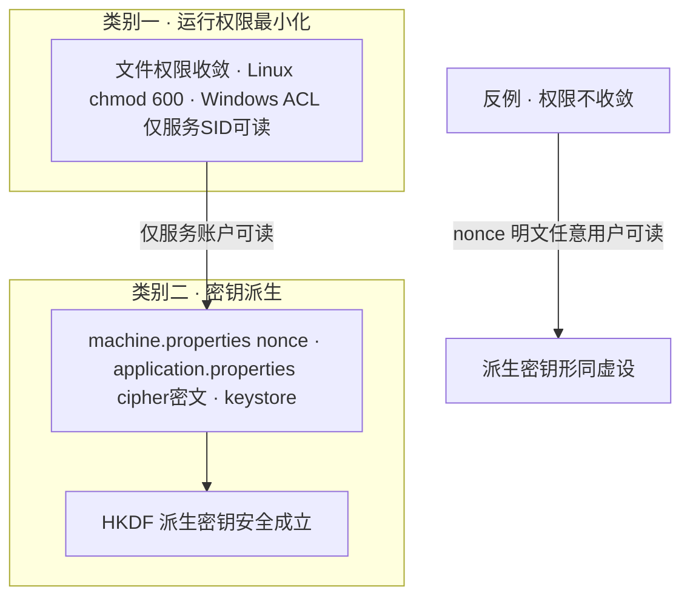
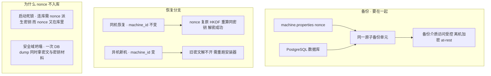

# PI 加解密体系与密钥管理解决方案（类别二）

> 最后更新：2026-08-14（校对：§0 表 2-1-h核心/2-1-a/2-1-b/2-1-c/2-1-h「已修复」置 ✅；2.3.2/2-1-e 标注为已定并落地、实机验证通过；K-9 静默/无人值守安装收口 = 确定不做·需求层面不再支持；删除原「§4 改动点落地索引」，实际落地实现以 **roadmap**（内部真源，不随本目录） 为准）
> 最后更新（历史）：2026-08-03（阶段1/2 + K-10 已落地并实机验证，补落地标注；进度真源见 **roadmap**（内部真源，不随本目录））
> 对应任务：**类别二 · 敏感数据机密性 / 加解密体系**（内部真源，不随本目录）（任务 2-1 硬编码/明文凭据、2-3-a SNMP）。**2-2 TLS 证书唯一已独立成文，见 [tls-certificate-solution.md](tls-certificate-solution.md)**。
> 需求定义：**secure-requirements-definitions.md**（内部真源，不随本目录）（REQ-CRED、REQ-CERT、AR-00-01、AR-00-02、IA-01-00；批准算法白名单 §6.1）。
> 姊妹文档：运行权限见 [runtime-permission-solution.md](runtime-permission-solution.md)（类别一）——两类在"文件权限收敛"处交汇（见 §2.4）。
> 背景知识与问答（密码学原理、为什么这么设计、编码≠加密≠哈希、HKDF/AES-GCM/bcrypt）见 [background/crypto-primer.md](../1-foundations/crypto-primer.md)；TLS/证书原理见 [background/tls-and-certificate-primer.md](../1-foundations/tls-and-certificate-primer.md)。本文只讲**现状与决定**，原理细节都在 primer。
>
> **来源与重要提示**：
> - 第一部分（§1）是对同事一份 **PI 密钥安全存储设计**（作者 Wang.Rui.Barney，2026-05-29，状态"设计评审中"，关联 CWE-798 `constant.mtp.core.key` 硬编码）的**梳理与摘录**（原文在 OneDrive `security-fix/doc/pi-key-design/pi-key-security-design.md`，未纳入本仓库）。
> - 该设计以 **MongoDB** 表述（PI 早期/参考 Automation Agent 语境）；**PI4.0 正式栈是 PostgreSQL**。密钥派生方案本身**与数据库引擎无关**，可直接沿用；仅"被加密的对象"需映射（Mongo 密码→PG 密码、Mongo `encryptable` 字段→PG `encryptable` 字段，含 SNMP 凭据）。见 §2.1。**此映射前提已确认**（K-2 代码实锤，见 §2.2）。
> - 第二部分（§2~§3）是**我方分析**：映射到 PI4.0 触点、一把密钥能闭合什么、还需单独做什么、与类别一耦合、是否满足 P2 provisioning、算法档位核对。
>
> 🟢 **落地状态（2026-08-03）**：阶段1（HKDF 地基）+ 阶段2（`{cipher:<purpose>}` 分域、DB 口令 `{cipher:database}`、顶层 admin 口令置空、installvariables 脱敏、WAR 方案 B2）+ K-10（ZE 收敛 HKDF）**均已落地并单机实机验证**。下文若干「占位/待定/本轮只记录」表述已被实现取代：① `MachineKeyPurpose` 的 `DATABASE`/`TLS` **已启用**、`SNMP` 见下条收口；② 2-1-e admin 引导口令 **D1 已定=顶层置空 + 首登强制改密**（§2.3.2）；③ K-10 **已实施**、ZE keystore 改 **option-1 运行时派生**（§2.10）。逐项状态以 **roadmap**（内部真源，不随本目录） 为准。
>
> 🟢 **SNMP 收口（2026-08-10，N-26 = 不做专用钥）**：SNMP 凭据两侧（PI/ZE）**维持用 GENERAL 钥**（`vertiv-pi-general-v1`，机器绑定 HKDF、每实例唯一 / AES-256-GCM）加密存 DB —— **已达标**（原病灶"全局固定密钥"已随阶段1/K-10 换 HKDF 消除）。评估后**不再引入独立 `…-snmp-v1` 子钥**：与 GENERAL 同源同 nonce、`info` 标签公开，域隔离增益≈0（防不住 nonce 泄露）；改法 ①ZE 换专用钥 / ②PI 去 `encryptable` 自建 均低收益高风险（②有明文回归风险）。后续若有硬需求再走"modifier 带 purpose"路线。**下文凡"SNMP 独立 `…-snmp-key-v1` 子钥 / 排最后 / 域隔离用独立钥"表述，以本收口为准（保留作决策留痕）**。详见 **roadmap N-26**（内部真源，不随本目录）。

---

## 0. 目标与范围

| 项 | 内容 |
|----|------|
| 合规项 | REQ-CRED 安全数据处理（机密性全生命周期）；底层横切 AR-00-01（只用批准算法）、AR-00-02（批准存储机制）、REQ-CERT（每功能独立密钥 + 私钥每组件唯一）、IA-01-00（凭据存储安全） |
| 子目标 | 密钥/口令**不硬编码、动态生成、加密存储**（TLS 证书/密钥对每实例唯一已移至 [tls-certificate-solution.md](tls-certificate-solution.md)） |
| 范围（本轮） | PI 本体（`mtp-core` + `taf-core-installer`）；备份恢复整改由 U1，SNMP 排最后 |
| 范围决定 | **不考虑集群/共享数据库**（故无"多节点各自派生密钥、解不开共享 DB 密文"问题）；**不考虑 PI 升级**（U1 负责） |
| 关联 issue | ISS-CRED（伞状）/ ISS-CRED-2 / ISS-CRED-3（凭据明文）、ISS-CERT（证书不唯一） |

**类别二触点全景 + 方案与状态**（本文围绕它们展开；已对照 **任务台账 · 任务 2-1**（内部真源，不随本目录），随其更新）：

> 处置手段：**密钥(派生)** = 换成 machine 绑定 HKDF 派生密钥；**明文凭据** = 安装期动态生成 + 加密存储 + 文件权限收敛（禁静态默认，如必须默认则强制首登改密）。（**证书**每实例唯一见 [tls-certificate-solution.md](tls-certificate-solution.md)。）
> 图例：有方案 ✅已定 / 🟡参考·未定稿 / ⬜功能级待定 / ➖不适用；已修复 ✅完成 / ⬜未开始 / ➖不适用。
>
> 🟢 **「已修复」列更新（2026-08-07，Win11+Server2022+Server2025 三机实机验证）**：本表「已修复」多为 2026-07-23 快照。当前实况：2-1-h核心(`constant.mtp.core.key` 删、HKDF 派生) ✅ / 2-1-b(DB 口令 `{cipher:database}`) ✅ / 2-1-a(`installvariables` `TAFDB_ADMNPWD` 置空) ✅ / 2-1-c(`InstallScript.iap_xml` 去硬编码常量) ✅ / 2-1-e(**顶层 admin 口令置空 + 首登强制改密**；D2 子租户口令保留键值置空) ✅ / 2-1-h(WAR **方案 B2**：base 留 WAR+清密值、剔 `-dev/-prod/-cluster`) ✅ / 2-1-k ✅；2-3-a(SNMP) ie-engine 已接线、**运行时采样加解密已实机验证（2026-08-12）**；2-1-i(备份插件) **密钥②已接线（DEK+GENERAL 信封，2026-08-20 本地提交）**、密钥①随 U1。逐项 commit/状态见 **roadmap 阶段2/3/6-4**（内部真源，不随本目录）。

| 类 | # | 触点 / 现状明文物 | 方案（已定/参考） | 有方案 | 已修复 | 归属 |
|----|----|------------------|------------------|:---:|:---:|------|
| 密钥 | 2-1-h核心 | `constant.mtp.core.key`（`{cipher}` 主密钥 + `EncryptDecryptService` 密钥）= `HoneyBadger@7775`（ASCII 数组，打进 WAR） | **已定**：`EncryptDecryptUtil.KEY` 来源换 machine 绑定 HKDF 派生（drop-in，算法/密文格式不变）；base 删该行 | ✅ | ✅ | mtp-core |
| 密钥 | 2-3-a | SNMP v2c/v3 凭据**存 DB**，已加密（`EncryptDecryptUtil`）用**全局固定密钥** | **已定**：DB `encryptable`/SNMP 与核心**同一把**（[代码实锤](#22-关键洞察一把派生密钥能同时闭合的触点)），换派生后来源自动闭合（**维持 `GENERAL` 钥**）；**专用 `…-snmp-v1` 子钥不做**（N-26，见 banner 收口） | ✅ | ✅ 已达标（GENERAL 钥） | mtp-core 功能级 |
| 密钥 | 2-1-i | `plugin.properties` + `taf-plugin-pi-backuprecovery-plugin.zip` `aessecretkey=victoryAndActive`（+ `hostpassword=hostPassword`） | **已定并部分落地**：归档本体（密钥②）改**每备份随机 DEK + 机器绑定 GENERAL 钥信封**（非独立 `-backup-key-v1` 子钥）、去 `plugin.properties` 硬编码 `aessecretkey`（2026-08-20 `00ca3fa`，roadmap 6-4/N-28）；远程共享 `hostPassword`（密钥①`victoryAndActive` Java 常量）随 U1 未做 | ✅ | 🟢 密钥②已本地落地 / ⬜ 密钥①随 U1 | 备份恢复插件 / U1 |
| 明文凭据 | 2-1-a | `installvariables.properties`（**IA 装完自动生成**，dump 全部 `$VAR$`，含 `TAFDB_ADMNPWD`/`WAITFORAPI_PASSWORD`；源码零引用） | **已定（方式①·保留文件）**：安装收尾动作把敏感键**行删除/清空**，保留文件与非敏感变量；无 U1 依赖（卸载已改 `.sh` 不读它、备份由 PI 自取、不考虑升级） | ✅ | ✅ | 安装器（**优先**） |
| 明文凭据 | 2-1-b | `application-prod.properties` `taf.db.postgresql.password=Passw0rd@123`（+原文 `tenant.default.password`） | **已定**：动态生成 + `{cipher}`（派生密钥加密，§1.5） | ✅ | ✅ | 安装器模板 / mtp-core |
| 明文凭据 | 2-1-c | `InstallScript.iap_xml` `Passw0rd123` + 6×`$TAFDB_ADMNPWD$` | **已定**：去硬编码常量、走 IA 变量 | ✅ | ✅ | 安装器 |
| 明文凭据 | 2-1-d | `createdb.sql` `CREATE/ALTER USER mtpadmin/mtpuser WITH PASSWORD 'Passw0rd@123'`（安装期一次性文件） | **已定并落地**：IA 变量 + 动态口令 + **执行后删**（Windows IA `DeleteFileAction` / Linux `rm -f`，N-23）→ **两平台装后无残留** | ✅ | ✅ | 安装器 |
| 明文凭据 | 2-1-e | `827.js` + `adminUser-instance.json` web admin `Passw0rd123`（抢注窗口） | **✅ 已定并落地（D1，§2.3.2）**：顶层 admin 默认口令**置空 + 首登强制改密（US-LOGIN）**（`952743b84` + 前端 `827.js` 清空）；抢注窗口风险已接受（同信任边界）。候选"随机口令→root-only 文件→手敲"降为留痕 | ✅ | ✅ | mtp-core |
| 明文凭据 | 2-1-h | WAR 内 `application-dev/-prod/-cluster.properties` + base（`api.key`/`api.secret`/`default.password`/db 口令/`{cipher}`…；注：`api.key` 系请求头名非密值，2026-08-12 已内联为常量 + 配置置空，见 roadmap N-2） | **已敲定**：`packagingExcludes` 剔除 dev/prod/cluster + base 清密值；**源码保留**；硬前提=外置 `config/application-prod.properties` 补全 prod 超集（SSL/ciphers/端口/签名） | ✅ | ✅ | mtp-core 构建 |
| 明文凭据 | 2-1-f | `BackUp_Restore.sh` `db_password="postgres"` | 文件已删（触点消失） | ➖ | ✅ Win+Linux 已删 | 已移除 |
| 明文凭据 | 2-1-g | `backup-configurations-schema-v1.json` `"hostPassword"` | 仅 schema 属性定义，非实际口令 | ➖ | ➖ N/A | mtp-core 插件 |
| 明文凭据 | 2-1-k | `main.*.js` `password:"Passw0rd123"` | 已迁 `827.js` | ➖ | ✅ `main.js` 无内嵌 | mtp-core 前端 |
| 明文凭据 | 2-1-j | `MssEngine.ini` / IE 日志 `KeyPasswd` | IE 引擎 PI4.0 已移除 | ➖ | ➖ N/A | — |
| 证书 | 2-2 | `keystore.p12`（8443 Core + 8088 ZE）静态自签、每装指纹一致 | **已独立成文 → [tls-certificate-solution.md](tls-certificate-solution.md)**（K-7 方向已定） | ✅ | ✅ 三机（Win11+Server2022+Server2025，指纹互异） | 安装器 |

**图 D1 · 类别二触点分类全景**（按"三种处置手段"归类，一眼看清哪些问题、各归哪种解法、状态如何）：



---

## 1. 同事方案摘录与解读（machine 绑定 HKDF 派生密钥）

### 1.1 当前问题（被替换的对象）

`application.properties` 内硬编码密钥：

```properties
constant.mtp.core.key=72,111,110,101,121,66,97,100,103,101,114,64,55,55,55,53
# ASCII 解码 = HoneyBadger@7775
```

用途：① Spring Cloud Config `{cipher}` 解密（启动时解密配置里的 DB/SSL 口令）；② `EncryptDecryptService` 加解密 DB 内 `encryptable` 字段（**SNMP 凭据**等）。**任何人解压 WAR 即可提取该密钥**，进而解密所有受保护数据（CWE-798）。

### 1.2 核心思想：密钥不落盘（动态派生）

> ⚠️ 措辞澄清：准确说是**派生出的 AES 密钥本身不落盘**（每次启动在内存重算、缓存，进程结束即消失）；**但输入之一的 `install_nonce` 落盘**（明文，靠文件权限保护）。即"没有任何单一落盘文件 == 那把密钥"，而非"所有秘密都不落盘"。又因输入不变、HKDF 确定性，**每次重启都原样重算出同一把密钥——重启不改变密钥**，旧密文照常能解。

用两个"公开可得值"经密码学函数派生密钥，密钥本身不存任何地方：

```
AES-256 Key = HKDF-SHA256(
    IKM  = machine_id_bytes || install_nonce_bytes,
    salt = 32 个零字节,
    info = MachineKeyPurpose.GENERAL.info()  // "vertiv-pi-general-v1"
)
```

| 输入 | 来源 | 是否存储 | 是否保密 |
|------|------|:---:|:---:|
| `machine_id` | OS 固有标识，实时读取 | 否 | 否 |
| `install_nonce` | 安装时随机生成，存 `machine.properties` | 是（明文） | 是（靠文件权限保护） |

**安全依据（摘录）**：攻击者需同时拿到 `machine_id`（本机访问权）与 `machine.properties`（服务账户权）才能还原密钥；获得二者≈完全控制目标机，属软件安全理论上限。→ 这条**直接依赖类别一的文件权限收敛**（见 §2.4）。

#### 1.2.1 密钥用途登记表（实现落地 · 2026-07-28）

> **实现命名（已落地）**：派生类为 `MachineKeyProvider`（懒汉单例，运行时 `getInstance().getKey(purpose)`；安装器静态 `deriveKey(purpose, nonce)`）；`info` 标签统一由枚举 **`MachineKeyPurpose`** 管理（运行时 `com.avocent.mtp.core.security.crypto`、安装器 `com.avocent.mtp.install` 各一份，靠 parity 向量对齐）。原名 `MachineKeyService` / 裸串 `INFO_DATA_KEY="vertiv-pi-data-key-v1"` 已废弃——`data` 语义含糊，改为 `GENERAL="vertiv-pi-general-v1"`。

| 枚举项 | `info` 标签 | 状态 | 派生密钥保护的对象 | 落地阶段 |
|--------|-----------|:---:|------------------|---------|
| `GENERAL` | `vertiv-pi-general-v1` | ✅ 已启用（唯一在用） | `EncryptDecryptUtil` 全部用途：配置 `{cipher}`（SSL keystore/truststore + signature keystore 口令）、DB `encryptable` 字段、module-registry 值、schema 托管列、PII 字段、找回密码 token | 阶段1 |
| `DATABASE` | `vertiv-pi-database-v1` | ✅ 已启用（2-1 DB 口令 `{cipher:database}`） | 数据库连接口令专用钥匙 | 阶段2 |
| `TLS` | `vertiv-pi-tls-v1` | ✅ 已启用（`{cipher:tls}` + ZE option-1 派生 keystore 口令） | TLS keystore/truststore 口令专用钥匙 | 阶段3 |
| `SNMP` | ~~`vertiv-pi-snmp-v1`~~ | 🟢 **不做（N-26）**：两侧维持用 `GENERAL` 钥加密 SNMP 凭据、已达标；专用 SNMP 钥判定域隔离增益≈0 | ~~SNMP v3 凭据存储专用钥匙~~（保留 enum 占位，本轮不启用） | — |

> **一把 vs 多把**：当前 `GENERAL` 一把通用钥匙覆盖上表全部 6 类对象（`EncryptDecryptUtil` 是全局对称入口）。`DATABASE/TLS/SNMP` 仅**预留 info 标签占位**，待对应阶段真正引入独立 secret 时才启用并迁移；换 `info` 即派生互不相关的独立钥匙，无需改 machine_id/nonce。**标签一经保护线上数据不得改动/复用**，轮换请升 `-vN` 后缀。
>
> 🟢 **更新（2026-08-03）**：`DATABASE`/`TLS` 已随阶段2/3 的 `{cipher:<purpose>}` 分域启用（裸 `{cipher}` 现直接抛异常，强制显式 `:purpose` 标签）。
> 🟢 **SNMP 收口（2026-08-10，N-26）**：`SNMP` 专用钥**不做**——两侧 SNMP 凭据维持用 `GENERAL` 钥加密（已达标）；`SNMP` enum 标签仅保留占位、本轮不启用。运行时采样加解密**已实机验证（2026-08-12，用户确认：凭据密文存储 + 采样正常）**。

### 1.3 machine_id 读取与稳定性

- **Linux**：`/etc/machine-id`（32 位小写十六进制，systemd 首启生成后永久不变）。
- **Windows**：注册表 `HKLM\SOFTWARE\Microsoft\Cryptography\MachineGuid`（UUID，OS 安装时写入不变）。
- **稳定性结论（摘录）**：正常重启 / 内核补丁升级 / VM 快照恢复 / vMotion 热迁移 → **不变**；仅"重装 OS"会变（此时本就要重装 PI）；VM 克隆未重置 ID → 与源相同（见 §1.8 边界）。

### 1.4 HKDF-SHA256 派生（Extract + Expand）

- **Extract**：`PRK = HMAC-SHA256(key=32零字节 salt, data=IKM)` → 32 字节伪随机中间密钥。
- **Expand**：`OKM = HMAC-SHA256(key=PRK, data=info || 0x01)` → 32 字节 = AES-256 密钥。
- **`info` 标签的价值**：换 `info` 字符串即可派生**用途独立**的第二把密钥（签名/不同功能），互不干扰、无需改 machine_id/nonce。→ **这正是满足 REQ-CERT"每功能独立密钥"的抓手**（见 §2.6）。
- 纯 JCE 标准库实现（Java 17+），无新依赖；`MachineKeyProvider` 懒汉单例 + 按 `MachineKeyPurpose` 分用途缓存（`ConcurrentHashMap`），每把密钥只派生一次。

**图 D2 · HKDF 派生架构**（两个公开可得值经 Extract/Expand 派生；换 `info` 即扇出用途独立的多把密钥，满足 REQ-CERT）：



### 1.5 文件结构与 `{cipher}` 密文格式（摘录）

```
<外置 config 目录>/            ← Windows <install>\config\ ; Linux /etc/opt/pi/
├── machine.properties          ← 新增，安装时创建（放 config，非安装根）
│     install-nonce=<64位Hex，256 bit>
├── application.properties       ← 现有，格式不变、内容变化
│     taf.db.password={cipher}Base64(IV||CT||Tag)
│     server.ssl.key-store-password={cipher}Base64(IV||CT||Tag)
│     # constant.mtp.core.key 整行删除
```

> **位置决策（2026-07-28，用户拍板）**：`machine.properties` 放**外置 config 目录**（非安装根）。理由：与 `application-prod.properties`/`certs` 同处敏感集中区，[类别一](runtime-permission-solution.md) 阶段6 的**目录级 ACL 收敛**（断继承 / 640 / 属主服务账户）天然覆盖它，无需为安装根单独挂一条针对单文件的 ACL 例外；也便于统一备份/DR（§2.7）。运行时按 config 目录定位（系统属性 `pi.machine.properties.path` 可覆盖）。

- `{cipher}` 密文 = `IV(12B 随机) || Ciphertext || GCM-Tag(16B)`，Base64 编码；每次加密 IV 随机 → 相同明文不同密文。

> 🟢 **已实现（阶段2，2026-07-29）**：`{cipher}` 升级为 **`{cipher:<purpose>}` 强制分域标签**——`{cipher:database}`/`{cipher:tls}`/`{cipher:general}` 分别用 `MachineKeyPurpose` 对应子钥解密；`EnvironmentTextCryptListener` 遇**裸 `{cipher}`（无 `:purpose`）直接抛 `IllegalStateException`**。`EncryptDecryptUtil` 增按 purpose 加解密重载（无参重载委托 `GENERAL` 保向后兼容）。
- **文件权限（K-4 已定·方式A）**：Linux `chown si_app:si` + `chmod 600`；Windows `icacls machine.properties /inheritance:r` + `/grant:r "NT SERVICE\TAFsvc:(R)"`（仅服务 SID `NT SERVICE\TAFsvc` 读；服务登录身份为 LocalService，ACL 授服务 SID 不变，见 runtime §1.10）。**OS-seal（DPAPI/TPM/keyring）本轮不做、仅登记**；**nonce 不入库**——理由与备份/容灾见 §2.7。

### 1.6 启动与运行期解密

- 启动最早期由 `EnvironmentTextCryptListener`（`ApplicationContextInitializer`）触发 `MachineKeyProvider.getInstance().getKey(GENERAL)`，遍历 Environment 所有 `{cipher}` 值用 AES-256-GCM 解密回明文——**发生在任何 Bean（DB 连接池）初始化之前**。
- 运行期 `EncryptDecryptService` 对 DB `encryptable` 字段（**SNMP 凭据等**）加解密，复用同一缓存密钥。

**图 D4 · 启动/运行期解密时序**（密钥每次重启在内存重算；`{cipher}` 解密早于任何 Bean 与 DB 连接池）：



### 1.7 安装器侧 `PiSetupAction`（摘录）

文件安装完成后执行：读 IA 变量（安装目录 + 用户输入的各口令）→ `SecureRandom` 生成 32B nonce 写 `machine.properties` → 派生密钥 → 逐个 AES-256-GCM 加密口令写回 `application.properties` 的 `{cipher}` → 设文件权限 → **清空 IA 变量里的明文**。安装器侧需一份与运行时逻辑相同、但**独立实现**的 `MachineKeyProvider`（+ 一份 `MachineKeyPurpose` 枚举副本；安装期无法依赖 PI WAR）。

**图 D3 · 安装期时序（PiSetupAction）**：



### 1.8 边界条件（摘录要点）

| 场景 | 处理 |
|------|------|
| 重启 | machine_id/nonce 不变，HKDF 确定性 → 同一密钥，业务透明 |
| 重装 OS（唯一会变的正常场景） | 本就需重装 PI：重输口令 + 新 nonce → 重建；DB 内 `encryptable` 需重配设备协议（预期操作） |
| `machine.properties` 丢失/损坏 | 启动失败并明确报错（不静默降级、不打 NPE）；**须纳入备份**，与 DB 视为同一备份单元 |
| machine_id 读取失败 | 抛异常启动失败，**禁止固定值兜底**（否则密钥可预测） |
| `{cipher}` 解密失败（密钥不匹配） | `AEADBadTagException` → 明确异常、启动失败；**绝不把乱码当配置传下去** |
| VM 克隆未重置 ID | 与源同密钥：测试可接受；生产须克隆后重跑安装器生成新 nonce |

### 1.9 SECURE 符合性（作者自评摘录）

| 需求 | 改造前 | 改造后 |
|------|--------|--------|
| IA-01-00 凭据存储 | ❌ 密钥硬编码在 JAR | ✅ AES-256-GCM 加密、密钥不落盘 |
| AR-00-01 批准算法 | ❌ 硬编码 key 无算法保证 | ✅ HKDF-SHA256(RFC5869) + AES-256-GCM(SP800-38D) |
| REQ-CERT 密钥用途/唯一 | ❌ 一把硬编码 key 到处用 | ✅ 机器绑定派生、可按 `info` 分用途、离线不可破 |

---

## 2. 我方分析：映射到 PI4.0 与本轮任务

### 2.1 引擎映射（MongoDB → PostgreSQL）

同事文档的 MongoDB 表述按下表映射到 PI4.0；**方案与引擎无关，逻辑不变**：

| 文档（MongoDB 语境） | PI4.0（PostgreSQL） |
|----------------------|---------------------|
| `taf.db.password`（Mongo 口令） | `taf.db.postgresql.password`（实测 `application-prod.properties` L8 明文 `Passw0rd@123`） |
| Mongo `encryptable` 字段（SNMP/Agent 凭据） | PostgreSQL 内 `encryptable` 字段（**SNMP 凭据**，见任务 2-3-a） |
| `$INSTALL_DIR`（Agent 目录） | PI 安装目录 / 外置 `config/`（`loader.path=./config`） |

> ✅ 已确认（K-2 代码实锤，见 §2.2）：`EncryptDecryptService` → `EncryptDecryptUtil` 确实读同一 `constant.mtp.core.key`；`encryptable` 即含 SNMP 凭据的 DB 存储字段。

### 2.2 关键洞察：一把派生密钥能同时闭合的触点

**K-2 已代码实锤（同一把）**：`{cipher}` 解密链（`EnvironmentTextCryptListener` → `EncryptDecryptUtil.decrypt`）与 `encryptable`/SNMP 加解密链（`EncryptDecryptServiceImpl` → `EncryptDecryptUtil`）**共用同一个** `EncryptDecryptUtil.KEY = PluginConfiguration.getByteKey("constant.mtp.core.key")`，且算法已是 `AES/GCM/NoPadding` + 12B 随机 IV + 16B tag（与派生方案密文格式一致）。所以只需把 `EncryptDecryptUtil.KEY` 的**来源**换成 `MachineKeyProvider` 派生密钥（`MachineKeyPurpose.GENERAL`，**drop-in**，算法不动），一次性闭合：

1. `{cipher}` 主密钥硬编码（任务 2-1）。
2. `application-prod.properties` DB 口令明文 → `{cipher}` 加密（任务 2-1）。
3. SNMP `encryptable` 字段的"全局固定密钥" → 每实例派生密钥（任务 2-3-a 的**密钥来源**部分，功能级改动的一半自动解决）。



### 2.3 它解决不了、需单独做的

- **ISS-CERT TLS 证书/密钥对唯一（任务 2-2）**：派生出的是**对称密钥**，≠ TLS **非对称密钥对**，本方案天然覆盖不到证书唯一性。**现状/方案/决策已独立成文，见 [tls-certificate-solution.md](tls-certificate-solution.md)**。
- **`plugin.properties` 备份恢复 AES 密钥（`victoryAndActive`）**：~~可纳入同一派生体系（换成按 `info=...-backup-key-v1` 派生）~~ → **实际落地（2026-08-20）走信封方案而非独立子钥**：归档本体每次备份随机 32B DEK 流式 AES-GCM、DEK 再用机器绑定 **GENERAL 钥**包裹写 `.vertiv` 头（密钥②，`00ca3fa`）；`plugin.properties` 硬编码 `aessecretkey` 已删。远程共享 `hostPassword` 解密（密钥①`victoryAndActive` Java 常量）随 U1。详见 roadmap 6-4/N-28。
- **admin 引导口令（`827.js` / `adminUser-instance.json` 的 `Passw0rd123`）**：属**凭据 provisioning**（每实例随机初始口令 + bcrypt 入库 + 首登改密），不是加密密钥问题；**本轮做，🟡 方案待确定见 §2.3.2**。注意：**用户登录口令用 bcrypt 哈希**（已确认），与本文的"配置密钥派生"是两条线，勿混（原理见 [primer Q9](../1-foundations/crypto-primer.md)）。

- **SNMP v2c/v3 凭据跨组件加密（PI ↔ Zero Engine，2-3-a 补充，2026-07-31 勘查）**：
  - **现状**：ZE 有**独立**加解密体系（`ie-engine` 的 `CryptoUtils` AES-256-GCM，与 PI 同密文格式；`CryptoManager` **PBKDF2-HmacSHA256/600k/固定 APP_SALT，从 seed 派生**，seed 走 docker `/run/secrets/seed`），但 `DeviceContext.encrypt/decryptCommunicationProfile` + `EnvironmentTextCryptListener` **全被注释停用** → **ZE DB 内 SNMP 凭据当前明文**（PI 下发设备时 `protocolConfig` 明文入 ZE 库）。PI 侧则走本方案 HKDF machine-bound `MachineKeyPurpose.SNMP`（占位，排最后）。
  - **问题**：上下游同一功能，SNMP 加解密**可否/应否共用同一把密钥**？
  - **结论（🟢 已被 N-26 收口更新，2026-08-10）**：跨组件**传输**由 Phase 3 的 per-instance TLS 保护；数据**落盘**两侧各用**本机机器绑定 HKDF 的 `GENERAL` 钥**加密（PI/ZE 各自 nonce，密文天然互异、一侧泄露不连累另一侧）——**已达标，不再引入独立 `…-snmp-v1` 子钥**（域隔离增益≈0，见 banner 收口 / N-26）。握手路径：PI 解密(PI GENERAL 钥)→TLS 明文过线→ZE 重加密(ZE GENERAL 钥)。〔留痕：此前建议"PI=`…-snmp-key-v1`、ZE=独立子钥"的强域隔离方案已弃用。〕
  - **仅当**改为"PI 送密文、ZE 原样存取且不重加密"才**必须共钥**——但会把两套密钥管理强耦合、扩大爆炸半径（一把泄露=两端全裸），**不建议**。
  - **前置缺口**：ZE 现有 seed 机制是 docker 语境，**on-prem PI 安装无 `/run/secrets/seed`** → 需补「安装期生成 32B 随机 seed → 混淆存 root-only 文件」的 on-prem 落地（详见 [tls-certificate-solution.md §2.3 ZE 侧计划](tls-certificate-solution.md)）。

#### 2.3.1 TLS 证书（ISS-CERT）—— 已迁出

> 证书问题（PI 现状 / 为什么密钥派生覆盖不到 ISS-CERT / 方案 / 决策 / 生命周期）已独立成文，见 [tls-certificate-solution.md](tls-certificate-solution.md)；原理见 [background/tls-and-certificate-primer.md](../1-foundations/tls-and-certificate-primer.md)。

#### 2.3.2 admin 引导口令去硬编码（2-1-e，✅ 已定并落地、实机验证通过）

> 🟢 **已定并落地（D1，2026-07-30）**：采用**「思路 4 收敛版」= 顶层 admin 默认口令置空 + 首登强制改密（US-LOGIN）**，抢注窗口风险已接受（见 **roadmap N-11**（内部真源，不随本目录））——`adminUser-instance.json` 顶层种子置空（`952743b84`）+ 前端 `827.js` 预填清空（前端同事）。**D2（子租户 `constant.mtp.core.default.password`）本轮不改口令语义、值随 WAR B2 置空保留键**。下文候选/讨论**保留作决策留痕**，不再是待定项。
>
> 🟡 **状态（2026-07-24，历史留痕）：方案未定，暂无定下来的解决方案，仅记录讨论与候选。** 方向确定（默认 web admin 口令**去明文 + 去固定 + 收敛抢注窗口**），但**落地方式尚未拍板**。以下完整记录问题、需求前提、四套候选思路、评审反馈、IA 工程约束与三条可行路径、以及待确认的需求点，供后续定稿。

**问题**：默认 web admin 口令 `Passw0rd123` 写死在前端 `827.js`；onboarding 窗口内任何人都能用它抢注、把 admin 改成自己的。后端流程（**`SessionsApplicationEventHandler`**）：`checkUserPassword` 校验提交口令 == 库值 → `initLogin`→`updateUserInfo` 用 `init.password` 覆盖；`rejectInitWhenOnboardingComplete` 在 onboarding 完成后拒绝再 init（`HTTP_FORBIDDEN`）——**后端结构基本够用，只需换掉"默认口令来源"并让前端不再写死**。

> 🟡 **关联（本地 PoC，未推仓库）· 自定义管理员用户名**：同一 onboarding 请求内，`updateUserInfo` 现还会（可选）经 `applyCustomAdminUsername` 读 `init.username` 把内置管理员 `admin` 改成用户自定义名，并 `rebindSessionAfterAdminRename` 用新名重认证刷新会话（免重登）。仅 onboarding 期触发、空字段 no-op（兼容旧前端）。回应 **issue-260「十」#3**（内部真源，不随本目录）；**决策层"安装期输入 vs 首登改名"仍悬**（Mark 主张安装期输入）。完整链路/校验/踩坑见 **issue-51 §9.6**（内部真源，不随本目录）。

> **命门**：判方案好坏只看一条——**onboarding 窗口内攻击者能否猜到/拿到初始口令**；存储加密/哈希是次要项。

**需求前提（已确认 2026-07-24）**：**装机的人与使用 PI 的人一般在同一团队**（同一信任边界）→ 倾向"安装期由操作员定口令、首登直接用、不再强制改密"。

**候选思路与评估**：

| # | 思路 | 解根因 | 看法 |
|---|------|:---:|------|
| 1 | 随机生成 → 落 root-only 文件 → 前端输入框 → 运维上机读文件手敲 | ✅ | 安全最强、业界常见；但需上机翻文件+复制，评审反映**太繁琐**；静默场景需 K-9 兜底 |
| 2 | 安装向导让操作员**自设**口令 → 首登直接用 | ✅ | UX 最好、无文件；口令勿泄入安装产物（撞 2-1-a/K-9）、复杂度须安装器强制 |
| 3 | 保留已有固定口令、仅"加密存储" | ❌ | **不解根因**（口令仍固定/可预测、照样抢注）；且口令应 bcrypt 哈希而非可逆加密。**倾向否决** |
| 4 | 默认口令置空/空串、只去前端写死 | ❌ | 单独用**不安全**（空口令更易抢注）；仅在"首登强制本机/console"额外加闸下才成立 |

**评审反馈（2026-07-24）**：
- **思路 1**：上机找文件、复制随机口令**太复杂**，要简化。简化手段（完成页/控制台直接显示口令）都要求装机时有人在场；而一旦有人在场，"当场自设"（思路 2）更简单——**思路 1 的独立价值只剩"无人值守"场景**。
- **思路 2**：安装时已输口令，首登再强制输新密码**冗余且困惑**。→ 采纳"**首登直接用、不强制改密**"（后端连 init 覆盖口令步都可省）；"强制改密"仅在"装机人 ≠ 最终 admin（分权）"时才需要，本前提下不需要。

**IA 工程约束（决定思路 2 怎么落）**：
- 现网 DB 口令面板每个输入项都是带独立 objectID 的 `EntryAtomBiDi`（`253d0b4d94ac`=DB admin 口令、`253d0b4d94ad`=DB user 口令 等）。**新增"web admin 口令"字段 = 新 objectID = IA Builder 构建时静默剥离**（headless 无 IA Designer 可注册）→ **凭空加输入框做不到**（见 [ObjectID 剥离复盘](../../migration-remediation-archive/02-hardcore-technical-postmortems.md)、[IA 协作复盘](../../retrospectives/ai-installanywhere-collaboration.md)）。
- 但安装器**已注册**成套口令输入设施：GUI+Console 面板（`545b8f08975e`/`5568c0eb98a3`/`557a7b9098d9`）、已收集 `$TAFDB_ADMNPWD$`、带复杂度校验 `ValidateInputPasswordAction`（8–16 位，大小写+数字+特殊字符 `!@#%^&*`）→ **不必从零加框**。

**三条可行落地路径（待选）**：

| 路径 | 做法 | objectID | 代价 / 前提 |
|------|------|:---:|------|
| **A**（最省） | 复用安装期已输口令 seed web admin 初始口令（bcrypt 入库）+ 去 `827.js` 默认值 + 首登不强制改密 | 零新增 | web 初始口令 = DB 口令（凭据复用）；同团队+可改，风险可接受 |
| **B**（最干净） | 劫持一个已注册但废弃的"幽灵输入字段"收**单独**的 web 口令 | 零新增 | 需先核验确有可复用可见输入字段（ESXi/pushRegistry/`WAITFORAPI_PASSWORD` 等候选待查证） |
| **C**（绕开 IA） | 不在安装器收、改到 PI 首登页设（`827.js` 前端改，非 IA） | 无（非 IA） | 服务已暴露后才设 → 抢注窗口回来，须加闸（一次性 token / 限 localhost）→ 又绕回读文件/网络假设 |

> 倾向（未拍板）：安全上"装机时（服务未暴露、操作员可信）定死口令"最稳、匹配同团队前提；IA 新节点限制用**路径 A** 零风险化解；要"web 口令 ≠ DB 口令"再走 **路径 B**（需查证幽灵字段）。

**待确认需求点（拍板前）**：
1. 是否接受**路径 A 的凭据复用**（web 初始口令 = DB 口令），还是必须分离（→ B，需查幽灵字段）？
2. 静默/无人值守安装是否覆盖口令下发（K-9）？若要，思路 2/路径 A 需补静默剧本或回退随机（思路 1）。
3. 是否有"装机人 ≠ 最终 admin"的分权要求（决定要不要强制改密）？
4. 口令复杂度以谁为准（安装器 `ValidateInputPasswordAction` vs **`requirements/password-requirement.txt`**（内部真源，不随本目录））。

**思路 1 细化（随机 + 文件；候选之一·非定稿；生成器用 `SecureRandom`，不用 HKDF——理由见 [primer Q11](../1-foundations/crypto-primer.md)）**：

1. **安装期** `PiSetupAction`：用 `SecureRandom` 生成**满足口令复杂度策略**的随机默认口令 `pwd`（默认策略：长度 ≥10、且大写/小写/数字/特殊字符各 ≥1，特殊字符取白名单；生成器须**保证**四类各至少一个——不能用裸 `Base64URL`，它不保证含合规特殊字符。要求见 **`requirements/password-requirement.txt`**（内部真源，不随本目录））→ ① 写 **root-only 文件**（如 `admin-initial-password.txt`，Linux `chmod 600`、Windows 服务SID-ACL）② DB admin 用户口令置 `bcrypt(sha256hex(pwd))`（替换 `Passw0rd123`）。
2. **前端 `827.js`**：删掉写死的 `password:'Passw0rd123'`，退化为普通输入框，由运维手敲。
3. **首登**：合规运维上机读文件拿默认口令 → 作 `user.password` 传 `/api/rest/v1/sessions` → 后端 `checkUserPassword` 校验实参 == 库值 → 通过后用 `init.password` 覆盖入库。
4. **收尾**：onboarding 完成后删除该文件（口令已改，文件已失效）；此后 `init` 走 `HTTP_FORBIDDEN`。

> 思路 1 为何安全：攻击者不知道随机初始口令（每实例随机、只在 root-only 文件里），`Passw0rd123` 猜不中、抢注窗口关闭。先前分析倾向否决的做法：去校验 / 置 null（= 思路 4，单独不安全）/ 自比对 / 仅 localhost / 用 HKDF 派生一次性口令（`SecureRandom` 更贴切、且不污染密钥派生域）。

> 关联：**issue-51 §九**（内部真源，不随本目录）。属应用层 provisioning，与"配置密钥派生"是两条线。**静默/无人值守安装下的引导口令协同见 §2.9（K-9，仅记录现状·本轮不处理）。**

**图 D5 · 思路 1（随机 + 文件）闭环示意**（候选之一·非定稿）：



### 2.4 与类别一（运行权限）的耦合

同事方案的安全性**建立在 `machine.properties`/`application.properties` 只有服务账户可读**之上（§1.2）。这正是[类别一](runtime-permission-solution.md)"敏感文件权限收敛"要做的事：

- Linux：`chown si_app:si` + `chmod 600/640`（对齐 runtime §2.5）。
- Windows：断继承 + 仅授对应服务 SID（`NT SERVICE\<svc>`）读（对齐 runtime §1.10.3）。

→ **两类必须协同**：密钥动态生成后靠权限收敛保证"只有服务账户读得到 nonce"；反之若权限不收敛，nonce 明文可被任意用户读走，派生密钥形同虚设。

**图 D7 · 类别一↔二耦合**（类别一的文件权限收敛是类别二密钥安全的地基）：



### 2.5 是否满足 P2（统一 provisioning 选型）

任务书 P2 悬置着"统一密钥/凭据 provisioning 方案（env / 配置提供方 / Vault / OS keystore / TPM）"。评估同事方案：

| 维度 | 同事方案（machine 绑定 HKDF） | 备选（TPM / DPAPI / Linux keyring / Vault） |
|------|-------------------------------|---------------------------------------------|
| 落地成本 | 低（纯 JCE，无新依赖、无外部服务） | 高（TPM 需硬件/驱动；Vault 需部署运维） |
| 每实例唯一 | ✅（machine_id + nonce） | ✅ |
| 密钥不落盘 | ✅（只存 nonce，非密钥） | ✅（硬件保管） |
| AR-00-02 合规 | 走"AR-00-00 批准安全函数"这一档（软件方案） | TPM 走"TPM 机制"档，更强 |
| 主要弱点 | nonce 明文靠文件权限；VM 克隆同密钥；重装 OS 需重配 | 复杂度、可用性、跨平台一致性 |

**结论（K-1 已关闭）**：采用 machine 绑定 **HKDF** 作 **P2 默认选型**——性价比最高，AR-00-02 允许"软件加密 + KDF 派生"这一档（见 **requirements §6.3**（内部真源，不随本目录））。是否再上 TPM/更强档，取决于客户是否要 Enhanced / FIPS（见 §2.6），作为逃生口仅登记。

### 2.6 算法与档位核对（AR-00-00）

对照 **批准算法白名单 §6.1**（内部真源，不随本目录）：

| 用途 | 方案用法 | Baseline 判定 |
|------|----------|:---:|
| 派生 | HKDF-SHA256（基于 HMAC-SHA256） | ✅（HMAC≥112bit、SHA-2 均在批准集） |
| 对称加密 | AES-256-GCM（12B IV + 16B tag） | ✅（AES-256 + GMAC/GCM 批准） |
| 完整性 | GCM Tag / HMAC-SHA256 | ✅ |

- **三个算法均落 Baseline 批准集**，无弱算法（无 ECB/CBC-SHA1/MD5）。
- **注意区分**：本方案是"**配置密钥派生 + 数据加密**"，用 HKDF；而"**用户口令存储**"须用口令 KDF（Argon2id / bcrypt≥10 / PBKDF2），PI 登录口令已用 **bcrypt**——两者是 AR-00-00 表里**不同行**，勿用 HKDF 存用户口令。
- ✅ **档位已定（2026-07-28；证书 2026-07-30 上调 RSA-3072）：整体走 Baseline** —— 对称 AES-256-GCM、派生 HKDF-SHA256、证书 RSA-3072/SHA256withRSA。仅当有政府/国防/FIPS 客户才升 Enhanced（AES-256 only、证书 ECDSA-P384 / SHA-384 哈希）——升档**直接影响 [tls-certificate-solution.md](tls-certificate-solution.md) 的证书密钥长度**。

### 2.7 nonce 备份/容灾与"不入库"决策（K-4，已定）

密钥不落盘、只存 `install_nonce`，运维侧按下表落地（本轮已定）：

> 🟢 **订正（2026-08-22，见 **roadmap N-29**（内部真源，不随本目录））**：安装器已落地 **nonce 卸载保留 + 同机重装复用**（Win `%ProgramData%\该公司MachineSecrets`、Linux `/var/lib/vertiv/machine-secrets`，安装树外 admin-only vault）。因此**同机 DR 不再依赖"备份包内带 nonce"**：备份包只含数据，nonce 常驻机器 vault、安装时 `resolveOrCreateNonce` 自动复用；下表「备份单元/同机恢复」按此更新，「异机/新机容灾」不变。**新增运维责任：退役/清机需手动删除该 vault。**

| 项 | 计划 |
|----|------|
| **备份单元** | `machine.properties`（nonce）**必须与 PostgreSQL 数据库作为同一原子备份单元**一起备。丢 nonce = DB 内 `encryptable`/SNMP 密文与配置 `{cipher}` 全部无法解密、PI 启动失败（见 §1.8）〔**N-29 更新**：同机 DR 下 nonce 已由机器 vault 常驻复用，**备份包无需再带 nonce**；本行"同一备份单元"仅在异机/离线归档 nonce 时才必要〕 |
| **同机恢复**（磁盘坏/重装同机） | 恢复 DB + `machine.properties` → machine_id 未变 + nonce 复原 → HKDF 确定性重算同一密钥 → 密文正常解密，业务透明〔**N-29 更新**：nonce 由机器 vault 自动复用，**同机重装无需人工还 `machine.properties`**；仅"磁盘/整机坏"的异机重建才需从备份还 nonce〕 |
| **异机/新机容灾** | machine_id 变 → 密钥变 → 旧密文解不开。**本轮范围（单机、不集群、不升级）不支持异机直恢**：新机需**重跑安装器**（重生 nonce + 重输/重配敏感值） |
| **备份自身保护** | 备份含 nonce（=主秘密）→ 备份介质须访问受控、离机存放**加密 at-rest** |
| **恢复校验** | 启动若 `{cipher}`/DB 解密失败（`AEADBadTagException`）→ **快速失败并明确报错**（"nonce 不匹配/恢复不完整"），绝不静默降级 |
| **运维手册** | Runbook 写明"`machine.properties` 是机密、属 DB 备份集，按 DB dump 同等对待"（**交付物 TODO：尚未产出**；含 DR 操作步骤；**静默安装部分待 K-9 后续定（§2.9 目前仅记录现状）**） |

**nonce 不放进数据库（已定）**，两条理由：

1. **启动死锁（决定性）**：PI 启动最早期要用"nonce 派生的密钥"解密 `taf.db.password` 的 `{cipher}` 才能连库；若 nonce 只在库里，则"连库需要 nonce、拿 nonce 又需先连库"→ 死锁。
2. **安全域坍塌**：库里已存被该密钥加密的密文，再把 nonce 塞进同库 = 钥匙贴在锁箱上；一次 DB dump 即同时拿到密文+密钥材料。现设计特意让 nonce 待在**独立保护域**（文件权限 + 机器绑定），使"DB 泄露 ≠ 密钥泄露"。

> 原则：**备份要"在一起"，存储要"分开"**。若需 DR 冗余，用运维持有的恢复密钥对 nonce 做 escrow 封装、不明文入库（本轮不做，登记）。
> 与范围一致：因**不考虑集群/共享 DB、不考虑升级**（见 §0），跨机/集群/升级迁移的密钥迁移不在本轮（升级归 U1）。

**图 D6 · nonce 备份/容灾与"不入库"决策**（原则：备份要在一起，存储要分开）：



### 2.8 · 2-1-h 外置 prod 配置补全对比（记录，2026-07-23）

> 为量化 2-1-h 硬前提而做的一次对照，**先只记录**。对比对象：
> - **源码 prod 全集**（仅看这两个）：**`webapp/src/main/resources/application.properties`**（base）+ **`application-prod.properties`**（prod 覆盖）。
> - **安装后外置**：`E:\...\<install-root>\config\application-prod.properties`。
>
> 关键发现：**SSL/ciphers/签名/keyStoreType 等 prod 关键项当前只存在于源码 prod（且随 WAR 打包），安装后的外置 config 并不含**——运行时靠 WAR 内打包的 `application-prod.properties` 兜底。一旦 2-1-h 用 `packagingExcludes` 把 prod 从 WAR 剔除，外置若不补齐，这些即断裂/降级。

**剔除 WAR 内 prod 前，外置 `config/application-prod.properties` 需补齐的键**：

| 键 | 源码 prod 全集 | 安装后外置 config | 剔除后风险 |
|----|:---:|:---:|----|
| `server.ssl.key-store-password`（`{cipher}`） | 有 | 缺 | 🔴 keystore 口令缺失，TLS 起不来 |
| `server.ssl.trust-store-password`（`{cipher}`） | 有 | 缺 | 🔴 truststore 口令缺失 |
| `server.ssl.keyStoreType=PKCS12` | 有 | 缺 | keystore 类型回落默认 |
| `server.ssl.keyAlias=mtp-platform` | 有 | 缺 | 取错证书别名 |
| `server.ssl.client-auth=want` | 有 | 缺 | mTLS 行为变化 |
| `server.ssl.enabled-protocols=TLSv1.2,TLSv1.3` | 有 | 缺 | 🔴 协议放宽/降级 |
| `server.ssl.ciphers=…`（5 套件） | 有 | 缺 | 🔴 弱套件回落 |
| `taf.security.signature.validation=true` | 有 | 缺 | 🔴 签名校验被关 |
| ~~`taf.security.signature.key-store-password`（`{cipher}`，base）~~ | ➖ | ➖ | ~~签名库口令缺失~~ → **已作废（N-34）**：sigver 改无口令公钥证书 `sigver.cer`，无 keystore 口令、无此校验项 |
| `tenant.default.password`（密值） | 有 | 缺 | 属 2-1-e/密值，应 `{cipher}` 或移除 |
| `constant.mtp.core.key`/~~`api.key`~~/`api.secret`/`default.password`/`server.password`（base 密值） | 有 | 缺 | 密值，应改派生/`{cipher}`（注：`api.key` 是**请求头名非密值**，2026-08-12 已内联为常量 + 配置置空，见 roadmap N-2；`constant.mtp.core.key` 主密钥已删） |
| `taf.db.postgresql.password` | 有（明文） | 有（**明文 🔴**） | 应改 `{cipher}` |

> 已在外置、无需补：`server.port`、`server.ssl.key-store`/`trust-store`（路径）、`logging.*`、`management.*`、`mtp.system.*`、采样间隔、`zero.engine`/`taf.service.address` 等结构项。
> 结论：2-1-h 落地前，外置 config 至少补齐上表"缺"的 **SSL/协议/套件/签名/keyStoreType/client-auth**（结构性）+ 把**密值以 `{cipher}` 提供**；否则丢 TLS/端口/签名或安全降级（呼应 §0 2-1-h 硬前提）。

### 2.9 · 静默/无人值守安装与动态凭据协同（K-9，✅ 确定不做·需求层面不再支持）

> ✅ **决策收口（2026-08-14，K-9=不做）：静默/无人值守安装从需求层面确定不再支持**，因此"动态凭据 ↔ 静默安装协同"的张力不复存在。下文现状记录与讨论**保留作决策留痕**。

**现状记录**：

- **交互式安装**：用户在向导里输入 DB 口令（经 IA 变量 `$TAFDB_ADMNPWD$` 等），口令仅在安装进程内存中停留、随即加密为 `{cipher}`。**这是既有业务功能，需保留**；配合 2-1-a 擦除 `installvariables.properties` 敏感键后，磁盘上不留明文，本身不构成安全触点。
- **静默/无人值守安装**：DB 口令经 IA 变量从响应文件 `silentsample.txt` 读取，口令以**明文长期停留在响应文件里**（磁盘/仓库/配管）。这是"明文秘密落在持久化介质"的一面，也是本议题唯一的真实关注点——且此现象是所有静默安装器的通性。
- **admin 引导口令（2-1-e）在全自动流水线下**："运维读 root-only 文件手敲"缺少"人"去读文件、完成首登 onboarding。

**已达成的理解（供后续讨论的边界）**：

- **不去掉用户输入口令的能力**（交互/静默皆保留），这是既有功能；真正要处理的仅"静默响应文件明文落盘"。
- 后续可评估的缓解方向（**均未选定**）：响应文件按秘密自管（即用即生成、装完即删、不进 Git）／从环境变量或外部密管注入／口令字段留空时回退为安装期自动生成——具体取舍留待专门讨论。

**关联位置**：安装期生成 §1.7；admin 口令链路 §2.3.2；响应文件/IA 变量触点 §0 的 2-1-a/2-1-c/2-1-d；Runbook §2.7；实际落地实现见 **roadmap**（内部真源，不随本目录）。**决策登记为 K-9（§3，✅ 确定不做）。**

---

### 2.10 · Zero Engine 加解密体系收敛到 PI HKDF（ZE↔PI，K-10 ✅ 已定：做，2026-07-31）

> 背景：勘查 `ie-engine`（ZE 应用）+ `zero-engine-pi-installer`（ZE 打包）后发现，ZE 自带一套**独立**加解密体系，且与 PI 的 HKDF 方案并存、语义分叉。本节记录现状、两算法对比、"整体换成 PI HKDF"的取舍，以及未来分布式演进。
>
> ✅ **决策（2026-07-31，K-10=做）**：**废弃 ZE 的 PBKDF2-seed + 自研混淆，收敛到 PI 的 HKDF `MachineKeyProvider`（每节点独立派生 + `MachineKeyPurpose` 分域）**；分布式演进走**模型 1**（每节点独立钥 + TLS 保传输 + 边界重加密），长期按需上 KMS，**不采用静态共享 seed**。落地随 **阶段 3（TLS）** 一并做（任务 3-5/3-6，见 **roadmap Phase 3**（内部真源，不随本目录））。
>
> **落地细节（2026-07-31 已定）**：① `MachineKeyProvider`/`MachineKeyPurpose` **复制 parity 副本**进 `ie-engine`（暂不抽共享库）；② SNMP `encryptable` **本轮一起做**（验证放后面）；③ ZE keystore 口令**随机化**；④ ZE nonce = `zeroengine/config/machine.properties`（文件名同 PI、**独立一份**、权限基于 ZE 自身）；⑤ ZE 证书/nonce/`{cipher}` **统一由 `PiSetupAction` 生成**（Core+ZE、双平台，`ze-install.sh` 仅调用点，Linux 须落实"PiSetupAction 在 ZE 铺好后执行"的时序）；⑥ 卸载清除安装期生成的 Core 证书由 `PiSetupAction.uninstall()` 守卫式删除（3-6；ZE 证书/nonce 随 `RD /S /Q zeroengine` 自动清除）。🟢 **已落地并实机验证（2026-08-03）**：K-10 五增量已提交（ie-engine `fa0b89f` parity+HKDF+`{cipher}`、SNMP 接线 `4d9a328`；zero-engine 去明文/打包剔除）；③ ZE keystore 口令由「随机化」**改为 option-1 运行时派生注入**（不落盘，见 §2.10.3 下方标注与 **roadmap 3-3**（内部真源，不随本目录））。ZE 实机起栈通、PI↔ZE 注册成功。

#### 2.10.1 ZE 现状（勘查实证）

- **算法栈**：`CryptoUtils`（AES-256-GCM，12B IV+16B tag，**与 PI 密文格式一致**，KEY 靠 `setKey()` 注入）+ `CryptoManager`（**PBKDF2-HmacSHA256 / 600k 迭代 / 固定硬编码 `APP_SALT` / 从 32B hex seed 派生**；seed 以自研可逆 XOR+rotate **混淆**后落盘）。
- **注册但停用**：`DockerSecretsEnvironmentPostProcessor`（`spring.factories`）与 `EnvironmentTextCryptListener`（`Application.java:79 addListeners`）**无条件注册**，但方法体**整段被注释**（注释原话"先不加密，等后面安全问题修复和新建了密码体系再修复"）→ 当前空操作 → ZE 侧 keystore 口令明文 `ZeroEngine@7775W`、SNMP 凭据（`DeviceContext`）明文入 ZE 库。
- **docker 耦合浅**：仅 `DOCKER_SECRETS_PATH=/run/secrets/seed`+`readSecret()` 属 docker 专有，且**无非注释代码调用**；`seed.key`/`ze.pass` 同时作为普通属性写在打包 `application-prod.properties:7-8`，注释里的意图路径读的是 `env.getProperty("seed.key")`。README 明示 on-prem 为 Linux/Windows + SQLite、**无 Dockerfile/compose** → 去 docker 近乎零成本。
- **取消注释的两档**（详见 [tls-certificate-solution.md §2.3 ZE 侧计划](tls-certificate-solution.md)）：Tier 1（取消注释+去明文，但用**打包静态 seed**=每装同钥，等同 PI 旧 `constant.mtp.core.key` 老问题，工作量小）；Tier 2（安装期每实例 seed + 重加密，才达每实例唯一，工作量中）。SQLite 无 DB 口令 → listener 的 `encryptDatabasePassword` on-prem 基本无用。

> 🟢 **现状已变（2026-08-03，K-10 落地后）**：上文「注释停用/docker seed/PBKDF2-seed」为**改造前**勘查快照。现况：`DockerSecretsEnvironmentPostProcessor` 已改名 `MachineKeyEnvironmentPostProcessor` 并启用（读 ZE nonce → HKDF 派生 + option-1 注入 TLS keystore 口令）、`EnvironmentTextCryptListener` 已启用解 `{cipher}`、`DeviceContext` SNMP 已接线；`CryptoManager`(PBKDF2-seed)/`seed.key`/`ze.pass`/docker 路径均废弃。Tier 1/2 之分已被 K-10（HKDF 每实例唯一）取代。

#### 2.10.2 两算法对比（ZE PBKDF2-seed vs PI HKDF）

| 维度 | ZE：PBKDF2-from-seed | PI：HKDF-from(machine_id+nonce) | 更优 |
|---|---|---|:--:|
| KDF 定位 | 口令 KDF，故意"慢"（600k）抗弱口令暴力 | 高熵材料 KDF，extract-then-expand，快 | **HKDF**（seed 已高熵，600k 纯浪费启动开销，用错场景） |
| 域分离 | 单钥、无 purpose | `info` 标签天然分域（GENERAL/DATABASE/TLS/SNMP） | **HKDF** |
| 绑定强度 | 只绑 seed → 拿到 seed 即拿到钥匙（可携带） | 绑 machine_id+nonce → 换机不可复现 | **HKDF**（at-rest 防窃取） |
| 密钥落盘 | seed 落盘 + 自研混淆（可逆无密钥=**安全剧场**） | 只落 nonce（非密钥），靠文件权限 | **HKDF** |
| salt | 固定硬编码（全装一致，违背 salt 初衷） | 无需（machine_id+nonce 保证唯一） | **HKDF** |
| 可携带性 | 高（seed 一拷即走） | 低（绑机器） | **视场景**（单机=劣；分布式共享钥时=可能是优） |

**结论**：单机场景 HKDF 全面更优；PBKDF2-seed 唯一"长处"是可携带性——仅在"跨节点共享同一把钥"时才有价值（见 §2.10.4）。

#### 2.10.3 整体换成 PI HKDF：工作量 / 优劣 / 收益

- **工作量（一次性，中等）**：① 移植 `MachineKeyProvider`+`MachineKeyPurpose` 进 ie-engine（PI 已是"运行时+安装器双份靠 parity 向量对齐"，ZE 为第 3 份或抽共享库）；② `CryptoUtils.KEY` 来源 seed→`getKey(purpose)`（**drop-in**，密文格式已一致）；③ 安装期生成 nonce（替代 seed）+ 重加密 keystore 口令；`CryptoManager` 废弃；④ parity 测试。相对"Tier 2 每实例 seed"，净增主要是移植 HKDF 那段（安装期 provisioning 两条路都要做）。
- **优**：全产品一套密钥设计（一次审计/一个白名单条目/一处轮换）；机器绑定 at-rest 更强 + purpose 分域；去掉错用 PBKDF2 与自研混淆；与本文 Baseline HKDF-SHA256 一致。
- **劣/风险**：一次性移植+测试成本 + ZE 安装脚本改动；**机器绑定会锁死"跨节点共享密文"能力**（分布式须边界重加密——但这本就是推荐做法）。
- **收益**：**现在**=消除 ZE 静态密钥+安全剧场、两套→一套降审计面；**未来**=分布式时"每节点=一个机器绑定安装"自然套用，日后上 KMS 也比"复制 seed"扩展干净。

#### 2.10.4 未来：分布式 ZE（多机）+ 单 PI 中心

三种密钥模型（按推荐度）：

1. **每节点独立密钥（强烈推荐，HKDF 天然适配）**：每 ZE 节点用本机 machine_id+nonce 派生本节点钥；SNMP 凭据流 = PI 存(PI 钥)→下发时解密→**TLS（Phase 3 per-instance 证书）明文过线**→节点重加密(节点钥)存本地。节点失陷只丢本节点数据；无共享秘密、无新基建、水平扩展干净。
2. **全 fleet 共享一把钥**：PI 可直推密文、任意节点能解、支持加密数据复制/HA；但一节点失陷=全 fleet 泄、需安全分发、与机器绑定互斥。**若走此路也别用静态共享 seed**（可携带+无轮换+无吊销=最差）。
3. **中心化 KMS（PI 中心当密钥权威）**：ZE 运行期经认证 TLS 取钥，最灵活、支持轮换/吊销，但引入 KMS 服务+取钥协议+可用性依赖。

**演进建议**：短/中期走**模型 1**（每节点 HKDF 独立钥 + TLS 保传输）；长期若需 ZE 数据复制/HA 则上**模型 3 KMS**，**不要**退化成模型 2 静态共享 seed。

**关联**：SNMP 跨组件不共钥见 §2.3 bullet；ZE 侧落地/seed provisioning 见 [tls-certificate-solution.md §2.3 / §5-4](tls-certificate-solution.md)。**决策登记为 K-10（§3）。**

---

## 3. 关键决策待定（供评审拍板）

> 仿类别一决策表。2026-07-23 敲定：**K-1~K-6、K-8 关闭**；**K-9（静默/无人值守安装）2026-08-14 定论 = 确定不做（需求层面不再支持）**。**K-7（TLS 证书）已迁至 [tls-certificate-solution.md §4](tls-certificate-solution.md)（方向已定）**。**另：2-1-e（admin 引导口令落地方式）2026-07-24 重开、2026-07-30 定稿 ✅ = D1 顶层置空 + 首登强制改密（§2.3.2）。SNMP 专用钥 2026-08-10 定论 = 不做（N-26，维持 GENERAL 钥已达标）。K-10（ZE 加解密收敛到 PI HKDF）2026-07-31 拍板 ✅ 做，落地随阶段 3 任务 3-5（§2.10）。**

| # | 待决 | 结论 / 倾向 | 状态 |
|---|------|-----------|:---:|
| K-1 | provisioning 选型 | 采用 machine 绑定 **HKDF** 作默认（§2.5） | ✅ 关闭 |
| K-2 | `constant.mtp.core.key` 与 SNMP 全局密钥是否同一把 | **是**（代码实锤，§2.2）；换派生即闭合来源 | ✅ 关闭 |
| K-3 | 是否按 `info` 分用途派生多把密钥 | **分**（每功能独立 `info`，满足 REQ-CERT） | ✅ 关闭 |
| K-4 | `install_nonce` 存储/保护 | **已定（方式A）**：明文 + `chmod 600`(Linux)/`icacls` 服务SID-only(Windows) + 机器绑定纵深；**OS-seal（DPAPI/TPM/keyring）本轮不做、仅登记为后续扩展**；**nonce 不入库**（启动死锁 + 安全域坍塌，§2.7） | ✅ 关闭 |
| K-5 | VM 克隆同密钥是否可接受 | 测试可接受；生产重跑安装器——**本轮仅记录，不处理** | ✅ 关闭（记录） |
| K-6 | `plugin.properties` AES 密钥并入派生体系 | **并入**：归档密钥②已改 **DEK + 机器绑定 GENERAL HKDF 钥信封**（非独立 `-backup-key-v1` 子钥）、去 `plugin.properties` 硬编码 `aessecretkey`；密钥①（远程 `hostPassword`/`victoryAndActive`）随 U1 | ✅ 关闭（密钥②**已本地落地 2026-08-20** `00ca3fa`，见 roadmap 6-4/N-28；密钥①待 U1） |
| K-8 | 对称算法 / 档位 | 对称定 **AES-256-GCM**（12B 随机 IV，同密钥不复用）；派生 **HKDF-SHA256**；**档位已定 Baseline（2026-07-28）**，仅政府/FIPS 客户升 Enhanced（仅影响 §2.6 证书长度/HKDF hash） | ✅ 关闭 |
| K-9 | 静默/无人值守安装与动态凭据协同 | ✅ **确定不做**：静默/无人值守安装从需求层面不再支持，"动态凭据 ↔ 静默安装"协同问题随之消失（§2.9，现状留痕） | ✅ 关闭（不做） |
| K-10 | ZE 加解密体系是否收敛到 PI HKDF | ✅ **已定：做**（2026-07-31）——废弃 ZE PBKDF2-seed+自研混淆，统一到 PI HKDF `MachineKeyProvider`（每节点独立派生+purpose 分域，§2.10）；分布式走模型1（每节点独立钥+TLS+边界重加密）→ 长期按需上 KMS，不用静态共享 seed。**落地随阶段 3（roadmap 任务 3-5）** | ✅ 关闭 |

---

## 4. 与任务书/需求的关系

- 对应 **任务 2-1**（内部真源，不随本目录）（硬编码/明文凭据 → 动态生成加密存储）、**任务 2-3-a**（内部真源，不随本目录）（SNMP 凭据与存储加密）；[任务 2-2 TLS 证书唯一 ISS-CERT](tls-certificate-solution.md) 独立成文。
- 本文即任务书 **P2"你方已有一套设计文档，待评估是否满足"** 的评估落点（评估结论见 §2.5）。
- 需求依据：**REQ-CRED / REQ-CERT / AR-00-01 / AR-00-02 / IA-01-00**（内部真源，不随本目录）。
- 关联 issue：**ISS-CRED 伞状**（内部真源，不随本目录）、**ISS-CRED-3 admin 引导口令**（内部真源，不随本目录）、ISS-CRED-2、ISS-CERT。
- 与类别一交汇点：[runtime-permission-solution.md](runtime-permission-solution.md) §1.10.3（Windows 文件 ACL）/ §2.5（Linux 文件权限）。
