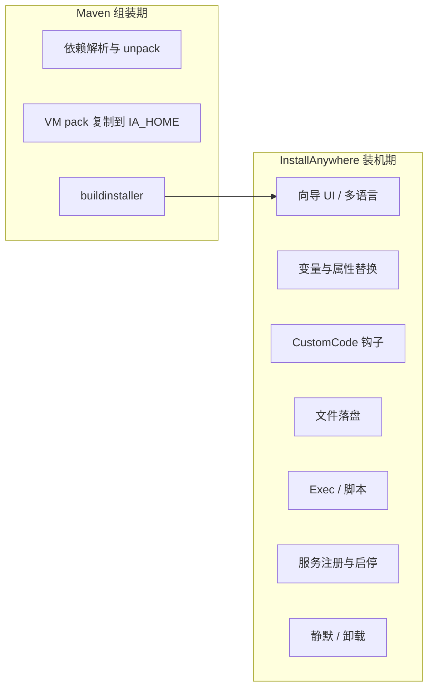

# InstallAnywhere 现状能力清单（As-Is）

> **最后更新**：2026-05-28  
> **基线工程**：`<repo-root>`（仅 PI 3.x 安装器，不含 PI 4.0）  
> **范围**：全新安装、静默安装、卸载。**不含升级（upgrade）**。  
> **方法**：只读扫描 `taf-core-installer`、`trellis-automation-agent-installer`、`TAF-InstallerCustomCode`，未改任何源码。

---

## 1. 工程与产物

| 工程 | 路径 | IA 工程文件 | Maven 坐标（copy 基线） |
|------|------|-------------|-------------------------|
| PI 主安装器 | `taf-core-installer/` | `src/main/TAFCore.iap_xml` | `com.avocent.taf:taf-core-installer:3.0.1-beta.3-wjt-SNAPSHOT` |
| Automation Agent | `trellis-automation-agent-installer/` | `TrellisAgent.iap_xml` | `com.avocent.taf.tools:vertiv-automation-agent-installer:2.5.2-SNAPSHOT` |
| 安装期 CustomCode | `TAF-InstallerCustomCode/` | （JAR，被 IA 引用） | `com.avocent.taf:taf-installer-customcode:1.12.4-wjt-SNAPSHOT` |

**构建链（PI）**：

1. `mvn validate` / `mvn deploy`（profile `-Ppi`）→ `maven-dependency-plugin` 将 war、插件 zip、Mongo、JRE VM pack、JSL、ZE 包等解包/复制到 `src/main/resources/binaries/`
2. `maven-antrun-plugin`（`package` 阶段）→ `buildinstaller` Ant 任务，读取 `TAFCore.iap_xml`，输出至 `src/main/TAFCore_Build_Output/pi/`
3. 平台目标：`Windows_Pure_64_Bit`、`Linux`，均 `buildWithVM=true`（内嵌 VM pack）
4. CI：`.gitlab-ci.yml` 使用 tag `pi-installanywhere`，依赖 `IA_HOME` 与预置 3rd-party marker 文件

**安装介质形态**（IA 惯例）：

- Windows：自解压 `.exe`（Pure 64-bit VM 安装器）
- Linux：`.bin` 安装脚本 + 内嵌 payload

---

## 2. 能力分层总览

| 层级 | 职责 | 替换 IA 时典型处理 |
|------|------|-------------------|
| Maven | 介质准备、版本对齐、CI | **大概率保留**，仅改最终打包入口 |
| IA | 装机编排、UI、变量、服务 | **主要替换对象** |

---

## 3. PI 主安装器 — 全新安装能力

### 3.1 用户输入与 IA 变量（GUI / 静默共用）

| 能力 | 变量/参数示例 | 默认值或说明 |
|------|----------------|--------------|
| 安装目录 | `USER_INSTALL_DIR` | 静默示例：`C:\Program Files\Trellis Application Manager` / `/opt/trellisappmgr` |
| 数据目录 | `USER_INPUT_DATA_FOLDER_1` | 与程序目录可分离 |
| 快捷方式目录 | `USER_SHORTCUTS` | Windows 开始菜单 / Linux `/usr/bin` |
| MongoDB 端口 | `DBCORE_PARAMETERS_1` | 27017 |
| DB 管理员账号/密码 | `DBCORE_PARAMETERS_2`–`3` | mtpadmin / （安装时设置） |
| DB 应用账号/密码 | `DBCORE_PARAMETERS_4`–`5` | mtpuser / （安装时设置） |
| PI HTTPS 端口 | `DBCORE_PARAMETERS_6` | 8443 |
| Linux 运行用户/组 | `TAF_UG_1` / `TAF_UG_2` | tafusr / tafgrp |
| DB 连接等待 | `DATABASE_WAIT_TIME_MINUTES` | 5 |
| 许可证分级 | `PI_LICENSE` | 从安装介质同目录 `pi_license.properties` 读取（静默可覆盖） |
| 覆盖旧数据 | `DELETE_PRIOR_DATA` / `DELETE_PRIOR_DATA_BOOLEAN_*` | 静默示例：`DELETE_PRIOR_DATA_BOOLEAN_1=1` |

来源：`installables/Windows|Unix/silentsample.txt`、`TAFCore.iap_xml` 变量绑定。

### 3.2 安装向导 UI

| 能力 | 实现 | 备注 |
|------|------|------|
| 图形安装向导 | IA Panel / Console 混合 | 含进度、许可协议、路径选择等 |
| 多语言 | `localesToBuild`：`en`、`zh_CN`；资源 `TAFCorelocales_pi/custom_en`、`custom_zh_CN` | 另有 mon/lean 目录在 pom 中排除打包 |
| 许可协议 | `resources/licenses/` + 按 locale 分子目录 | 见 `documentation/localization/Installer Localization.md` |
| 本地化图片 | `resources/images/<locale>/` | 与英文文件名对齐 |
| 安装日志 | `$USER_INSTALL_DIR$\$_installation$\Logs$` | 安装/卸载分日志路径配置 |

### 3.3 CustomCode（`taf-installer-customcode.jar`）

编译目标 **Java 21**；在 IA 工程中按类名引用。主要类（`TAF-InstallerCustomCode/src/main/java`）：

| 类 | 用途 |
|----|------|
| `CheckPortsNeededInUse` | 端口占用检查（安装向导） |
| `ValidateInputIsANumberAction` | 数字输入校验 |
| `ValidateInputPasswordAction` | 密码策略校验 |
| `ValidateFilePathAction` | 路径合法性 |
| `EncryptPasswordAction` | 密码加密写入配置 |
| `PanelDatabaseConnectivityConfirmationAction` / `ConsoleDatabaseConnectivityConfirmationAction` | Mongo 连通性确认（含 Swing UI） |
| `WaitForAPI` | 等待 PI API 就绪 |
| `GetApplicationNames` | 应用名解析 |
| `ProgressSet` | 进度条更新 |
| `PromptAlternatePortsConsole` / `PromptAlternatePortsPanel` | 备用端口提示 |
| `ScrubProductNameAction` | 产品名清理（控制台） |
| `ValidateProcessIsRunningAction` | 进程运行检查 |
| `PluginZipHelper` / `Common` / `OsCheck` | 工具类 |

**替换影响**：上述逻辑强依赖 IA `CustomCodeAction` / `CustomCodeConsoleAction` 生命周期与 IA 变量 API；迁移需等价 hook 或改写为独立 JVM 子进程 + 配置文件。

### 3.4 文件落盘与配置生成

| 类别 | 来源/目标 | 说明 |
|------|-----------|------|
| 嵌入式 JRE | bundled VM：`zulu-jre-21-win64.vm` / `zulu-jre-21-linux64.vm` | Maven 复制到 `IA_HOME/resource/installer_vms`；IA build configuration 选择 bundled VM |
| MongoDB | `resources/binaries/mongodb-*` | Windows 服务名 `TAFdb`；Linux `init.d-mongod` |
| PI 应用 | `mtp-core.war`、trust/keystore、大量 `taf-plugin-*` / `taf-data-*` zip | Maven unpack + manifest |
| 配置模板 | `installables/All/application.properties` 等 | IA `ASCIIFileManipulator` 变量替换；含 ZE 默认地址等 |
| Windows 服务包装 | `jsl64.exe` → `TAFsvc.exe`，`TAFsvc.ini` | JSL：`servicename=TAFsvc`，依赖 `TAFdb` |
| Zero Engine（Windows） | `resources/binaries/zeroengine` → `$USER_INSTALL_DIR$\zeroengine` | unzip JRE、`ZESvc.exe`（由 `TAFsvc.exe` 复制）、`-install`、注册表 ImagePath 引号修复、`NTServiceController` 启动 `ZESvc` |
| Zero Engine（Linux） | `zeroengine-linux` 暂存 → `/var/tmp/ze-pi-install` → `ze-install.sh` | 目标 `/opt/zeroengine`，systemd `zesvc` |
| PostgreSQL（Windows） | `postgresql-windows-x64.exe` | 仍在 binaries 预置（CI copy）；是否参与 PI 安装链需结合 IA 动作确认 |
| VC++ 运行库 | `vc_redist.x64.exe` | Windows 依赖 |
| 快捷方式 / Readme | `installables/Windows/` | `InstallReadme.html`、`.url` 等 |

### 3.5 服务注册与启动顺序（Windows）

典型顺序（`TAFCore.iap_xml` 中已确认片段）：

1. 安装 Mongo 二进制与配置 → 注册/启动 **TAFdb**（`mongod.exe --install`）
2. 安装 `TAFsvc.exe` / `TAFsvc.ini` / `mtp-core.war` 等
3. **ZESvc**：解压 ZE JRE → `ZESvc.exe -install` → 修正 `HKLM\...\Services\ZESvc\ImagePath` → 启动 ZESvc
4. **TAFsvc**：`TAFsvc.exe -install` → 修正 TAFsvc ImagePath → `NTServiceController` 启动 TAFsvc
5. CustomCode：`WaitForAPI` 等后置步骤

Linux：TAF Web 服务脚本 `TAFsvc.sh` + init.d；ZE 由 `ze-install.sh` 注册 systemd。

### 3.6 装机后行为

- 用户通过 `https://<host>:8443` 完成首次配置（业务文档描述；安装器负责端口与服务就绪）
- 安装期日志与 `_installation` 元数据保留在安装目录

---

## 4. PI 主安装器 — 静默安装能力

| 能力 | 机制 |
|------|------|
| 触发 | 安装介质同目录 `installer.properties`，设置 `INSTALLER_UI=Silent` |
| 参数 | 与 GUI 共用 IA 变量名（见 §3.1） |
| 示例 | `installables/Windows/silentsample.txt`、`installables/Unix/silentsample.txt` |
| 许可证 | `pi_license.properties` 旁路加载；可设 `PI_LICENSE=basic` 等 |
| 先删旧数据 | `DELETE_PRIOR_DATA_BOOLEAN_1=1` |

**替换要点**：任何替代方案需支持**无 GUI 批处理/无人值守**，且变量名或映射表需与现网自动化脚本兼容（或提供迁移说明）。

---

## 5. PI 主安装器 — 卸载能力

| 平台 | 能力 | 实现要点（IA） |
|------|------|----------------|
| Windows | 停止并删除 **TAFsvc** | `NTServiceController` + `TAFsvc.exe -remove` |
| Windows | 停止并删除 **ZESvc** | `ZESvc.exe -remove`；删除 `zeroengine` 目录（`rmdir`） |
| Windows | 停止并删除 **TAFdb** | `mongod.exe --remove -serviceName TAFdb` |
| Windows | 删除程序/数据文件 | IA `shouldUninstall` / 文件集卸载阶段 |
| Linux | 停止 TAF 相关服务 | init.d / 脚本（与安装对称） |
| Linux | ZE 卸载 | 优先 ` /opt/zeroengine/_installation/uninstall.sh`；fallback：systemctl stop/disable、删 unit、`userdel ze_app` 等 |
| 通用 | 卸载日志 | `uninstallLogEnabled` 等 IA 工程属性 |

**已知风险（历史装机，非本预研范围）**：服务 `-remove` 返回成功但 SCM 仍残留 `Start Pending` 进程——替换方案需在卸载设计中显式验证进程退出。

**范围外说明**：`TAFCore.iap_xml` 内仍大量存在 `Upgrading` 条件与升级专用动作；**本次预研不评估升级路径**，替换选型时不得默认继承 IA 升级语义。

---

## 6. Automation Agent 安装器（As-Is 摘要）

与 PI 共用 **InstallAnywhere + `IA_HOME` + JRE 21 VM pack + JSL** 模式，但产物与编排独立。

| 能力 | 说明 |
|------|------|
| 安装物 | `trellis-automation-agent` fat-jar + `server.properties` / `authentication.properties` |
| Windows 服务 | `TrellisAutomationAgentSvc.ini` + JSL |
| Linux | `TrellisAutomationAgentSvc.sh` + sudoers |
| CustomCode | `taf-automation-agent-installer-customcode.jar`（独立 artifact） |
| 与 PI 关系 | **无** `ieinstaller`/ZE 依赖；客户常单独安装 |

**替换策略 implication**：可与 PI **同技术栈** 一并替换，也可 **二期** 处理；能力矩阵应单独一行评估 Agent。

---

## 7. Maven 侧能力（构建期，非 IA 专有）

| 能力 | PI (`taf-core-installer`) |
|------|---------------------------|
| 多 profile 构建变量 | `build.cfg=pi`，`src/main/resources/variables/pi.properties` 注入 IA `buildtimevarpropfile` |
| 插件 manifest | `manifest-generator` 子模块 |
| ZE 解包 | `unpackZeroEngineWindows` / `unpackZeroEngineLinux`、copy zip/tar 到 `binaries/zeroengine*` |
| 校验和 | `checksum-maven-plugin` SHA-256 输出到 `target/` |
| 产物过大 | GitLab CI 仅保留 checksum manifest，安装包留在 runner `target/` 或 Maven registry |

---

## 8. 能力分级（供后续矩阵使用）

| 优先级 | 能力 ID | 说明 |
|--------|---------|------|
| **Must** | OFFLINE_PAYLOAD | 单介质离线安装，含 JRE/Mongo/应用/ZE |
| **Must** | WIN_LINUX | Windows exe + Linux bin |
| **Must** | SILENT | `installer.properties` 静默 |
| **Must** | SVC_WIN | TAFsvc、TAFdb、ZESvc 注册/启动/卸载 |
| **Must** | SVC_LINUX | TAFsvc.sh、zesvc systemd、ZE 脚本 |
| **Must** | CONFIG_SUBST | 端口/路径/账号写入 properties |
| **Must** | UNINSTALL | 对称卸载服务与文件 |
| **Should** | I18N_UI | en + zh_CN 安装 UI |
| **Should** | CUSTOM_JAVA | CustomCode 校验与 DB 确认 |
| **Should** | LICENSE_TIER | `pi_license.properties` / `PI_LICENSE` |
| **Could** | INSTALL_LOGS | 安装目录 `_installation/Logs` 路径约定 |
| **Out of scope** | UPGRADE | 本次预研明确排除 |

---

## 9. 关键文件索引

| 主题 | 路径（相对 `cursor_out/copy`） |
|------|-------------------------------|
| IA 主工程 | `taf-core-installer/src/main/TAFCore.iap_xml` |
| Maven 构建 | `taf-core-installer/pom.xml` |
| CI | `taf-core-installer/.gitlab-ci.yml` |
| 静默样例 | `taf-core-installer/src/main/resources/installables/{Windows,Unix}/silentsample.txt` |
| 多语言 | `taf-core-installer/src/main/TAFCorelocales_pi/` |
| CustomCode | `TAF-InstallerCustomCode/src/main/java/com/avocent/mtp/install/` |
| Agent IA | `trellis-automation-agent-installer/TrellisAgent.iap_xml` |

---

## 10. 文档关系

- 评估标准 → [03-research-constraints-and-criteria.md](03-research-constraints-and-criteria.md)
- 候选适配 → [04-candidate-fit-matrix.md](04-candidate-fit-matrix.md)
- 迁移路径 → [05-migration-path-options.md](05-migration-path-options.md)
- 待决项 → [06-open-questions-and-decisions.md](06-open-questions-and-decisions.md)
