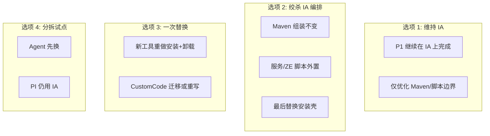

# 替换路径选项与风险（仅安装 / 卸载）

> **最后更新**：2026-05-28  
> **前提**：[03](03-research-constraints-and-criteria.md) 全部约束；**不含 upgrade**。  
> **说明**：以下为纸面路径，**不实施**；供评审选择后续是否 POC。

---

## 1. 路径总览

| 选项 | 名称 | 概要 |
|------|------|------|
| **1** | 维持 IA | 继续 `TAFCore.iap_xml`；替换项目搁置或仅做 license 谈判 |
| **2** | 绞杀编排 | Maven payload 不变；把服务注册、ZE、Mongo 初始化逐步迁出 IA 为脚本；最后再换安装壳 |
| **3** | 一次替换 | 选定 Install4j / WiX+脚本等，重写安装+卸载流 |
| **4** | Agent 先行 | `trellis-automation-agent-installer` 试点新工具，PI 主安装器仍 IA |
| **5** | Go 交叉编译自研安装器 | 用 Go 统一生成 Win/Linux 安装二进制，安装/静默/卸载由自研框架编排 |

---

## 2. 选项 1 — 维持 InstallAnywhere

### 2.1 做法

- 保留 `buildinstaller` + `TAFCore.iap_xml` + CustomCode。
- P1 任务（ZE、SI 移除、JRE21）在 IA 内完成。
- 预研产出仅作为「未来切换」知识库。

### 2.2 适用条件

- P1 装机验证尚未稳定，或团队无替换 bandwidth。
- IA license 可接受且 2025+ 构建链已跑通。

### 2.3 风险

| 风险 | 等级 | 说明 |
|------|------|------|
| XML 编排静默失败 | 高 | ZE 已发生「构建成功、装机缺目录/服务」 |
| CustomCode vs VM 版本 | 高 | Java 21 class 与 bundled JRE 不一致 |
| 维护成本 | 中 | 大 XML、Designer 依赖、新人上手难 |
| license | 中 | 商业续费 |

### 2.4 工作量（粗估）

- **替换工作量**：0（预研归档即可）
- **持续维护**：随每次安装包变更编辑 IA

---

## 3. 选项 2 — 绞杀 IA 编排（推荐作为「若替换」的默认路径）

### 3.1 做法（分阶段，仍不含 upgrade）

**阶段 S0（现状）**  
Maven → `resources/binaries` → IA 装机（当前 copy 基线）。

**阶段 S1 — 外置「可脚本化」块**  
将下列逻辑沉淀为 **独立脚本/清单**，IA 仅 `Exec` 调用（或文档约定顺序）：

| 块 | 现承载 | 外置目标 |
|----|--------|----------|
| ZE Windows | IA Exec + JSL | `zeroengine` 目录内脚本或 `install-ze-win.ps1` |
| ZE Linux | IA 调 `ze-install.sh` | 已基本外置，可减少 IA 包裹 |
| Mongo 初始化 | IA + JS | `createuser.js` 驱动脚本 |
| 卸载 ZE Linux | IA fallback exec | 统一 `uninstall.sh` |

**阶段 S2 — 新安装壳**  
引入 Install4j / MSI+脚本 等，仅负责：UI/静默、文件复制、调用 S1 脚本、卸载入口。

**阶段 S3 — 退役 IA**  
删除 `buildinstaller` 与 `TAFCore.iap_xml` 依赖。

### 3.2 优势

- 与 P1 并行：S1 可在仍用 IA 时降低 XML 复杂度。
- 复用 `zero-engine-pi-installer` 已有脚本模式。
- POC 时可先验证 **脚本+服务** 再换 UI 壳。

### 3.3 风险

| 风险 | 等级 | 说明 |
|------|------|------|
| 双轨过渡期 | 中 | S1 期间 IA+脚本 重复维护 |
| 静默变量兼容 | 中 | 需保持 `installer.properties` 映射 |
| 卸载顺序 | 高 | 服务残留问题需在新壳重测 |

### 3.4 工作量（粗估，人周，待团队校准）

| 阶段 | PI | Agent |
|------|-----|-------|
| S1 外置脚本 | 2–4 | 0–1 |
| S2 新壳 + 静默 | 6–12 | 2–4（若同期） |
| S3 退役 IA | 1–2 | 1 |
| CustomCode 迁移 | 3–6 | 1–2 |

---

## 4. 选项 3 — 一次替换

### 4.1 做法

- 选定单一工具链（倾向 Install4j 或 WiX+Linux tar）。
- 从 [02](02-as-is-capability-inventory.md) 能力清单逐项重写：文件集、静默、服务、卸载、i18n。
- CustomCode：移植到目标平台 Java API 或改为安装前/后 `java -jar` hook。

### 4.2 优势

- 无长期双轨；交付物清晰。

### 4.3 风险

| 风险 | 等级 | 说明 |
|------|------|------|
| 大爆炸 | 高 | 与 P1 叠加时回归面极大 |
| 遗漏文件集 | 高 | IA 隐式目录扫描问题可能以新形式再现 |
| 周期 | 高 | 估计 12–20+ 人周（PI alone） |

### 4.4 适用条件

- P1 已稳定且全量安装/卸载测试基线完备。
- 有专职安装器开发 + QA 窗口。

---

## 5. 选项 4 — Agent 先行试点

### 5.1 做法

- `vertiv-automation-agent-installer` 用 jpackage/Install4j/NSIS 重做（单 jar + JSL）。
- PI 主安装器继续使用 IA，积累新工具 CI 经验。

### 5.2 优势

- 体量小，验证签名、静默、服务、卸载。
- 失败不影响 PI 主交付。

### 5.3 风险

| 风险 | 等级 | 说明 |
|------|------|------|
| 双工具链 | 中 | 构建机需两套 pipeline |
| 经验迁移有限 | 中 | PI 多组件编排仍比 Agent 复杂一个数量级 |

### 5.4 与选项 2/3 关系

- 可作为 **选项 2 的 S2 预演** 或 **降低选项 3 风险** 的第一步。

---

## 6. 选项 5 — Go 交叉编译自研安装器

### 6.1 做法

- 以 Go 实现安装器内核（参数解析、文件落盘、变量替换、日志、卸载状态）。
- 通过交叉编译产出 Windows/Linux 二进制；平台差异由适配层处理。
- 服务安装仍调用现有系统能力（Windows `sc.exe`/JSL、Linux systemd）。
- `TAF-InstallerCustomCode` 以外部 Java hook 方式保留，或逐步重写为 Go。

### 6.2 优势

- 脱离 `IA_HOME`/Designer 依赖，CI 可重复性更高。
- 双平台工具链统一，安装流程与日志格式可标准化。
- 长期可控（脚本散落问题可收敛到单一代码库）。

### 6.3 风险

| 风险 | 等级 | 说明 |
|------|------|------|
| 自研框架成本 | 高 | 需要自行实现安装 UI/卸载状态/回滚策略 |
| CustomCode 迁移 | 高 | IA API 不可复用，需 Java hook 或重写 |
| 交付认证 | 中 | Windows 签名、杀软误报、企业策略适配 |

### 6.4 适用条件

- 团队接受「安装器平台化」投入（非一次性脚本）。
- 目标明确偏向长期自主可控，而非短期替换上线。

---

## 7. 横向对比

| 维度 | 选项 1 | 选项 2 | 选项 3 | 选项 4 | 选项 5 |
|------|--------|--------|--------|--------|--------|
| 短期交付风险 | 低 | 中 | 高 | 低（对 PI） | 高 |
| 长期维护性 | 低 | 高 | 高 | 中 | 高 |
| 与 P1 并行 | 优 | 优 | 差 | 优 | 差 |
| CustomCode 冲击 | 无 | 中 | 高 | 低 | 高 |
| 卸载验证负担 | 低 | 中 | 高 | 低 | 高 |
| 需 POC 才能定案 | 否 | 是（S2 前） | 是 | 是（Agent） | 是 |

---

## 8. 预研建议（非决策）

| 优先级 | 建议 |
|--------|------|
| **现在** | 采用 **选项 1** 完成 P1；预研文档归档 |
| **P1 smoke 通过后** | 若仍要弃 IA，优先 **选项 2（S1 外置脚本）**，不直接选项 3 |
| **若需快速验证新工具** | **选项 4（Agent 先行）**，再决定是否扩大至 PI |
| **若战略目标偏自主可控** | 可走 **选项 2 → 选项 5**：先外置脚本，再用 Go 收敛安装壳 |
| **不推荐** | 在 ZE/VM 问题未清前启动 **选项 3** |

---

## 9. 卸载专项（各选项共同必测）

因本次 **不含 upgrade**，卸载是替换方案的主验证场景之一：

| 检查项 | Windows | Linux |
|--------|---------|-------|
| TAFsvc 停止并删除 | ☐ | N/A（脚本/init） |
| TAFdb/mongod 停止并删除 | ☐ | ☐ |
| ZESvc/zesvc 停止并删除 | ☐ | ☐ |
| `zeroengine` / `/opt/zeroengine` 删除 | ☐ | ☐ |
| 安装目录与数据目录策略 | ☐（保留/全删） | ☐ |
| SCM/systemd 无残留 | ☐ | ☐ |

---

## 10. 文档关系

- 能力清单 → [02-as-is-capability-inventory.md](02-as-is-capability-inventory.md)  
- 候选矩阵 → [04-candidate-fit-matrix.md](04-candidate-fit-matrix.md)  
- 待决项 → [06-open-questions-and-decisions.md](06-open-questions-and-decisions.md)
