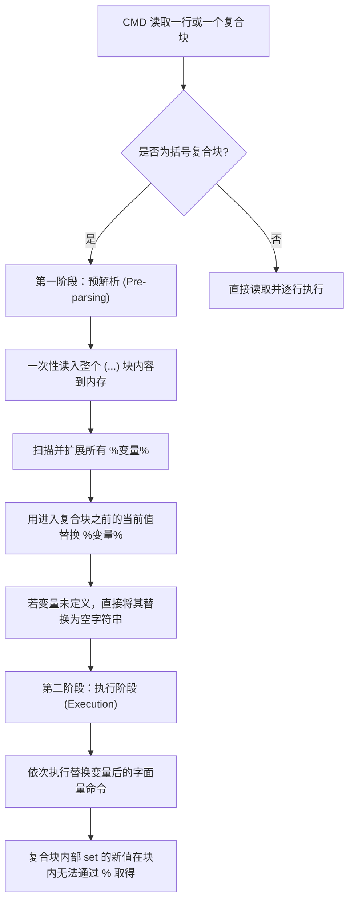

# 千万别在 Windows 复合命令块中犯这个错：剖析 CMD 延迟展开引发的磁盘清空灾难与 CI 安全沙箱建立

> **作者**：高级系统架构师  
> **分类**：系统工程 / 安全治理 / CI-CD 实践 / 避坑指南  
> **核心痛点**：高权限部署包在执行清理脚本时，由于 `cmd.exe` 复合块的两阶段解析模型导致变量被解析为空值，从而触发 `rmdir /s /q "\"` 静默清空运行机 C 盘。本文将深度剖析其事故机理，提供防御性重构方案，并开源一套通用的静态安全审计 CI 门禁工具。

---

## 一、 引言

在企业级软件的部署与运维场景中，高权限脚本是把“双刃剑”。它们拥有直接控制系统服务、物理磁盘和系统文件的特权，这意味着脚本中任何微小的逻辑瑕疵都可能被放大为灾难。

在最近一次主打**“数据库底座平滑迁移与轻量级伴生引擎升级”**的部署打包重构战役中，为了规避打包编译器对 PowerShell 特殊变量的误替换，团队将一段 JRE 环境解压并展平子目录的逻辑由 PowerShell 改写为了 Windows 原生的 CMD 批处理脚本。然而，正是这个看似简单的改动，因为触发了 Windows `cmd.exe` 解释器中极其隐蔽的**“延迟展开（Delayed Expansion）”**两阶段解析陷阱，导致在打包环境以管理员权限运行时，触发了递归删除当前盘符根目录（即 `C:\`）的灾难。

本文将以这一极具技术教育意义的真实灾难为切入点，深度逆向剖析 Windows 批处理解释器的底层解析模型，并提供完美的防御性代码方案。同时，为了用工具代替人脑保证绝对安全，本文还将提供一套可直接合入 CI/CD 门禁的静态安全审计引擎，彻底杜绝此类高危命令的合入。

---

## 二、 灾难现场与触发链路还原

为了将轻量级伴生采集引擎（CompanionAgentSvc）无缝注册为 Windows 专属服务，我们需要在安装期动态释放并部署 Java 21 的运行时（JRE）。其部署流程如下：

1. 部署包落盘：将压缩包 `zulu-jre-21.zip` 释放到安装目录的下属子文件夹中。
2. 动态解压：调用解压工具，将其解压到临时子目录。
3. 目录展平：将解压后的深层目录移动或复制（`xcopy`）到标准 JRE 路径。
4. 物理清理：删除解压时产生的临时垃圾子目录，实现“零残留”干净交付。

由于在安装期，这些临时路径需要根据用户选择的实际安装路径（如 `$USER_INSTALL_DIR$`）进行动态拼接。因此，在 CMD 脚本中，不可避免地使用了 `if` 复合语句块进行平台和文件存在性校验。

### 2.1 引入高危隐患的原始代码（反面教材）

以下是导致灾难发生的 CMD 批处理代码片段。请注意，这段脚本在执行时拥有 **Local System / Administrator** 权限：

```batch
@echo off
:: ==============================================================================
:: 警告：以下为灾难复盘的反面教材，请勿在生产环境直接运行！
:: ==============================================================================

if "%OS%"=="Windows_NT" (
    :: 动态指定 JRE 目标路径和源 zip 文件名
    set "JREDIR=D:\EnterpriseApp\companion\jre"
    set "ZIPNAME=zulu21.44.17-ca-jre21.0.8-win_x64"
    
    :: 检查 bin 目录下的 java.exe 是否存在，若不存在则进行解压和清理
    if not exist "%JREDIR%\bin\java.exe" (
        :: 调用解压工具，解压到临时子目录中
        powershell -NoProfile -Command "Expand-Archive -Path '%JREDIR%\%ZIPNAME%.zip' -DestinationPath '%JREDIR%'"
        
        :: 展平目录：将临时解压出的子目录内的全部文件复制到标准 JRE 根目录下
        xcopy /E /I /Y "%JREDIR%\%ZIPNAME%\*" "%JREDIR%"
        
        :: 【致命灾难点】清理临时子目录
        rmdir /s /q "%JREDIR%\%ZIPNAME%"
    )
)
```

### 2.2 灾难发生时的运行症状

当该脚本在打包 Runner 节点或开发机上运行时，发生了以下现象：
1. 伴生引擎的 JRE 确实被释放了，但并没有成功解压。
2. 系统突然疯狂报错，提示“找不到文件”、“拒绝访问”。
3. 随后，系统的用户桌面图标、C 盘系统目录和关键配置文件开始静默消失。
4. 打包进程强行终止，操作系统陷入崩溃或蓝屏。

---

## 三、 事故机理深度剖析：CMD 的“两阶段”解析模型

为什么这段看起来逻辑非常顺畅的 `if` 语句，会演变为“C 盘清空器”？
根因在于 **CMD 解释器对于括号复合块（Parenthesis Block）独特的“预解析（Pre-parsing）”与“变量扩展（Variable Expansion）”机制**。

### 3.1 复合块的两阶段解析模型

Windows 的命令提示符解释器（`cmd.exe`）并不是逐行读取并执行命令的，尤其是当它遇到由双括号 `(...)` 包裹的复合块（如 `if (...)`、`for (...)`）时。它的生命周期严格遵循以下两个阶段：



1.  **第一阶段：预解析（Pre-parsing）与变量替换**
    当 `cmd.exe` 在解析过程中读到复合块的左括号 `(` 时，它会**一次性**将整个括号块内的所有代码读入内存。
    此时，解释器会对整个块进行第一轮变量扫描，将其中所有被百分号包裹的变量 `%VAR%`，**替换为它们进入该复合块之前的值**。如果这个变量在进入复合块之前**未定义**，它会被无情地替换为**空值（空字符串）**。

2.  **第二阶段：执行阶段（Execution）**
    预解析完成后，整个复合块内的变量已经全部被写死成了字面量。接着，解释器开始一行行执行这些命令。
    在执行阶段，即使你在第一行通过 `set VAR=value` 重新修改了变量，由于后续行的 `%VAR%` 在预解析阶段已经完成了字面量替换，因此这些后续命令**完全无法感知**到新变量值的变化！

### 3.2 致命的“空值级联”是如何触发的

让我们把上述模型套用到我们的反面教材中：

1.  当 `cmd.exe` 读取到外层的 `if "%OS%"=="Windows_NT" (` 时，它会将整个复合块（包含内部所有的 `set`、`powershell`、`xcopy`、`rmdir`）一次性加载。
2.  此时，解释器发现块内存在变量引用：`%JREDIR%` 和 `%ZIPNAME%`。
3.  **关键致命点**：由于我们在复合块内部才通过 `set "JREDIR=..."` 和 `set "ZIPNAME=..."` 去定义它们，在进入这个复合块之前，**这两个变量在系统环境中根本不存在（值为空）**！
4.  因此，在预解析阶段，所有的 `%JREDIR%` 和 `%ZIPNAME%` 被全部替换为了空字符串 `""`。
5.  预解析后的命令在内存中被展开为：
    ```batch
    :: 内存中实际执行的命令（变量已被写死为空）
    if "Windows_NT"=="Windows_NT" (
        set "JREDIR=D:\EnterpriseApp\companion\jre"
        set "ZIPNAME=zulu21.44.17-ca-jre21.0.8-win_x64"
        if not exist "\bin\java.exe" (
            powershell -NoProfile -Command "Expand-Archive -Path '\.zip' -DestinationPath ''"
            xcopy /E /I /Y "\*" ""
            rmdir /s /q "\"
        )
    )
    ```
6.  当执行到最核心的清理命令：
    ```batch
    rmdir /s /q "%JREDIR%\%ZIPNAME%"
    ```
    在预解析后，它变成了：
    ```batch
    rmdir /s /q "\"
    ```
7.  **灾难降临**：在 Windows 操作系统中，单个反斜杠 `\` 代表**当前驱动器的根目录**！如果当前运行打包脚本的盘符是 `C:`，那么这行命令将被无情地解析为：
    ```batch
    rmdir /s /q "C:\"
    ```
    这是一个拥有 Administrator 权限、静默、不经确认且递归删除整个系统 C 盘的毁灭性命令。

---

## 四、 防御性重构：消除变量预解析的技术方案

要彻底消除这一高危隐患，有两套成熟的重构路线：**“启用延迟变量展开”** 或 **“实施无环境变量依赖的扁平化重构”**。

### 4.1 方案 A：启用延迟变量展开（使用 `!变量!` 语法）

CMD 解释器提供了一个机制，允许在运行时动态解析变量。通过在脚本开头声明 `setlocal enabledelayedexpansion`，并用感叹号 `!VAR!` 代替百分号 `%VAR%`，可以指示解释器在**执行阶段**再去获取变量的最新值。

#### 修复后的安全代码（方案 A）：

```batch
@echo off
setlocal enabledelayedexpansion

if "%OS%"=="Windows_NT" (
    :: 动态指定 JRE 目标路径和源 zip 文件名
    set "JREDIR=D:\EnterpriseApp\companion\jre"
    set "ZIPNAME=zulu21.44.17-ca-jre21.0.8-win_x64"
    
    :: 1. 强安全守护：确保 JREDIR 变量绝对不为空，且长度大于 10 字节（防止短路径和根路径）
    if "!JREDIR!"=="" goto :err_handler
    if "!ZIPNAME!"=="" goto :err_handler
    
    :: 2. 使用 !! 代替 %% 来引用动态变量
    if not exist "!JREDIR!\bin\java.exe" (
        powershell -NoProfile -Command "Expand-Archive -Path '!JREDIR!\!ZIPNAME!.zip' -DestinationPath '!JREDIR!'"
        xcopy /E /I /Y "!JREDIR!\!ZIPNAME!\*" "!JREDIR!"
        
        :: 3. 执行物理删除前，进行二次路径合法性硬安全校验（防止路径拼接为空值）
        if exist "!JREDIR!\!ZIPNAME!" (
            :: 切换到目标目录后再执行删除，绝不对绝对路径直接执行 rmdir
            cd /d "!JREDIR!" && rmdir /s /q "!ZIPNAME!"
        )
    )
)
goto :eof

:err_handler
echo [ERROR] 路径变量为空，脚本终止以防止潜在的数据损坏！
exit /b 1

:eof
endlocal
```

### 4.2 方案 B：无环境变量依赖的扁平化重构（最佳实践）

在部署包工程中，由于打包编译器的机制，最安全的做法是**“不依赖解释器内部的环境变量赋值”**。我们可以将多层 `if` 复合块完全展平，或者使用打包编译器提供的原生字面量变量直接替换（在 XML 中转义或硬编码），并彻底去掉 CMD 的括号复合块：

#### 修复后的安全代码（方案 B - 推荐）：

```batch
@echo off
:: 1. 彻底弃用 if (...) 复合块，改用单行判定与 goto 跳转，实现逻辑展平
if not "%OS%"=="Windows_NT" goto :eof

:: 2. 移除所有动态 set 赋值，完全使用字面量（或打包编译器在编译期直接展开的字面量）
:: 3. 强安全守卫：在执行任何破坏性操作前，进行绝对物理路径的硬编码校验
if not exist "D:\EnterpriseApp\companion\jre\bin\java.exe" (
    powershell -NoProfile -Command "Expand-Archive -Path 'D:\EnterpriseApp\companion\jre\zulu21.44.17-ca-jre21.0.8-win_x64.zip' -DestinationPath 'D:\EnterpriseApp\companion\jre'"
    xcopy /E /I /Y "D:\EnterpriseApp\companion\jre\zulu21.44.17-ca-jre21.0.8-win_x64\*" "D:\EnterpriseApp\companion\jre"
)

:: 4. 物理清理时：① 先判断目标临时文件夹物理存在；② 先 cd 切换目录；③ 只执行局部文件夹删除，杜绝反斜杠传递
if exist "D:\EnterpriseApp\companion\jre\zulu21.44.17-ca-jre21.0.8-win_x64" (
    cd /d "D:\EnterpriseApp\companion\jre" && rmdir /s /q "zulu21.44.17-ca-jre21.0.8-win_x64"
)

:eof
```

---

## 五、 CI 安全门禁：开源通用系统级破坏性命令静态审计脚本

“人是不可靠的，唯有工具和流程才能保证 100% 的绝对安全。”

为了彻底杜绝此类由于人为疏忽或 AI 幻觉合入的高危命令，我们编写了一套完全通用的静态安全审计脚本 `verify-destructive-commands.ps1`。该脚本可无缝集成到 **GitLab CI、GitHub Actions 或 Jenkins** 管道中，作为强制执行的 **Quality Gate（质量红线）**。一旦发现未受保护的删除操作，直接中断构建并报错。

### 5.1 静态审计工具完整源码

```powershell
# ==============================================================================
# verify-destructive-commands.ps1
# ==============================================================================
# 用途：静态安全审计脚本，检测项目工作空间中所有批处理及打包 XML 中是否存在高危删除命令
# 规则：
#   1. 扫描所有 rmdir /s /q 或 rm -rf 危险删除命令
#   2. 如果删除的目标路径仅由模糊的变量组成（如 %VAR% 或 \ 或为空），直接拦截
#   3. 删除命令必须显式绑定已知的安全根路径字面量（如 $USER_INSTALL_DIR$ 或 D:\App）
# ==============================================================================

param (
    [string]$TargetDir = ".",
    [string]$ExcludePatterns = "node_modules,target,.git"
)

Write-Host "🔍 [CI-Audit] 开始执行部署脚本系统级静态安全审计..." -ForegroundColor Cyan
$HasError = $false

# 收集所有批处理脚本、Shell 脚本以及打包 XML 文件
$Files = Get-ChildItem -Path $TargetDir -Recurse -Include "*.bat", "*.cmd", "*.sh", "*.xml", "*.iap_xml" | Where-Object {
    $filePath = $_.FullName
    $exclude = $false
    foreach ($pattern in $ExcludePatterns.Split(",")) {
        if ($filePath -match $pattern) { $exclude = $true; break }
    }
    -not $exclude
}

foreach ($File in $Files) {
    $LineNum = 0
    $Content = Get-Content -Path $File.FullName
    
    foreach ($Line in $Content) {
        $LineNum++
        
        # 匹配 Windows 的 rmdir 删除命令
        if ($Line -match "rmdir\s+/s\s+/q" -or $Line -match "rm\s+-rf") {
            
            # 规则 1：拦截对绝对根路径 "\" 或当前物理根 "\" 的直接删除
            if ($Line -match "rmdir\s+/s\s+/q\s+`"\s*\\`"" -or $Line -match "rmdir\s+/s\s+/q\s+`"%\w+%\s*`"" -or $Line -match "rm\s+-rf\s+`"/\s*`"") {
                Write-Host "❌ [CRITICAL ERROR] 发现高危删除命令隐患！" -ForegroundColor Red
                Write-Host "   文件：$($File.FullName) : 行 $LineNum" -ForegroundColor DarkRed
                Write-Host "   内容：$Line" -ForegroundColor DarkRed
                Write-Host "   根因：企图对根路径 \ 或纯变量进行直接递归清理，极易因变量空值级联导致整盘擦除！" -ForegroundColor Red
                $HasError = $true
                continue
            }
            
            # 规则 2：检查删除路径是否受保护（是否包含安全根路径的前缀字面量）
            $IsProtected = $false
            $ProtectedPrefixes = @(
                "D:\\EnterpriseApp", 
                "C:\\EnterpriseApp", 
                "\$USER_INSTALL_DIR\$", 
                "\$USER_MAGIC_FOLDER_1\$", 
                "\$USER_MAGIC_FOLDER_2\$"
            )
            
            foreach ($Prefix in $ProtectedPrefixes) {
                # 转换前缀中的特殊字符进行正则匹配
                $EscapedPrefix = [Regex]::Escape($Prefix)
                if ($Line -match "rmdir\s+/s\s+/q\s+`"$EscapedPrefix" -or $Line -match "rmdir\s+/s\s+/q\s+$EscapedPrefix" -or $Line -match "rm\s+-rf\s+`"$EscapedPrefix") {
                    $IsProtected = $true
                    break
                }
            }
            
            if ($IsProtected) {
                Write-Host "   ✅ [PASS] 发现受保护的局部删除路径（已绑定安全根目录）：" -ForegroundColor Green
                Write-Host "      文件：$($File.Name) : 行 $LineNum" -ForegroundColor Gray
                Write-Host "      内容：$Line" -ForegroundColor Gray
            } else {
                # 如果没有绑定安全前缀，但在删除前执行了 cd 守卫，认为警告通过，但发出警告
                if ($Line -match "cd\s+/d\s+`"\$USER_INSTALL_DIR" -and $Line -match "rmdir") {
                    Write-Host "   ⚠️ [WARNING] 发现带有 cd 路径守卫的删除命令，请确保前置 cd 路径 100% 存在：" -ForegroundColor Yellow
                    Write-Host "      文件：$($File.FullName) : 行 $LineNum" -ForegroundColor Gray
                    Write-Host "      内容：$Line" -ForegroundColor Gray
                } else {
                    Write-Host "❌ [CRITICAL ERROR] 发现未受保护的删除命令！" -ForegroundColor Red
                    Write-Host "   文件：$($File.FullName) : 行 $LineNum" -ForegroundColor DarkRed
                    Write-Host "   内容：$Line" -ForegroundColor DarkRed
                    Write-Host "   根因：删除路径未绑定任何已知的安全前缀或编译器全局变量，存在空值级联风险！" -ForegroundColor Red
                    $HasError = $true
                }
            }
        }
    }
}

if ($HasError) {
    Write-Host "`n❌ [CI-Audit] 安全审计未通过！请立即修复上述高危命令风险！" -ForegroundColor Red
    exit 1
} else {
    Write-Host "`n🎉 [CI-Audit] 100% 静态安全审计通过！未发现破坏性命令风险。" -ForegroundColor Green
    exit 0
}
```

### 5.2 在 GitLab CI 管道中集成

将上述脚本放置在项目根目录的 `scripts/verify-destructive-commands.ps1`。在 `.gitlab-ci.yml` 配置文件中添加一个前置静态检查阶段，在打包前强制拦截：

```yaml
stages:
  - test
  - build

# 静态安全审计阶段：作为高优 Quality Gate
security-audit:
  stage: test
  tags:
    - windows-powershell
  script:
    - powershell -NoProfile -ExecutionPolicy Bypass -File "./scripts/verify-destructive-commands.ps1" -TargetDir "./"
  allow_failure: false  # 强制要求通过，审计失败则熔断整个构建流
```

---

## 六、 总结与给重构者的技术底线建议

在对遗留系统、运维脚本或高权限部署系统进行任何形式的重构时，技术纯洁性绝不应当建立在牺牲安全性的基础之上。以下是沉淀出的三条技术底线：

1.  **敬畏 Shell 解释器的方言特性**：对于 CMD 复合块两阶段解析、PowerShell 的 `$nested` 与部署工具全局变量的覆盖、Linux 管道的 Exit Code 传递（`set -o pipefail`）等底层机制，必须保持敬畏并进行深度的理论验证，切忌“想当然”地编写。
2.  **实施防御性重构（Defensive Reengineering）**：
    *   绝不在复合块内动态 set 并在块内引用。
    *   执行任何删除命令前，必须进行路径非空和含有特定特征字面量的硬编码断言。
    *   在物理删除目标临时文件夹前，遵循“先 cd 切换目录判定存在，再递归删除局部相对路径”的原则，绝不在绝对路径上直接执行通配符删除。
3.  **用流程和工具锁死安全上限**：通过编写通用的静态安全审计脚本，将其合入 CI 门禁，用 100% 的自动化工具拦截来平替脆弱的“人工 Code Review”，实现高水准的系统级安全交付。
