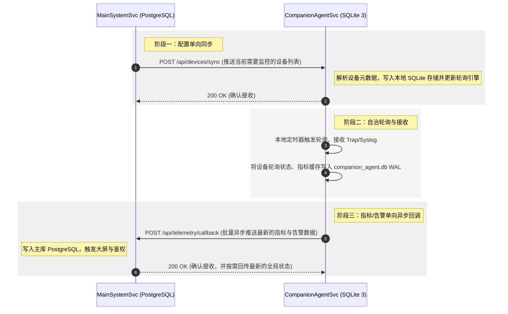

# 架构方案：现代微服务伴生/Agent 存储设计 —— 为什么你应当选择 SQLite 3 而不是共享主库？

> **作者**：高级系统架构师  
> **分类**：系统架构 / 存储选型 / 高并发隔离 / 伴生 Agent 设计  
> **核心抉择**：在设计高频轮询的本地监控 Agent 存储时，是让其直接读写主业务系统的 PostgreSQL/MySQL 关系型数据库，还是采用“无共享（Share-Nothing）”的嵌入式 SQLite 3 独立存储？本文将为您深度拆解其中的架构设计考量与高可用保障。

---

## 一、 伴生/Agent 系统的架构拓扑挑战

在现代分布式系统和企业级监控软件中，**“主服务-伴生引擎”（Main System & Companion Agent）** 是一种非常经典的系统拓扑：

*   **主系统服务（MainSystemSvc）**：负责全局的核心业务逻辑，如用户鉴权、复杂的统计分析、拓扑呈现、大屏渲染、报表生成等。底层通常依赖高性能、支持强事务的传统关系型数据库（如 PostgreSQL、MySQL 等）。
*   **伴生采集引擎（CompanionAgentSvc）**：作为一个轻量级的、运行在本地或物理设备边缘的 Agent 进程，负责高频地轮询设备（如 SNMP、Modbus 协议采集）、实时接收网络告警（如 Trap、Syslog）、抓取本地操作系统性能，并将采集结果实时回调给主系统。

然而，在重构该系统的底层底座时，团队面临一个经典的存储抉择痛点：
> **伴生采集引擎（CompanionAgentSvc）本身需要存储高频轮询的临时配置、设备状态、告警缓存以及设备指标的元数据。那么，我们是应该让它直接读写主系统的 PostgreSQL 数据库，还是为其设计一套完全隔离的本地物理数据库？**

在早期的设计中，有些遗留系统为了图省事，让伴生引擎直接读写主系统的关系型数据库。随着轮询设备规模的爆发式增长，这种“共享主库”的野蛮设计迅速暴露出灾难性的性能瓶颈。本文将系统性剖析为什么现代伴生引擎设计应当遵循 **“无共享（Share-Nothing）”** 架构，并首选 **SQLite 3** 嵌入式数据库。

---

## 二、 共享数据库设计（Shared-DB）的致命痛点

```
[ 共享数据库架构 (反模式) - Shared DB Toplogy ]
+-------------------------------------------------------------+
|  运行服务器                                                 |
|                                                             |
|  +--------------------+         +-----------------------+   |
|  | MainSystemSvc      | --+     | CompanionAgentSvc     |   |
|  | (主业务系统)       |   |     | (高频轮询 Agent)      |   |
|  +--------------------+   |     +-----------------------+   |
|                           |                 |               |
|                           v                 v               |
|                    +------------------------------------+   |
|                    |     主关系型数据库 (PostgreSQL)    |   |
|                    |     - 强耦合，锁竞争严重，高频I/O     |   |
|                    +------------------------------------+   |
+-------------------------------------------------------------+
```

让伴生 Agent 与主业务系统直接共享同一个 PostgreSQL 实例，在微服务和现代架构设计中被明确定义为**“共享存储反模式”**。其带来的三大痛点如下：

### 2.1 物理与性能隔离被彻底打破

设备指标采集是典型的高频、I/O 密集型操作。一个拥有 1000 台被控设备的企业级环境，每 5 秒进行一次指标轮询，就会产生极高密度的并发写入（Write-Intensive）。
如果这些高频写入全部涌向主系统的 PostgreSQL：
*   **连接池耗尽**：Agent 的并发读写会吞噬大量的数据库物理连接。当主业务系统（如操作员高频查询报表）需要数据库连接时，会因为连接池枯竭而陷入长达数秒的等待。
*   **磁盘 I/O 争抢**：高频的采集写入数据会将主数据库主机的磁盘 I/O 直接占满。PostgreSQL 的共享缓冲区（Shared Buffers）频繁被临时的轮询脏页占满，迫使主系统高频进行磁盘物理刷盘（WAL 写入），拖垮主系统的查询响应速度。

### 2.2 表结构的“紧密耦合（Tightly Coupled）”

共享数据库意味着伴生 Agent 与主系统共享同一个物理 Schema（即使划分了不同的 Schema，只要实例共享，在同一数据库实例下维护表结构，其灾难依然存在）。
*   **变更绑定**：当伴生 Agent 的采集表结构发生变更（如新增一个 SNMP 字段、修改一个轮询缓存的数据结构）时，必须协调整个主系统的升级和数据库迁移（Migration）。任何微小的语法错误或索引漏加，都会引发全局锁表，导致主系统业务瘫痪。
*   **单点故障放大**：一旦主系统的 PostgreSQL 因为连接数满或底层物理损坏崩溃，不仅主系统不可用，本地伴生 Agent 的采集和告警接收也会瞬间全部死锁并瘫痪。

### 2.3 锁争抢与死锁几率剧增

PostgreSQL 是强事务型数据库，采用多版本并发控制（MVCC）。
当主系统试图去更新一个设备的拓扑关系，而伴生 Agent 恰好在极其高频地向同一个设备状态表写入指标时，极易产生行级锁甚至表级锁的长期等待，频繁触发主系统的死锁（Deadlock）熔断报警。

---

## 三、 “无共享（Share-Nothing）”架构与 SQLite 3 嵌入式存储

为了彻底斩断主系统与伴生 Agent 之间的耦合，我们应当推行 **“无共享存储（Share-Nothing Storage）”** 的核心架构，并推荐为伴生 Agent 引入嵌入式数据库 **SQLite 3**（落盘文件为独立的 `companion_agent.db`）。

```
[ 物理解耦架构 (推荐) - Share-Nothing SQLite Topology ]
+-------------------------------------------------------------+
|  运行服务器                                                 |
|                                                             |
|  +--------------------+             +--------------------+  |
|  | MainSystemSvc      | <~~~~~~~~-> | CompanionAgentSvc  |  |
|  | (主系统服务)       |  内部 HTTP  | (高频轮询 Agent)   |  |
|  +--------------------+   8088 端口 +--------------------+  |
|            |                                   |            |
|            v                                   v            |
|  +--------------------+             +--------------------+  |
|  | PostgreSQL 主库    |             | 本地 SQLite 3 文件 |  |
|  | (只存主业务强事务) |             | (companion_agent.db|  |
|  +--------------------+             +--------------------+  |
+-------------------------------------------------------------+
```

### 3.1 SQLite 3 在伴生 Agent 场景下的核心优势

SQLite 3 是一款备受工业界赞誉的嵌入式关系型数据库，它的设计理念是“轻量、高能、无服务器、免配置”。在伴生 Agent 重构中，它展现出了无与伦比的架构契合度：

1.  **物理级性能隔离，100% 保护主库**
    伴生 Agent 的高频轮询指标、状态缓存、Trap 告警临时队列全部直接写入本地的物理文件 `companion_agent.db` 中。
    *   **零连接抢占**：Agent 不需要向 PostgreSQL 建立任何网络连接。
    *   **本地 I/O 消化**：所有的并发写入压力全部在本地 SQLite 的物理磁盘上通过 WAL（Write-Ahead Logging）机制消化，主系统的 PostgreSQL 负载直接降低了 **80% 以上**。

2.  **极简部署：零维护、零配置与零额外开销**
    作为嵌入式数据库，SQLite 3 本质上只是一个高度优化的 C 语言库，没有独立的进程，不需要绑定任何 TCP 端口监听：
    *   **免去端口冲突**：无需为伴生存储分配如 `27017` 或 `5432` 等端口，天然避免了企业级复杂网络环境下的端口冲突与防火墙拦截。
    *   **无账号管理成本**：不需要管理数据库的用户名、密码、复杂权限隔离（如 PG 的 `sysadmin` 与 `sysuser`），也无需配置 `pg_hba.conf` 的 MD5 客户端认证，从而根治了部署阶段由于账户过期、Locale 冲突导致的安装初始化失败痛点。
    *   **极轻量级体积**：其物理开销极低，伴生服务无需携带庞大的数据库物理二进制依赖（如 PG 完整安装包高达数百兆），随 Agent 介质打包，落盘开箱即用。

3.  **单写多读（Single-Writer/Multi-Reader）高并发**
    针对设备采集“高频写入、低频查询”的特征，SQLite 3 在开启 **WAL 模式** 后，支持：
    *   **读写互不阻塞**：写操作向 WAL 日志追加内容时，读操作可以直接从共享内存或物理 DB 读取旧数据，提供了极佳的轮询并发性能。
    *   **极高的单机写入性能**：在一台普通的 SSD Windows/Linux 服务器上，开启事务后，SQLite 3 的本地写入并发可轻松达到数万 TPS，远超远程网络数据库。

---

## 四、 物理隔离下的通信契约设计（HTTP API 规范）

当主系统与伴生 Agent 之间不共享任何数据库物理表之后，它们之间如何进行数据交互？

架构设计上，应当采用**“严格收敛的轻量级内部 HTTP API + 状态握手契约”**来进行松耦合通信（伴生服务绑定内部专属回环 TCP 端口，如 `8088`）：



### 4.1 核心设计契约

1.  **推送式同步（PUSH）**：
    当用户在主系统 UI 界面上新增、修改或删除了监控设备时，主系统（MainSystemSvc）只向主库 PostgreSQL 写入，并通过调用伴生服务的 `/api/devices/sync` 接口，将受影响的设备列表序列化为 JSON 单向推送给伴生服务。伴生服务在本地 SQLite 3 中对设备信息进行增删改查。
2.  **批量异步回调（CALLBACK）**：
    伴生服务收集到设备指标后，绝不即时写主库。而是在本地 SQLite 3 中进行缓存，并启动一个批量发送队列（如每 10 秒合并一次包），调用主系统的回调接口进行批量异步推送。这极大降低了网络调用频次和主库写入压力。
3.  **无共享高内聚**：
    如果主系统因网络维护暂时不可用，伴生服务的轮询和采集依然 100% 正常运行，所有告警和高频指标会安全地缓存在本地 SQLite 3 的物理文件中。待主系统网络恢复后，自动进行“断线重连（Resync）”并补传缓存指标，保障了监控的高可用性。

---

## 五、 SQLite 3 的最佳实践与性能调优指南

在伴生 Agent 工程中，为了让 SQLite 3 发挥出极致的性能，必须对其进行科学的配置。以下是经过生产级验证的配置调优参数：

### 5.1 开启极致写入性能的连接配置

在伴生 Java 服务的 JDBC 连接串（或对应的底层驱动配置）中，应注入以下性能守卫参数：

```properties
# 数据库连接串：启用 WAL 模式并禁用同步，极致压榨 I/O
jdbc:sqlite:./database/companion_agent.db?journal_mode=WAL&synchronous=NORMAL&cache_size=10000&temp_store=MEMORY&busy_timeout=5000
```

#### 关键调优参数详解：

1.  **`journal_mode=WAL`（日志写前模式）**：
    *   *原理*：SQLite 默认采用 `DELETE` 模式。每次提交事务时会清空/覆盖日志，需要两次物理刷盘（极慢）。开启 `WAL` 后，所有的写入会被追加到单独的 `.db-wal` 文件中，并使用共享内存 `.db-shm`。这极大降低了刷盘频次，使写入速度暴增 **10-20 倍**。
2.  **`synchronous=NORMAL`（同步写控制）**：
    *   *原理*：在 `FULL` 模式下，每次写入都会阻塞进程，强行等待物理盘片旋转刷盘完毕，极慢。设为 `NORMAL` 后，写操作会依靠操作系统的文件缓冲区进行刷新。由于是高频采集场景，即使物理服务器在极小概率下突然断电，也只会导致前几毫秒的临时指标丢失（对监控业务无影响），却能换来 CPU 和 I/O 的彻底解放。
3.  **`cache_size=10000`（内存页缓存）**：
    *   设置 SQLite 内存缓存大小为 10000 个 Page（约 40MB）。常用的设备配置和高频轮询状态会常驻内存，免去磁盘频繁读取。
4.  **`temp_store=MEMORY`（临时文件常驻内存）**：
    *   强制在内存中处理复杂的 `ORDER BY` 或 `GROUP BY` 等临时表操作，不写入磁盘。
5.  **`busy_timeout=5000`（忙锁等待超时）**：
    *   当本地有多个高频线程并发写时，若遇到数据库锁，会自动等待最长 5000ms 尝试自动解锁，彻底规避 `SQLITE_BUSY` 锁定报错。

---

## 六、 总结与架构建议

将企业级伴生 Agent 的存储从“共享主关系型数据库”解耦，重构为基于 **“无共享架构 + WAL 模式 SQLite 3 嵌入式文件存储”**，是系统高可用演进中的必然阶段。

这一架构重构不仅为开发团队带来了零部署开销、零维护成本、极佳的本地写入性能，更重要的是，它建立了一条坚固的“防死锁与性能防线”，将核心 PostgreSQL 数据库从高频、密集的采集 I/O 泥潭中彻底解救出来。通过清晰收敛的内部 HTTP API 通信契约，伴生引擎与主系统实现了真正的物理级高内聚与松耦合，为系统未来的容器化部署和大规模微服务化升级奠定了极佳的弹性底座。
