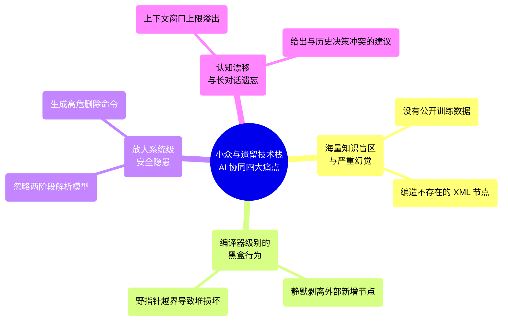

# 方法论：当 AI 遇到闭源黑盒遗留系统 —— 资深工程师如何通过“证据驱动”与“黑盒逆向”打破 AI 幻觉？

> **作者**：高级系统架构师 / 研发效能专家  
> **分类**：软件重构 / 研发效能 / AI 协同方法论 / 遗留系统治理  
> **核心挑战**：在面对 React、Spring Boot 等主流技术栈时，AI 极其出色；但在面对缺乏公开数据集、闭源且充满编译器黑盒行为的遗留技术栈时，AI 极易产生幻觉，甚至写出高危逻辑。本文将总结一整套“证据驱动、安全沙箱、上下文对齐”的现代 AI 协同重构方法论。

---

## 一、 遗留与小众技术栈下，AI 协同的四大痛点

随着大语言模型（如 Claude-3.5-Sonnet、GPT-4o 等）在软件工程中的普及，团队习惯于将常规的业务代码编写“外包”给 AI 助手。这在主流、开源的技术栈中运作良好，因为互联网上存在海量的公开代码仓库、博客文章、StackOverflow 问答和官方开发文档。

然而，当重构的战役打入**企业级遗留、闭源或极其小众的底层系统**（如古老的打包编译器、闭源的系统配置工具、多年前的 Java Service 封装器、传统的 CMD 批处理机制）时，团队会遭遇极其严峻的 AI 协同痛点：



1.  **海量知识盲区与严重幻觉**：AI 的训练数据中几乎没有小众打包编译器或商业闭源底层框架的内部定义。当被要求“在 XML 中新增一个服务注册动作”时，AI 会根据常识胡乱编造出看似非常合理的 XML 标签。这些标签在构建期不仅通不过编译，甚至会引起编译器的黑盒报错。
2.  **编译器级别的黑盒行为难以预测**：由于打包工具、封装器是闭源的，我们无法进行源码级单步调试。像“在 XML 中手动新增 ObjectID 在构建时会被静默剥离”、“孤立内联节点在 fileSize=-1 时触发 C++ 编译器堆损坏崩溃”等底层缺陷，AI 绝对无法通过简单的静态代码分析和常识预知。
3.  **系统级安全隐患被成倍放大**：AI 的安全意识是基于常识的。在高权限（Administrator / System 权限）的部署或运维脚本编写中，AI 极易忽略 CMD 等 Shell 解释器的方言特性（如延迟展开机制），写出诸如 `rmdir /s /q "%JREDIR%"` 等逻辑不闭环的清理命令，直接将整盘擦除的风险带入生产。
4.  **长对话轮次下的“认知漂移”**：跨越数天、涉及多技术栈（Java、XML、Shell、Maven）的复杂重构，往往伴随着漫长且高频的技术对话。随着上下文窗口的增加，AI 会不可避免地发生“遗忘”或“认知漂移”，给出与之前已确定的架构决策相冲突的过时建议。

为了突破这些技术瓶颈，我们在某大型监控软件的数据底座升级与部署架构重构中，彻底改变了与 AI 的协同模式。我们推行了一整套从**“任务外包工”向“证据驱动推理伙伴”**升维的重构方法论。

---

## 二、 AI 协同模式的升维转变：核心方法论

### 方法论一：从“任务外包”转向“证据驱动（Evidence-Driven）”

*   **传统错误模式（代码外包）**：直接向 AI 发送宽泛的指令：“帮我写一个在安装器中解压 zip 并启动服务的 XML 节点。”  
    *   *后果*：AI 产生严重幻觉，凭空捏造一堆废弃的标签。
*   **现代升维模式（证据驱动）**：将 AI 定位为**“拥有严谨逻辑的推理伙伴”**。我们在动手前，必须主动向 AI 提供三类“铁证”，并引导其进行逻辑推导：
    1.  **提供 Baseline 证据**：将现有的、已被编译器验证通过的正常 XML 物理节点（包括其完整的父子上下文，如 `visualChildren` 链、正常的 `ExecuteScript` 节点定义）作为“模板铁证”提供给 AI，指示其“像素级模仿，严禁自主发明标签”。
    2.  **提供真实的报错日志**：将构建失败的原始堆栈（如 C++ 内存越界退出码 `0xC0000374`、或者 Maven 报错、服务自启失败日志）无保留地提供给 AI，阻止其进行“可能是网络问题”等无意义的猜测。
    3.  **引导差异对比分析（Diff Analysis）**：不让 AI 瞎猜，而是引导其进行横向和纵向的对比：“对比 build-11（成功，仅文件落盘）和 build-12（失败，堆损坏），找出 XML 结构中的唯一变量，推导为什么 fileSize=-1 会导致编译崩溃？”

### 方法论二：建立“静态验证与安全沙箱”过滤机制

“不相信 AI 的口头保证，只相信工具的静态审计结果。”

AI 编写的涉及系统级删除、注册表修改的脚本，在运行前必须通过一关。我们在 AI 与真实操作系统之间建立了一层**“安全沙箱（Security Sandbox）”**：

1.  **编写静态安全审计工具**：在重构最开始，率先编写通用的审计脚本（如 `verify-destructive-commands.ps1`），对所有 `rmdir`、`rm -rf` 危险命令的参数进行严格的特征校验（路径是否绑定全局字面量前缀、是否包含 cd 路径守卫、是否可能传递空值）。
2.  **建立闭环修复机制**：将静态审计脚本合入本地 Git 钩子或 CI 构建门禁。
3.  **以工具日志驱动 AI 自我修复**：一旦 AI 生成的代码包含安全隐患，静态审计脚本会自动拦截并输出详细的“不合规报告”。我们将这个报告原封不动地发回给 AI，迫使其在安全规则的刚性约束下，吐出极其严谨、带有双保险守卫的修复代码。

### 方法论三：上下文快照对齐策略（Context Snapshot）

为了彻底解决长对话轮次下 AI 的“认知漂移”与健忘症，我们建立了 **Context Snapshot（上下文快照）** 机制：

1.  **维护单一事实源（Single Source of Truth）**：在重构工程中设立专门的 `docs/context-snapshot.md` 文件。
2.  **动态 Checkpoint 归档**：每当攻坚取得阶段性突破（如 Windows 侧装机回归通过、解决 0xC0000374 崩溃、确定采用 SQLite 3 作为隔离存储），立即将最新的“核心技术结论、关键物理节点、下次对话启动方式”合并更新到该快照文档中。
3.  **无缝认知恢复**：在开启新的 AI 对话、或者在不同的工具链中切换时，指令的第一步永远是：“请静默读取并内化 `docs/context-snapshot.md` 里的所有决策与上下文，恢复全量技术认知。”
4.  **消除认知偏差**：这确保了 AI 始终站在最新、最正确的工程终点上提供建议，避免其给出与历史决策冲突的过时思路。

---

## 三、 实战案例一：解决“解压工具静默崩溃”的演进全过程

以下案例真实还原了我们如何运用上述方法论引导 AI，一步步攻克“GnuWin32 unzip.exe 静默内存截断崩溃”这一隐蔽黑盒 Bug 的过程。

### 3.1 初始阶段（AI 给出常规建议，遭遇黑盒崩溃）

*   **技术背景**：我们正在将底座从 MongoDB 替换为 PostgreSQL 18.4。由于 PostgreSQL 的物理体积大，IA 静态打包打包缺失部分物理文件（如 `share` 目录），我们采用了**“动态 Zip 介质落盘后解压平滑部署”**的方案。
*   **AI 习惯性建议**：使用开源、小巧的 GnuWin32 `unzip.exe` 命令行工具进行解压。
*   **真实运行症状**：在某些全新的现代 Windows Server 2019+ 机器上，解压过程顺利结束，且 `unzip.exe` 的 Exit Code 也是 0（代表成功）。但是，`database` 目录下的物理文件严重不全，导致后续 PostgreSQL 初始化 `initdb` 频繁由于缺少核心动态链接库而报错。

### 3.2 推理阶段（引导 AI 分析底层依赖）

我们没有让 AI 去反复重试 `unzip` 命令，而是使用证据驱动：
*   **证据输入**：我们在正常运行的开发机上，使用 `unzip` 成功解压；在故障机上失败。我们使用 `dumpbin` 或进程监视工具，抓取了 GnuWin32 `unzip.exe` 的底层动态链接库依赖树，并将依赖信息输入给 AI。
*   **AI 深度推理**：
    AI 通过分析依赖树并检索知识库发现：GnuWin32 的 `unzip.exe` 编译于 2005 年以前，其底层强依赖古老的系统运行时 **`msvcp60.dll`（VC++ 6.0 运行时）**。
    在现代安全的 Windows 10 (Build 17063+) / Windows Server 2019+ 操作系统中，出于安全考量，系统默认不包含或不信任该动态链接库。导致 `unzip.exe` 在解压超过 100MB 的 PostgreSQL 大包时，发生了**静默内存截断崩溃**。操作系统强行终止了其解压进程。因为崩溃发生在外壳 DLL 内部，`unzip.exe` 的进程退出码甚至来不及抛出异常，依然返回了 0，形成了极具欺骗性的假象。

### 3.3 破局：生活在陆地上（Living off the Land）

既然分析出了底层依赖缺陷，我们引导 AI ：“在不让用户额外安装 VC++ 6.0 运行时的刚性约束下，Windows 系统本身是否内置了现代的解压工具？”

*   **AI 提出的破局方案**：Windows 10 / Server 2019+ 原生内置了现代的 **`tar.exe`**（基于 BSD tar），支持直接解压 `.zip` 格式，且没有任何外部古老 DLL 依赖，性能极其强悍。
*   **安全沙箱介入，编写终极解压命令**：
    ```cmd
    tar -xf "$USER_INSTALL_DIR$$\\pgsql.zip" -C "$USER_INSTALL_DIR$$\\"
    ```
*   **Fail-Fast（快速失败）设计模式**：为了防止在极少数不支持 `tar.exe` 的极其老旧的 Windows 系统（如 Server 2012 R2）上运行失败，我们要求 AI 在 Java 部署 Custom Code 的前置启动阶段，编写了一段静默兼容性检查逻辑：

```java
// GetApplicationNames.java
public void install(Installer auxiliary) throws Exception {
    try {
        // 静默运行 tar.exe --version
        Process process = Runtime.getRuntime().exec("tar --version");
        int exitCode = process.waitFor();
        if (exitCode != 0) {
            throw new Exception("Missing native tar.exe");
        }
    } catch (Exception e) {
        // 弹出友好的系统兼容性检查失败提示框
        JOptionPane.showMessageDialog(null, 
            "The system lack of 'tar.exe'. This installer requires Windows 10 or Windows Server 2019+.", 
            "Compatibility Pre-check Failure", 
            JOptionPane.ERROR_MESSAGE);
        throw new FatalInstallException("Pre-flight compatibility check failed: native tar.exe is missing.");
    }
}
```
这套前置 Fail-Fast 机制不仅彻底解决了静默崩溃问题，还实现了干净的安装终止与回滚，达成了极高的工程交付质量。

---

## 四、 实战案例二：AI 协同排查“伴生服务注册执行断层”的逆向推导

在重构伴生服务安装逻辑期间（build-5 到 build-11），我们遭遇了极其诡异的断层：
> **症状**：构建日志显示伴生服务文件已正常编译并编入安装介质。在运行安装时，伴生服务的 WAR 包、JRE 压缩包也确实释放在了物理磁盘的目标目录。然而，**伴生服务的 Windows 服务（ZESvc）从未被注册，且解压 JRE 的 unzip 动作也从未被调用。安装日志中对这些服务注册动作完全没有任何执行记录（静默跳过）**。

这是典型的打包编译器黑盒运行机制导致的执行断层。

### 4.1 第一阶段：控制变量与多维 Diff 对照

*   **逆向分析思路**：
    1.  我们将 build-5（失败，服务未注册）和原系统正常注册其他服务（如主系统 TAFsvc）时的 XML 结构导出。
    2.  将两个 XML 的树状依赖关系、节点挂载、以及安装过程中的完整执行日志提供给 AI。
    3.  引导 AI：“不要猜测配置，从组件激活与执行序列的生命周期，横向对比为什么主服务能执行，而伴生服务动作组被静默忽略？”

### 4.2 第二阶段：推导打包编译器的“跨组件引用静默隔离”机制

*   **AI 的逻辑推导结论**：
    *   在 XML 结构中，伴生服务的服务注册动作组 `ecdb7d1e9e76`，其**物理定义（实体定义）**被挂在 `Main Database Linux` 这个组件节点内部。
    *   在 Windows 安装序列中，我们因为图省事，仅仅通过一个引用指针 `<object refID="ecdb7d1e9e76"/>`，将该动作组跨组件挂载到了 Windows Only 的文件安装执行序列（`d4095d81b09b`）下方。
    *   **黑盒规则发现**：打包编译器在打包运行时，会根据用户所选的特性和当前运行平台，单向激活组件。当在 Windows 平台运行时，`Main Database Linux` 组件被标记为**不激活**。
    *   编译器的运行引擎在解析执行序列时，一旦发现被引用动作组的物理定义属于一个未激活的组件，即使该动作组在活跃组件的执行序列中被显式引用，运行引擎也会**静默跳过整个动作组的执行**，不报任何错误。这就是典型的“跨组件引用静默隔离”。

### 4.3 第三阶段：方案演进——内联提升（Hoist）补丁

既然找到了根因，我们不能在没有 GUI 的 headless 构建机上打开设计器去重构。我们引导 AI：“如何使用 Python 的 XML 解析器编写一个自动化补丁，彻底重构这一跨组件依赖？”

*   **重构方案：内联提升（Hoist）**
    AI 帮助编写了 `apply-ze-install-fix-v7.py` 自动化修复补丁，执行以下重构操作：
    1.  **物理剥离**：将伴生服务注册动作组 `ecdb7d1e9e76` 的完整物理节点定义，从 Linux 组件的 `visualChildren` 向量中彻底删除。
    2.  **内联提升（Hoist）**：直接将该动作组的完整定义**内联插入**到 Windows Only 专属的文件序列 `d4095d81b09b` 内部。
    3.  **移除孤立 refID**：清理所有上层孤立的交叉引用指针，消除了潜在的命名空间冲突。

#### Hoist 重构前后的 XML 结构对比：

```
[ 重构前：跨组件引用静默隔离 ]
Component: Main Database Linux (未激活)
  └── [实体定义] ActionGroup: ecdb7d1e9e76 (伴生服务注册) <--------+
                                                               |
Component: Windows Only files (激活)                            | (跨组件引用，静默失效)
  └── InstallFile: zeroengine                                  |
  └── [引用指针] object refID="ecdb7d1e9e76" ------------------+

-----------------------------------------------------------------------------

[ 重构后：内联提升 (Hoist) 方案 - 成功执行 ]
Component: Windows Only files (激活)
  └── InstallFile: zeroengine
  └── [实体定义内联提升] ActionGroup: ecdb7d1e9e76 (伴生服务注册)
```

在随后的 build-11 装机验证中，伴生服务的服务注册、JRE 动态解压、自启双保险配置**首次全部 100% 顺利执行**，攻克了这一隐蔽的执行断层。

---

## 五、 总结：给未来重构者的“AI 协同”生存法则

1.  **AI 不是代码外包工，而是逻辑推理机**：在面对没有公开文档和源码的闭源系统时，停止向 AI 索要大块代码。将 Baseline、报错日志和 Diff 变量作为证据喂给 AI，引导其进行底层的逻辑推导，这才能释放 AI 的真正效能。
2.  **用工具和沙箱守住安全底线**：不要让 AI “裸奔”。在动手改代码前，先和 AI 合作开发出“静态安全审计工具”和“Fail-Fast 兼容性预检逻辑”。用刚性的规则和自动化流程，在 AI 生成的代码与高权限系统运行之间筑起一道防火墙。
3.  **动态维护 Context Snapshot**：复杂工程的对话轮次过长时，必须维护单一事实源的快照文件，每当攻坚成功一个 Checkpoint，立即更新快照。这不仅能帮助 AI 消除认知漂移，更是项目交付时最珍贵的技术成长资产。
