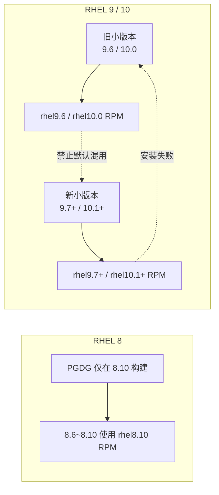

# PostgreSQL 18.4 PGDG RPM — Red Hat / 兼容发行版选用说明

> **最后更新**：2026-06-04  
> **用途**：PI 离线依赖包（`dependencies/linux/redhat/`）选型与安装器 `releasever` 映射。  
> **参考**：[PGDG — Multiple RHEL minor versions](https://yum.postgresql.org/news/postgresql-rpms-multiple-rhel-minor-versions/) · [pgdg-rpms #119](https://github.com/pgdg-packaging/pgdg-rpms/issues/119)

---

## 背景

PGDG 自 2025 年底起对 **RHEL 9 / 10** 按 **OS 小版本（minor release）** 分别编译 RPM。根因是 **9.6↔9.7、10.0↔10.1** 等版本之间 **OpenSSL ABI 不兼容**（新包可能依赖 `OPENSSL_3.4.0` 等新符号，旧系统无法满足）。

**RHEL 8** 小版本之间保持 ABI 兼容；PGDG 仅在 **8.10** 环境构建，包名中的 `rhel8.10` 表示 **构建环境**，不表示只能安装在 8.10 上。

以下规则同样适用于 **Rocky Linux、AlmaLinux、Oracle Linux** 等与 RHEL **同版本号** 的衍生版。

---

## RHEL 8（全系）

| 项 | 说明 |
|----|------|
| **适用 OS** | RHEL 8.x（及同主版本的兼容发行版） |
| **选用 RPM** | `postgresql18-18.4-2PGDG.rhel8.10.x86_64.rpm` |
| **说明** | PGDG 当前仅在 8.10 上编译；因 RHEL 8 小版本 ABI 兼容，**8.6～8.10 均可使用该包**。文件名中的 `-2PGDG` 仅为 RPM release 序号，与「第 2 代通用包」无关。 |
| **PostgreSQL 小版本升级** | 在同一 major（18.x）内做 `dnf upgrade` 一般为常规升级；**不等同于**跨 OS 小版本（如 8.6→8.10）的升级，后者需单独规划 OS 升级。 |

---

## RHEL 9

| OS 小版本 | 应使用的 RPM | 禁止 / 不推荐 |
|-----------|--------------|----------------|
| **9.6** | `postgresql18-18.4-1PGDG.rhel9.6.x86_64.rpm` | 不得使用 `rhel9.7` / `rhel9.8` 等较新小版本包（旧系统缺少新 OpenSSL 符号时会安装失败） |
| **9.7** | `postgresql18-18.4-1PGDG.rhel9.7.x86_64.rpm` | **禁止混用** `rhel9.6` 仓库/包作为默认安装路径（未保证兼容，且后续 yum 升级易错乱） |
| **9.8** | **优先** `postgresql18-18.4-1PGDG.rhel9.8.x86_64.rpm`（若 dependencies 中已提供） | 禁止默认使用 `rhel9.6` 包；有 9.8 专用包时优先用 9.8；`rhel9.7` 包在 9.8 上是否可用需以 PGDG 仓库或实测为准 |
| **其他 9.x** | 待评估 | PGDG 通常只维护 **最近两个** 9.x 小版本；超出范围需查 PGDG 新闻或单独验证 |

**原则**：OS 小版本与 RPM 的 `rhel9.x` 标签 **必须一致**。**旧 OS 不能用新小版本 RPM**；**新 OS 禁止默认选用旧小版本 RPM**（即使旧 ABI 包有时能装上，PGDG 未保证 forward compatibility）。

---

## RHEL 10

| OS 小版本 | 应使用的 RPM | 禁止 / 不推荐 |
|-----------|--------------|----------------|
| **10.0** | `postgresql18-18.4-1PGDG.rhel10.0.x86_64.rpm` | 不得使用 `rhel10.1` / `rhel10.2` 等较新小版本包 |
| **10.1** | `postgresql18-18.4-1PGDG.rhel10.1.x86_64.rpm` | **禁止混用** `rhel10.0` 包作为默认安装路径 |
| **10.2** | **优先** `postgresql18-18.4-1PGDG.rhel10.2.x86_64.rpm`（若已提供） | 禁止默认使用 `rhel10.0` 包；有 10.2 专用包时优先用 10.2 |
| **其他 10.x** | 待评估 | 同 RHEL 9，仅维护最近两个小版本时需再确认 |

**原则**：与 RHEL 9 相同——按 OS `releasever` **精确匹配** RPM，禁止跨 OpenSSL ABI 边界混装。

---

## 安装器实现要点

1. 安装前解析 `releasever`（如 `8`、`9.6`、`9.7`、`9.8`、`10.0`、`10.1`、`10.2`），查表选择对应 RPM。
2. **RHEL 8**：任意 8.x 小版本均映射到 **`rhel8.10`** 包。
3. **RHEL 9 / 10**：必须与小版本 **一一对应**；禁止在新小版本上回退选用旧包。

示例（解析 OS 版本后）：

```
8.*     → postgresql18-18.4-2PGDG.rhel8.10.x86_64.rpm
9.6     → postgresql18-18.4-1PGDG.rhel9.6.x86_64.rpm
9.7     → postgresql18-18.4-1PGDG.rhel9.7.x86_64.rpm
9.8     → postgresql18-18.4-1PGDG.rhel9.8.x86_64.rpm   # 有则必用
10.0    → postgresql18-18.4-1PGDG.rhel10.0.x86_64.rpm
10.1    → postgresql18-18.4-1PGDG.rhel10.1.x86_64.rpm
10.2    → postgresql18-18.4-1PGDG.rhel10.2.x86_64.rpm   # 有则必用
```

---

## 当前离线包目录对照

路径（发布介质）：`dependencies/linux/redhat/`（例如 `PI next release\dependencies\linux\redhat\`）

| 文件 | 对应 OS |
|------|---------|
| `postgresql18-18.4-2PGDG.rhel8.10.x86_64.rpm` | RHEL 8 全系 |
| `postgresql18-18.4-1PGDG.rhel9.6.x86_64.rpm` | 9.6 |
| `postgresql18-18.4-1PGDG.rhel9.7.x86_64.rpm` | 9.7 |
| `postgresql18-18.4-1PGDG.rhel10.0.x86_64.rpm` | 10.0 |
| `postgresql18-18.4-1PGDG.rhel10.1.x86_64.rpm` | 10.1 |

### 已知缺口

以下 PGDG 已支持、但当前离线目录 **尚未包含** 的包（上线前按需从 [PGDG YUM](https://yum.postgresql.org/packages/) 补齐）：

- `postgresql18-18.4-1PGDG.rhel9.8.x86_64.rpm`
- `postgresql18-18.4-1PGDG.rhel10.2.x86_64.rpm`

---

## 选型逻辑（简图）



---

## 相关文档

- Ubuntu/Debian 离线包：见同目录 `dependencies/linux/ubtunu/`（目录名拼写待统一）
- Windows 二进制：`dependencies/windows/postgresql-18.4-1-windows-x64-binaries.zip`
