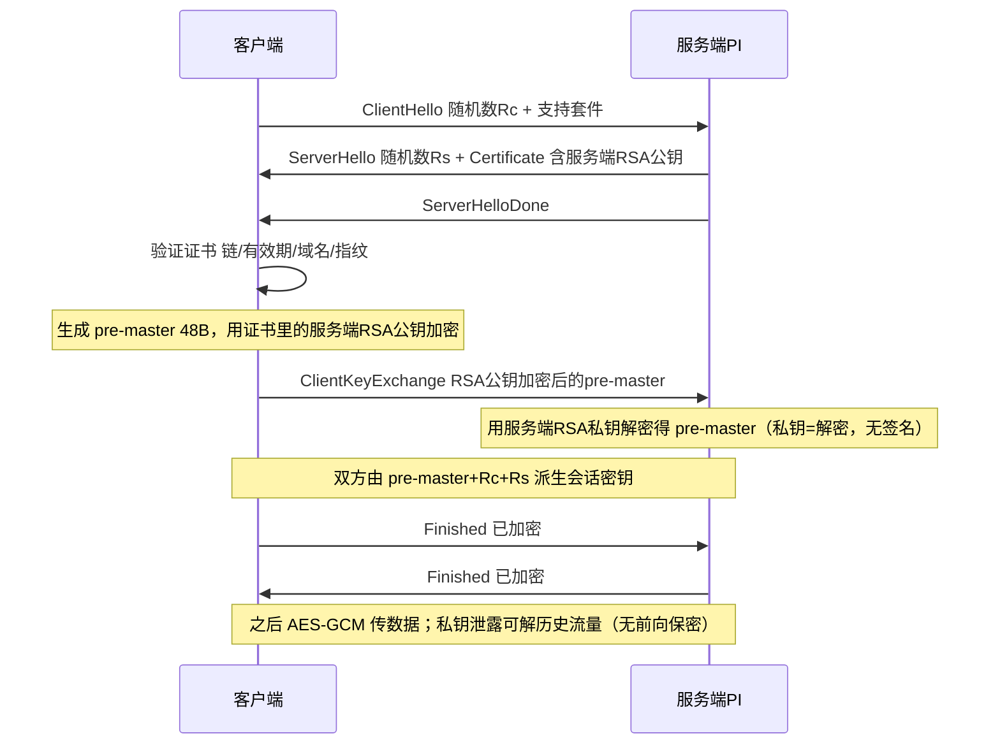
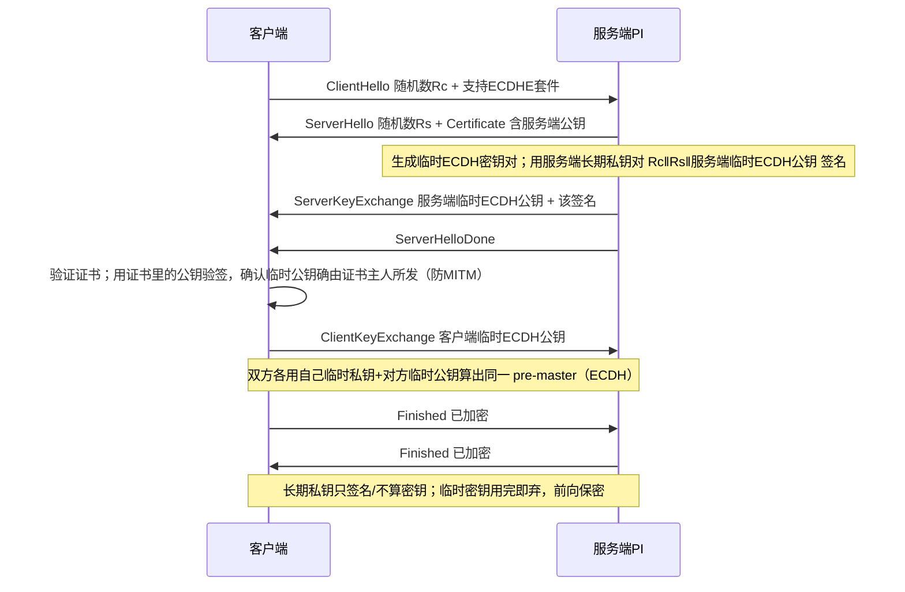
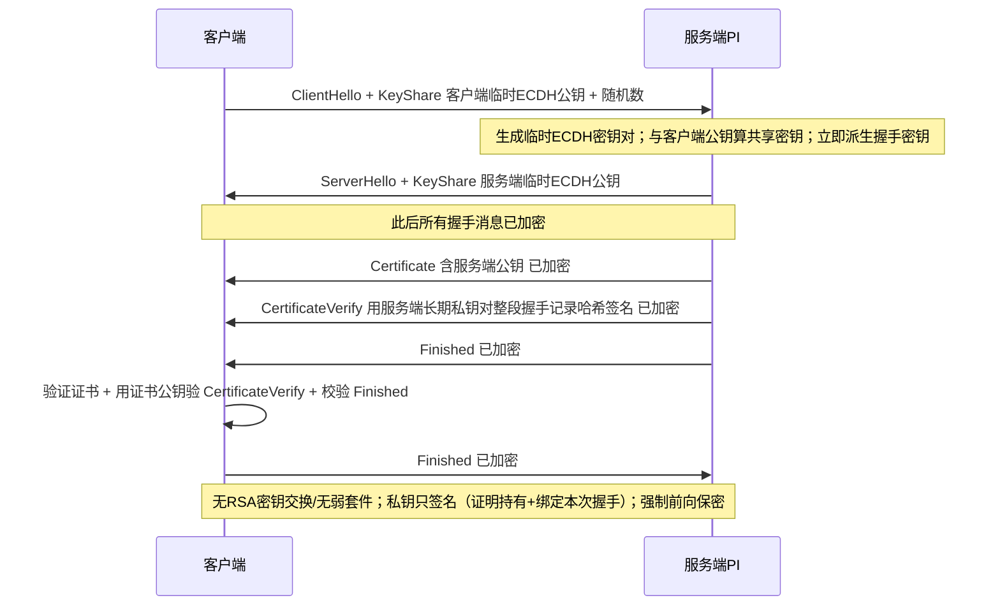
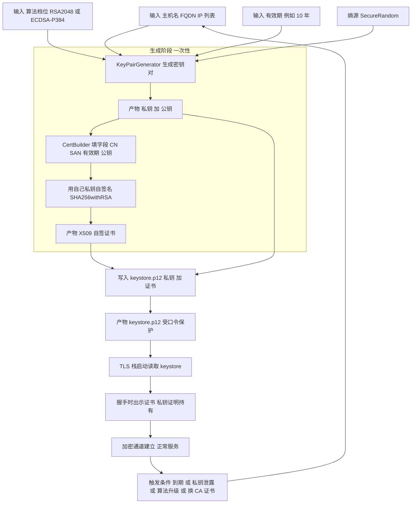

# TLS 与证书：背景知识（类别二 · #58 前置）

> 最后更新：2026-07-23
> 定位：本文是 **TLS/HTTPS/证书的原理背景 + 讨论问答**；对应的**证书问题现状与方案（做什么）**见 [../tls-certificate-solution.md](../tls-certificate-solution.md)。
> 面向：想弄懂"TLS 握手 / X.509 证书 / #58 每实例唯一证书"方案背后原理的读者。
> 姊妹前置：通用密码学（编码/加密/哈希、对称/非对称、AES/HKDF/bcrypt、熵、批准算法）见 [crypto-primer.md](crypto-primer.md)；运行权限的账户/隔离原理见 [windows-account-and-isolation-primer.md](windows-account-and-isolation-primer.md)。
> 先决基础：本文多处用到**对称 vs 非对称加密**，若不熟先看 [crypto-primer.md §3](crypto-primer.md)。一句话回顾：对称=一把钥匙两头共用（快，传数据）；非对称=公钥+私钥一对（慢，用于协商密钥/签名/证身份）。

---

## 1. HTTPS / TLS

**HTTPS = HTTP 跑在 TLS 之上。** TLS 提供三件事：**① 机密性(加密) ② 完整性(MAC) ③ 身份认证(证书)**——它建立一条加密通道。握手大意：非对称先协商出一把**临时对称会话密钥**，之后用对称(AES-GCM)传数据。版本用 **TLS 1.2 / 1.3**（SSL3/TLS1.0/1.1 已淘汰）。

### ⚠️ 关键澄清：RSA 在 TLS 里有两个用途，别混

- ① **RSA 做密钥交换**（客户端用服务端 RSA 公钥加密 pre-master，服务端私钥解密）：**TLS 1.2 仍支持**；**TLS 1.3 彻底删除**。
- ② **RSA 做签名/证书**（证书是 RSA、握手用 RSA 私钥签名）：**1.2 与 1.3 都还能用**。
- 所以"TLS 1.3 不用 RSA" = **不用 RSA 做密钥交换**，不是完全不用 RSA。
- 各图里"私钥签名"的**私钥 = 服务端长期私钥**（与其证书里的公钥配对），**不是**临时密钥、也不是 CA 私钥。

### 图1a · TLS 1.2 —— RSA 密钥交换（私钥=解密 pre-master，无签名，**无前向保密**）

### 图1b · TLS 1.2 —— ECDHE 密钥交换（私钥=签名认证，**前向保密**，现代推荐）

> **"私钥签名"到底签什么**（回答常见疑问）：ECDHE 模式里，服务端用**自己的长期私钥**（与证书公钥配对）对 `客户端随机数 ‖ 服务端随机数 ‖ 服务端临时ECDH公钥` 签名。客户端用**证书里的公钥**验签，从而确认"这个临时 ECDH 公钥确实是证书主人发的，没被中间人替换"。签名**不参与**算会话密钥，只负责**认证**。

### 图2 · TLS 1.3 握手（1-RTT，仅 ECDHE；私钥签"整段握手记录哈希"）

> TLS 1.3 的 `CertificateVerify`：服务端用**长期私钥**对**整段握手记录的哈希**签名——既证明"我持有证书对应的私钥"，又把签名**绑定到这一次具体握手**（防重放/中间人）。1.3 只保留 ECDHE、去掉弱套件与 RSA 密钥交换，因此**默认就带前向保密**。

### 前向保密（Forward Secrecy）

会话密钥由**临时(ephemeral)** 密钥算出、用完即弃；长期私钥只做签名。于是**将来长期私钥泄露，也解不开过去录下的流量**。RSA 密钥交换（图1a）没有这个性质——私钥一泄，历史流量全暴露，这正是 TLS 1.3 删除它的原因。

### 问答 · "公钥加密含 AES 密钥的内容、私钥解密"这个理解对吗

你描述的"客户端用服务端公钥加密一块含 AES 密钥的内容 → 服务端私钥解密拿到对称密钥 → 之后 AES 传输"——**在 TLS 1.2 的 RSA 密钥交换模式下完全正确**（图1a）。需补两点现代实情：

1. **现代 TLS（1.2 的 ECDHE、以及所有 1.3）不再用 RSA 加密密钥**，而是用 **(EC)DHE 临时 DH 协商**：双方各交换临时公钥、各自算出同一共享秘密，**证书私钥只用来签名认证**、不解密密钥（图1b/图2）。好处是**前向保密**。
2. 不是"直接传一把 AES 密钥"，而是双方从共享秘密经 KDF **各自派生**会话密钥（还分收发方向）。

一句话：**"非对称搞定对称密钥+认证身份，之后对称传数据"**这个大框架你对了；只是现代实现里那把私钥更多是**签名认证**而非**解密密钥**。

## 2. PKI / X.509 证书

- **证书 = 公钥 + 身份 + 有效期 + 签发者签名** 的 X.509 文件。
- **自签 vs CA 签**：自签=自己给自己背书（PI 现状）；CA 签=受信第三方背书（浏览器默认信任）。
- **信任链**：叶证书 ← 中间 CA ← 根 CA。
- **关键字段**：`CN`/`SAN`（域名/主机）、有效期、**指纹(fingerprint)**（证书的 SHA-256 摘要，用来比"是不是同一张"）。
- **keystore vs truststore**：keystore 放**自己的私钥+证书**（对外证明"我是谁"）；truststore 放**信任的对方/CA 证书**（判断"对面可不可信"）。PI 的 `keystore.p12`（私钥）、`core-trust.jks`（信任库）。**PKCS12(.p12)** 是现代标准格式，**JKS** 是 Java 旧格式。

### 自签 vs CA 签 与 CSR

- **自签**：用自己的私钥给自己的证书签名——没有第三方背书，客户端默认不信任（弹警告），需手动导入信任或点继续。PI 现状即此。
- **CA 签**：先生成 **CSR（Certificate Signing Request，含公钥 + 身份信息）**，交给 CA；CA 用它的私钥签发带信任链的证书。浏览器内置信任根 CA → 绿锁、无警告。
- 两者只差"组装+签名"这一步，密钥对生成、落 keystore、使用等阶段完全一样。

## 3. SAN 与 CN（主机名校验）

**SAN（Subject Alternative Name）** 是 X.509 的一个扩展字段，列出证书对哪些"名字"有效——可以是 DNS 名（`pi.corp.local`）、IP（`10.1.2.3`）等。老式做法把主机名写在 **CN（Common Name）** 里。

**现代规则**：2017 年起，Chrome 58+/Firefox/Edge/Safari **只看 SAN、无视 CN**。所以：

- **SAN 里没有你访问用的主机名 → 名字校验失败**（`ERR_CERT_COMMON_NAME_INVALID`），即便证书被信任也没有绿锁。
- **CN 是不是主机名已无所谓**——只有 SAN 起作用。

### 不写 SAN 会怎样（按客户端类型）

| 客户端 | 无 SAN 的后果 |
|--------|--------------|
| 现代浏览器 | 只看 SAN，无 SAN→报名字不匹配；自签还会先报"不受信任"，点继续能进但永远无绿锁 |
| 程序化/Java 客户端（HttpsURLConnection、Apache HttpClient、OkHttp） | 默认 hostname verifier 遇无 SAN/不匹配直接抛 `SSLPeerUnverifiedException`；"能跑"往往是把主机名校验关了——这本身是弱化 |
| IE11 | **支持 SAN**（20 年前就有的标准），不会因用 SAN 被排除；但 IE11 已 EOL（2022-06） |

**结论**：无 SAN = 名字校验在所有"严格客户端"处失败，只能退回"导入信任 + 关主机名校验"或"手动点继续"，脆弱且部分抵消修证书的意义。**若要证书名字校验干净，SAN 必须写对**（访问用的 hostname/IP）。

## 4. mTLS 双向认证

- **普通 TLS（单向）**：只有**服务端**出示证书，客户端验证服务端；客户端不出示证书（身份靠应用层口令等）。
- **mTLS（mutual TLS，双向）**：**两边都出示证书**，服务端**还要验证客户端证书**。用于机器对机器场景，用密码学证书当客户端身份，比口令强。

Spring Boot 的 `server.ssl.client-auth` 三档：

| 值 | 含义 |
|----|------|
| `none` | 不要客户端证书 |
| `want` | 服务端**请求**客户端证书，但**没有也放行**（可选 mTLS） |
| `need` | **强制**客户端证书，没有就握手失败 |

> 若一端开了 mTLS 且要校验对方证书，则对方证书的信任（truststore）和唯一性也要一起考虑。

## 5. 证书生命周期

一张证书从生到用到换，经历下面几个阶段——每阶段"用什么输入、做什么操作、产出什么"：

| 阶段 | 输入内容 | 用什么方式/工具 | 产物 |
|------|----------|-----------------|------|
| 生成密钥对 | 算法、长度、熵(SecureRandom) | `KeyPairGenerator` | 私钥 + 公钥 |
| 组装+自签证书 | CN、SAN、有效期、公钥 | BouncyCastle CertBuilder（或 keytool） | X.509 自签证书 |
| 落盘 | 私钥 + 证书 + keystore 口令 | `KeyStore`(PKCS12) | `keystore.p12` |
| 使用 | keystore 路径 + 口令 | TLS 协议栈（握手） | 加密通道 |
| 轮换/替换 | 见 §8 | 重跑生成 或 导入 CA 证书 | 新 keystore |

## 6. 生成证书用什么工具

| 工具 | 是什么 | 适不适合 |
|------|--------|----------|
| `keytool` | JDK **自带命令行**，`-genkeypair` 一步生成密钥对+自签证书写进 keystore | 可用，无额外依赖；控制 SAN 等扩展不如编程式（新版 `-ext SAN=` 才支持，JDK 8+/Zulu 21 均支持） |
| `openssl` | 通用加密命令行，能生成密钥/CSR/自签证书 | Windows 上不一定有；跨平台依赖它有风险 |
| Java `KeyPairGenerator` | **JDK 标准库现成的类**（`java.security.KeyPairGenerator`），`getInstance("RSA"/"EC").generateKeyPair()` 返回 `KeyPair` | 首选；**只生成密钥对，不生成证书** |
| BouncyCastle `JcaX509v3CertificateBuilder` | 第三方库，用密钥对构建并签出 X.509 证书，能完整设置 SAN/扩展 | 配合 KeyPairGenerator；很多 Java 项目已引入 |
| `java.security.KeyStore` | JDK 自带，把私钥+证书写成 PKCS12(.p12) | 落盘用它 |

> 干净的编程式路径 = `KeyPairGenerator`（生密钥对）+ BouncyCastle（自签、设 SAN）+ `KeyStore`（写 PKCS12）。因需跨平台、要细控扩展，比 shell 调 keytool/openssl 更可控。

## 7. 为什么非对称密钥不做"确定性派生"

对称密钥（AES）我们用 HKDF 从 `machine_id + nonce` 派生（好处：不落盘、要用时重算）。**非对称密钥对不这么干**，四个理由：

1. **对称密钥=任意随机字节**，HKDF 输出直接能用；**非对称密钥有数学结构**（RSA 要两个大素数、EC 要特定范围标量），不是"随便一串字节"就合法。
2. **RSA 生成消耗的随机量不定**（素数是"取一个→测→不是就重取"）。即便用 HKDF 输出当种子，**换 JDK/库版本/素数搜索实现，同种子会算出不同密钥** → "以后再派生一次来恢复"不可靠。
3. **安全域坍塌**：TLS 私钥若也从 `nonce` 派生，nonce 一泄 = 对称密钥 + TLS 私钥全丢。
4. **没收益**：派生对称密钥是为了"不落盘"；而 **TLS 私钥无论如何都要落盘**（TLS 栈每次启动从 keystore 读，不是每次握手重算）。既然反正要存，就生成一次随机的、存进 keystore、纳入备份即可。

**做法**：`SecureRandom` 现取现用生成新鲜随机密钥对；业界（NIST/常规）也都这样——非对称私钥由 CSPRNG 在密钥生成器内部产生，然后加密存储。

## 8. 轮换 / 续期 / 换 CA

**为什么需要轮换**（三个真实驱动）：
1. **到期**：证书有 notAfter，过期后 TLS 客户端直接拒绝 → 服务不可用，必须到期前换。
2. **私钥泄露/疑似泄露**：换 key 是止血唯一手段。
3. **算法升级**：长跨度里 RSA-2048 可能变弱，轮换时换 3072/ECDSA。

**每实例随机证书后照样能处理**：每台重跑同一套生成逻辑产出新证书、热替换即可（PI 3.0.0+ 已支持初始化后更换 MTP 证书）。自签场景"轮换"= 重生成 + 重新建立信任（客户端若导入过旧证书要重导）。

> 关键取舍：#58 要的是"**唯一性**"不是"短寿命"。自签轮换要客户端重新信任、较烦，所以可**保留长有效期 + 每实例唯一**，把轮换当成"到期/泄露/升级才用的能力"，而非频繁例行。

## 9. 术语表（TLS/PKI 专属）

| 缩写 | 全称 | 人话 |
|------|------|------|
| TLS/SSL | Transport Layer Security | HTTPS 的加密层；用 1.2/1.3 |
| PKI / X.509 | 公钥基础设施 / 证书格式 | 证书=公钥+身份+签名 |
| CN | Common Name | 证书主体名；现代客户端已不用它做主机名校验 |
| SAN | Subject Alternative Name | 证书有效的主机名/IP 列表；现代主机名校验只看它 |
| CSR | Certificate Signing Request | 送 CA 签发用的请求（含公钥+身份） |
| mTLS | mutual TLS | 双向证书认证 |
| keystore / truststore | — | 放自己私钥+证书 / 放信任的对方或 CA 证书 |
| PKCS12/.p12, JKS | keystore 格式 | .p12 现代标准，JKS Java 旧格式 |
| 指纹 fingerprint | — | 证书的 SHA-256 摘要，用来比"是不是同一张" |
| 前向保密 Forward Secrecy | — | 长期私钥泄露也解不开过去流量（ECDHE 才有） |

（RSA / ECDH·ECDHE / ECDSA·EdDSA 等非对称算法术语见 [crypto-primer.md §11](crypto-primer.md)。）

---

## 与方案文档的关系

- 本文只讲**原理与"为什么"**；**证书问题现状、方案、决策与改动索引**见 [../tls-certificate-solution.md](../tls-certificate-solution.md)。
- 通用密码学背景见 [crypto-primer.md](crypto-primer.md)。
- 关联任务：[类别二 · 任务 2-2 TLS 证书唯一](../../01-remediation-task-ledger.md)；需求定义 [secure-requirements §6.1 批准算法](../../requirements/secure-requirements-definitions.md)。
- 关联 issue：[#58 证书不唯一](../../issues/issue-58-ar00-06-non-unique-tls-cert.md)。
