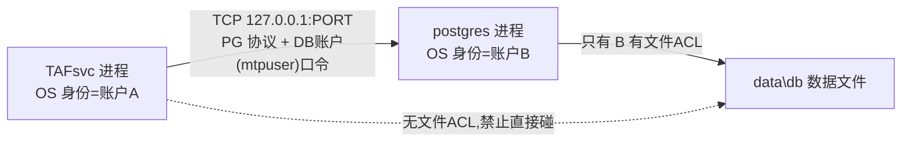

# Windows 账户与服务隔离：背景知识与选型讨论

> 最后更新：2026-07-21
> 定位：本文是**背景知识 + 选型讨论（为什么这么选）**；对应的**决定（做什么）**见 [../runtime-permission-solution.md](../runtime-permission-solution.md) §1.10。
> 面向：想弄懂"运行权限方案"背后 Windows 账户/隔离原理的读者，不需要预备知识。

---

# 第一部分 · 背景知识（通用）

## 1. 一切进程都以某个账户身份运行

Windows 上任何进程运行时都带一个"安全令牌（token）"，代表**它是谁、能干什么**。服务也一样：由**服务控制管理器（SCM）**用一个"登录账户（Log On account）"来启动。因此"服务以谁运行"直接决定了它被攻破后攻击者能拿到多大权力——这就是运行权限方案要治理的根本对象。

## 2. 六类服务账户详解

| 账户 | 本质 | 本机权限 | 网络身份 | 密码 | 隔离性 | 类比 Linux |
|------|------|----------|----------|------|--------|-----------|
| **LocalSystem**（`NT AUTHORITY\SYSTEM`） | 系统内置最高权限 | 近乎无限（=机器主人） | 机器账户 `MACHINE$` | 无 | 无 | ≈ **root** |
| **LocalService**（`NT AUTHORITY\LOCAL SERVICE`） | 内置低权限 | 很低 | 匿名（谁也不是） | 无 | 一般 | ≈ 很受限的 nobody |
| **NetworkService**（`NT AUTHORITY\NETWORK SERVICE`） | 内置低权限 | 低 | 机器账户 `MACHINE$` | 无 | 弱（多服务共用同一身份） | ≈ 共用的低权用户 |
| **虚拟服务账户 VSA**（`NT SERVICE\<服务名>`） | 每服务自动派生的专属身份 | 低 + 可精确授权 | 机器账户 `MACHINE$` | 无（系统托管） | 较好（每服务独立 SID） | ≈ 每服务一专用户但免管密码 |
| **本地用户**（`net user vertiv_pi`） | 自建普通用户 | 你控制（可很低） | 无（仅本机） | **要自己管** | 好 | ≈ `useradd tafusr` |
| **gMSA**（`DOMAIN\gmsaPI$`） | AD 托管服务账户，密码自动轮换 | 你控制 | 真正的域身份 | AD 管理 | 最好（可审计/可跨机） | ≈ 集中身份管理 |

### 落地配置对照（怎么设 + 例子）

| 账户 | `services.msc` "登录"页显示 | `sc config` 写法 | 典型例子 | 适合场景 |
|------|--------------------------|------------------|----------|----------|
| LocalSystem | Local System account | `obj= "LocalSystem"` | 大量 Windows 核心服务 | **禁用**（仅安装期） |
| LocalService | `NT AUTHORITY\LocalService` | `obj= "NT AUTHORITY\LocalService" password= ""` | 本地诊断/时间类轻量服务 | 纯本地、不碰网络 |
| NetworkService | `NT AUTHORITY\NetworkService` | `obj= "NT AUTHORITY\NetworkService" password= ""` | 老版 IIS 应用池默认 | 过渡方案（共用身份、弱隔离） |
| 虚拟服务账户 | `NT SERVICE\TAFsvc` | `obj= "NT SERVICE\TAFsvc" password= ""` | SQL Server 的 `NT SERVICE\MSSQLSERVER` | 想省密码 + 要隔离 |
| 本地用户 | `.\vertiv_pi` | `obj= ".\vertiv_pi" password= "<随机>"` | 传统 PostgreSQL on Windows 专用账户 | 工作组/单机 |
| gMSA | `DOMAIN\gmsaPI$` | `obj= "DOMAIN\gmsaPI$" password= ""` | IIS 农场、SQL AlwaysOn 集群 | 域/生产/多节点 |

要理解"网络身份"这一列：当服务去访问**另一台机器**的资源（文件共享、远程库）时，Windows 用账户的"网络身份"去认证。内置低权账户里，LocalService 对外是匿名（基本被拒），其余（LocalSystem/NetworkService/VSA）对外都是**机器账户 `MACHINE$`**；本地用户在别的机器上没有可用身份；只有 gMSA/域用户是"网络通用"的真身份。

## 3. 账户 vs 组：本地组不是"运行身份"

一个常见混淆：**"本地组（local group）"不是一种服务账户，也不能用来运行任何进程**。它只是"一堆用户的容器"，唯一用途是**批量授权**（因为组也有 SID，能进 ACL）。

| 概念 | 能不能"运行"服务 | 举例 |
|------|------------------|------|
| 运行身份（用户 / 内置服务身份 / VSA / gMSA） | 能 | `LocalSystem`、`vertiv_pi`、`NT SERVICE\TAFdb` |
| 组 | **不能** | `Administrators`、`Users`、`vertiv_pi_grp` |

### PI 为何"去组化"：老做法 vs 新做法

老做法（同事 POC 早期，用组给程序目录"共享只读"）：

```text
net localgroup vertiv_pi_grp /add
net localgroup vertiv_pi_grp vertiv_pi /add
net localgroup vertiv_pi_grp vertiv_pi_db /add
icacls INSTALL_DIR /grant vertiv_pi_grp:(OI)(CI)RX
```

新做法（不建组，按主体直授）：

```text
icacls INSTALL_DIR /grant .\vertiv_pi:(OI)(CI)RX
icacls INSTALL_DIR /grant .\vertiv_pi_db:(OI)(CI)RX
```

去组化的收益：粒度更细、看 ACL 一眼知道谁有什么权（审计透明）、避免组被后续滥用/权限悄悄扩散、无组残留。对应 `PI-WIN-001`（原"建组失败"）、`PI-WIN-003`（原"入组失败"）都已废弃。

> 采用 VSA 后同理：直接对 `NT SERVICE\TAFsvc` 等主体授 ACL，仍然不需要任何本地组。

## 4. 特权 vs 权限（两个不同维度）

- **特权 / 用户权利（Privilege / User Right）**：系统级"能力"。最关键的是 `Log on as a service`（`SeServiceLogonRight`）——账户能被用作服务身份的前提，缺了服务起不来（报 1058）。在本地安全策略 / GPO 里配置。
- **权限（Permission / ACL）**：针对某个对象（文件/目录/注册表）的访问许可，写在对象的 DACL 里，用 `icacls` 设置。

一个服务账户通常两样都要：有 `Log on as a service`（特权）+ 对自己目录有合适 ACL（权限）。

icacls 权限速记：`R`=读、`RX`=读+执行（跑程序必需）、`M`=修改、`F`=完全控制；`(OI)(CI)`=继承给子文件/子目录。

## 5. 术语表

| 缩写 | 全称 | 人话 |
|------|------|------|
| GPO | Group Policy Object | 集中下发配置/限制（域或本地）。企业常用它禁建本地用户、限制服务登录权、限制可运行程序 |
| gMSA | group Managed Service Account | AD 托管、密码自动轮换、可多机共用的服务账户（`...$`）；仅域内可用 |
| sMSA / MSA | (standalone) Managed Service Account | gMSA 的单机版 |
| KDS | Key Distribution Service | gMSA 密码轮换所依赖的 AD 服务（需 KDS 根密钥） |
| SCM | Service Control Manager | 管理所有服务的核心组件（`sc.exe`/`services.msc` 背后） |
| LSA | Local Security Authority | 管账户/令牌/权限的系统子系统；**VSA 由它托管** |
| SID | Security Identifier | 用户/组/服务身份的唯一 ID；ACL 里记录的是 SID |
| ACL / DACL / ACE | 访问控制列表 / 自主 ACL / 访问控制项 | 对象上的授权清单；每条 ACE = `(SID, 允许/拒绝, 权限, 继承)` |
| SeServiceLogonRight | "Log on as a service" 特权 | 账户可作服务身份的前提 |
| UAC | User Account Control | 提权确认机制；导致"管理员进程"带 Administrators 组（PG 不喜欢） |
| AppLocker / WDAC | 应用白名单 / Defender 应用控制 | 只许运行白名单程序，可能拦安装器或 `net.exe`/`icacls` |
| Kerberos | 域网络认证协议 | 网络身份要被别的机器认，靠它 |
| SMB | 网络文件共享协议 | `\\server\share`，需要网络身份 |
| MACHINE$ | 机器账户 | 每台机器本身也是一个账户；LocalSystem/NetworkService/VSA 对外都表现为它 |

## 6. 隔离原理：为什么"攻破一个服务不连累其他"

### 6.1 关键认知：跨服务访问数据库，走"网络 + DB 账户"，不走 OS 文件权限

直觉是"A 要改数据，得有 B 的数据文件权限"——**恰恰相反，这正是设计的精妙点**。



- 账户 A 跑的 TAFsvc **从不直接读写** `data\db`；它通过回环 `127.0.0.1:<端口>`、用 PG 协议、出示**数据库层账户口令**（`mtpuser`，与 OS 账户无关）连过去。
- 只有账户 B 跑的 postgres 拥有 `data\db` 的文件 ACL、真正碰磁盘。它验证口令 + 检查该 DB 角色的 `GRANT` 后，**替 A** 完成增删改查。

所以"tafdb 让 A 改数据吗？"——让，但是**走前门、验身份、按授权**地让，而不是因为 A 在 OS 层能碰文件。正确设计里 A 对 `data\db` 应为零 OS 权限。

### 6.2 银行金库类比

数据库=金库；`data\db`=钱；账户 B=唯一有金库钥匙的柜员；账户 A=来办业务的客户。A 想存取钱不会拿到钥匙，而是走柜台（TCP 端口）、出示身份证+密码（DB 口令），柜员验完替他操作。A 能改数据，但只能通过**可鉴权、可限额（GRANT）、可审计**的柜台，永远碰不到金库本身。

### 6.3 两层身份务必分清

| 层 | 身份 | 作用 |
|----|------|------|
| 操作系统层 | `NT SERVICE\TAFsvc` / `NT SERVICE\TAFdb`（或本地用户） | 决定哪个进程能碰哪些磁盘文件、有哪些系统特权 |
| 数据库/应用层 | `mtpuser`（运行）/ `mtpadmin`（超管）PG 角色 | 决定连上库后能做哪些 SQL（GRANT） |

这也解释了为什么 `mtpadmin` 是超级用户会被单列为问题：即便 OS 层隔离做好，若连库用超管角色，DB 层这道闸形同虚设。

### 6.4 爆炸半径：为什么隔离能限制损失

核心四词：**最小权限、特权分离、纵深防御、限制爆炸半径**。

- 现状（三服务全 LocalSystem）：攻破 TAFsvc = 拿到 SYSTEM = 机器 root = 直接读写所有数据、停改任何服务、读所有密钥。**一个洞全盘皆输**。
- 目标（分离 + 收敛）：攻破 TAFsvc 只拿到账户 A 的低权令牌：

| 攻击者想干 | 分离设计下结果 |
|-----------|----------------|
| 直接改磁盘上的数据库文件 | 拒（A 对 `data\db` 无 ACL） |
| 停/重配 postgres 植入后门 | 拒（A 无该服务控制权/非管理员） |
| 提权成管理员 | 需再找一个提权漏洞（多一道坎） |
| 用 A 的 DB 口令连库改数据 | 仍可，但**受 `mtpuser` 的 GRANT 限制**（所以要收敛超管） |

每一道边界都是攻击者必须额外攻破的门；相同账户跑所有服务=横向移动零成本，不同低权账户=被关在第一个盒子里。"绝不给 A 对 `db\` 的 Modify"的意义就在于：给了它就能绕过 DB 鉴权直接从文件层篡改/加密数据，DB 层所有防护被短路。

---

# 第二部分 · 选型讨论（为什么这么选）

## 7. 虚拟服务账户（VSA）深入

- **为何绕开"建本地用户"**：VSA 由 LSA 托管，**你不需要"创建"它**——把服务登录身份设成 `NT SERVICE\<服务名>` 它就存在了，不走被 GPO 常禁的 `New-LocalUser`/`net user`。
- **无密码**：系统托管，彻底消除"随机密码生成/不落日志/轮换"整片风险（原方案最麻烦的部分）。
- **每服务独立 SID**：可 `icacls "data\db" /grant "NT SERVICE\TAFdb:(OI)(CI)M"` 精确授权，隔离照样成立。
- **服务登录权**：经 SCM 设置账户时，`Log on as a service` 多数情况自动授予。
- **命名规则**：VSA 名 = `NT SERVICE\<服务注册名>`，与服务短名一一对应、**不能单独命名**（要改只能改服务名）。PI 三服务固定 `TAFsvc`/`TAFdb`/`ZESvc`，无需另起用户名。
- **网络身份 = `MACHINE$`**：见下节局限。

## 8. 全场景操作系统统一用 VSA 的收益与局限

目标系统 Win11 / Server 2022 / 2025 均支持 VSA（Win7/2008R2 起）。

| 维度 | 收益 | 局限/风险 |
|------|------|-----------|
| 建账户 | 不用建用户，**绕开最常见 GPO 封锁** | — |
| 密码 | **零密码管理**，消除密钥泄露面 | — |
| 隔离 | 每服务独立 SID，可 ACL | — |
| 一致性 | 三个目标系统同一套逻辑，安装器更简单 | — |
| 网络身份 | 本机 loopback + DB 口令认证不受影响 | 对外是 `MACHINE$`：远程 Windows 集成认证 / 远程 SMB 共享场景受限 |
| 跨机 | — | 不能多机共享同一身份（PI 单机无所谓） |
| 企业治理 | — | 不满足"必须用具名域账户/gMSA"的合规规定 |
| 服务登录权 | 通常自动授 | GPO 硬管控该权限时仍可能被拦（所有账户类型通病） |
| 应用兼容 | — | 对"完整用户 profile"的隐性依赖需实测（PG 尤其，见 §11） |

**网络身份局限具体在哪些业务咬人**（对 PI 现状均无影响，仅未来触发）：远程库用 SSPI/Kerberos 集成认证、备份写远程 SMB 共享、访问其他用 Windows 认证的域资源、SIEM 要求按服务身份关联出站连接、多机共用同一服务身份（集群）。判据：只要是**本机/loopback**，或**跨机但用应用层口令**，VSA 都没问题。

## 9. VSA vs 本地用户（`net user vertiv_pi`）详细对比

| 维度 | 虚拟服务账户 VSA | 本地用户 vertiv_pi |
|------|------------------|---------------------|
| 建账户（受限企业最大坎） | 不用建，**绕开禁建本地用户 GPO** | 必须 `net user` 建，**GPO 一禁就走不通**（`PI-WIN-002`） |
| 密码管理 | **无密码**，消除泄露面 | 要生成≥20位随机密码、存 SCM、严防泄露到日志 |
| "作为服务登录"权 | 经 SCM 通常自动授 | 需显式授，GPO 硬管控时可能被拦（`PI-WIN-021`） |
| 隔离性 | 每服务独立 SID | 每服务独立用户，同样好 |
| PostgreSQL 兼容 | initdb 那步要"绕"，需 PoC（见 §11） | 有密码可 `runas` 以该用户跑 initdb，PG 侧最顺（业界传统做法） |
| 卸载清理 | 无账户残留 | 要 `userdel`，还有"同名外来账户"判别 |
| 网络身份 | 机器账户 `MACHINE$` | 无域身份（仅本机）——两者都不适合跨机集成认证 |
| 安装器实现复杂度 | 更简单（省建用户+密码+清理） | 多了建用户、密码全生命周期、卸载清理 |

**结论**：tafsvc/ZESvc（Java）用 VSA 完胜；tafdb（PostgreSQL）用 VSA 的收益一样，但卡在 initdb（见 §11）。最终决策见 [../runtime-permission-solution.md](../runtime-permission-solution.md) §1.10。

## 10. 逃生口"模式 C（手动指定账户）"：做法与影响

本轮不实现，仅登记做法与影响，供将来"具名/域账户强制要求"或"远程集成认证"时启用。

做法（在"默认 VSA"上做加法）：

```text
PI_SVC_ACCOUNT_MODE = auto(默认)  → 用 VSA：NT SERVICE\TAFsvc / TAFdb / ZESvc
PI_SVC_ACCOUNT_MODE = manual      → 用传入账户：校验存在+非管理员+补服务登录权 → 同一套 ACL/sc config
```

改动与影响范围：

| 部分 | 改动 | 量级 |
|------|------|------|
| IA 工程（`TAFCore.iap_xml`，仅 Windows 规则） | 加变量 `PI_SVC_ACCOUNT_MODE`、`SERVICE_ACCOUNT_*`、（域用户才需）`SERVICE_PASSWORD_*` | 小 |
| 安装向导 | 加一个 Windows-only 面板（自动/手动、账户名、密码框） | 中 |
| 静默安装 | 对应 property + 文档 | 小 |
| Custom Code（jar） | 加 manual 分支：跳过建账户 → 校验 → 补服务登录权 → 进入**共用**的 ACL/`sc config` | 中 |
| 核心 ACL / 服务配置逻辑 | **不动**（对任何主体通用，直接复用） | 无 |
| Linux | 不涉及 | 无 |

为什么影响小：设 ACL、`sc config` 配服务对"VSA/本地用户/域用户"是完全一样的（底层都只是 SID），模式 C 只是"换个主体名塞进同一套逻辑"，是低风险的加法，不碰既有 Linux 链路，也不碰核心授权逻辑；auto 默认路径行为不变。

## 11. tafdb 以 VSA 运行的风险，与"装时特权 initdb + 装后切 VSA"为何成立

PG 在 Windows 上"讲究"运行账户，但风险集中在**安装期 initdb**，不是稳态运行：

1. PG 不肯以"管理员身份"跑（`initdb`/`postgres` 检查到 Administrators 会拒），所以天生要低权账户——**VSA 恰好满足**。
2. 稳态运行：只要 `data\db` 授给了 `NT SERVICE\TAFdb`、`sc config` 切到该 VSA，日常启动读写无障碍（参照 SQL Server 常年跑在 `NT SERVICE\MSSQLSERVER`）。
3. 真正摩擦：**无密码 VSA 不能 `runas`**，没法"以 VSA 身份"跑 initdb。

**解法（已定）**：不以 VSA 跑 initdb，而是——

```text
① 安装期(管理员/安装器上下文) 跑 initdb 建 data\db   ← PI 现在就是这么干且能成功
   （PG 遇管理员上下文会自动用"受限令牌"降权继续）
② icacls data\db /grant "NT SERVICE\TAFdb:(OI)(CI)M"   ← 本就要做的最小权限授权
③ sc config TAFdb obj= "NT SERVICE\TAFdb" password= ""  ← 切服务身份为 VSA（复用 PI-WIN-022 套路）
④ 启动 TAFdb
```

这样把"重写 initdb 编排"的中等风险降成"只需验证 postgres 能以 VSA 启动"的小风险。剩下唯一要在 Server 2022/2025 各点一次的就是第④步的冒烟验证。PoC 不通则 tafdb 单独退回本地用户，tafsvc/ZESvc 仍用 VSA。

## 12. 与决策文件的关系

- 本文只讲原理与"为什么"；**最终决定（D1~D6）、三模式对比、待办与风险**见 [../runtime-permission-solution.md](../runtime-permission-solution.md) §1.10。
- 关联任务：[类别一 · 任务 1-1](../../01-remediation-task-ledger.md)；DB 层口令治理属类别二 [issue-51](../../issues/issue-51-as01-00-admin-user-autoload-password.md) / [issue-260](../../issues/issue-260-as01-00-hardcoded-secrets-umbrella.md)。
