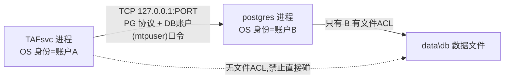

# Windows 账户与服务隔离：背景知识与选型讨论

> 最后更新：2026-08-14（第四部分补 Q6：ZE 绑 162 特权端口原理，对应 [../runtime-permission-solution.md](../runtime-permission-solution.md) §5）；2026-08-04（补第四部分：LocalService/服务 SID 答疑 + PoC）
> 定位：本文是**背景知识 + 选型讨论（为什么这么选）**；对应的**决定（做什么）**见 [../runtime-permission-solution.md](../runtime-permission-solution.md) §1.10。
> ⚠️ **选型变更（2026-08-04）**：VSA 登录（`sc config obj="NT SERVICE\<svc>"`）实机在域信任断的机器上报 **1057** 失败（详见 [../runtime-permission-solution.md](../runtime-permission-solution.md) 附录 C），且公司内机器域信任状态参差 → **排除 VSA/gMSA/本地用户**，Windows 降权改走**内建 `LocalService` + 每服务 SID 隔离**。§7~9 关于 VSA 的讨论**保留作历史/对比**，最新指引见下方**第三部分**。
> 面向：想弄懂"运行权限方案"背后 Windows 账户/隔离原理的读者，不需要预备知识。

---

# 第一部分 · 背景知识（通用）

## 1. 一切进程都以某个账户身份运行

Windows 上任何进程运行时都带一个"安全令牌（token）"，代表**它是谁、能干什么**。服务也一样：由**服务控制管理器（SCM）**用一个"登录账户（Log On account）"来启动。因此"服务以谁运行"直接决定了它被攻破后攻击者能拿到多大权力——这就是运行权限方案要治理的根本对象。

## 2. 六类服务账户详解

| 账户 | 本质 | 本机权限 | 网络身份 | 密码 | 隔离性 | 类比 Linux |
|------|------|----------|----------|------|--------|-----------|
| **LocalSystem**（`NT AUTHORITY\SYSTEM`） | 系统内置最高权限 | 近乎无限（=机器主人） | 机器账户 `MACHINE$` | 无 | 无 | ≈ **root** |
| **LocalService**（`NT AUTHORITY\LOCAL SERVICE`） | 内置低权限 | 很低 | 匿名（谁也不是） | 无 | 一般 | ≈ 很受限的 nobody |
| **NetworkService**（`NT AUTHORITY\NETWORK SERVICE`） | 内置低权限 | 低 | 机器账户 `MACHINE$` | 无 | 弱（多服务共用同一身份） | ≈ 共用的低权用户 |
| **虚拟服务账户 VSA**（`NT SERVICE\<服务名>`） | 每服务自动派生的专属身份 | 低 + 可精确授权 | 机器账户 `MACHINE$` | 无（系统托管） | 较好（每服务独立 SID） | ≈ 每服务一专用户但免管密码 |
| **本地用户**（`net user vertiv_pi`） | 自建普通用户 | 你控制（可很低） | 无（仅本机） | **要自己管** | 好 | ≈ `useradd tafusr` |
| **gMSA**（`DOMAIN\gmsaPI$`） | AD 托管服务账户，密码自动轮换 | 你控制 | 真正的域身份 | AD 管理 | 最好（可审计/可跨机） | ≈ 集中身份管理 |

### 落地配置对照（怎么设 + 例子）

| 账户 | `services.msc` "登录"页显示 | `sc config` 写法 | 典型例子 | 适合场景 |
|------|--------------------------|------------------|----------|----------|
| LocalSystem | Local System account | `obj= "LocalSystem"` | 大量 Windows 核心服务 | **禁用**（仅安装期） |
| LocalService | `NT AUTHORITY\LocalService` | `obj= "NT AUTHORITY\LocalService" password= ""` | 本地诊断/时间类轻量服务 | 纯本地、不碰网络 |
| NetworkService | `NT AUTHORITY\NetworkService` | `obj= "NT AUTHORITY\NetworkService" password= ""` | 老版 IIS 应用池默认 | 过渡方案（共用身份、弱隔离） |
| 虚拟服务账户 | `NT SERVICE\TAFsvc` | `obj= "NT SERVICE\TAFsvc" password= ""` | SQL Server 的 `NT SERVICE\MSSQLSERVER` | 想省密码 + 要隔离 |
| 本地用户 | `.\vertiv_pi` | `obj= ".\vertiv_pi" password= "<随机>"` | 传统 PostgreSQL on Windows 专用账户 | 工作组/单机 |
| gMSA | `DOMAIN\gmsaPI$` | `obj= "DOMAIN\gmsaPI$" password= ""` | IIS 农场、SQL AlwaysOn 集群 | 域/生产/多节点 |

要理解"网络身份"这一列：当服务去访问**另一台机器**的资源（文件共享、远程库）时，Windows 用账户的"网络身份"去认证。内置低权账户里，LocalService 对外是匿名（基本被拒），其余（LocalSystem/NetworkService/VSA）对外都是**机器账户 `MACHINE$`**；本地用户在别的机器上没有可用身份；只有 gMSA/域用户是"网络通用"的真身份。

## 3. 账户 vs 组：本地组不是"运行身份"

一个常见混淆：**"本地组（local group）"不是一种服务账户，也不能用来运行任何进程**。它只是"一堆用户的容器"，唯一用途是**批量授权**（因为组也有 SID，能进 ACL）。

| 概念 | 能不能"运行"服务 | 举例 |
|------|------------------|------|
| 运行身份（用户 / 内置服务身份 / VSA / gMSA） | 能 | `LocalSystem`、`vertiv_pi`、`NT SERVICE\TAFdb` |
| 组 | **不能** | `Administrators`、`Users`、`vertiv_pi_grp` |

### PI 为何"去组化"：老做法 vs 新做法

老做法（同事 POC 早期，用组给程序目录"共享只读"）：

```text
net localgroup vertiv_pi_grp /add
net localgroup vertiv_pi_grp vertiv_pi /add
net localgroup vertiv_pi_grp vertiv_pi_db /add
icacls INSTALL_DIR /grant vertiv_pi_grp:(OI)(CI)RX
```

新做法（不建组，按主体直授）：

```text
icacls INSTALL_DIR /grant .\vertiv_pi:(OI)(CI)RX
icacls INSTALL_DIR /grant .\vertiv_pi_db:(OI)(CI)RX
```

去组化的收益：粒度更细、看 ACL 一眼知道谁有什么权（审计透明）、避免组被后续滥用/权限悄悄扩散、无组残留。对应 `PI-WIN-001`（原"建组失败"）、`PI-WIN-003`（原"入组失败"）都已废弃。

> 采用 VSA 后同理：直接对 `NT SERVICE\TAFsvc` 等主体授 ACL，仍然不需要任何本地组。

## 4. 特权 vs 权限（两个不同维度）

- **特权 / 用户权利（Privilege / User Right）**：系统级"能力"。最关键的是 `Log on as a service`（`SeServiceLogonRight`）——账户能被用作服务身份的前提，缺了服务起不来（报 1058）。在本地安全策略 / GPO 里配置。
- **权限（Permission / ACL）**：针对某个对象（文件/目录/注册表）的访问许可，写在对象的 DACL 里，用 `icacls` 设置。

一个服务账户通常两样都要：有 `Log on as a service`（特权）+ 对自己目录有合适 ACL（权限）。

icacls 权限速记：`R`=读、`RX`=读+执行（跑程序必需）、`M`=修改、`F`=完全控制；`(OI)(CI)`=继承给子文件/子目录。

## 5. 术语表

| 缩写 | 全称 | 人话 |
|------|------|------|
| GPO | Group Policy Object | 集中下发配置/限制（域或本地）。企业常用它禁建本地用户、限制服务登录权、限制可运行程序 |
| gMSA | group Managed Service Account | AD 托管、密码自动轮换、可多机共用的服务账户（`...$`）；仅域内可用 |
| sMSA / MSA | (standalone) Managed Service Account | gMSA 的单机版 |
| KDS | Key Distribution Service | gMSA 密码轮换所依赖的 AD 服务（需 KDS 根密钥） |
| SCM | Service Control Manager | 管理所有服务的核心组件（`sc.exe`/`services.msc` 背后） |
| LSA | Local Security Authority | 管账户/令牌/权限的系统子系统；**VSA 由它托管** |
| SID | Security Identifier | 用户/组/服务身份的唯一 ID；ACL 里记录的是 SID |
| ACL / DACL / ACE | 访问控制列表 / 自主 ACL / 访问控制项 | 对象上的授权清单；每条 ACE = `(SID, 允许/拒绝, 权限, 继承)` |
| SeServiceLogonRight | "Log on as a service" 特权 | 账户可作服务身份的前提 |
| UAC | User Account Control | 提权确认机制；导致"管理员进程"带 Administrators 组（PG 不喜欢） |
| AppLocker / WDAC | 应用白名单 / Defender 应用控制 | 只许运行白名单程序，可能拦安装器或 `net.exe`/`icacls` |
| Kerberos | 域网络认证协议 | 网络身份要被别的机器认，靠它 |
| SMB | 网络文件共享协议 | `\\server\share`，需要网络身份 |
| MACHINE$ | 机器账户 | 每台机器本身也是一个账户；LocalSystem/NetworkService/VSA 对外都表现为它 |

## 6. 隔离原理：为什么"攻破一个服务不连累其他"

### 6.1 关键认知：跨服务访问数据库，走"网络 + DB 账户"，不走 OS 文件权限

直觉是"A 要改数据，得有 B 的数据文件权限"——**恰恰相反，这正是设计的精妙点**。


```mermaid
flowchart LR
  A["TAFsvc 进程<br/>OS 身份=账户A"] -->|"TCP 127.0.0.1:PORT<br/>PG 协议 + DB账户(mtpuser)口令"| DB["postgres 进程<br/>OS 身份=账户B"]
  DB -->|"只有 B 有文件ACL"| Files["data\db 数据文件"]
  A -.->|"无文件ACL,禁止直接碰"| Files
```

- 账户 A 跑的 TAFsvc **从不直接读写** `data\db`；它通过回环 `127.0.0.1:<端口>`、用 PG 协议、出示**数据库层账户口令**（`mtpuser`，与 OS 账户无关）连过去。
- 只有账户 B 跑的 postgres 拥有 `data\db` 的文件 ACL、真正碰磁盘。它验证口令 + 检查该 DB 角色的 `GRANT` 后，**替 A** 完成增删改查。

所以"tafdb 让 A 改数据吗？"——让，但是**走前门、验身份、按授权**地让，而不是因为 A 在 OS 层能碰文件。正确设计里 A 对 `data\db` 应为零 OS 权限。

### 6.2 银行金库类比

数据库=金库；`data\db`=钱；账户 B=唯一有金库钥匙的柜员；账户 A=来办业务的客户。A 想存取钱不会拿到钥匙，而是走柜台（TCP 端口）、出示身份证+密码（DB 口令），柜员验完替他操作。A 能改数据，但只能通过**可鉴权、可限额（GRANT）、可审计**的柜台，永远碰不到金库本身。

### 6.3 两层身份务必分清

| 层 | 身份 | 作用 |
|----|------|------|
| 操作系统层 | `NT SERVICE\TAFsvc` / `NT SERVICE\TAFdb`（或本地用户） | 决定哪个进程能碰哪些磁盘文件、有哪些系统特权 |
| 数据库/应用层 | `mtpuser`（运行）/ `mtpadmin`（超管）PG 角色 | 决定连上库后能做哪些 SQL（GRANT） |

这也解释了为什么 `mtpadmin` 是超级用户会被单列为问题：即便 OS 层隔离做好，若连库用超管角色，DB 层这道闸形同虚设。

### 6.4 爆炸半径：为什么隔离能限制损失

核心四词：**最小权限、特权分离、纵深防御、限制爆炸半径**。

- 现状（三服务全 LocalSystem）：攻破 TAFsvc = 拿到 SYSTEM = 机器 root = 直接读写所有数据、停改任何服务、读所有密钥。**一个洞全盘皆输**。
- 目标（分离 + 收敛）：攻破 TAFsvc 只拿到账户 A 的低权令牌：

| 攻击者想干 | 分离设计下结果 |
|-----------|----------------|
| 直接改磁盘上的数据库文件 | 拒（A 对 `data\db` 无 ACL） |
| 停/重配 postgres 植入后门 | 拒（A 无该服务控制权/非管理员） |
| 提权成管理员 | 需再找一个提权漏洞（多一道坎） |
| 用 A 的 DB 口令连库改数据 | 仍可，但**受 `mtpuser` 的 GRANT 限制**（所以要收敛超管） |

每一道边界都是攻击者必须额外攻破的门；相同账户跑所有服务=横向移动零成本，不同低权账户=被关在第一个盒子里。"绝不给 A 对 `db\` 的 Modify"的意义就在于：给了它就能绕过 DB 鉴权直接从文件层篡改/加密数据，DB 层所有防护被短路。

---

# 第二部分 · 选型讨论（为什么这么选）

## 7. 虚拟服务账户（VSA）深入

- **为何绕开"建本地用户"**：VSA 由 LSA 托管，**你不需要"创建"它**——把服务登录身份设成 `NT SERVICE\<服务名>` 它就存在了，不走被 GPO 常禁的 `New-LocalUser`/`net user`。
- **无密码**：系统托管，彻底消除"随机密码生成/不落日志/轮换"整片风险（原方案最麻烦的部分）。
- **每服务独立 SID**：可 `icacls "data\db" /grant "NT SERVICE\TAFdb:(OI)(CI)M"` 精确授权，隔离照样成立。
- **服务登录权**：经 SCM 设置账户时，`Log on as a service` 多数情况自动授予。
- **命名规则**：VSA 名 = `NT SERVICE\<服务注册名>`，与服务短名一一对应、**不能单独命名**（要改只能改服务名）。PI 三服务固定 `TAFsvc`/`TAFdb`/`ZESvc`，无需另起用户名。
- **网络身份 = `MACHINE$`**：见下节局限。

## 8. 全场景操作系统统一用 VSA 的收益与局限

目标系统 Win11 / Server 2022 / 2025 均支持 VSA（Win7/2008R2 起）。

| 维度 | 收益 | 局限/风险 |
|------|------|-----------|
| 建账户 | 不用建用户，**绕开最常见 GPO 封锁** | — |
| 密码 | **零密码管理**，消除密钥泄露面 | — |
| 隔离 | 每服务独立 SID，可 ACL | — |
| 一致性 | 三个目标系统同一套逻辑，安装器更简单 | — |
| 网络身份 | 本机 loopback + DB 口令认证不受影响 | 对外是 `MACHINE$`：远程 Windows 集成认证 / 远程 SMB 共享场景受限 |
| 跨机 | — | 不能多机共享同一身份（PI 单机无所谓） |
| 企业治理 | — | 不满足"必须用具名域账户/gMSA"的合规规定 |
| 服务登录权 | 通常自动授 | GPO 硬管控该权限时仍可能被拦（所有账户类型通病） |
| 应用兼容 | — | 对"完整用户 profile"的隐性依赖需实测（PG 尤其，见 §11） |

**网络身份局限具体在哪些业务咬人**（对 PI 现状均无影响，仅未来触发）：远程库用 SSPI/Kerberos 集成认证、备份写远程 SMB 共享、访问其他用 Windows 认证的域资源、SIEM 要求按服务身份关联出站连接、多机共用同一服务身份（集群）。判据：只要是**本机/loopback**，或**跨机但用应用层口令**，VSA 都没问题。

## 9. VSA vs 本地用户（`net user vertiv_pi`）详细对比

| 维度 | 虚拟服务账户 VSA | 本地用户 vertiv_pi |
|------|------------------|---------------------|
| 建账户（受限企业最大坎） | 不用建，**绕开禁建本地用户 GPO** | 必须 `net user` 建，**GPO 一禁就走不通**（`PI-WIN-002`） |
| 密码管理 | **无密码**，消除泄露面 | 要生成≥20位随机密码、存 SCM、严防泄露到日志 |
| "作为服务登录"权 | 经 SCM 通常自动授 | 需显式授，GPO 硬管控时可能被拦（`PI-WIN-021`） |
| 隔离性 | 每服务独立 SID | 每服务独立用户，同样好 |
| PostgreSQL 兼容 | initdb 那步要"绕"，需 PoC（见 §11） | 有密码可 `runas` 以该用户跑 initdb，PG 侧最顺（业界传统做法） |
| 卸载清理 | 无账户残留 | 要 `userdel`，还有"同名外来账户"判别 |
| 网络身份 | 机器账户 `MACHINE$` | 无域身份（仅本机）——两者都不适合跨机集成认证 |
| 安装器实现复杂度 | 更简单（省建用户+密码+清理） | 多了建用户、密码全生命周期、卸载清理 |

**结论**：tafsvc/ZESvc（Java）用 VSA 完胜；tafdb（PostgreSQL）用 VSA 的收益一样，但卡在 initdb（见 §11）。最终决策见 [../runtime-permission-solution.md](../runtime-permission-solution.md) §1.10。

## 10. 逃生口"模式 C（手动指定账户）"：做法与影响

本轮不实现，仅登记做法与影响，供将来"具名/域账户强制要求"或"远程集成认证"时启用。

做法（在"默认 VSA"上做加法）：

```text
PI_SVC_ACCOUNT_MODE = auto(默认)  → 用 VSA：NT SERVICE\TAFsvc / TAFdb / ZESvc
PI_SVC_ACCOUNT_MODE = manual      → 用传入账户：校验存在+非管理员+补服务登录权 → 同一套 ACL/sc config
```

改动与影响范围：

| 部分 | 改动 | 量级 |
|------|------|------|
| IA 工程（`TAFCore.iap_xml`，仅 Windows 规则） | 加变量 `PI_SVC_ACCOUNT_MODE`、`SERVICE_ACCOUNT_*`、（域用户才需）`SERVICE_PASSWORD_*` | 小 |
| 安装向导 | 加一个 Windows-only 面板（自动/手动、账户名、密码框） | 中 |
| 静默安装 | 对应 property + 文档 | 小 |
| Custom Code（jar） | 加 manual 分支：跳过建账户 → 校验 → 补服务登录权 → 进入**共用**的 ACL/`sc config` | 中 |
| 核心 ACL / 服务配置逻辑 | **不动**（对任何主体通用，直接复用） | 无 |
| Linux | 不涉及 | 无 |

为什么影响小：设 ACL、`sc config` 配服务对"VSA/本地用户/域用户"是完全一样的（底层都只是 SID），模式 C 只是"换个主体名塞进同一套逻辑"，是低风险的加法，不碰既有 Linux 链路，也不碰核心授权逻辑；auto 默认路径行为不变。

## 11. tafdb 以 VSA 运行的风险，与"装时特权 initdb + 装后切 VSA"为何成立

PG 在 Windows 上"讲究"运行账户，但风险集中在**安装期 initdb**，不是稳态运行：

1. PG 不肯以"管理员身份"跑（`initdb`/`postgres` 检查到 Administrators 会拒），所以天生要低权账户——**VSA 恰好满足**。
2. 稳态运行：只要 `data\db` 授给了 `NT SERVICE\TAFdb`、`sc config` 切到该 VSA，日常启动读写无障碍（参照 SQL Server 常年跑在 `NT SERVICE\MSSQLSERVER`）。
3. 真正摩擦：**无密码 VSA 不能 `runas`**，没法"以 VSA 身份"跑 initdb。

**解法（已定）**：不以 VSA 跑 initdb，而是——

```text
① 安装期(管理员/安装器上下文) 跑 initdb 建 data\db   ← PI 现在就是这么干且能成功
   （PG 遇管理员上下文会自动用"受限令牌"降权继续）
② icacls data\db /grant "NT SERVICE\TAFdb:(OI)(CI)M"   ← 本就要做的最小权限授权
③ sc config TAFdb obj= "NT SERVICE\TAFdb" password= ""  ← 切服务身份为 VSA（复用 PI-WIN-022 套路）
④ 启动 TAFdb
```

这样把"重写 initdb 编排"的中等风险降成"只需验证 postgres 能以 VSA 启动"的小风险。剩下唯一要在 Server 2022/2025 各点一次的就是第④步的冒烟验证。PoC 不通则 tafdb 单独退回本地用户，tafsvc/ZESvc 仍用 VSA。

## 12. 与决策文件的关系

- 本文只讲原理与"为什么"；**最终决定（D1~D6）、三模式对比、待办与风险**见 [../runtime-permission-solution.md](../runtime-permission-solution.md) §1.10。
- 关联任务：[类别一 · 任务 1-1](../../01-remediation-task-ledger.md)；DB 层口令治理属类别二 [issue-51](../../issues/issue-51-as01-00-admin-user-autoload-password.md) / [issue-260](../../issues/issue-260-as01-00-hardcoded-secrets-umbrella.md)。

---

# 第三部分 · 微软官方服务账户指引摘要（2026-08-04 补，附原链接）

> 背景：VSA 登录（`sc config obj="NT SERVICE\<svc>"`）在域信任断机器上 1057 失败（见 [../runtime-permission-solution.md](../runtime-permission-solution.md) 附录 C）→ Windows 降权改走 **LocalService + 每服务 SID**。以下摘录官方文档要点，支撑该选择。

## 13. 官方选型总原则

- **最小权限、每服务独立账户**：装服务时给"完成任务所需的最小权限"；仅当服务需要管理员特权/"作为操作系统一部分"时才用 LocalSystem，且应向管理员征得同意。[Guidelines for Selecting a Service Logon Account](https://learn.microsoft.com/en-us/windows/win32/ad/guidelines-for-selecting-a-service-logon-account)
- **账户优先级（MS 共识）**：能用 **MSA/gMSA/虚拟账户** 就用；不行则用**最小权限的专用账户**（本地或域），**每个服务用独立账户、别用共享账户、别授多余权限**——"权限通过组成员或**直接授给服务 SID**（在支持服务 SID 处）赋予"。[SQL: Configure Windows Service Accounts and Permissions](https://learn.microsoft.com/en-us/sql/database-engine/configure-windows/configure-windows-service-accounts-and-permissions) · [Entra: AD service accounts (on-premises)](https://learn.microsoft.com/en-us/entra/architecture/service-accounts-on-premises)
- **每个服务都跑在某账户的安全上下文里**；SCM 用该账户登录、生成令牌附到进程，之后所有对"可保护对象"的访问都按此令牌鉴权。SCM **不保管**服务账户密码——密码过期则登录失败、服务起不来。[Service User Accounts](https://learn.microsoft.com/en-us/windows/win32/services/service-user-accounts)

## 14. 六类账户（官方口径）

| 账户 | 本机权限 | 网络身份 | 密码 | 域依赖 | 官方定位 |
|------|----------|----------|------|--------|----------|
| **LocalSystem**（`NT AUTHORITY\SYSTEM`） | 极高（含 SYSTEM+Administrators SID、`SeTcb` 等） | 机器账户 | 无 | 无 | 仅在"需管理员特权/作为 OS 一部分"时用 [LocalSystem](https://learn.microsoft.com/en-us/windows/win32/services/localsystem-account) |
| **LocalService**（`NT AUTHORITY\LocalService`） | 最小（≈Users） | **匿名 null session** | 无 | **无** | 本地低权首选；对外无凭据 [LocalService](https://learn.microsoft.com/en-us/windows/win32/services/localservice-account) |
| **NetworkService**（`NT AUTHORITY\NetworkService`） | 最小（≈Users，与 LocalService 同级） | **机器账户 `域\机器$`** | 无 | **无**（运行） | 需以机器身份访问网络时用 [NetworkService](https://learn.microsoft.com/en-us/windows/win32/services/networkservice-account) |
| **虚拟账户 VSA**（`NT SERVICE\<svc>`） | 低+可精确授权 | 机器账户 | 无（托管） | 登录赋值经 LSA，**域信任异常时可能 1057** | 单机首选；SQL DB 引擎默认 [understand-service-accounts](https://learn.microsoft.com/en-us/windows-server/identity/ad-ds/manage/understand-service-accounts) |
| **MSA/gMSA**（`域\acct$`） | 可控 | 真域身份、密码自动轮换 | AD 托管 | **强依赖域/AD** | 多机/农场/需域集成认证；须域管预建 [gMSA overview](https://learn.microsoft.com/en-us/windows-server/security/group-managed-service-accounts/group-managed-service-accounts-overview) · [dd548356](https://learn.microsoft.com/en-us/previous-versions/windows/it-pro/windows-server-2008-R2-and-2008/dd548356\(v=ws.10\)) |
| **本地/域用户** | 可控 | 本地用户无域身份；域用户有 | **要自管** | 本地用户无；域用户有 | 不能用 MSA/VSA 时的退路 |

> MS 官方默认值参考（SQL Server 独立服务器）：Win7/2008R2+ 数据库引擎默认 **虚拟账户**，2008 时代默认 **NETWORK SERVICE**；`LOCAL SERVICE` 用于 Browser 等轻量服务。

## 15. 关键机制：Per-service SID（服务 SID）——共享账户下仍能隔离

- SQL Server **为每个服务启用 per-service SID 以实现服务隔离 + 纵深防御**：SID 由服务名派生、全局唯一（`NT SERVICE\<svc>`）；**"用含服务 SID 的 ACE 就能把资源访问限定到该服务，无需高权账户、也不削弱对象保护"**。[SQL doc · Service configuration and access control](https://learn.microsoft.com/en-us/sql/database-engine/configure-windows/configure-windows-service-accounts-and-permissions)
- 含义（对 PI 的价值）：**即使多个服务共用 `LocalService` 这个登录身份，只要各自 `sc sidtype <svc> unrestricted`，其进程令牌就带唯一的 `NT SERVICE\<svc>` 组** → 把 PGDATA/敏感文件 ACL 只授给对应服务 SID，即可恢复"服务间互不可及"的隔离。
- **且这套只用到"能成"的动作**：`sc sidtype … unrestricted` 与 `icacls /grant "NT SERVICE\<svc>"` 实测在域信任断机器上均成功；卡住的只有 VSA 的 `sc config obj=`（1057）。故 **LocalService + 服务 SID = 降权(离 SYSTEM) + 隔离 + 域无关**。

## 16. 三个必须记住的坑

1. **本地化名字**：`sc config`/`CreateService`/`ChangeServiceConfig` 必须用**不变式英文名** `NT AUTHORITY\LocalService` / `NT AUTHORITY\NetworkService`（中文/各语言 OS 一律用它）；`LookupAccountSid` 返回的是**本地化显示名**，若拿显示名去配会出意外。[LocalService](https://learn.microsoft.com/en-us/windows/win32/services/localservice-account) · SQL doc「Localized service names」表
2. **共享账户削弱隔离**：SQL 官方明确"**LocalService 不支持作 DB 引擎账户，因为它是共享的**，别的以 LocalService 运行的服务会拿到对 SQL 的 sysadmin 访问"。对 PG 不直接适用（PG 鉴权独立），但"共享账户=弱隔离"成立 → 用服务 SID 补。
3. **授"作为服务登录"权的差异**：用 `Services.msc`/IIS 管理器配 MSA/VSA 会**自动**授 `SeServiceLogonRight`；用 `sc.exe`/API 配普通账户则需**显式**授（Secpol/Secedit/NTRights）。**LocalService/NetworkService 是内建账户，天生具备该权、无需授。**[dd548356 · Using virtual accounts / 配置服务](https://learn.microsoft.com/en-us/previous-versions/windows/it-pro/windows-server-2008-R2-and-2008/dd548356\(v=ws.10\))

## 17. 链接索引（一句话）

- [Guidelines for Selecting a Service Logon Account](https://learn.microsoft.com/en-us/windows/win32/ad/guidelines-for-selecting-a-service-logon-account)：最小权限选账户的总纲。
- [Service User Accounts](https://learn.microsoft.com/en-us/windows/win32/services/service-user-accounts)：服务登录/令牌/密码机制；三个特殊账户入口。
- [LocalSystem Account](https://learn.microsoft.com/en-us/windows/win32/services/localsystem-account)：最高权内建账户及其特权清单（PI 要**离开**它）。
- [LocalService Account](https://learn.microsoft.com/en-us/windows/win32/services/localservice-account)：最小权、网络匿名（PI **首选**）。
- [NetworkService Account](https://learn.microsoft.com/en-us/windows/win32/services/networkservice-account)：最小权、网络=机器账户（需机器身份时用）。
- [Service Accounts in Windows Server](https://learn.microsoft.com/en-us/windows-server/identity/ad-ds/manage/understand-service-accounts)：sMSA/gMSA/dMSA/虚拟账户对比表。
- [Service Accounts Step-by-Step Guide (2008R2, dd548356)](https://learn.microsoft.com/en-us/previous-versions/windows/it-pro/windows-server-2008-R2-and-2008/dd548356\(v=ws.10\))：MSA/虚拟账户配置与 `SeServiceLogonRight` 授权差异、排障。
- [Group Managed Service Accounts overview](https://learn.microsoft.com/en-us/windows-server/security/group-managed-service-accounts/group-managed-service-accounts-overview)：gMSA 原理与 KDS/域要求（PI 不用）。
- [Entra: AD service accounts (on-premises)](https://learn.microsoft.com/en-us/entra/architecture/service-accounts-on-premises)：本地用户作服务账户"无域网络身份、不支持 Kerberos 互认"的局限。
- [SQL: Configure Windows Service Accounts and Permissions](https://learn.microsoft.com/en-us/sql/database-engine/configure-windows/configure-windows-service-accounts-and-permissions)：per-service SID 隔离、默认账户表、共享账户警告、本地化名表——**本轮最贴合的范本**。

---

# 第四部分 · LocalService/服务 SID 答疑（2026-08-04）

> 定位：把选型确定为 **三服务统一 LocalService + `sc sidtype <svc> unrestricted` + ACL 授各自 `NT SERVICE\<svc>`** 过程中的关键问答固化下来，供实现与评审引用。

## 18. Q1：LocalService/NetworkService 只差网络身份？以后改 NetworkService 麻烦吗？

- **是的，本机权限完全相同，实质只差网络身份**（LocalService 对外匿名；NetworkService 对外 = 机器账户 `MACHINE$`）。
- 以后 LocalService → NetworkService 的改动**很小**，前提是 **ACL 授给"服务 SID"而非授给 LocalService 本身**：
  - ACL 授 **`NT SERVICE\<svc>`** → 换登录账户时**所有文件 ACL 一行不用改**（服务 SID 与登录账户解耦）；改动 = 每服务 `sc config <svc> obj=` 由 `"NT AUTHORITY\LocalService"` 改成 `"NT AUTHORITY\NetworkService"` + 重启，**一服务一行、无密码**。
  - ACL 若直接授给了 **`NT AUTHORITY\LocalService`（S-1-5-19）** → 切到 NetworkService（S-1-5-20）就得**全部重授**。
- 可**按服务单独切**（只把 TAFdb 切 NetworkService，其余留 LocalService）。→ 结论：坚持"用服务 SID 授权"，则将来换账户成本近乎零。

## 19. Q2：每服务各自 SID = 给三个服务的"用户"各发 id 吗？靠什么保证互不可访问？

- **不是给"登录用户"发 id**——三服务登录身份都还是**同一个 LocalService**。服务 SID 是**由服务名自动派生的唯一组 SID**（`NT SERVICE\TAFdb`，底层 `S-1-5-80-…`），在 `sc sidtype <svc> unrestricted` 打开后，**启动时被注入该服务进程令牌**。即：登录身份=LocalService（共享），令牌里**额外带**一个"我是哪个服务"的唯一组。
- **隔离机制 = 内核"令牌 SID vs 对象 DACL"访问检查**：
  - `data\db` 的 DACL 只授 `NT SERVICE\TAFdb`（+SYSTEM/Administrators）；
  - TAFdb 令牌含 `NT SERVICE\TAFdb` → 命中 → 放行；
  - TAFsvc 令牌含的是 `NT SERVICE\TAFsvc`（无 TAFdb）→ DACL 无匹配 → **拒绝**；
  - 关键：DACL **不授** `LocalService`（S-1-5-19），所以"共用 LocalService"帮不了 TAFsvc 碰 PGDATA。
- 用 `unrestricted`（服务 SID 作普通组加入令牌用于授权）即可；**不要** `restricted`（会把进程变成写受限令牌、更激进、易弄坏服务）。
- 残留边界（诚实说）：三服务共用 LocalService 且带 `SeImpersonate`，理论上仍有"令牌模仿类提权到 SYSTEM"的通用 Windows 风险——但这对 VSA 一样，不是本选择独有短板。文件级隔离照做仍有效。

## 20. Q3：TAFdb 与 PostgreSQL 现状？要不要"套一层"或改 NetworkService？（DB 有非本地访问需求）

- **关系澄清**：Windows 上 **TAFdb 服务就是 PostgreSQL 服务本身**（`sc qc TAFdb` → `BINARY_PATH = pg_ctl runservice -N TAFdb -D …\data\db`，进程 `postgres.exe`）。**不存在"套一层"**，TAFdb 已等于"postgres 的 Windows 服务名"。
- **现状**：TAFdb 当前**以 `LocalSystem` 运行**（实测确认）→ **postgres 现在不是以自己低权用户跑，而是以 SYSTEM 跑**。这正是要治理的问题。
- **"DB 非本地访问需求"不影响账户选择**，需分清方向：
  - **入站（远程客户端连 PG）**：由 `listen_addresses` + `pg_hba.conf`(`hostssl … scram`) + 防火墙放行 5432 控制，**与服务以什么 OS 账户运行无关**。
  - **出站（postgres 以机器身份主动外连别的 Windows 机）**：才用"网络身份"，但 **postgres 不做这种事**。
  - → 运维/开发调试的"远程连库"属**入站**，**LocalService 完全够用，不需为此改 NetworkService**。
- **微软"LocalService 不适合 DB 引擎"是 SQL Server 特有原因**（SQL 把 per-service SID provision 成 sysadmin 登录，共享 LocalService 会让别的 LocalService 服务拿到 sysadmin）——**PG 鉴权与 OS 账户无关，不直接适用**；"共享账户弱隔离"的通用担忧由服务 SID 补上。
- **做法**：TAFdb 也用 **LocalService** + `sc sidtype TAFdb unrestricted` + PGDATA 只授 `NT SERVICE\TAFdb`。**需 PoC 验证** postgres 能否以 LocalService 正常起（需 `SeCreateGlobal` 建全局共享内存，LocalService 具备）。

## 21. Q4：SQL Server / PostgreSQL 在 Windows 上官方怎么做？

- **SQL Server（官方）**：Win7/2008R2+ 数据库引擎默认 **虚拟账户 `NT SERVICE\MSSQLSERVER`**（2008 时代默认 NETWORK SERVICE）；核心是 **per-service SID 隔离**（数据/备份/日志目录 ACL 授给 per-service SID，并把该 SID 作 sysadmin 登录）；明确**别用共享账户、每服务独立、LocalService 不支持作 DB 引擎账户**；需网络资源时用 MSA/gMSA。
- **PostgreSQL（官方 + 事实标准）**：`initdb`/`postgres` **拒绝以管理员运行** → 天生要低权账户，且该账户需对数据目录完全访问；EDB 官方 Windows 安装器通常**创建专用低权本地用户（如 `postgres`，带密码）**运行服务（也有用 NetworkService 的）。→ PG 官方路子 = **专用低权本地用户**，但**这正是我们已排除的"本地用户"**（密码管理 + GPO 常禁建户）。故用 **LocalService（免密码免建户）+ 服务 SID 授数据目录**等价实现"低权账户 + 独占数据目录"。

## 22. Q5：服务间隔离的出发点、必要性、改动量、优劣、现在/未来收益

- **出发点**：纵深防御、限制爆炸半径。TAFsvc 最暴露，被攻破后——无隔离则可直接读改 PGDATA、读 keystore、篡改 ZE（一洞全输）；有隔离则被关在自己盒子里。
- **必要性分层**：①"离开 SYSTEM"（三服务都不再 SYSTEM）= 第一大 win，**必须**；②"服务间隔离"（各自服务 SID + 文件 ACL 只授本服务）= 第二层纵深防御，也是 **6-1/6-2（敏感文件/PGDATA 独占）成立的前提**。PI 存 DB 数据 + keystore，这层有实价值。
- **改动量（相对"只降权"的增量很小）**：`sc sidtype <svc> unrestricted` ×3 行；ACL 本就要做（6-1/6-2），只需把授权主体写成 `NT SERVICE\<svc>`（我们之前 icacls 已在用）。大头 icacls 本就要做。
- **优劣**：优 = 真降爆炸半径、让 6-1/6-2 有意义、**域无关**（本机已验 sidtype/icacls 能成）、ACL 与登录账户解耦（Q1 切换零成本）、增量极小；劣 = 多一层概念（登录账户≠授权主体，运维理解成本）、需 PoC 验证令牌确带服务 SID、`SeImpersonate` 残留提权风险仍在（VSA 同样）。
- **收益**：现在 = 满足审计"最小权限+隔离"预期、与 Linux `pi_app`/`pi_db` 对齐、一个服务被攻破不连累其它；未来 = 新增服务照套、换登录账户时 ACL 不受影响。

## 23. PoC：不动安装器，手动预验证这套是否成立

> ✅ **本机预验结论（2026-08-04）**：在**域信任断**的 Win 工作站上跑 `script/poc-tafdb-localservice.ps1`，`sc config obj="NT AUTHORITY\LocalService"`（须 `cmd /c` 执行，见下坑）、`sc sidtype TAFdb unrestricted`、`icacls "data\db" /grant "NT SERVICE\TAFdb:F"`、`net start TAFdb` **四步全部成功**，`SERVICE_START_NAME=NT AUTHORITY\LocalService` + `SERVICE_SID_TYPE=UNRESTRICTED` + 服务 `RUNNING`（postgres 成功以 LocalService 读取 PGDATA 配置）→ **LocalService + 服务 SID 路线在域信任断环境下可行**。⬜ 待补：`psql` 功能读写、Process Explorer 验令牌带 `NT SERVICE\TAFdb`、Server 2022/2025 复验。
> ⚠️ **实测坑**：`sc config obj= "…" password= ""` 用 **PowerShell 直接调 `sc.exe`** 会因空串参数被吞而**静默失败**（服务留在 LocalSystem、却报个 usage/成功混淆）；须用 `cmd /c "sc config … password= """"`。落地到 IA Exec（本就 `cmd /c`）不受此影响。

> 目的：在改安装器前，用**已装好的一套 PI**（或任一测试机上的一个测试服务）确认三件事都"能成"：①`sc config obj=LocalService` 生效；②`sc sidtype unrestricted` 后进程令牌确带 `NT SERVICE\<svc>`；③只授服务 SID 的目录，别的服务 SID 进程访问被拒。全部管理员 cmd 执行。

**A. 最小闭环（针对 TAFdb，验"能起 + 令牌带服务 SID"）**

```cmd
:: 1) 看现状（当前多半是 LocalSystem）
sc qc TAFdb
:: 2) 切登录身份为 LocalService（无密码）
net stop TAFdb
sc config TAFdb obj= "NT AUTHORITY\LocalService" password= ""
:: 3) 打开服务 SID（注入 NT SERVICE\TAFdb 到令牌）
sc sidtype TAFdb unrestricted
sc qsidtype TAFdb            :: 期望 SERVICE_SID_TYPE: UNRESTRICTED
:: 4) 把数据目录 + bin 授给服务 SID（先 grant，不断继承，最小验证）
icacls "E:\software\PI4.0\...\data\db"  /grant "NT SERVICE\TAFdb:(OI)(CI)F" /T /C
icacls "E:\software\PI4.0\...\database\bin" /grant "NT SERVICE\TAFdb:(OI)(CI)(RX)" /T /C
:: 5) 起服务，看能否正常起（关键：postgres 能否以 LocalService 起）
net start TAFdb
sc query TAFdb              :: 期望 STATE: RUNNING
```

**验令牌确实带服务 SID**（服务起来后，用进程 PID 查）：

```cmd
sc queryex TAFdb                     :: 记下 PID
whoami /? 不适用；改用 Sysinternals：
:: 需 Sysinternals handle/Process Explorer：Process Explorer → 选中 postgres.exe →
::   属性 → Security 页，应能看到组里含 "NT SERVICE\TAFdb"
```

（无 Sysinternals 时，可用 `Process Explorer` GUI 看 postgres.exe 的 Security 标签；命令行没有直接打印任意进程令牌组的内置工具。）

**B. 隔离验证（"别的服务 SID 碰不到"，最有说服力）**

```cmd
:: 造一个只授 TAFdb 服务 SID 的隔离目录
mkdir C:\pgiso & echo secret> C:\pgiso\a.txt
icacls C:\pgiso /inheritance:r
icacls C:\pgiso /grant "SYSTEM:(OI)(CI)F" "Administrators:(OI)(CI)F" "NT SERVICE\TAFdb:(OI)(CI)F"
:: 用 TAFsvc 的服务 SID 上下文去读（模拟"另一个服务"）——最简单的等价验证：
::   直接看 ACL 是否只列了 TAFdb；再用 icacls 的模拟检查
icacls C:\pgiso                      :: 应只见 SYSTEM/Administrators/NT SERVICE\TAFdb
:: 严格验证需让 TAFsvc 进程去读该文件并观察被拒（可临时把某测试 exe 注册成服务跑）
```

**C. 回滚（PoC 后还原，避免污染环境）**

```cmd
net stop TAFdb
sc config TAFdb obj= "LocalSystem"
sc sidtype TAFdb none
:: 数据目录 ACL 若只做了 /grant（未断继承），保留 NT SERVICE\TAFdb 的 grant 无害；
:: 如需彻底还原：icacls "...\data\db" /remove "NT SERVICE\TAFdb" /T /C
net start TAFdb
rmdir /s /q C:\pgiso
```

**要不要提前跑？我的判断：值得跑，但只跑最小项。**

- **最该跑的是"postgres 能否以 LocalService 起"（A 步第 5 步）**——这是唯一有真实不确定性的点（PG on Windows 历史上多用 NetworkService/本地 postgres 用户，LocalService 相对少见，需实证）。这一项在你**当前这台机器上就能跑**，域信任断也不影响（LocalService 是内建账户，不经域解析）。
- `sc sidtype unrestricted` + `icacls "NT SERVICE\<svc>"` 我们**已在实机验证过能成**（1.10.5），可不必再单独验。
- B 的严格隔离验证成本较高（要另注册一个测试服务用其令牌读），**非必需**——隔离由内核访问检查保证，原理确定；A 通过即可支撑落地决策。

## Q6：ZE 要监听 162（SNMP trap）——为何 Linux 降权后绑不上、Windows 却无所谓？

> 背景：ZE（Zero Engine）需监听 UDP/162 收 SNMP trap。降权后 `zesvc` 在 Linux 以 `ze_app` 运行、Windows 以 LocalService 运行。决策与落地状态见 [runtime-permission §5](../runtime-permission-solution.md)；本条只讲"为什么"。

- **什么是特权端口**：类 Unix 系统把 **0–1023** 视作"特权端口"（well-known ports），只有 **root（或持 `CAP_NET_BIND_SERVICE` 能力的进程）** 才能 `bind()`。162 < 1024 → 非 root 进程绑定直接 `EACCES`。这是内核级历史约定，用来防止普通用户冒充系统服务（如 DNS/53、SNMP/162）。
- **Linux 降权后为何绑不上、怎么解**：`ze_app` 是普通用户、无 root → 绑 162 被拒。解法是给服务**单一能力** `CAP_NET_BIND_SERVICE`（"可绑定特权端口"），而**不**回退到 root：
  - systemd unit 里 `AmbientCapabilities=CAP_NET_BIND_SERVICE`（把能力放进进程的 ambient 集，子进程也带）+ `CapabilityBoundingSet=CAP_NET_BIND_SERVICE`（把能力上限**钉死**为只这一个，杜绝拿到别的能力）。
  - 这是最小授权：进程仍是普通用户，只是多了"绑低端口"这一件事的许可，其余一切照旧受限。备选 `iptables REDIRECT 162→高位端口`（不改进程能力）；**不推荐**对 `java` 二进制 `setcap`（影响所有 java 进程）或全局降 `net.ipv4.ip_unprivileged_port_start`（放开全系统低端口，面太大）。
- **Windows 为何无所谓**：Windows **没有"特权端口"这一概念**——任何账户（含 LocalService）都能 `bind()` 任意端口，无需特殊权限。所以 ZESvc 以 LocalService 运行也能直接绑 162，**不需要授权动作**。
- **那 Windows 侧要注意什么**：只有**端口占用**——系统自带的"SNMP Trap"服务（`snmptrap.exe`，SNMP 可选功能、默认不启用）若在跑会先占 162。处理是安装前**检测占用并输出非致命告警**（不硬停），详见 [runtime-permission §5](../runtime-permission-solution.md)。
- **一句话对照**：Linux 的门槛是"**能不能绑**（权限）"→ 给一个 capability 解决；Windows 的门槛是"**有没有人先占**（占用）"→ 检测告警解决。

---

# 第五部分 · 运行身份 vs 文件属主：Windows/Linux 对称模型（2026-08-10）

## 24. 两个维度必须分开：进程"以谁运行" ≠ 文件"归谁所有"

一个常见困惑："Windows 给了各服务 LocalService（低权），被攻破也拿不到管理员，很好；可 Linux 上我把文件设成 `root:pi`（属主 root），是不是反而把 root 给了服务？" —— **不是。这是把两个不同维度混在了一起：**

| 维度 | 含义（被攻破时的意义） | Windows PI | Linux PI |
|---|---|---|---|
| **① 进程运行身份** | 服务进程被攻破后攻击者拿到的身份 | 三服务均 `NT AUTHORITY\LocalService`（+ 每服务 SID），**非管理员** | tafsvc=`pi_app`、zesvc=`ze_app`、db=`postgres`，**均非 root** |
| **② 文件属主** | 谁能"写/替换"程序代码（war/jre/二进制） | 属主 `SYSTEM`/`Administrators`（管理员）；服务 SID 只被授 **读/执行** | 属主 `root`（管理员）；组 `pi`/`ze` 授 **读/执行**；服务账号**非属主** |

**结论：两边是同一套模型，不是反的。**
- 维度① 两边都用**低权账号**跑服务 → 被攻破都**拿不到 root/管理员**（你欣赏的 Windows 那个好处，Linux 用 `pi_app`/`ze_app` 同样具备）。
- 维度② 两边都让**管理员/root 拥有代码、服务只读** → 被攻破也**改不动自身 war/jre**、无法植入后门做持久化。
- `root:pi` 里的 `root` 是**文件所有者**（对应 Windows 的 `SYSTEM/Administrators` 拥有 `Program Files`），**不是** tafsvc 的运行身份；tafsvc 的运行身份是 systemd 单元里的 `User=pi_app`（低权），等价于 Windows 的 LocalService。

### 设计思想一句话
**"谁运行"与"谁拥有"分离**（privilege separation）：运行用最低权账号，代码归管理员/root 且对运行账号只读。这样单点被攻破，既拿不到管理员，也改不动代码 —— 两层纵深，Windows 与 Linux 各自的实现只是账户体系不同。

## 25. PI 实例对照 + 两边各自的收紧缺口

### Windows PI 实例
- **运行身份**：`TAFsvc`/`ZESvc`/`TAFdb` 三服务 `sc config obj= "NT AUTHORITY\LocalService"` + `sc sidtype <svc> unrestricted`（每服务 SID）。
- **文件属主/授权**：安装树属主为 `SYSTEM`/`Administrators`；6-1 对敏感件断继承、只授 `SYSTEM:F Administrators:F "NT SERVICE\<svc>:R"`（服务只读）。
- **隔离**：PGDATA(`data\db`) 只授 `NT SERVICE\TAFdb`（+SYSTEM+Admin），`TAFsvc`/`ZESvc` 进不去（6-2 实测符合）。
- ~~**现存缺口**：非 6-1 硬化的文件（如 `certs\core-trust.jks`、`_installation\installvariables.properties`）仍继承宽松 ACL `Authenticated Users:(M)`+`Users:(RX)`~~ → ✅ **已闭环（回填）**：① `core-trust.jks` 已随 6-1 授 `NT SERVICE\TAFsvc:(R)`、断继承（Win 三机验证），且已 N-34 改为 PiSetupAction 每机口令独家生产；② `installvariables.properties` 的 `TAFDB_ADMNPWD` 已置空（2-2）、整个 `_installation` 目录已 `icacls /inheritance:r` 锁死 SYSTEM/Admin、移除 TAFsvc（N-25）。此处不再是缺口（原引用的"第 26 节 core-trust.jks 计划"已不存在）。

### Linux PI 实例
- **运行身份**：systemd 单元 `tafsvc User=pi_app Group=pi`、`zesvc User=ze_app Group=ze`、`postgresql User=postgres`。
- **文件属主/授权**：安装树 `.bin` 以 root 落盘 → `root:root`；安装脚本 `chgrp -R pi $INSTALL_DIR` + `chmod -R g+rX` 使其成 **`root:pi` + 组只读/可遍历**（pi_app 靠组 `pi` 能读能执行、**不能改**）。运行时可写目录（`logs/`、`/var/opt/powerinsight`）单独 `chown pi_app:pi`。
- **对比 Windows**：Linux 的 `root:pi` 恰是 Windows 想要、但当前**未完全做到**的那层代码完整性——普通文件层 **Linux 比 Windows 更严**（Windows 普通件继承了 `Users`/`AuthUsers` 写权）。
- **现存缺口**：**`mtp-core.war` 当前属主是 `pi_app:pi`**（安装脚本显式 `chown pi_app:pi`）→ 运行服务是 war 的属主、可覆写自身 → 违反维度②，是 Linux 上唯一的例外。→ 应回收为 `root:pi`（见第 27 节计划）。另：代码目录 IA 出厂为 `774/775`（**组含写位**），组 `pi` 对目录可写意味着 pi_app 可在目录内删/换文件；若要完整代码完整性，需再去掉代码目录的组写位（可选深化，见第 27 节）。

### 一句话收尾
`root:pi` = "代码归 root、服务(pi_app)只读"，与 Windows "文件归 SYSTEM、服务(LocalService)只读"是**同一思想的两种实现**；不存在"把 root 给了服务"。要对齐，方向是**把 Windows 普通件收紧到服务只读**、**把 Linux 的 war 属主收回 root**，而不是把 Linux 放开成 pi_app 属主。

