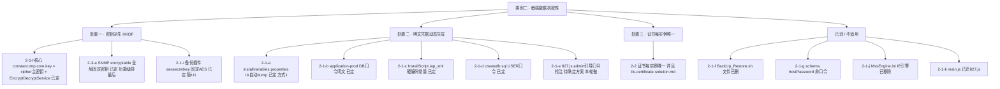
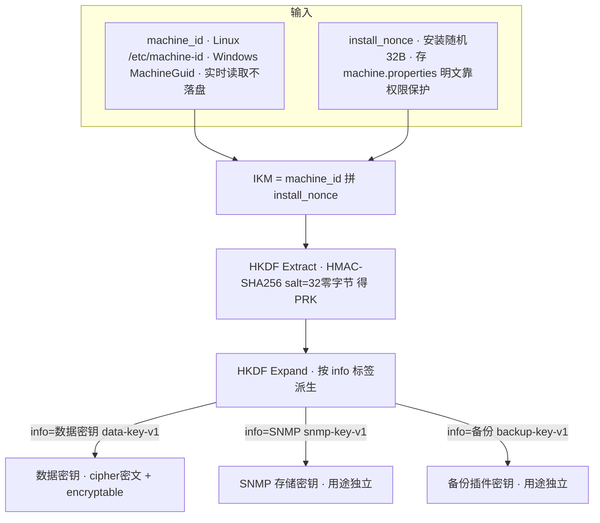
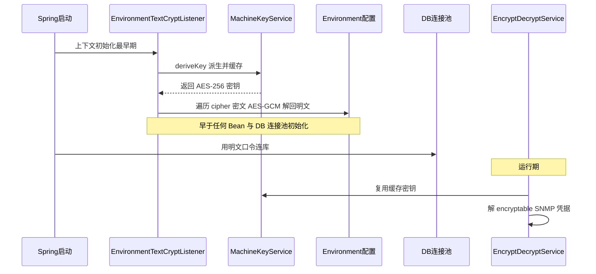
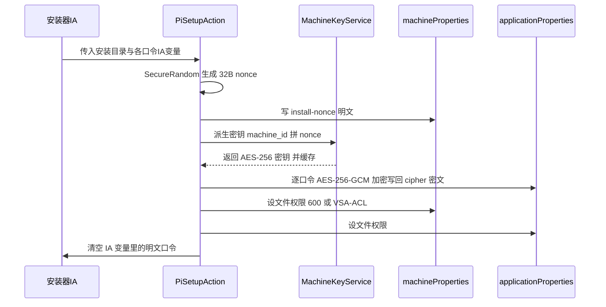
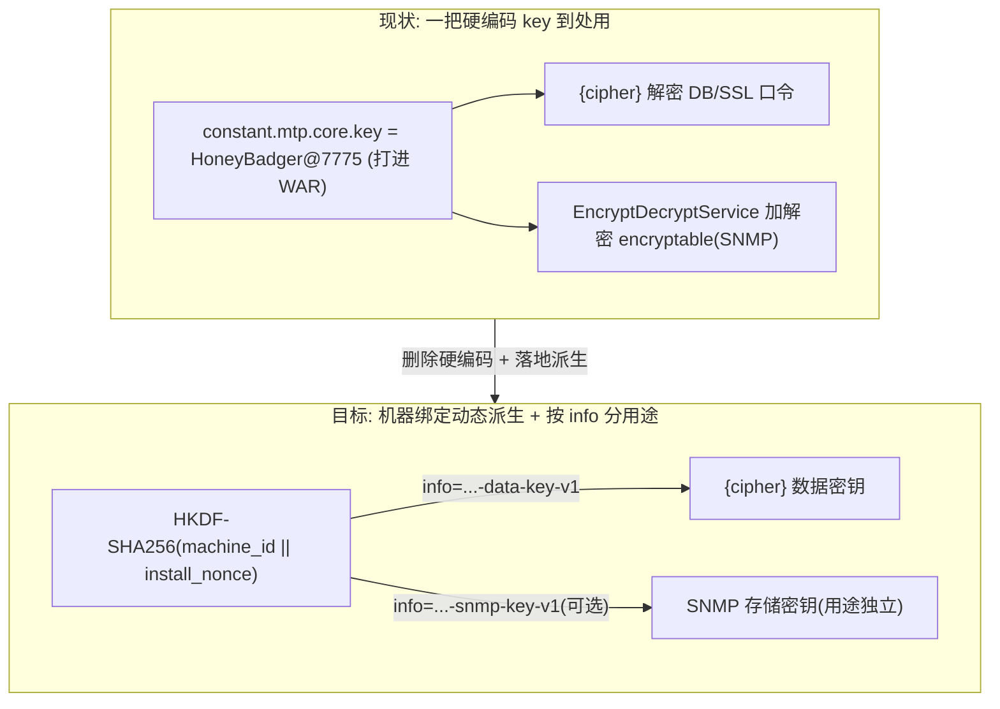
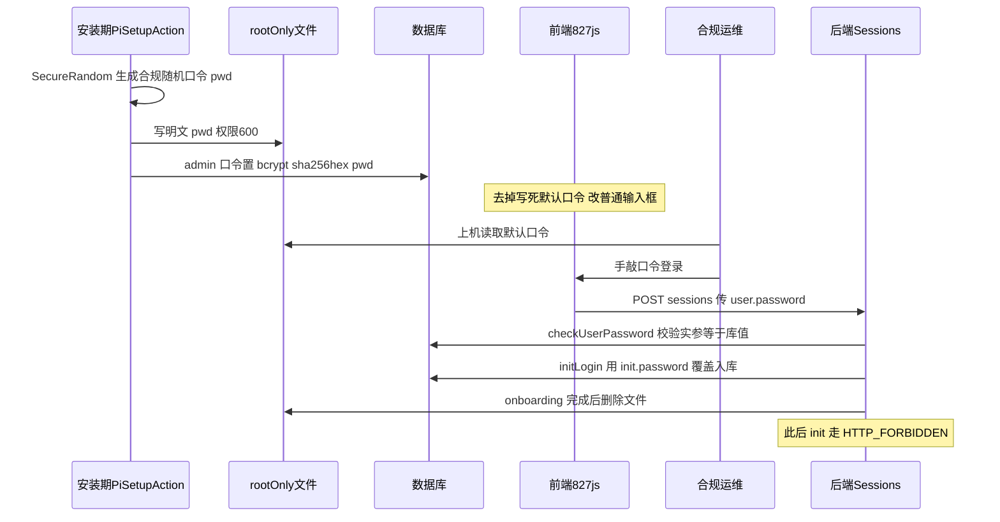
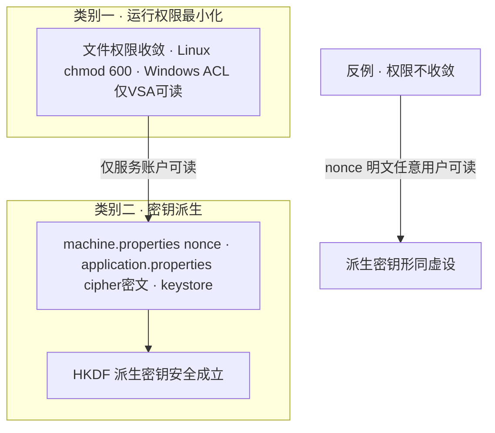
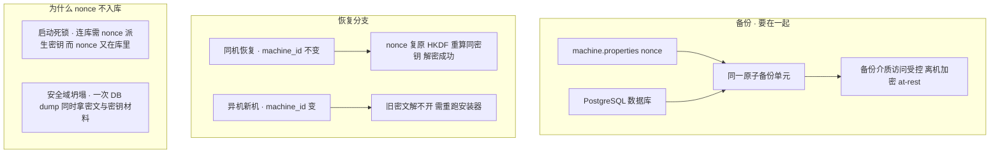

# PI 加解密体系与密钥管理解决方案（类别二）

> 最后更新：2026-07-23
> 对应任务：[类别二 · 敏感数据机密性 / 加解密体系](../01-remediation-task-ledger.md)（任务 2-1 硬编码/明文凭据、2-3-a SNMP）。**2-2 TLS 证书唯一已独立成文，见 [tls-certificate-solution.md](tls-certificate-solution.md)**。
> 需求定义：[secure-requirements-definitions.md](../requirements/secure-requirements-definitions.md)（AS-01-00、AR-00-06、AR-00-01、AR-00-02、IA-01-00；批准算法白名单 §6.1）。
> 姊妹文档：运行权限见 [runtime-permission-solution.md](runtime-permission-solution.md)（类别一）——两类在"文件权限收敛"处交汇（见 §2.4）。
> 背景知识与问答（密码学原理、为什么这么设计、编码≠加密≠哈希、HKDF/AES-GCM/bcrypt）见 [background/crypto-primer.md](background/crypto-primer.md)；TLS/证书原理见 [background/tls-and-certificate-primer.md](background/tls-and-certificate-primer.md)。本文只讲**现状与决定**，原理细节都在 primer。
>
> **来源与重要提示**：
> - 第一部分（§1）是对同事一份 **PI 密钥安全存储设计**（作者 Wang.Rui.Barney，2026-05-29，状态"设计评审中"，关联 CWE-798 `constant.mtp.core.key` 硬编码）的**梳理与摘录**（原文在 OneDrive `security-fix/doc/pi-key-design/pi-key-security-design.md`，未纳入本仓库）。
> - 该设计以 **MongoDB** 表述（PI 早期/参考 Automation Agent 语境）；**PI4.0 正式栈是 PostgreSQL**。密钥派生方案本身**与数据库引擎无关**，可直接沿用；仅"被加密的对象"需映射（Mongo 密码→PG 密码、Mongo `encryptable` 字段→PG `encryptable` 字段，含 SNMP 凭据）。见 §2.1。**此映射前提已确认**（K-2 代码实锤，见 §2.2）。
> - 第二部分（§2~§4）是**我方分析**：映射到 PI4.0 触点、一把密钥能闭合什么、还需单独做什么、与类别一耦合、是否满足 P2 provisioning、算法档位核对与改动点落地。

---

## 0. 目标与范围

| 项 | 内容 |
|----|------|
| 合规项 | AS-01-00 安全数据处理（机密性全生命周期）；底层横切 AR-00-01（只用批准算法）、AR-00-02（批准存储机制）、AR-00-06（每功能独立密钥 + 私钥每组件唯一）、IA-01-00（凭据存储安全） |
| 子目标 | 密钥/口令**不硬编码、动态生成、加密存储**（TLS 证书/密钥对每实例唯一已移至 [tls-certificate-solution.md](tls-certificate-solution.md)） |
| 范围（本轮） | PI 本体（`mtp-core` + `taf-core-installer`）；备份恢复整改由 U1，SNMP 排最后 |
| 范围决定 | **不考虑集群/共享数据库**（故无"多节点各自派生密钥、解不开共享 DB 密文"问题）；**不考虑 PI 升级**（U1 负责） |
| 关联 issue | #260（伞状）/ #36 / #51（凭据明文）、#58（证书不唯一） |

**类别二触点全景 + 方案与状态**（本文围绕它们展开；已对照 [任务台账 · 任务 2-1](../01-remediation-task-ledger.md)，随其更新）：

> 处置手段：**密钥(派生)** = 换成 machine 绑定 HKDF 派生密钥；**明文凭据** = 安装期动态生成 + 加密存储 + 文件权限收敛（禁静态默认，如必须默认则强制首登改密）。（**证书**每实例唯一见 [tls-certificate-solution.md](tls-certificate-solution.md)。）
> 图例：有方案 ✅已定 / 🟡参考·未定稿 / ⬜功能级待定 / ➖不适用；已修复 ✅完成 / ⬜未开始 / ➖不适用。

| 类 | # | 触点 / 现状明文物 | 方案（已定/参考） | 有方案 | 已修复 | 归属 |
|----|----|------------------|------------------|:---:|:---:|------|
| 密钥 | 2-1-h核心 | `constant.mtp.core.key`（`{cipher}` 主密钥 + `EncryptDecryptService` 密钥）= `HoneyBadger@7775`（ASCII 数组，打进 WAR） | **已定**：`EncryptDecryptUtil.KEY` 来源换 machine 绑定 HKDF 派生（drop-in，算法/密文格式不变）；base 删该行 | ✅ | ⬜ | mtp-core |
| 密钥 | 2-3-a | SNMP v2c/v3 凭据**存 DB**，已加密（`EncryptDecryptUtil`）用**全局固定密钥** | **已定**：DB `encryptable`/SNMP 与核心**同一把**（[代码实锤](#22-关键洞察一把派生密钥能同时闭合的触点)），换派生后来源自动闭合；再给 SNMP **独立 `info=…-snmp-key-v1`** 单独一把 | ✅ | ⬜ 排最后 | mtp-core 功能级 |
| 密钥 | 2-1-i | `plugin.properties` + `taf-plugin-pi-backuprecovery-plugin.zip` `aessecretkey=victoryAndActive`（+ `hostpassword=hostPassword`） | **已定**：固定 AES 密钥改 HKDF 派生（独立 `info=…-backup-key-v1`）；接线随 U1 | ✅ | ⬜ | 备份恢复插件 / U1 |
| 明文凭据 | 2-1-a | `installvariables.properties`（**IA 装完自动生成**，dump 全部 `$VAR$`，含 `TAFDB_ADMNPWD`/`WAITFORAPI_PASSWORD`；源码零引用） | **已定（方式①·保留文件）**：安装收尾动作把敏感键**行删除/清空**，保留文件与非敏感变量；无 U1 依赖（卸载已改 `.sh` 不读它、备份由 PI 自取、不考虑升级） | ✅ | ⬜ | 安装器（**优先**） |
| 明文凭据 | 2-1-b | `application-prod.properties` `taf.db.postgresql.password=Passw0rd@123`（+原文 `tenant.default.password`） | **已定**：动态生成 + `{cipher}`（派生密钥加密，§1.5） | ✅ | ⬜ | 安装器模板 / mtp-core |
| 明文凭据 | 2-1-c | `InstallScript.iap_xml` `Passw0rd123` + 6×`$TAFDB_ADMNPWD$` | **已定**：去硬编码常量、走 IA 变量 | ✅ | ⬜ | 安装器 |
| 明文凭据 | 2-1-d | `createdb.sql` `CREATE/ALTER USER mtpadmin/mtpuser WITH PASSWORD 'Passw0rd@123'`（Linux 验；**Windows 复核未发现该文件，2026-07-23**） | **已定**：IA 变量 + 动态口令 + 执行后删 | ✅ | ⬜ | 安装器 |
| 明文凭据 | 2-1-e | `827.js` + `adminUser-instance.json` web admin `Passw0rd123`（抢注窗口） | **🟡 待确定方案**（本轮做，详见 §2.3.2）：默认口令"去明文 + 去固定"方向不变；落地方式有多条候选（随机生成 / 安装期用户输入 / 已有口令加密存储 / 置空），需从需求侧确认若干点后再定稿 | 🟡 | ⬜ 本轮做 | mtp-core |
| 明文凭据 | 2-1-h | WAR 内 `application-dev/-prod/-cluster.properties` + base（`api.key`/`api.secret`/`default.password`/db 口令/`{cipher}`…） | **已敲定**：`packagingExcludes` 剔除 dev/prod/cluster + base 清密值；**源码保留**；硬前提=外置 `config/application-prod.properties` 补全 prod 超集（SSL/ciphers/端口/签名） | ✅ | ⬜ | mtp-core 构建 |
| 明文凭据 | 2-1-f | `BackUp_Restore.sh` `db_password="postgres"` | 文件已删（触点消失） | ➖ | ✅ Win+Linux 已删 | 已移除 |
| 明文凭据 | 2-1-g | `backup-configurations-schema-v1.json` `"hostPassword"` | 仅 schema 属性定义，非实际口令 | ➖ | ➖ N/A | mtp-core 插件 |
| 明文凭据 | 2-1-k | `main.*.js` `password:"Passw0rd123"` | 已迁 `827.js` | ➖ | ✅ `main.js` 无内嵌 | mtp-core 前端 |
| 明文凭据 | 2-1-j | `MssEngine.ini` / IE 日志 `KeyPasswd` | IE 引擎 PI4.0 已移除 | ➖ | ➖ N/A | — |
| 证书 | 2-2 | `keystore.p12`（8443 Core + 8088 ZE）静态自签、每装指纹一致 | **已独立成文 → [tls-certificate-solution.md](tls-certificate-solution.md)**（K-7 方向已定） | ✅ | ⬜ | 安装器 |

**图 D1 · 类别二触点分类全景**（按"三种处置手段"归类，一眼看清哪些问题、各归哪种解法、状态如何）：



---

## 1. 同事方案摘录与解读（machine 绑定 HKDF 派生密钥）

### 1.1 当前问题（被替换的对象）

`application.properties` 内硬编码密钥：

```properties
constant.mtp.core.key=72,111,110,101,121,66,97,100,103,101,114,64,55,55,55,53
# ASCII 解码 = HoneyBadger@7775
```

用途：① Spring Cloud Config `{cipher}` 解密（启动时解密配置里的 DB/SSL 口令）；② `EncryptDecryptService` 加解密 DB 内 `encryptable` 字段（**SNMP 凭据**等）。**任何人解压 WAR 即可提取该密钥**，进而解密所有受保护数据（CWE-798）。

### 1.2 核心思想：密钥不落盘（动态派生）

> ⚠️ 措辞澄清：准确说是**派生出的 AES 密钥本身不落盘**（每次启动在内存重算、缓存，进程结束即消失）；**但输入之一的 `install_nonce` 落盘**（明文，靠文件权限保护）。即"没有任何单一落盘文件 == 那把密钥"，而非"所有秘密都不落盘"。又因输入不变、HKDF 确定性，**每次重启都原样重算出同一把密钥——重启不改变密钥**，旧密文照常能解。

用两个"公开可得值"经密码学函数派生密钥，密钥本身不存任何地方：

```
AES-256 Key = HKDF-SHA256(
    IKM  = machine_id_bytes || install_nonce_bytes,
    salt = 32 个零字节,
    info = "vertiv-pi-data-key-v1"
)
```

| 输入 | 来源 | 是否存储 | 是否保密 |
|------|------|:---:|:---:|
| `machine_id` | OS 固有标识，实时读取 | 否 | 否 |
| `install_nonce` | 安装时随机生成，存 `machine.properties` | 是（明文） | 是（靠文件权限保护） |

**安全依据（摘录）**：攻击者需同时拿到 `machine_id`（本机访问权）与 `machine.properties`（服务账户权）才能还原密钥；获得二者≈完全控制目标机，属软件安全理论上限。→ 这条**直接依赖类别一的文件权限收敛**（见 §2.4）。

### 1.3 machine_id 读取与稳定性

- **Linux**：`/etc/machine-id`（32 位小写十六进制，systemd 首启生成后永久不变）。
- **Windows**：注册表 `HKLM\SOFTWARE\Microsoft\Cryptography\MachineGuid`（UUID，OS 安装时写入不变）。
- **稳定性结论（摘录）**：正常重启 / 内核补丁升级 / VM 快照恢复 / vMotion 热迁移 → **不变**；仅"重装 OS"会变（此时本就要重装 PI）；VM 克隆未重置 ID → 与源相同（见 §1.8 边界）。

### 1.4 HKDF-SHA256 派生（Extract + Expand）

- **Extract**：`PRK = HMAC-SHA256(key=32零字节 salt, data=IKM)` → 32 字节伪随机中间密钥。
- **Expand**：`OKM = HMAC-SHA256(key=PRK, data=info || 0x01)` → 32 字节 = AES-256 密钥。
- **`info` 标签的价值**：换 `info` 字符串即可派生**用途独立**的第二把密钥（签名/不同功能），互不干扰、无需改 machine_id/nonce。→ **这正是满足 AR-00-06"每功能独立密钥"的抓手**（见 §2.6）。
- 纯 JCE 标准库实现（Java 17+），无新依赖；`MachineKeyService` 用 double-checked locking + `volatile` 缓存，只派生一次。

**图 D2 · HKDF 派生架构**（两个公开可得值经 Extract/Expand 派生；换 `info` 即扇出用途独立的多把密钥，满足 AR-00-06）：



### 1.5 文件结构与 `{cipher}` 密文格式（摘录）

```
$INSTALL_DIR/
├── machine.properties          ← 新增，安装时创建
│     install-nonce=<64位Hex，256 bit>
├── application.properties       ← 现有，格式不变、内容变化
│     taf.db.password={cipher}Base64(IV||CT||Tag)
│     server.ssl.key-store-password={cipher}Base64(IV||CT||Tag)
│     # constant.mtp.core.key 整行删除
```

- `{cipher}` 密文 = `IV(12B 随机) || Ciphertext || GCM-Tag(16B)`，Base64 编码；每次加密 IV 随机 → 相同明文不同密文。
- **文件权限（K-4 已定·方式A）**：Linux `chown si_app:si` + `chmod 600`；Windows `icacls machine.properties /inheritance:r` + `/grant:r "NT SERVICE\TAFsvc:(R)"`（仅服务 VSA 读）。**OS-seal（DPAPI/TPM/keyring）本轮不做、仅登记**；**nonce 不入库**——理由与备份/容灾见 §2.7。

### 1.6 启动与运行期解密

- 启动最早期由 `EnvironmentTextCryptListener`（`ApplicationContextInitializer`）触发 `MachineKeyService.deriveKey()`，遍历 Environment 所有 `{cipher}` 值用 AES-256-GCM 解密回明文——**发生在任何 Bean（DB 连接池）初始化之前**。
- 运行期 `EncryptDecryptService` 对 DB `encryptable` 字段（**SNMP 凭据等**）加解密，复用同一缓存密钥。

**图 D4 · 启动/运行期解密时序**（密钥每次重启在内存重算；`{cipher}` 解密早于任何 Bean 与 DB 连接池）：



### 1.7 安装器侧 `PiSetupAction`（摘录）

文件安装完成后执行：读 IA 变量（安装目录 + 用户输入的各口令）→ `SecureRandom` 生成 32B nonce 写 `machine.properties` → 派生密钥 → 逐个 AES-256-GCM 加密口令写回 `application.properties` 的 `{cipher}` → 设文件权限 → **清空 IA 变量里的明文**。安装器侧需一份与运行时逻辑相同、但**独立实现**的 `MachineKeyService`（安装期无法依赖 PI WAR）。

**图 D3 · 安装期时序（PiSetupAction）**：



### 1.8 边界条件（摘录要点）

| 场景 | 处理 |
|------|------|
| 重启 | machine_id/nonce 不变，HKDF 确定性 → 同一密钥，业务透明 |
| 重装 OS（唯一会变的正常场景） | 本就需重装 PI：重输口令 + 新 nonce → 重建；DB 内 `encryptable` 需重配设备协议（预期操作） |
| `machine.properties` 丢失/损坏 | 启动失败并明确报错（不静默降级、不打 NPE）；**须纳入备份**，与 DB 视为同一备份单元 |
| machine_id 读取失败 | 抛异常启动失败，**禁止固定值兜底**（否则密钥可预测） |
| `{cipher}` 解密失败（密钥不匹配） | `AEADBadTagException` → 明确异常、启动失败；**绝不把乱码当配置传下去** |
| VM 克隆未重置 ID | 与源同密钥：测试可接受；生产须克隆后重跑安装器生成新 nonce |

### 1.9 SECURE 符合性（作者自评摘录）

| 需求 | 改造前 | 改造后 |
|------|--------|--------|
| IA-01-00 凭据存储 | ❌ 密钥硬编码在 JAR | ✅ AES-256-GCM 加密、密钥不落盘 |
| AR-00-01 批准算法 | ❌ 硬编码 key 无算法保证 | ✅ HKDF-SHA256(RFC5869) + AES-256-GCM(SP800-38D) |
| AR-00-06 密钥用途/唯一 | ❌ 一把硬编码 key 到处用 | ✅ 机器绑定派生、可按 `info` 分用途、离线不可破 |

---

## 2. 我方分析：映射到 PI4.0 与本轮任务

### 2.1 引擎映射（MongoDB → PostgreSQL）

同事文档的 MongoDB 表述按下表映射到 PI4.0；**方案与引擎无关，逻辑不变**：

| 文档（MongoDB 语境） | PI4.0（PostgreSQL） |
|----------------------|---------------------|
| `taf.db.password`（Mongo 口令） | `taf.db.postgresql.password`（实测 `application-prod.properties` L8 明文 `Passw0rd@123`） |
| Mongo `encryptable` 字段（SNMP/Agent 凭据） | PostgreSQL 内 `encryptable` 字段（**SNMP 凭据**，见任务 2-3-a） |
| `$INSTALL_DIR`（Agent 目录） | PI 安装目录 / 外置 `config/`（`loader.path=./config`） |

> ✅ 已确认（K-2 代码实锤，见 §2.2）：`EncryptDecryptService` → `EncryptDecryptUtil` 确实读同一 `constant.mtp.core.key`；`encryptable` 即含 SNMP 凭据的 DB 存储字段。

### 2.2 关键洞察：一把派生密钥能同时闭合的触点

**K-2 已代码实锤（同一把）**：`{cipher}` 解密链（`EnvironmentTextCryptListener` → `EncryptDecryptUtil.decrypt`）与 `encryptable`/SNMP 加解密链（`EncryptDecryptServiceImpl` → `EncryptDecryptUtil`）**共用同一个** `EncryptDecryptUtil.KEY = PluginConfiguration.getByteKey("constant.mtp.core.key")`，且算法已是 `AES/GCM/NoPadding` + 12B 随机 IV + 16B tag（与派生方案密文格式一致）。所以只需把 `EncryptDecryptUtil.KEY` 的**来源**换成 `MachineKeyService` 派生密钥（**drop-in**，算法不动），一次性闭合：

1. `{cipher}` 主密钥硬编码（任务 2-1）。
2. `application-prod.properties` DB 口令明文 → `{cipher}` 加密（任务 2-1）。
3. SNMP `encryptable` 字段的"全局固定密钥" → 每实例派生密钥（任务 2-3-a 的**密钥来源**部分，功能级改动的一半自动解决）。



### 2.3 它解决不了、需单独做的

- **#58 TLS 证书/密钥对唯一（任务 2-2）**：派生出的是**对称密钥**，≠ TLS **非对称密钥对**，本方案天然覆盖不到证书唯一性。**现状/方案/决策已独立成文，见 [tls-certificate-solution.md](tls-certificate-solution.md)**。
- **`plugin.properties` 备份恢复 AES 密钥（`victoryAndActive`）**：可纳入同一派生体系（换成按 `info=...-backup-key-v1` 派生），但需单独接线到备份恢复插件，且与 U1 协同。
- **admin 引导口令（`827.js` / `adminUser-instance.json` 的 `Passw0rd123`）**：属**凭据 provisioning**（每实例随机初始口令 + bcrypt 入库 + 首登改密），不是加密密钥问题；**本轮做，🟡 方案待确定见 §2.3.2**。注意：**用户登录口令用 bcrypt 哈希**（已确认），与本文的"配置密钥派生"是两条线，勿混（原理见 [primer Q9](background/crypto-primer.md)）。

#### 2.3.1 TLS 证书（#58）—— 已迁出

> 证书问题（PI 现状 / 为什么密钥派生覆盖不到 #58 / 方案 / 决策 / 生命周期）已独立成文，见 [tls-certificate-solution.md](tls-certificate-solution.md)；原理见 [background/tls-and-certificate-primer.md](background/tls-and-certificate-primer.md)。

#### 2.3.2 admin 引导口令去硬编码（2-1-e，本轮做，🟡 待确定方案）

> 🟡 **状态（2026-07-24）：方案未定，暂无定下来的解决方案，仅记录讨论与候选。** 方向确定（默认 web admin 口令**去明文 + 去固定 + 收敛抢注窗口**），但**落地方式尚未拍板**。以下完整记录问题、需求前提、四套候选思路、评审反馈、IA 工程约束与三条可行路径、以及待确认的需求点，供后续定稿。

**问题**：默认 web admin 口令 `Passw0rd123` 写死在前端 `827.js`；onboarding 窗口内任何人都能用它抢注、把 admin 改成自己的。后端流程（[`SessionsApplicationEventHandler`](file:///D:/idea_workspace/mtp-pi-core/webapp/src/main/java/com/avocent/mtp/core/security/SessionsApplicationEventHandler.java)）：`checkUserPassword` 校验提交口令 == 库值 → `initLogin`→`updateUserInfo` 用 `init.password` 覆盖；`rejectInitWhenOnboardingComplete` 在 onboarding 完成后拒绝再 init（`HTTP_FORBIDDEN`）——**后端结构基本够用，只需换掉"默认口令来源"并让前端不再写死**。

> **命门**：判方案好坏只看一条——**onboarding 窗口内攻击者能否猜到/拿到初始口令**；存储加密/哈希是次要项。

**需求前提（已确认 2026-07-24）**：**装机的人与使用 PI 的人一般在同一团队**（同一信任边界）→ 倾向"安装期由操作员定口令、首登直接用、不再强制改密"。

**候选思路与评估**：

| # | 思路 | 解根因 | 看法 |
|---|------|:---:|------|
| 1 | 随机生成 → 落 root-only 文件 → 前端输入框 → 运维上机读文件手敲 | ✅ | 安全最强、业界常见；但需上机翻文件+复制，评审反映**太繁琐**；静默场景需 K-9 兜底 |
| 2 | 安装向导让操作员**自设**口令 → 首登直接用 | ✅ | UX 最好、无文件；口令勿泄入安装产物（撞 2-1-a/K-9）、复杂度须安装器强制 |
| 3 | 保留已有固定口令、仅"加密存储" | ❌ | **不解根因**（口令仍固定/可预测、照样抢注）；且口令应 bcrypt 哈希而非可逆加密。**倾向否决** |
| 4 | 默认口令置空/空串、只去前端写死 | ❌ | 单独用**不安全**（空口令更易抢注）；仅在"首登强制本机/console"额外加闸下才成立 |

**评审反馈（2026-07-24）**：
- **思路 1**：上机找文件、复制随机口令**太复杂**，要简化。简化手段（完成页/控制台直接显示口令）都要求装机时有人在场；而一旦有人在场，"当场自设"（思路 2）更简单——**思路 1 的独立价值只剩"无人值守"场景**。
- **思路 2**：安装时已输口令，首登再强制输新密码**冗余且困惑**。→ 采纳"**首登直接用、不强制改密**"（后端连 init 覆盖口令步都可省）；"强制改密"仅在"装机人 ≠ 最终 admin（分权）"时才需要，本前提下不需要。

**IA 工程约束（决定思路 2 怎么落）**：
- 现网 DB 口令面板每个输入项都是带独立 objectID 的 `EntryAtomBiDi`（`253d0b4d94ac`=DB admin 口令、`253d0b4d94ad`=DB user 口令 等）。**新增"web admin 口令"字段 = 新 objectID = IA Builder 构建时静默剥离**（headless 无 IA Designer 可注册）→ **凭空加输入框做不到**（见 [ObjectID 剥离复盘](../../migration-remediation-archive/02-hardcore-technical-postmortems.md)、[IA 协作复盘](../../retrospectives/ai-installanywhere-collaboration.md)）。
- 但安装器**已注册**成套口令输入设施：GUI+Console 面板（`545b8f08975e`/`5568c0eb98a3`/`557a7b9098d9`）、已收集 `$TAFDB_ADMNPWD$`、带复杂度校验 `ValidateInputPasswordAction`（8–16 位，大小写+数字+特殊字符 `!@#%^&*`）→ **不必从零加框**。

**三条可行落地路径（待选）**：

| 路径 | 做法 | objectID | 代价 / 前提 |
|------|------|:---:|------|
| **A**（最省） | 复用安装期已输口令 seed web admin 初始口令（bcrypt 入库）+ 去 `827.js` 默认值 + 首登不强制改密 | 零新增 | web 初始口令 = DB 口令（凭据复用）；同团队+可改，风险可接受 |
| **B**（最干净） | 劫持一个已注册但废弃的"幽灵输入字段"收**单独**的 web 口令 | 零新增 | 需先核验确有可复用可见输入字段（ESXi/pushRegistry/`WAITFORAPI_PASSWORD` 等候选待查证） |
| **C**（绕开 IA） | 不在安装器收、改到 PI 首登页设（`827.js` 前端改，非 IA） | 无（非 IA） | 服务已暴露后才设 → 抢注窗口回来，须加闸（一次性 token / 限 localhost）→ 又绕回读文件/网络假设 |

> 倾向（未拍板）：安全上"装机时（服务未暴露、操作员可信）定死口令"最稳、匹配同团队前提；IA 新节点限制用**路径 A** 零风险化解；要"web 口令 ≠ DB 口令"再走 **路径 B**（需查证幽灵字段）。

**待确认需求点（拍板前）**：
1. 是否接受**路径 A 的凭据复用**（web 初始口令 = DB 口令），还是必须分离（→ B，需查幽灵字段）？
2. 静默/无人值守安装是否覆盖口令下发（K-9）？若要，思路 2/路径 A 需补静默剧本或回退随机（思路 1）。
3. 是否有"装机人 ≠ 最终 admin"的分权要求（决定要不要强制改密）？
4. 口令复杂度以谁为准（安装器 `ValidateInputPasswordAction` vs [`requirements/password-requirement.txt`](../requirements/password-requirement.txt)）。

**思路 1 细化（随机 + 文件；候选之一·非定稿；生成器用 `SecureRandom`，不用 HKDF——理由见 [primer Q11](background/crypto-primer.md)）**：

1. **安装期** `PiSetupAction`：用 `SecureRandom` 生成**满足口令复杂度策略**的随机默认口令 `pwd`（默认策略：长度 ≥10、且大写/小写/数字/特殊字符各 ≥1，特殊字符取白名单；生成器须**保证**四类各至少一个——不能用裸 `Base64URL`，它不保证含合规特殊字符。要求见 [`requirements/password-requirement.txt`](../requirements/password-requirement.txt)）→ ① 写 **root-only 文件**（如 `admin-initial-password.txt`，Linux `chmod 600`、Windows VSA-ACL）② DB admin 用户口令置 `bcrypt(sha256hex(pwd))`（替换 `Passw0rd123`）。
2. **前端 `827.js`**：删掉写死的 `password:'Passw0rd123'`，退化为普通输入框，由运维手敲。
3. **首登**：合规运维上机读文件拿默认口令 → 作 `user.password` 传 `/api/rest/v1/sessions` → 后端 `checkUserPassword` 校验实参 == 库值 → 通过后用 `init.password` 覆盖入库。
4. **收尾**：onboarding 完成后删除该文件（口令已改，文件已失效）；此后 `init` 走 `HTTP_FORBIDDEN`。

> 思路 1 为何安全：攻击者不知道随机初始口令（每实例随机、只在 root-only 文件里），`Passw0rd123` 猜不中、抢注窗口关闭。先前分析倾向否决的做法：去校验 / 置 null（= 思路 4，单独不安全）/ 自比对 / 仅 localhost / 用 HKDF 派生一次性口令（`SecureRandom` 更贴切、且不污染密钥派生域）。

> 关联：[issue-51 §九](../issues/issue-51-as01-00-admin-user-autoload-password.md)。属应用层 provisioning，与"配置密钥派生"是两条线。**静默/无人值守安装下的引导口令协同见 §2.9（K-9，仅记录现状·本轮不处理）。**

**图 D5 · 思路 1（随机 + 文件）闭环示意**（候选之一·非定稿）：



### 2.4 与类别一（运行权限）的耦合

同事方案的安全性**建立在 `machine.properties`/`application.properties` 只有服务账户可读**之上（§1.2）。这正是[类别一](runtime-permission-solution.md)"敏感文件权限收敛"要做的事：

- Linux：`chown si_app:si` + `chmod 600/640`（对齐 runtime §2.5）。
- Windows：断继承 + 仅授对应 VSA 读（对齐 runtime §1.10.4）。

→ **两类必须协同**：密钥动态生成后靠权限收敛保证"只有服务账户读得到 nonce"；反之若权限不收敛，nonce 明文可被任意用户读走，派生密钥形同虚设。

**图 D7 · 类别一↔二耦合**（类别一的文件权限收敛是类别二密钥安全的地基）：



### 2.5 是否满足 P2（统一 provisioning 选型）

任务书 P2 悬置着"统一密钥/凭据 provisioning 方案（env / 配置提供方 / Vault / OS keystore / TPM）"。评估同事方案：

| 维度 | 同事方案（machine 绑定 HKDF） | 备选（TPM / DPAPI / Linux keyring / Vault） |
|------|-------------------------------|---------------------------------------------|
| 落地成本 | 低（纯 JCE，无新依赖、无外部服务） | 高（TPM 需硬件/驱动；Vault 需部署运维） |
| 每实例唯一 | ✅（machine_id + nonce） | ✅ |
| 密钥不落盘 | ✅（只存 nonce，非密钥） | ✅（硬件保管） |
| AR-00-02 合规 | 走"AR-00-00 批准安全函数"这一档（软件方案） | TPM 走"TPM 机制"档，更强 |
| 主要弱点 | nonce 明文靠文件权限；VM 克隆同密钥；重装 OS 需重配 | 复杂度、可用性、跨平台一致性 |

**结论（K-1 已关闭）**：采用 machine 绑定 **HKDF** 作 **P2 默认选型**——性价比最高，AR-00-02 允许"软件加密 + KDF 派生"这一档（见 [requirements §6.3](../requirements/secure-requirements-definitions.md)）。是否再上 TPM/更强档，取决于客户是否要 Enhanced / FIPS（见 §2.6），作为逃生口仅登记。

### 2.6 算法与档位核对（AR-00-00）

对照 [批准算法白名单 §6.1](../requirements/secure-requirements-definitions.md)：

| 用途 | 方案用法 | Baseline 判定 |
|------|----------|:---:|
| 派生 | HKDF-SHA256（基于 HMAC-SHA256） | ✅（HMAC≥112bit、SHA-2 均在批准集） |
| 对称加密 | AES-256-GCM（12B IV + 16B tag） | ✅（AES-256 + GMAC/GCM 批准） |
| 完整性 | GCM Tag / HMAC-SHA256 | ✅ |

- **三个算法均落 Baseline 批准集**，无弱算法（无 ECB/CBC-SHA1/MD5）。
- **注意区分**：本方案是"**配置密钥派生 + 数据加密**"，用 HKDF；而"**用户口令存储**"须用口令 KDF（Argon2id / bcrypt≥10 / PBKDF2），PI 登录口令已用 **bcrypt**——两者是 AR-00-00 表里**不同行**，勿用 HKDF 存用户口令。
- **档位待定（P1）**：商用交付走 Baseline 即够；若有政府/国防/FIPS 客户须走 Enhanced（AES-256 only、证书 RSA≥3072 或 ECDSA-P384）——**直接影响 [tls-certificate-solution.md](tls-certificate-solution.md) 的证书密钥长度**。

### 2.7 nonce 备份/容灾与"不入库"决策（K-4，已定）

密钥不落盘、只存 `install_nonce`，运维侧按下表落地（本轮已定）：

| 项 | 计划 |
|----|------|
| **备份单元** | `machine.properties`（nonce）**必须与 PostgreSQL 数据库作为同一原子备份单元**一起备。丢 nonce = DB 内 `encryptable`/SNMP 密文与配置 `{cipher}` 全部无法解密、PI 启动失败（见 §1.8） |
| **同机恢复**（磁盘坏/重装同机） | 恢复 DB + `machine.properties` → machine_id 未变 + nonce 复原 → HKDF 确定性重算同一密钥 → 密文正常解密，业务透明 |
| **异机/新机容灾** | machine_id 变 → 密钥变 → 旧密文解不开。**本轮范围（单机、不集群、不升级）不支持异机直恢**：新机需**重跑安装器**（重生 nonce + 重输/重配敏感值） |
| **备份自身保护** | 备份含 nonce（=主秘密）→ 备份介质须访问受控、离机存放**加密 at-rest** |
| **恢复校验** | 启动若 `{cipher}`/DB 解密失败（`AEADBadTagException`）→ **快速失败并明确报错**（"nonce 不匹配/恢复不完整"），绝不静默降级 |
| **运维手册** | Runbook 写明"`machine.properties` 是机密、属 DB 备份集，按 DB dump 同等对待"（**交付物 TODO：尚未产出**；含 DR 操作步骤；**静默安装部分待 K-9 后续定（§2.9 目前仅记录现状）**） |

**nonce 不放进数据库（已定）**，两条理由：

1. **启动死锁（决定性）**：PI 启动最早期要用"nonce 派生的密钥"解密 `taf.db.password` 的 `{cipher}` 才能连库；若 nonce 只在库里，则"连库需要 nonce、拿 nonce 又需先连库"→ 死锁。
2. **安全域坍塌**：库里已存被该密钥加密的密文，再把 nonce 塞进同库 = 钥匙贴在锁箱上；一次 DB dump 即同时拿到密文+密钥材料。现设计特意让 nonce 待在**独立保护域**（文件权限 + 机器绑定），使"DB 泄露 ≠ 密钥泄露"。

> 原则：**备份要"在一起"，存储要"分开"**。若需 DR 冗余，用运维持有的恢复密钥对 nonce 做 escrow 封装、不明文入库（本轮不做，登记）。
> 与范围一致：因**不考虑集群/共享 DB、不考虑升级**（见 §0），跨机/集群/升级迁移的密钥迁移不在本轮（升级归 U1）。

**图 D6 · nonce 备份/容灾与"不入库"决策**（原则：备份要在一起，存储要分开）：



### 2.8 · 2-1-h 外置 prod 配置补全对比（记录，2026-07-23）

> 为量化 2-1-h 硬前提而做的一次对照，**先只记录**。对比对象：
> - **源码 prod 全集**（仅看这两个）：[`webapp/src/main/resources/application.properties`](file:///D:/idea_workspace/mtp-pi-core/webapp/src/main/resources/application.properties)（base）+ [`application-prod.properties`](file:///D:/idea_workspace/mtp-pi-core/webapp/src/main/resources/application-prod.properties)（prod 覆盖）。
> - **安装后外置**：`E:\software\PI4.0\main\config\application-prod.properties`。
>
> 关键发现：**SSL/ciphers/签名/keyStoreType 等 prod 关键项当前只存在于源码 prod（且随 WAR 打包），安装后的外置 config 并不含**——运行时靠 WAR 内打包的 `application-prod.properties` 兜底。一旦 2-1-h 用 `packagingExcludes` 把 prod 从 WAR 剔除，外置若不补齐，这些即断裂/降级。

**剔除 WAR 内 prod 前，外置 `config/application-prod.properties` 需补齐的键**：

| 键 | 源码 prod 全集 | 安装后外置 config | 剔除后风险 |
|----|:---:|:---:|----|
| `server.ssl.key-store-password`（`{cipher}`） | 有 | 缺 | 🔴 keystore 口令缺失，TLS 起不来 |
| `server.ssl.trust-store-password`（`{cipher}`） | 有 | 缺 | 🔴 truststore 口令缺失 |
| `server.ssl.keyStoreType=PKCS12` | 有 | 缺 | keystore 类型回落默认 |
| `server.ssl.keyAlias=mtp-platform` | 有 | 缺 | 取错证书别名 |
| `server.ssl.client-auth=want` | 有 | 缺 | mTLS 行为变化 |
| `server.ssl.enabled-protocols=TLSv1.2,TLSv1.3` | 有 | 缺 | 🔴 协议放宽/降级 |
| `server.ssl.ciphers=…`（5 套件） | 有 | 缺 | 🔴 弱套件回落 |
| `taf.security.signature.validation=true` | 有 | 缺 | 🔴 签名校验被关 |
| `taf.security.signature.key-store-password`（`{cipher}`，base） | 有 | 缺 | 签名库口令缺失 |
| `tenant.default.password`（密值） | 有 | 缺 | 属 2-1-e/密值，应 `{cipher}` 或移除 |
| `constant.mtp.core.key`/`api.key`/`api.secret`/`default.password`/`server.password`（base 密值） | 有 | 缺 | 密值，应改派生/`{cipher}` |
| `taf.db.postgresql.password` | 有（明文） | 有（**明文 🔴**） | 应改 `{cipher}` |

> 已在外置、无需补：`server.port`、`server.ssl.key-store`/`trust-store`（路径）、`logging.*`、`management.*`、`mtp.system.*`、采样间隔、`zero.engine`/`taf.service.address` 等结构项。
> 结论：2-1-h 落地前，外置 config 至少补齐上表"缺"的 **SSL/协议/套件/签名/keyStoreType/client-auth**（结构性）+ 把**密值以 `{cipher}` 提供**；否则丢 TLS/端口/签名或安全降级（呼应 §0 2-1-h 硬前提）。

### 2.9 · 静默/无人值守安装与动态凭据协同（K-9，仅记录现状·本轮不处理）

> ⚠️ **本节仅记录现状，先不敲定方案、本轮不处理。** 动态凭据（§1.7 `PiSetupAction` 生成 + §2.3.2 admin 随机口令→root-only 文件→运维手敲）默认预期"安装期生成 + 人工 onboarding"，与**静默/无人值守安装**（响应文件 `silentsample.txt`，无人交互）存在张力。下面把现状与已达成的理解记录下来，具体方案留待后续讨论。

**现状记录**：

- **交互式安装**：用户在向导里输入 DB 口令（经 IA 变量 `$TAFDB_ADMNPWD$` 等），口令仅在安装进程内存中停留、随即加密为 `{cipher}`。**这是既有业务功能，需保留**；配合 2-1-a 擦除 `installvariables.properties` 敏感键后，磁盘上不留明文，本身不构成安全触点。
- **静默/无人值守安装**：DB 口令经 IA 变量从响应文件 `silentsample.txt` 读取，口令以**明文长期停留在响应文件里**（磁盘/仓库/配管）。这是"明文秘密落在持久化介质"的一面，也是本议题唯一的真实关注点——且此现象是所有静默安装器的通性。
- **admin 引导口令（2-1-e）在全自动流水线下**："运维读 root-only 文件手敲"缺少"人"去读文件、完成首登 onboarding。

**已达成的理解（供后续讨论的边界）**：

- **不去掉用户输入口令的能力**（交互/静默皆保留），这是既有功能；真正要处理的仅"静默响应文件明文落盘"。
- 后续可评估的缓解方向（**均未选定**）：响应文件按秘密自管（即用即生成、装完即删、不进 Git）／从环境变量或外部密管注入／口令字段留空时回退为安装期自动生成——具体取舍留待专门讨论。

**关联位置**：安装期生成 §1.7；admin 口令链路 §2.3.2；响应文件/IA 变量触点 §0 的 2-1-a/2-1-c/2-1-d；安装器改动索引 §4；Runbook §2.7。**决策登记为 K-9（§3，仅记录现状）。**

---

## 3. 关键决策待定（供评审拍板）

> 仿类别一决策表。2026-07-23 敲定：**K-1~K-6、K-8 关闭**；**K-9（静默安装协同）** 保持 open。**K-7（TLS 证书）已迁至 [tls-certificate-solution.md §4](tls-certificate-solution.md)（方向已定）**。**另：2-1-e（admin 引导口令落地方式）2026-07-24 重开为 🟡 待确定方案（§2.3.2）。**

| # | 待决 | 结论 / 倾向 | 状态 |
|---|------|-----------|:---:|
| K-1 | provisioning 选型 | 采用 machine 绑定 **HKDF** 作默认（§2.5） | ✅ 关闭 |
| K-2 | `constant.mtp.core.key` 与 SNMP 全局密钥是否同一把 | **是**（代码实锤，§2.2）；换派生即闭合来源 | ✅ 关闭 |
| K-3 | 是否按 `info` 分用途派生多把密钥 | **分**（每功能独立 `info`，满足 AR-00-06） | ✅ 关闭 |
| K-4 | `install_nonce` 存储/保护 | **已定（方式A）**：明文 + `chmod 600`(Linux)/`icacls` VSA-only(Windows) + 机器绑定纵深；**OS-seal（DPAPI/TPM/keyring）本轮不做、仅登记为后续扩展**；**nonce 不入库**（启动死锁 + 安全域坍塌，§2.7） | ✅ 关闭 |
| K-5 | VM 克隆同密钥是否可接受 | 测试可接受；生产重跑安装器——**本轮仅记录，不处理** | ✅ 关闭（记录） |
| K-6 | `plugin.properties` AES 密钥并入派生体系 | **并入**（独立 `info=…-backup-key-v1`），接线随 U1 | ✅ 关闭（方案） |
| K-8 | 对称算法 / 档位 | 对称定 **AES-256-GCM**（12B 随机 IV，同密钥不复用）；档位默认 **Baseline**，客户合规可升 Enhanced（仅影响 §2.6 证书长度/HKDF hash） | ✅ 关闭 |
| K-9 | 静默/无人值守安装与动态凭据协同 | **仅记录现状，本轮不处理**（§2.9）：交互/静默的用户输入口令能力为既有功能须保留；唯一真实关注点=静默响应文件明文落盘；缓解方向未选定 | 🟡 open（记录） |

---

## 4. 改动点落地索引（high-level，本轮不改代码）

> 仅给"落在哪"的范围，供后续实现定位。跨 `mtp-core`（运行时）+ `taf-core-installer`（安装器）两工程。

| 区域 | 改动项 | 类型 |
|------|--------|------|
| `mtp-core` | 新增 `MachineKeyService`（HKDF 派生 + 缓存；按 `info` 分用途，K-3） | 新增 |
| `mtp-core` | `EncryptDecryptUtil.KEY`：来源从 `constant.mtp.core.key` 改由 `MachineKeyService` 派生（`data-key-v1`）——`{cipher}`(经 `EnvironmentTextCryptListener`) 与 `encryptable`(经 `EncryptDecryptServiceImpl`) 两链共用，一处改双链生效（K-2 已确认同一把） | 修改 |
| `mtp-core` | SNMP `encryptable` 加解密改用**独立** `info=…-snmp-key-v1` 派生密钥（K-3；2-3-a，排最后） | 修改（功能级） |
| `mtp-core` | `application.properties`：删 `constant.mtp.core.key`，密值改 `{cipher}` | 修改（与任务 2-1-h"WAR 不打配置"协同） |
| `mtp-core` | **2-1-e**：默认口令去明文/去固定（`827.js` + 后端引导口令）——**落地方式待确定**（§2.3.2） | 🟡 待定 |
| 安装器 customcode | 新增 `PiSetupAction`（2-1-e 引导口令落地方式待确定，§2.3.2）+ 独立 `MachineKeyService` + `FilePermissionUtil` | 新增 |
| `taf-core-installer`（IA） | 安装后动作接 `PiSetupAction`；`machine.properties`/`application.properties` 模板；口令输入项（已有 `$TAFDB_ADMNPWD$`） | 修改 |
| `taf-core-installer`（IA） | **2-1-a（方式①）**：安装收尾动作（Exec/CustomCode）抹除 `_installation/installvariables.properties` 的敏感键（`TAFDB_ADMNPWD`/`WAITFORAPI_PASSWORD` 等）——行删除/清空，**保留文件**；后续可随动态口令改造向"口令不成为被 dump 的 IA 变量"（方式②）收敛 | 新增 |
| `taf-core-installer`（IA） | **K-9 静默安装协同**：现状=静默响应文件 `silentsample.txt` 口令明文落盘（详见 §2.9）——**仅记录，本轮不处理** | 待定（仅记录） |
| `taf-core-installer`（IA） | **任务 2-2 TLS 证书**：已独立成文，见 [tls-certificate-solution.md §6](tls-certificate-solution.md) | 迁出 |
| 备份恢复插件 | `plugin.properties` AES 密钥改派生（K-6，与 U1 协同） | 新增（独立） |

**文件权限收敛**（`machine.properties`/`application.properties`/keystore）由**类别一**统一落地（见 §2.4），不在本文重复。逐触点方案与状态已并入 [§0 触点全景表](#0-目标与范围)。

---

## 5. 与任务书/需求的关系

- 对应 [任务 2-1](../01-remediation-task-ledger.md)（硬编码/明文凭据 → 动态生成加密存储）、[任务 2-3-a](../01-remediation-task-ledger.md)（SNMP 凭据与存储加密）；[任务 2-2 TLS 证书唯一 #58](tls-certificate-solution.md) 独立成文。
- 本文即任务书 **P2"你方已有一套设计文档，待评估是否满足"** 的评估落点（评估结论见 §2.5）。
- 需求依据：[AS-01-00 / AR-00-06 / AR-00-01 / AR-00-02 / IA-01-00](../requirements/secure-requirements-definitions.md)。
- 关联 issue：[#260 伞状](../issues/issue-260-as01-00-hardcoded-secrets-umbrella.md)、[#51 admin 引导口令](../issues/issue-51-as01-00-admin-user-autoload-password.md)、#36、#58。
- 与类别一交汇点：[runtime-permission-solution.md](runtime-permission-solution.md) §1.10.4（Windows 文件 ACL）/ §2.5（Linux 文件权限）。
