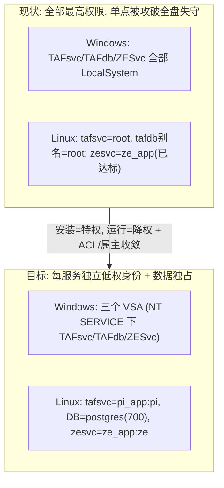
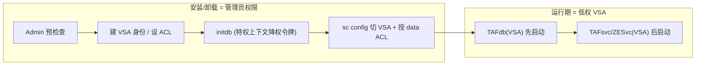
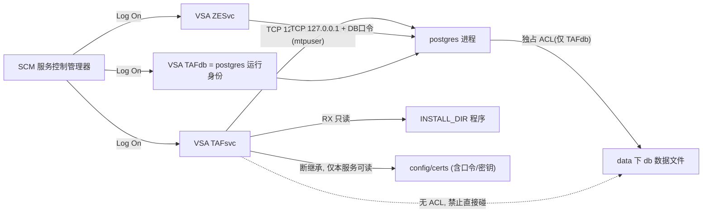
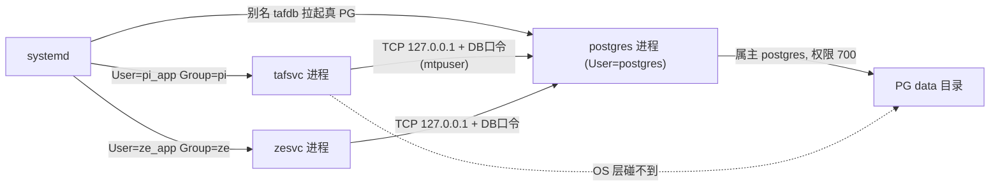
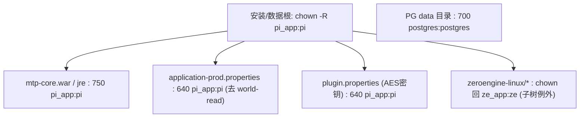

# PI 运行权限最小化解决方案（Windows + Linux）

> 最后更新：2026-07-21
> 对应任务：[类别一 · 运行权限最小化（IA-02-03）](../01-remediation-task-ledger.md)（见任务 1-1）。
> 需求定义：[secure-requirements-definitions.md](../requirements/secure-requirements-definitions.md)（IA-02-03）。
> 背景知识与选型讨论（为什么这么选）：[background/windows-account-and-isolation-primer.md](background/windows-account-and-isolation-primer.md)。
>
> **来源与重要提示**：
> - 第一部分（Windows）是对同事一套 **Windows 运行权限 POC 设计文档**的**梳理与摘录**（原文未纳入本仓库，留在 OneDrive `security-fix/doc/windows-runtime-permission-design/`，共 7 篇 00~06）。
> - 该套内容源自同事**在 PI4.0 阶段、借 PI3.0 环境（MongoDB，服务 `TAFdb`=`mongod.exe`）对 Windows 运行权限做的 POC 验证**——所以其技术细节是 MongoDB 栈。**PI4.0 正式栈已是 PostgreSQL，并新增 Zero Engine 服务 `ZESvc`**。因此其"思想/账户模型/ACL/流程/错误码"可直接沿用，但**引擎相关的技术细节（mongod/mongodump、`tafdb.cfg`、Mongo 认证）需按 §1.8 映射到 PI4.0 正式栈**。
> - 第二部分（Linux）已定稿（2026-07-21）：`pi_app`/`pi` 降权、DB 认发行版 `postgres`、文件权限收敛，见 §2。

---

## 0. 目标与范围

| 项 | 内容 |
|----|------|
| 合规项 | IA-02-03（Identification and Authentication）：应用不应长期以管理员/最高权限运行；日常运行与高危操作应分权 |
| 目标 | 安装/卸载用管理员；**运行期**改为专用低权限账户；进程隔离 + 目录 ACL 收敛 |
| 范围（本轮） | PI 本体三层闭环：**服务降权 + 敏感文件权限 + DB 角色**；**不含**应用层 RBAC（PI 已用 Spring Security，本轮不动） |
| 平台 | Windows（§1，来自同事设计）+ Linux（§2，已定稿 2026-07-21） |
| 现状（Windows，2026-07 审计） | `TAFdb` / `TAFsvc` / `ZESvc` **全部 `StartName=LocalSystem`** → 🔴 违反最小权限 |

**全景：现状 vs 目标（Windows + Linux）**



> 图注：左右两 OS 同一思想——安装/卸载才用最高权限，运行期一律降到"每服务一个独立低权身份"，并把数据文件独占给数据库身份。

---

## 1. Windows 运行权限方案（源自同事的 Windows 运行权限 POC 梳理：PI4.0 阶段、用 PI3.0/MongoDB 环境验证）

### 1.1 核心思想

1. **安装 ≠ 运行**：安装/卸载必须 Administrator（建用户、注册服务、设 ACL、写 Program Files）；**运行期**改用专用低权限本地账户。
2. **一服务一账户 + 进程隔离**：主业务与数据库分别用**不同**账户运行，任一进程被攻破不会直接拿到另一进程/数据的权限。
3. **无本地组，按用户授 ACL**：不建 `vertiv_pi_grp`（POC 中的老做法已废弃）；安装目录"共享只读"由对每个服务账户**分别** grant 实现。
4. **安全逻辑走 IA `CustomAction` + `taf-installer-customcode.jar`**：建用户、配 Log On、设 ACL、自检都在 Java Custom Code 里做；**放弃**把 `PiWindowsSecurity.ps1` 打进安装包再 `powershell -File` 调用的试点（已从仓库移除）。
5. **凭据不落明文**：服务账户随机密码只存 IA 变量（`$PI_SVC_PASSWORD$` 等），**禁止**写安装日志、**不**落 `pi-svc-secrets.json`。

### 1.2 账户模型

POC 设计（两服务两账户）：

```text
vertiv_pi     → 运行 TAFsvc（主业务 WAR + plugins）
vertiv_pi_db  → 运行 TAFdb（mongod.exe，数据库）
```

账户规范（两账户同规范、独立密码）：

| 属性 | 值 |
|------|-----|
| 组成员 | **Users**（**不在** Administrators） |
| 密码 | 安装器随机生成（≥20 字符），写入 SCM，不落明文 |
| 密码策略 | Password never expires；User cannot change password |
| 登录限制 | Deny logon locally；Deny RDP |
| 特权 | 仅授 **Log on as a service** |

账户来源三种模式：

| 模式 | 场景 | 做法 |
|------|------|------|
| **A 自动创建**（默认） | workgroup / 单机 | 安装器（Admin）`CustomAction SetupAccounts` 建本地用户 + 随机密码 |
| **B IT 预建**（域环境） | 域成员 / 安全基线严格 | AD 域用户或 gMSA，安装器只校验 + 配服务 + 设 ACL |
| **C 向导手动指定** | 静默/受管 | 传入账户名，校验存在且具 Log on as a service |

> **企业环境风险（同事重点强调）**：即便以 Administrator 运行，GPO / AppLocker / WDAC 也可能禁止创建本地用户、禁止授"作为服务登录"、拦截 `net.exe`/`icacls`/注册服务。域环境应走**模式 B**，不可依赖模式 A。失败码 `PI-WIN-002`（建用户）、`PI-WIN-021`（服务登录权）。

### 1.3 目录结构与 ACL（摘录）

双主目录：`<INSTALL_DIR>`（`$USER_INSTALL_DIR$`，程序/JRE/DB 二进制）与 `<DATA_DIR>`（`$USER_MAGIC_FOLDER_2$`，db/log/backup，可 ChooseFolder 改路径）。约束：两目录不能相同。

ACL 矩阵（POC/MongoDB 栈，权限：RX=读+执行、R=读、M=改）：

| 路径 | vertiv_pi | vertiv_pi_db | 说明 |
|------|-----------|--------------|------|
| `<INSTALL_DIR>` | RX | RX | 程序只读，任一账户都不得有 M |
| `<INSTALL_DIR>\config` | R | R | 读配置 |
| `<DATA_DIR>\db` | 无 | M | 数据独占（DB 账户） |
| `<DATA_DIR>\log`（业务） | M | — | 主业务日志 |
| `<DATA_DIR>\backup` | M | 无/R | 运行期备份 |

原则：**主业务账户不得对 `db\` 有 M**（否则隔离失效）；ACL 必须在 **ChooseFolder 确定最终 `<DATA_DIR>` 之后**再应用（`PI-WIN-077`）；域机用 `.\` 限定名避免被解析为域主体。

### 1.4 安装 / 卸载流程要点

**安装期特权 vs 运行期降权**



> 图注：只有安装/卸载才用管理员；关键顺序是 ChooseFolder 后设 ACL、DB 服务先于主服务、服务 `--install` 后必须 `sc config` 切到 VSA（否则回落 LocalSystem）。

- **全新安装**：Admin 预检查（`PI-WIN-080`）→ 选目录并校验 → `SetupAccounts` → 建 DATA_DIR 子目录 → `SetupDataDirsAndAcls` → 部署 → 装 DB 服务 + `ConfigServiceLogon` → 装主服务 + `ConfigServiceLogon` → 初始化 DB 用户 → 启 DB → 启主服务 → `PostInstallCheck`。
- **关键顺序**：ChooseFolder 后再设 ACL；**DB 服务先于主服务**启动；服务 `--install` 后**必须** `sc config` 改 Log On 账户（否则默认 LocalSystem）。
- **卸载**：默认仅删程序、**保留**数据与账户；仅"删除数据"分支才删 `db/log/backup`（二次确认）；"完全清理"才 `userdel`。

### 1.5 备份与恢复（含技术债）

- 两类备份权限模型不同：**安装备份**由 Admin 执行（可停服务、调 dump 到 `%INSTALLER_TEMP%\iebackup`）；**运行期备份**在主业务账户进程内触发，写 `<DATA_DIR>\backup`，认证用 **DB 应用账户**而非 OS 账户。
- **POC 环境（MongoDB 栈）技术债**：`BackUp_Restore_Windows.bat` 参数写死 `--postgres-service-name postgresql-x64-9.5`，与 POC 的 MongoDB 不符 → 当时目标是"MongoDB 化"。
- ⚠️ **PI4.0 反转**：PI4.0 本就是 PostgreSQL，上述"MongoDB 化"方向不适用；PI4.0 下 `pg_dump`/`pg_restore` + postgres 服务名反而是对的。**备份/恢复整改由其他同事负责（工程内记为 U1）**，本方案不展开，仅保留权限模型（backup 目录 vertiv_pi 可写、优先走 DB 工具而非文件拷贝）。

### 1.6 IA 落地方式与待办

- 载体：与现有 `CheckPortsNeededInUse` 一致——`CustomAction` + `resourceName=taf-installer-customcode.jar`；**禁止** `ExtractToFile` + 外置 ps1。
- 每阶段一个 Custom Code 类（占位命名，`com.avocent.mtp.install`）：`SetupAccounts` / `SetupDataDirsAndAcls` / `ConfigServiceLogon`(DB) / `ConfigServiceLogon`(主) / `VerifyServiceLogon` / `PostInstallCheck`。
- 待办分组与优先级（同事清单，编号 W-xx）：

| 优先级 | 项 | 内容 |
|--------|-----|------|
| P0 | W-01, W-11~13, W-20~22, W-30~34 | IA-02-03 核心：Admin 检查 + 双账户 + ACL + 服务 Log On |
| P1 | W-60~61 | 安装后自检 / 可支持性 |
| P2 | W-50~51, W-70~72, W-80~83 | 备份插件、卸载分支 |

- 错误码体系 `PI-WIN-xxx`（同事 05 篇有 40 个场景 + 汇总表），关键：`PI-WIN-002` 建用户、`PI-WIN-010~013` ACL、`PI-WIN-020~022` 服务 Log On、`PI-WIN-070~077` DATA_DIR、`PI-WIN-080` 非 Admin、`PI-WIN-090~095` 备份；`PI-WIN-WARN-001~003` 合规告警（账户在 Administrators、主账户误持 db 写权、两服务共用账户）。已废弃 `PI-WIN-001/003`（本地组相关）。

### 1.7 发现的问题与差距（当前 vs 目标）

| 主题 | 当前（代码现状） | 目标（本设计） |
|------|------------------|----------------|
| Admin 预检查 | 无（Linux 有 Check for Root） | 安装第一步校验管理员（`PI-WIN-080`） |
| 服务 Log On | 默认 LocalSystem | 专用低权限账户 |
| OS 用户创建 | Windows 未自动创建 | 模式 A 建账户（无本地组） |
| 目录 ACL | 未按服务账户细分 | 按账户分别 grant，`db\` 独占 |
| 企业环境适配 | 无 | 模式 B/C + IT 确认清单 |
| DATA_DIR 风险 | 部分 | UNC/Default profile/改路径均有 preflight + 错误码 |

### 1.8 PI4.0 适配差异映射（关键）

同事 POC 用的是 MongoDB 栈；映射到 PI4.0 正式栈（PostgreSQL）：

| 维度 | 同事 POC（MongoDB 栈） | PI4.0 现状 / 映射 |
|------|-------------------|-------------------|
| 数据库引擎 | MongoDB（`mongod.exe`） | **PostgreSQL** |
| DB 服务 | `TAFdb` = `mongod -serviceName TAFdb` | `TAFdb` = `pg_ctl register`（显示名 Trellis Application Framework Database） |
| 主业务服务 | `TAFsvc` | `TAFsvc`（mtp-core） |
| 新增服务 | 无 | **`ZESvc`（Zero Engine，PI4.0 新增）** |
| DB 配置文件 | `mongod.cfg` / `tafdb.cfg` | `postgresql.conf` / `pg_hba.conf` |
| 备份工具 | `mongodump` / `mongorestore` | `pg_dump` / `pg_restore` |
| DB 应用账户 | `$TAFDB_USER$` / `$TAFDB_ADMIN$`（Mongo auth） | `mtpuser`（运行）/ `mtpadmin`（超级用户）PG 角色 |
| 数据目录 | `<DATA_DIR>\db`（mongo dbPath） | `data\db`（PG data） |
| OS 运行账户（目标） | `vertiv_pi` / `vertiv_pi_db`（2 账户） | 需覆盖**3 个服务** → 见下 |

**PI4.0 服务与运行账户现状（Windows，2026-07 审计）**：

| 服务 | 组件 | 现状 StartName | 目标 |
|------|------|----------------|------|
| `TAFdb` | PostgreSQL | 🔴 LocalSystem | `NT SERVICE\TAFdb`（VSA，见 §1.10） |
| `TAFsvc` | mtp-core 主业务 | 🔴 LocalSystem | `NT SERVICE\TAFsvc`（VSA，见 §1.10） |
| `ZESvc` | Zero Engine（PI4.0 新增） | 🔴 LocalSystem | `NT SERVICE\ZESvc`（VSA，见 §1.10） |

> **PI4.0 方案定稿要点（详见 §1.10）**：
> 1. **`ZESvc` 账户归属**——已定：全线用虚拟服务账户（VSA），每服务天然一个独立身份，见 §1.10 决定 D1。
> 2. **数据目录独占**：PG data 目录（`data\db`）独占授给 `NT SERVICE\TAFdb`；主/ZE 账户不得写。
> 3. **DB 认证映射**：`mtpadmin`/`mtpuser` PG 角色，与本地连接/`pg_hba`、"无密码本地连接"问题联动，属类别二（见任务 2-1 / issue-51、issue-260）；OS 层隔离不替代 DB 层口令治理。
> 4. 备份引擎技术债在 PI4.0 已非"MongoDB 化"（见 §1.5），交由 U1。

### 1.9 与本工程任务书的关系

- 对应 [任务台账 · 任务 1-1](../01-remediation-task-ledger.md)（服务降权 + 敏感文件权限 + DB 角色三层闭环）。
- DB 角色/凭据相关联动：[issue-51](../issues/issue-51-as01-00-admin-user-autoload-password.md)、[issue-260](../issues/issue-260-as01-00-hardcoded-secrets-umbrella.md)。

### 1.10 PI4.0 Windows 账户策略决策（本项目定稿 2026-07-21）

> 本节只记"做了什么决定"；背景知识、选型讨论与"为什么这么选"（含账户类型详解、VSA 收益/局限、VSA vs 本地用户对比、模式 C 做法与影响）见 [background/windows-account-and-isolation-primer.md](background/windows-account-and-isolation-primer.md)。

| # | 决定 | 一句话理由 | 状态 |
|---|------|-----------|------|
| D1 | **默认全线用虚拟服务账户（VSA）**：`NT SERVICE\TAFsvc` / `NT SERVICE\TAFdb` / `NT SERVICE\ZESvc`，每服务一个独立身份 | 绕开"建本地用户"的 GPO 封锁、无密码可管、每服务独立 SID 天然隔离；ZESvc 账户归属随之自动解决 | 已定 |
| D2 | **安装必须以管理员运行** + 安装早期加 Admin 预检查（对应 `PI-WIN-080`） | 建/配服务、设 ACL、写 Program Files 都需管理员；运行期才降权 | 已定 |
| D3 | **Windows 下不新建本地用户组**（去组化，按主体直授 ACL） | 粒度更细、审计透明、无组残留（废弃 `vertiv_pi_grp`；`PI-WIN-001/003` 作废） | 已定 |
| D4 | **tafdb 落地** = 装时特权上下文跑 initdb → `icacls` 授 `NT SERVICE\TAFdb` → `sc config obj="NT SERVICE\TAFdb" password=""` → 启动 | 不以无密码 VSA 跑 initdb，避开编排难点；复用同事"装后 `sc config`"套路（`PI-WIN-022`） | 已定，待 PoC |
| D5 | **PI 只提供 VSA 最小权限地基**；公布"每服务最小权限清单"；客户自行叠加审计/限制（SACL / Deny ACE / AppLocker / SIEM） | VSA 是有独立 SID 的正经主体，客户可在其上加固，PI 不需介入 | 已定 |
| D6 | **放弃模式 B（自建 gMSA/域账户主路径）**；**模式 C（手动指定账户）本轮不做，仅登记为逃生口** | PI 为单机/localhost 架构，模式 C 使用场景少；未来遇"具名/域账户强制要求"或"远程集成认证"再启用 | 已定 |

**Windows 目标账户与隔离架构**



> 图注：三服务各跑在自己的 VSA 上；主/ZE 服务访问库只能走回环 TCP + DB 口令（不碰磁盘库文件），data\db 独占授给 TAFdb，config/certs 断继承后仅对应服务可读。

**VSA 账户命名说明**：VSA 名 = `NT SERVICE\<服务注册名>`，与服务短名一一对应、**不能单独命名**（要改只能改服务名）。PI 三服务固定为 `TAFsvc` / `TAFdb` / `ZESvc`，因此账户名无需另行发明。

**网络身份适用性**：VSA 对外表现为机器账户 `MACHINE$`。对 PI 现状（库在 `127.0.0.1`、DB 走口令认证、备份写本地）**无影响**；仅在未来"远程库用 Windows 集成认证"或"备份写远程 SMB 共享"等场景才需改走模式 C（详见 primer）。

#### 1.10.1 三种模式：同事设想 vs 我方最终决定

| 模式 | 同事设想中的定位 | 我方最终决定 |
|------|------------------|--------------|
| A · 安装器自动建本地用户（`vertiv_pi`/`vertiv_pi_db`） | workgroup / 单机**默认** | **不采用**：要建用户（GPO 易拦）+ 管随机密码（泄露面），正是本次想消灭的痛点 |
| B · IT 预建 gMSA / 域账户 | 域环境推荐 | **放弃**：部署门槛高（KDS/AD），PI 单机场景用不上 |
| C · 向导/静默手动指定账户 | 静默/受管可选 | **本轮不做，仅登记为逃生口**：备将来强治理/远程认证需求 |
| （新）全线 VSA | 同事仅列为"不想管密码时"的备选 | **选定为默认**：无需建用户、无密码、每服务独立 SID、绕开 GPO |

#### 1.10.2 待办与风险

- **PoC（必须）**：tafdb 以 `NT SERVICE\TAFdb` 在 **Windows Server 2022 / 2025** 各验一次（装时 initdb → 切 VSA → 启动读写）。PoC 不通则 tafdb 单独退回本地用户，tafsvc/ZESvc 仍用 VSA。
- **风险（环境相关，非 VSA 独有）**：GPO 若"硬性集中管控 Log on as a service"、AppLocker/WDAC 拦 `icacls`/`sc`/安装器，仍可能失败；域/受管环境届时走模式 C。
- **与类别二耦合**：本决策只解决 OS 层运行身份隔离；DB 仍是 `--auth=trust`/本地无密码，需类别二治理（交叉引用 [issue-51](../issues/issue-51-as01-00-admin-user-autoload-password.md)、[任务 2-1](../01-remediation-task-ledger.md)）。**OS 层隔离不替代 DB 层口令治理。**
- **模式 C 的具体做法、实现复杂度与影响**分析见 primer（本轮只登记、不实现）。

#### 1.10.3 改动点落地索引（现网 `TAFCore.iap_xml`，后续启动时再具体做）

> 只给"落在哪里"的范围，附现网 objectID/大致行号，供后续实现定位；本轮不改代码。全部 Windows-only，不触及 Linux 链。

| 决定 | 落点（节点 / 大致位置） | 改动性质 | 影响面 |
|------|------------------------|----------|--------|
| D1 · TAFdb→VSA | Exec「PostgreSQL initdb + pg_ctl register -N TAFdb」(~26106)：`pg_ctl register -N TAFdb && sc config TAFdb DisplayName=…` 之后追加 | 改现有（追加 `sc config TAFdb obj="NT SERVICE\TAFdb" password=""`） | 小 |
| D1 · ZESvc→VSA | ExecuteScript `d82cc271b581`「copy nginx + setup ze services」(~29970)：`ZESvc.exe -install` / `sc config ZESvc start= auto` 附近追加 | 改现有（追加 `sc config ZESvc obj="NT SERVICE\ZESvc" password=""`） | 小 |
| D1 · TAFsvc→VSA | 同脚本 `TAFsvc.exe -install`(~29975) 之后；且须在 createdb Exec 的 `net start TAFsvc`(~26291) **之前**切好账户 | 改现有（追加 `sc config TAFsvc obj="NT SERVICE\TAFsvc" password=""`）+ 注意顺序 | 小 |
| D4 · tafdb 数据目录授权 | 同 initdb Exec(~26106)，`register` 后、启动前 | 新增 `icacls "<data\db>" /grant "NT SERVICE\TAFdb:(OI)(CI)M"` | 小 |
| D5 · 目录/文件 ACL 收敛 | 全工程当前**无任何 `icacls`**，且审计实测敏感文件被 `BUILTIN\Users` 继承读（见 §1.10.4）→ 需新增一组：`INSTALL_DIR` 对三 VSA 授 RX、`config`/`certs`/`log`/`backup` 分权 + 断继承 | 全新（新 Exec 或 CustomAction，Windows 规则门控，放 ChooseFolder 定稿之后） | 中 |
| D2 · 安装管理员预检查 | Windows 当前**无**等价项（Linux 有「Check for Root」~4310）→ 安装早期新增 | 全新（Windows-only 预检查 + 失败中止对话框） | 中 |
| D3 · 不建本地用户组 | grep 证实全工程**无 `net localgroup`/无建用户** | 无需改（保持现状、别引入） | 无 |
| D6 · 模式 B/C | — | 不做（仅登记） | 无 |

**两条实现路线**：
- 路线甲（最小改动）：把 `sc config` / `icacls` 几行直接**追加进现有 Exec/批处理**（26106、29970 两块），最快、最省，但安全逻辑散在 inline 批处理里。
- 路线乙（对齐同事设计）：新增 `CustomAction`，复用现有 `CheckPortsNeededInUse`（objectID `cc86fc84a02e` ~8582）+ `taf-installer-customcode.jar` 载体，把"配服务账户 + 设 ACL + 自检"收进 Java，更规整可测，但要动 jar 与构建。

**涉及文件**：主改 `TAFCore.iap_xml`；可选 `taf-installer-customcode.jar`（仅路线乙）；文档 `InstallReadme.txt/html`（补"安装需管理员" + "每服务最小权限清单"）；不涉及 Linux/脚本/其他 installables。

### 1.10.4 Windows 文件/目录 ACL 现状与收敛（据 2026-07 审计）

> 回答"为什么 Linux 逐文件问了权限、Windows 没问"——不是不需要，而是两套权限模型不同、且同事 POC 已给过目录级矩阵；这里把 PI4.0 实测发现补齐。

**背景差异（你可能忽略的知识点）**：

- Windows **没有 Unix 权限位、没有"other/世界"位**，权限走 **ACL + 继承**：常规做法是在**目录级**设 ACL、子项自动继承，而不像 Linux 逐文件设 `chmod`。同事 POC 的 02 文档已给出目录级 ACL 矩阵（本文 §1.3），所以它**不是需要逐文件与你敲定的开放项**。
- Linux 那边则有大量 `644 root:root` 的 world-readable 具体文件、又没有现成矩阵，才必须逐条与你确认（§2.5）。
- **但风险是对称的**：Windows 上"world-readable"的等价物 = `BUILTIN\Users` / `Authenticated Users` 对敏感文件有 **Read**（且多为从父目录**继承**而来，不是显式授的）。

**PI4.0 审计实测（`E:\software\PI4.0`）确有此问题**（审计脚本"类别一-3"）：

| 对象 | 现状 ACL | 目标 |
|------|----------|------|
| 安装根 `E:\software\PI4.0` | `Authenticated Users:(M)`、`BUILTIN\Users:(RX)`（继承） | 收敛：去掉 Authenticated Users 写、按 VSA 分别授权 |
| `main\config\application-prod.properties`（**含 DB 口令**） | `BUILTIN\Users:(I)(RX)` | 断继承，仅 `NT SERVICE\TAFsvc` 可读 |
| `main\certs\keystore.p12` | `BUILTIN\Users:(I)(RX)` | 断继承，仅 `NT SERVICE\TAFsvc` 可读 |
| `main\zeroengine\config\application-prod.properties` | `BUILTIN\Users:(I)(RX)` | 断继承，仅 `NT SERVICE\ZESvc` 可读 |
| `main\zeroengine\certs\keystore.p12` | `BUILTIN\Users:(I)(RX)` | 断继承，仅 `NT SERVICE\ZESvc` 可读 |

**收敛做法**：对敏感文件/目录 `icacls "<path>" /inheritance:r`（断继承）再 `/grant` 只给对应 VSA；写权限（`log`/`backup`）单独授。这归入 **D5**"最小权限地基"落地，改动点并入 §1.10.3 的"D5 目录/文件 ACL 收敛"，与 Linux §2.5 对称。

> 注：这些敏感文件里的**明文口令/固定密钥**本身属"类别二·加解密体系"（见 `01-remediation-task-ledger.md` 任务 2-1）；ACL 收敛只是把"谁能读到"锁小，二者叠加才闭环。

---

## 2. Linux 运行权限解决方案（定稿 2026-07-21）

> 与 Windows 不同，Linux 用 **user + group + 属主/权限位（chown/chmod）** 做隔离，组是常规手段。`zesvc` 已是范例（`User=ze_app`），本轮把 tafsvc 降权、收敛敏感文件权限，DB 认发行版 `postgres`。仅 RHEL/Ubuntu；不为纯 Debian 做额外处理。

### 2.1 现状（2026-07 RHEL/Ubuntu 审计实测）

| 服务 | 组件 | 现状运行身份 | 判定 |
|------|------|--------------|------|
| `zesvc` | Zero Engine | `User=ze_app`（组 `ze`） | 已达标（对齐范例） |
| `tafsvc` | mtp-core 主业务 | root（unit 无 `User=`） | 需降权 |
| `tafdb` | PostgreSQL 别名 | root（oneshot `/bin/true`） | 空壳别名，见 §2.4（伪报） |
| 真 PG（RHEL `postgresql-18`） | PostgreSQL | `User=postgres` | 已达标（见 §2.3） |
| 真 PG（Ubuntu `postgresql@18-main`） | PostgreSQL | unit `User=` 空，但 postmaster 实际降权到 `postgres`（`ps` 为准） | 已达标（见 §2.4） |
| DB 角色 `mtpadmin` | — | `superuser=true` | 类别二（DB 角色治理，非本节） |
| 敏感文件 | 配置/证书/凭据 | 大量 `root:root` 且 world-readable | 需收敛（§2.5） |

**关键发现**：IA **仍在创建 `tafusr`/`tafgrp` 并已 chown**（install/config/data 三处），但 `taf-core-installer/.../Unix/postgresql/pi-linux-install.sh` 第 7 步新建的 `tafsvc.service` **没写 `User=`** 而回退 root。历史 SysV `TAFsvc.sh` 本来是 `su tafusr -c "java ..."`——所以 tafsvc 降权 = **把丢掉的 `User=` 在 systemd 单元里补回来**。

### 2.2 账户模型决策（定稿）

| # | 决定 | 说明 |
|---|------|------|
| L-D1 | **tafsvc 运行用户 = `pi_app`，主组 `pi`** | 由现有 `$TAF_UG_1$` 默认值 `tafusr`→`pi_app`、`$TAF_UG_2$` 默认值 `tafgrp`→`pi` 改名；`tafsvc.service` 补 `User=pi_app`/`Group=pi` |
| L-D2 | **创建 `pi_db`（组 `pi`）** | 应你要求为命名一致性而建；但 Linux 上 PI 不自跑 postgres，`tafdb` 为空壳别名，**`pi_db` 无常驻服务进程**（见 §2.4），仅作命名/属主占位 |
| L-D3 | **不建跨服务共享组** | 组 `pi` 仅 PI 家族（pi_app/pi_db）用，且只作主组、不做跨服务共享读写；ZE 保持 `ze_app:ze`；DB 保持 `postgres` |
| L-D4 | **敏感文件权限收敛** | 去 world-read，`chown pi_app:pi` + `chmod 640/750`；**ZE 子树保持 `ze_app`**（chown 顺序，见 §2.5 要点） |
| L-D5 | **DB 运行身份认发行版 `postgres`** | RHEL/Ubuntu 均达标（§2.3/§2.4），本轮不改 DB 引擎运行账户 |

**Linux 目标账户与隔离架构**



> 图注：与 Windows 同构，只是实现换成 user/group + 属主。tafsvc 降到 pi_app、zesvc 保持 ze_app、DB 认发行版 postgres（data 目录 700）；跨服务访问库同样走回环 TCP + DB 口令，OS 层碰不到库文件。

### 2.3 为什么发行版 `postgres` 算达标（数据文件安全）

- postmaster/backend 以专用低权用户 **`postgres`** 运行，非 root；
- 数据目录（RHEL `/var/lib/pgsql/18/data`）属主 `postgres:postgres`、权限 **`700`**——除 postgres/root 外谁都读不了原始库文件；
- 结果：DB 引擎非 root（被攻破只得 postgres 有限权限），其他服务用户（pi_app/ze_app）OS 层碰不到库文件，只能走 `127.0.0.1:5432` + DB 口令的正门。这正是"运行身份最小化 + 数据文件机密性"，发行版开箱即给。

### 2.4 `tafdb` 别名 与 Ubuntu 说明

- `tafdb.service` 是 **oneshot**：`Type=oneshot` + `RemainAfterExit=yes` + `ExecStart=/bin/true` + `Requires=<真PG>`。它自身什么都不干，只为让 `systemctl start tafdb` 顺带拉起真 PG，使 RHEL/Ubuntu 运维命令统一。**没有常驻 root 进程**，审计的"tafdb=root"是 **wrapper 伪报**。
- RHEL：真 PG = `postgresql-18`（`User=postgres`）。
- Ubuntu：`postgresql.service` 是空壳 meta 单元；真单元 `postgresql@18-main` 的 systemd `User=` **显示为空**，但 postmaster 由 `pg_ctlcluster` 启动后**降权到 `postgres`**——以 `ps -o user=,args= -C postgres`（实测为 `postgres`）为准，故**达标**；审计对 unit `User=` 的读数是伪报。
- `pi_db` 若设为 `tafdb.service` 的 `User=`，只是给 `/bin/true` 换个跑者（装饰性）；保留 `pi_db` 作命名/属主，`tafdb` 维持现状。

### 2.5 文件权限矩阵（据 RHEL 审计报告）

mtp-core（`pi_app`）实际涉及目录：

| 目录 / 文件 | pi_app 需要 | 现状 | 目标 |
|-------------|------------|------|------|
| `/opt/trellisappmgr`（mtp-core.war、jre、createdb.sql） | 读+遍历 | `764 root:root` | pi_app 可读遍历（chown 已覆盖，**排除 ZE 子树**） |
| `/etc/opt/powerinsight/application-prod.properties`（**含 DB 口令**） | 读 | `764 root:root`、world-readable | `640 pi_app:pi`，去 world-read |
| `/etc/opt/powerinsight/postgresql.conf` | 读 | `764 root:root` | `640 pi_app:pi` |
| `/var/opt/powerinsight/**`（数据、plugins） | 读写 | 大量 `644 root:root` world-readable | `chown -R pi_app:pi`，目录 `750`、文件 `640` |
| mtp-core 运行日志目录 | 写 | root | pi_app 可写 |

**必须收紧的真敏感文件**（其余 `locale/messages_*`、`jre/conf/*` 属噪音，非机密）：
- `/etc/opt/powerinsight/application-prod.properties`（DB 口令）
- `/opt/trellisappmgr/_installation/installvariables.properties`（安装变量，含敏感）
- `/var/opt/powerinsight/system/data/p1/taf-plugin-backuprecovery/1/plugin.properties`（**写死 AES 密钥**）
- ZE 侧（归 `ze_app`，不归 pi）：`/opt/trellisappmgr/zeroengine-linux/certs/keystore.p12`、`.../config/application-prod.properties`

**两个要点**：
1. **chown 管道已存在**：IA 已对 `$USER_INSTALL_DIR$`/`$USER_MAGIC_FOLDER_1$`/`$USER_MAGIC_FOLDER_2$` 做 `chown -R`；改名后自动归 pi_app:pi。缺的是**去 world-read 的 chmod 收紧** + **unit 真的以 pi_app 跑**。
2. **ZE 子树冲突**：`/opt/trellisappmgr/zeroengine-linux/*` 属 ze_app，却在 `$USER_INSTALL_DIR$` 下，会被 `chown -R pi_app` 一起改走——须保证 **ZE 的 chown 在 pi_app 的 `chown -R` 之后**（或排除该子树）。

**文件属主/权限收敛示意**



> 图注：收敛动作 = 现有 `chown -R pi_app:pi` 之上补 `chmod` 去 world-read（config/密钥 640、目录 750）；ZE 子树须在其后 chown 回 ze_app；PG data 目录本就 700 postgres，不动。

### 2.6 RHEL 与 Ubuntu 差异

- PG 单元名/数据目录：RHEL `postgresql-18` + `/var/lib/pgsql/18/data`；Ubuntu `postgresql@18-main` + `/var/lib/postgresql/18/main`。
- Ubuntu `postgresql.service` 空壳 meta 单元 `User=` 空为伪报（§2.4）；不为纯 Debian 做额外处理。
- `tafdb` 别名的 `Requires=` 指向各自的 `$PG_SERVICE`。

### 2.7 与 Windows 方案的对齐点

- 隔离思想一致：安装=特权、运行=低权限、每服务独立身份、数据独占。
- 实现手段不同：Linux 用 user/group + 属主（chown/chmod），Windows 用按用户 ACL（无本地组）。

### 2.8 改动点落地索引（现网，后续启动时再具体做）

> 仅给范围，附现网 objectID/文件位置；本轮不改代码。仅 RHEL/Ubuntu，不触及 Windows 链。旧备份 `.iap_xml`（`.2022.196`/`.2017.677`）不处理。

| 决定 | 落点 | 改动性质 |
|------|------|----------|
| L-D1 · 用户/组改名 | `TAFCore.iap_xml` 13150/13172、13388/13410 默认值 `tafusr→pi_app`、`tafgrp→pi`；locale `custom_en` 343/349/475/481 + Exec（716/722/728/734 `groupadd`/`useradd`/`chown`）；`silentsample.txt` 51/55；卸载 `userdel`/`groupdel`（iap 22934/23008）自动跟随 | 改现有（改默认值，变量名 `$TAF_UG_1/2$` 可保留） |
| L-D1 · tafsvc 降权 | `taf-core-installer/.../Unix/postgresql/pi-linux-install.sh` 第 7 步 `tafsvc.service` 补 `User=pi_app`/`Group=pi`；数据/日志 pi_app 可写（chown 已覆盖 `$USER_MAGIC_FOLDER_2$`） | 改现有（unit 加 2 行 + 确保写权限） |
| L-D2 · 建 pi_db | locale `custom_en` 的 `useradd` Exec 旁新增第二个 `useradd pi_db -g pi`（或新 Exec）；卸载加 `userdel pi_db` | 新增（小；注意 pi_db 无常驻进程） |
| L-D4 · 文件权限收敛 | 现有 `chown -R` 之后新增 `chmod`（去 world-read、640 config、750/640 data），并保证 **ZE 子树在其后 chown 回 ze_app** | 新增（一段 chmod/chown 收尾） |
| L-D5 · DB | 不动（认 `postgres`）；`tafdb` 别名维持现状 | 无 |
| 历史隐患 | 确认**不重新引入** `tafusr/pi_app NOPASSWD sudo`（旧 `.2022.196` 曾有 `$TAF_UG_1$ ALL=(ALL) NOPASSWD: ALL`，当前活跃版本已无） | 校验项 |

---

## 附录 A · PostgreSQL 用户/认证现状与远程连接策略（参考·未定稿）

> 🟡 **状态：参考·未定稿**（2026-07-20 讨论产出，从任务台账迁入，供决策参考，非最终方案）。
> **范围边界**：本附录讲的是 **DB 认证模式与部署/远程连接策略**（peer/trust/scram、`pg_hba`、远程放行），属运行/部署层；与"明文口令 → 动态生成加密存储"的**类别二口令治理**（见 [任务台账 · 任务 2-1](../01-remediation-task-ledger.md)）互补、不重叠。
> **编号说明**：本附录内的 `DB-D1/DB-D3/DB-D5` 是**独立的"DB 连接决策"编号**，与正文 Windows `D1~D6`（§1.10）、Linux `L-D1~L-D5`（§2.2）**不是同一套**，勿混。其中 **DB-D5（保留 `mtpadmin` 现状、不做角色收敛）** 与正文 §2.1「DB 角色治理非本节」、§1.10 的取向一致。

### A.1 PostgreSQL 用户/认证现状（已核验，来自安装器代码）

- Windows `taf-core-installer/src/main/TAFCore.iap_xml` L26106：`initdb -U mtpadmin ... --auth=trust` → `mtpadmin` **是** Windows 集群引导超级用户，**无 `postgres` 角色**。
- Linux `taf-core-installer/src/main/resources/installables/Unix/postgresql/pi-linux-install.sh` L199-209：发行版 initdb 默认超级用户 `postgres` + 脚本额外 `CREATE ROLE mtpadmin WITH LOGIN SUPERUSER` → **两个超级用户**；`mtpuser` 为普通运行角色。

| 角色 | Windows | Linux(RHEL/Ubuntu) | 权限 | 用途 |
| :--- | :--- | :--- | :--- | :--- |
| `postgres` | 不存在（被 `-U mtpadmin` 顶替） | 存在，发行版引导超级用户 | SUPERUSER | Linux 本地 provisioning（`su - postgres`） |
| `mtpadmin` | 引导超级用户(=改名的 postgres) | 额外新建的第二个 SUPERUSER | SUPERUSER | 跑 `createdb.sql`、被 app 当"admin"连 |
| `mtpuser` | app 运行角色，`mtp` 库 owner | 同 | 普通(非超级) | 运行时 JDBC 连接 |

- **为何 Linux 不像 Windows 那样把 `postgres` 改名为 `mtpadmin`（补充结论）**：Linux 集群为发行版托管，① **peer 认证按 OS 用户名映射同名角色**（改名后 `sudo -u postgres psql` 连不进，需建 OS 用户 `mtpadmin` 或配 `pg_ident.conf`）；② 发行版工具链（`pg_ctlcluster`/`pg_lsclusters`/`postgresql-setup`/`pg_upgrade`/备份）依赖 `postgres` 角色存在。→ **维持"postgres + 额外 mtpadmin"现状，不改名**。

### A.2 认证模式速查（`pg_hba.conf` 末列）

- `peer`（Linux 本地 socket 默认）：用 OS 身份认证，`su - postgres` 免口令。
- `trust`：完全不验、免口令（Windows `initdb --auth=trust` 即此，仅本地范围）。
- `scram-sha-256`：现代口令认证（PG10+，远程用）；`md5`：旧式较弱。
- 行首：`local`=Unix socket、`host`=TCP、`hostssl`=TCP 且强制 TLS。
- → "本地 provisioning 免口令"来自 trust/peer；`mtpuser` 运行时走 `host+scram` **要口令**。
- **DB-D3 已定：不再考虑无密码连接 DB** —— 运行时/远程一律口令认证；peer/trust 仅限本机 provisioning 窗口。

### A.3 DB 远程连接策略（含指令示例）

- 默认（DB-D1）：`mtpadmin` 与 `postgres` **一律仅本地**；仅合法运维改 `pg_hba` 白名单放行 **`mtpuser` 远程**，**`postgres` 永远只本地**。
- 首选零暴露：`ssh dbhost && sudo -u postgres psql`（peer 免口令、网络零暴露）。
- 万不得已放超级用户的应急四步：

```sql
-- 1) 超级用户先设口令（远程口令认证必须）
ALTER ROLE postgres WITH PASSWORD '<强随机>';
ALTER ROLE mtpadmin WITH PASSWORD '<强随机>';
```

```conf
# 2) postgresql.conf
listen_addresses = 'localhost,10.0.0.5'   # 本机内网IP，勿用 '*'
ssl = on
ssl_cert_file = 'server.crt'
ssl_key_file  = 'server.key'
```

```conf
# 3) pg_hba.conf（具体规则在前、兜底在后）
hostssl all mtpuser  10.0.0.20/32 scram-sha-256   # 优先只放非特权运行账户
hostssl all postgres 10.0.0.30/32 scram-sha-256   # 超级用户万不得已才放，限单IP/32
host    all all      0.0.0.0/0    reject           # 兜底拒绝
```

```bash
# 4) 防火墙时限化（RHEL 例）+ reload
firewall-cmd --add-rich-rule='rule family=ipv4 source address=10.0.0.30/32 port port=5432 protocol=tcp accept' --timeout=3600
sudo -u postgres pg_ctl reload -D <PGDATA>
```

- 优先 **SSH + 本地 peer** 或**新建受限非超级用户管理角色**，而非暴露超级用户。远程一律 `hostssl`（`sslmode=verify-full`）；与类别二 **[任务 2-2 唯一证书](../01-remediation-task-ledger.md)** 相关联（服务端证书须先"每实例唯一"，远程 TLS 才有意义）。
- **未采纳的参考选项存档**：曾讨论"去 mtpadmin"两方案——A) 界面默认值改 `postgres`；B) 删除 admin 用户/口令输入项、内部用 `postgres`(peer)/`initdb -U postgres` 供给。因 **DB-D5 保留 mtpadmin 现状**，本轮**不采纳**，仅存档备查。

### A.4 权限阶梯（澄清 mtpadmin 非"受限管理角色"）

| 能力 | mtpuser（mtp 库 owner） | 受限管理角色(设想) | mtpadmin/postgres(SUPERUSER) |
| :--- | :---: | :---: | :---: |
| mtp 库内增删改查/DDL | ✅ | ✅ | ✅ |
| 访问/改其它数据库 | ❌ | ❌ | ✅ |
| `COPY ... FROM/TO 文件`（读写磁盘） | ❌ | ❌ | ✅ |
| `CREATE/ALTER/DROP ROLE` | ❌ | 视授权 | ✅ |
| `ALTER SYSTEM`/改配置/复制 | ❌ | ❌ | ✅ |
| 绕过 GRANT/RLS 检查 | ❌ | ❌ | ✅ |

> 现状 `mtpadmin` = **改名/额外的完整超级用户**，并非受限管理角色；若将来需远程库管，应**另建** NOSUPERUSER 受限角色，而非复用 mtpadmin。
