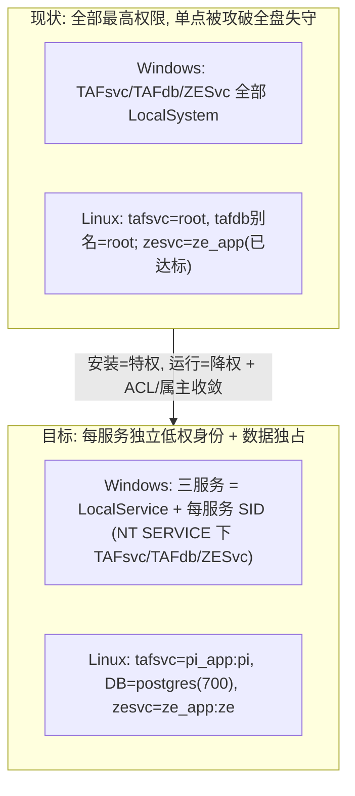
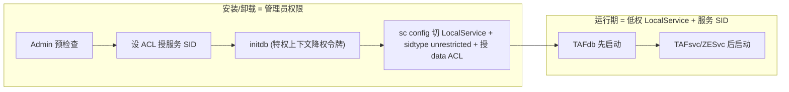
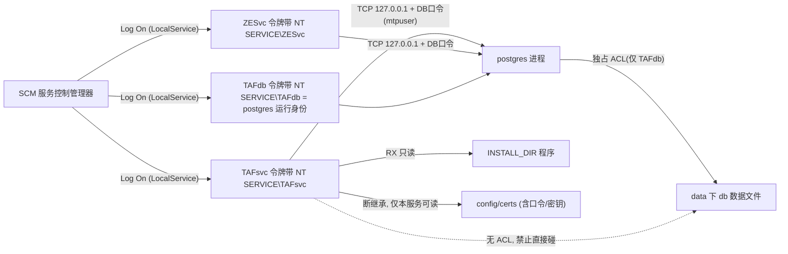
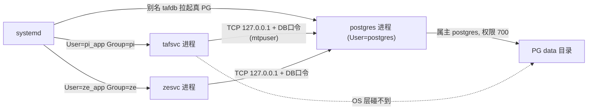
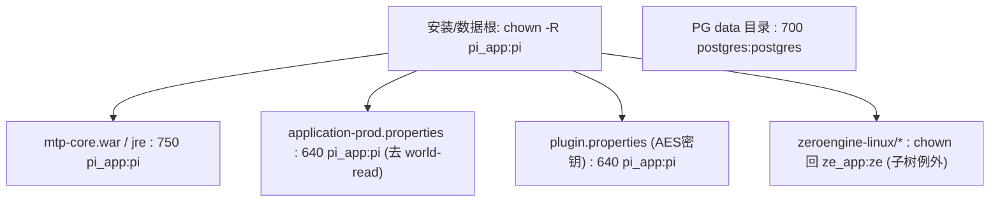

# PI 运行权限最小化解决方案（Windows + Linux）

> ✅ **TL;DR · 现行方案（先看这个）**
> - **Windows**：三服务（TAFsvc/TAFdb/ZESvc）登录身份统一 `NT AUTHORITY\LocalService` + 每服务 `sc sidtype unrestricted`（令牌带唯一 `NT SERVICE\<svc>`）；文件/目录 ACL 断继承、仅授对应服务 SID；PGDATA 独占 TAFdb。详见 §1.10。
> - **Linux**：`tafsvc`=`pi_app:pi`、DB 认发行版 `postgres`（data 700）、`zesvc`=`ze_app:ze`；敏感文件 `chown pi_app:pi`+`chmod 640/750` 去 world-read；WAR 属主 `root:pi`/`root:ze`（运行账户只读）。详见 §2。
> - **回滚 / 中途失败清理**（跨平台）见 §3；**备份恢复(U1)交汇**见 §4；**ZE 绑 162 端口**见 §5 + [primer Q6](background/windows-account-and-isolation-primer.md)；**DB 远程连接**见附录 A。
> - **基线**：Windows 门禁 `pi-security-validate-windows.ps1` **53/0**；Linux `pi-security-validate-linux.sh` 各 **35/0**。
>
> 🔖 **编号图例（三套决策编号并存、勿混）**：Windows `D1~D6`（§1.10）· Linux `L-D1~L-D5`（§2.2）· DB 连接 `DB-D1/D3/D5`（附录 A）。
>
> 📝 **2026-08-14 文档重排（不改结论、只理结构）**：新增顶部 TL;DR + 编号图例；Windows POC 旧内容（账户模型/ACL 矩阵/待办与错误码/差距表）精简下沉至[附录 B](#附录-b-windows-poc-设计留痕精简)，§1.2/1.3/1.5/1.6/1.7 改为指向现行方案（§1.10）的 stub；回滚清理由 §2.9 提级为跨平台 **§3**、备份交汇顺延 **§4**；ZE 绑 162 独立为 **§5**（原理迁入 [primer Q6](background/windows-account-and-isolation-primer.md)）；删 §1.8 与 §0 重复的服务现状表。
> 📝 **2026-08-14 二次整理**：删除原 §1.10.3（Windows 改动点落地索引）与原 §2.8（Linux 改动点落地索引）——实际落地以 [roadmap](../02-implementation-roadmap.md) 为准；**原 §1.10.4（文件/目录 ACL 收敛）顺延补号为 §1.10.3**（无编号缺口，引用已同步）；Windows 实机失败复盘由原 §1.10.5 迁入**附录 C**（标注仅 Windows 侧遇到）；**附录 A** 转"定稿"、删 A.2/A.3（远程连接实操改指 [qa-impact 附录 C](../qa-impact-and-regression-scope.md#附录-c--开启数据库远程连接windows--linux-实操)）、DB-D1/D3/D5 决策折叠入抬头。相关按号引用已跨文件同步。
>
> 最后更新：2026-08-12（Windows LocalService+服务SID 已落地并验证——现行标准门禁 `pi-security-validate-windows.ps1` **53/0**（08-12 四机：Win11 default/custom + Server2025 default/custom，首含自定义路径 + 卸载 100% CLEAN）；5-4/5-7 降为非致命告警；6-1/6-2 已落地并验证；**Linux 侧（Ubuntu/RHEL）亦已实机验证 各 35/0——含 CHDIR 遍历修复、WAR 属主 `root:pi`/`root:ze`、`/var/opt/VertivBackup` 预建、Linux 清理，见 §2.5 实机落地补充**；Windows `installvariables` 改锁 `_installation` 目录见 §1.10 / roadmap N-25）
> ℹ️ **门禁口径补注（2026-08-12）**：`verify-pi-all-phases.ps1` **已退役删除**；文中所有 `44/0` 均为该脚本 2026-08-07 三机历史记录，予以保留；现行标准门禁 = `pi-security-validate-windows.ps1`（53/0）/ `pi-security-validate-linux.sh`（35/0）。
> 对应任务：[类别一 · 运行权限最小化（IA-02-03）](../01-remediation-task-ledger.md)（见任务 1-1）。
> 需求定义：[secure-requirements-definitions.md](../requirements/secure-requirements-definitions.md)（IA-02-03）。
> 背景知识与选型讨论（为什么这么选）：[background/windows-account-and-isolation-primer.md](background/windows-account-and-isolation-primer.md)。
>
> ⚠️ **Windows 选型变更（2026-08-04，重大）**：原方案让三服务以 **VSA 作登录账户**（`sc config obj="NT SERVICE\<svc>"`），实机在**域信任断**的机器上报 **1057** 失败（见附录 C），且公司内机器域信任状态参差、客户现场大概率复现 → **Windows 降权改为**：三服务登录身份统一 **`NT AUTHORITY\LocalService`**（内建、免密码、域无关）+ 每服务 **`sc sidtype <svc> unrestricted`**（令牌带唯一 `NT SERVICE\<svc>`）+ 文件 ACL 仍授 **`NT SERVICE\<svc>`（服务 SID，授权主体不变）**。**下文凡"VSA 作登录账户"处均以此为准**；所有 `icacls /grant "NT SERVICE\<svc>"` 授权保持不变（服务 SID 与登录账户解耦）。选型缘由与官方依据见 [primer 第三/四部分](background/windows-account-and-isolation-primer.md)。**代码已改为 LocalService + 每服务 SID，并 Win11 + Server 2022 + Server 2025 三机装机验证通过（44/0 via 已退役 `verify-pi-all-phases.ps1`；另 08-12 四机 `pi-security-validate-windows.ps1` 53/0 复核，见顶部补注）**。
>
> **来源与重要提示**：
> - 第一部分（Windows）是对同事一套 **Windows 运行权限 POC 设计文档**的**梳理与摘录**（原文未纳入本仓库，留在 OneDrive `security-fix/doc/windows-runtime-permission-design/`，共 7 篇 00~06）。**POC 中未被采用/已被现行方案取代的细节**（两账户模型、旧 ACL 矩阵、W-xx 待办、PI-WIN 错误码、差距表）已下沉至[附录 B](#附录-b-windows-poc-设计留痕精简)留痕；正文以 §1.10 现行决策为准。
> - 该套内容源自同事**在 PI4.0 阶段、借 PI3.0 环境（MongoDB，服务 `TAFdb`=`mongod.exe`）对 Windows 运行权限做的 POC 验证**——所以其技术细节是 MongoDB 栈。**PI4.0 正式栈已是 PostgreSQL，并新增 Zero Engine 服务 `ZESvc`**。因此其"思想/账户模型/ACL/流程/错误码"可直接沿用，但**引擎相关的技术细节（mongod/mongodump、`tafdb.cfg`、Mongo 认证）需按 §1.8 映射到 PI4.0 正式栈**。
> - 第二部分（Linux）已定稿（2026-07-21）：`pi_app`/`pi` 降权、DB 认发行版 `postgres`、文件权限收敛，见 §2。

---

## 0. 目标与范围

| 项 | 内容 |
|----|------|
| 合规项 | IA-02-03（Identification and Authentication）：应用不应长期以管理员/最高权限运行；日常运行与高危操作应分权 |
| 目标 | 安装/卸载用管理员；**运行期**改为专用低权限账户；进程隔离 + 目录 ACL 收敛 |
| 范围（本轮） | PI 本体三层闭环：**服务降权 + 敏感文件权限 + DB 角色**；**不含**应用层 RBAC（PI 已用 Spring Security，本轮不动） |
| 平台 | Windows（§1，来自同事设计）+ Linux（§2，已定稿 2026-07-21） |
| 现状（Windows，2026-07 审计） | `TAFdb` / `TAFsvc` / `ZESvc` **全部 `StartName=LocalSystem`** → 🔴 违反最小权限 |

**全景：现状 vs 目标（Windows + Linux）**

```mermaid
flowchart TB
  subgraph now [现状: 全部最高权限, 单点被攻破全盘失守]
    nWin["Windows: TAFsvc/TAFdb/ZESvc 全部 LocalSystem"]
    nLin["Linux: tafsvc=root, tafdb别名=root; zesvc=ze_app(已达标)"]
  end
  subgraph target [目标: 每服务独立低权身份 + 数据独占]
    tWin["Windows: 三服务 = LocalService + 每服务 SID (NT SERVICE 下 TAFsvc/TAFdb/ZESvc)"]
    tLin["Linux: tafsvc=pi_app:pi, DB=postgres(700), zesvc=ze_app:ze"]
  end
  now -->|"安装=特权, 运行=降权 + ACL/属主收敛"| target
```

> 图注：左右两 OS 同一思想——安装/卸载才用最高权限，运行期一律降到"每服务一个独立低权身份"，并把数据文件独占给数据库身份。

---

## 1. Windows 运行权限方案（源自同事的 Windows 运行权限 POC 梳理：PI4.0 阶段、用 PI3.0/MongoDB 环境验证）

### 1.1 核心思想

1. **安装 ≠ 运行**：安装/卸载必须 Administrator（建用户、注册服务、设 ACL、写 Program Files）；**运行期**改用专用低权限本地账户。
2. **一服务一账户 + 进程隔离**：主业务与数据库分别用**不同**账户运行，任一进程被攻破不会直接拿到另一进程/数据的权限。
3. **无本地组，按用户授 ACL**：不建 `vertiv_pi_grp`（POC 中的老做法已废弃）；安装目录"共享只读"由对每个服务账户**分别** grant 实现。
4. **安全逻辑走 IA `CustomAction` + `taf-installer-customcode.jar`**：建用户、配 Log On、设 ACL、自检都在 Java Custom Code 里做；**放弃**把 `PiWindowsSecurity.ps1` 打进安装包再 `powershell -File` 调用的试点（已从仓库移除）。
5. **凭据不落明文**：服务账户随机密码只存 IA 变量（`$PI_SVC_PASSWORD$` 等），**禁止**写安装日志、**不**落 `pi-svc-secrets.json`。

### 1.2 账户模型（现行 = §1.10；POC 留痕见附录 B）

> POC 原设计为"两服务两账户"（`vertiv_pi` / `vertiv_pi_db`，MongoDB 栈）。**该模型未被采用**——现行是 **LocalService + 每服务 SID（不建账户）**，见 §1.10。POC 的账户规范、三种账户来源模式（A 自动建/B IT 预建/C 手动指定）、企业环境 GPO 风险等留痕见 [附录 B](#附录-b-windows-poc-设计留痕精简)。

### 1.3 目录结构（现行 ACL 见 §1.10.3；POC 矩阵见附录 B）

双主目录：`<INSTALL_DIR>`（`$USER_INSTALL_DIR$`，程序/JRE/DB 二进制）与 `<DATA_DIR>`（`$USER_MAGIC_FOLDER_2$`，db/log/backup，可 ChooseFolder 改路径，两目录不能相同）。

> **现行文件/目录 ACL 收敛**（断继承、仅授各服务 SID `NT SERVICE\<svc>`、PGDATA 独占 TAFdb）见 §1.10.3。POC 的两账户 ACL 矩阵（`vertiv_pi`/`vertiv_pi_db`）与"ACL 须在 ChooseFolder 定稿后应用、域机用 `.\` 限定名"等留痕见 [附录 B](#附录-b-windows-poc-设计留痕精简)。

### 1.4 安装 / 卸载流程要点

**安装期特权 vs 运行期降权**

```mermaid
flowchart LR
  subgraph installphase [安装/卸载 = 管理员权限]
    a1["Admin 预检查"] --> a2["设 ACL 授服务 SID"] --> a3["initdb (特权上下文降权令牌)"] --> a4["sc config 切 LocalService + sidtype unrestricted + 授 data ACL"]
  end
  a4 --> r1
  subgraph runphase [运行期 = 低权 LocalService + 服务 SID]
    r1["TAFdb 先启动"] --> r2["TAFsvc/ZESvc 后启动"]
  end
```

> 图注：只有安装/卸载才用管理员；关键顺序是 ChooseFolder 后设 ACL、DB 服务先于主服务、服务 `--install` 后必须 `sc config` 切到 LocalService + `sc sidtype unrestricted`（否则回落 LocalSystem / 无服务 SID）。

- **全新安装**：Admin 预检查（`PI-WIN-080`）→ 选目录并校验 → `SetupAccounts` → 建 DATA_DIR 子目录 → `SetupDataDirsAndAcls` → 部署 → 装 DB 服务 + `ConfigServiceLogon` → 装主服务 + `ConfigServiceLogon` → 初始化 DB 用户 → 启 DB → 启主服务 → `PostInstallCheck`。
- **关键顺序**：ChooseFolder 后再设 ACL；**DB 服务先于主服务**启动；服务 `--install` 后**必须** `sc config` 改 Log On 账户（否则默认 LocalSystem）。
- **卸载**：默认仅删程序、**保留**数据与账户；仅"删除数据"分支才删 `db/log/backup`（二次确认）；"完全清理"才 `userdel`。

### 1.5 备份与恢复（现见 §4；POC 技术债见附录 B）

> 备份/恢复的权限模型与 U1 交汇见 §4（原 §3）：安装备份走 Admin、运行期备份在主业务账户进程内触发写 `<DATA_DIR>\backup`、认证用 DB 应用账户而非 OS 账户。POC 环境（MongoDB 栈）`BackUp_Restore_Windows.bat` 写死 postgres 服务名等技术债、以及"PI4.0 反转（本就是 PostgreSQL、`pg_dump`/`pg_restore` 才对）"的说明留痕见 [附录 B](#附录-b-windows-poc-设计留痕精简)。

### 1.6 IA 落地方式（现行落地见 roadmap；POC 待办/错误码见附录 B）

> 现行改动点落地与实机结果见 [roadmap 阶段5/6](../02-implementation-roadmap.md)。载体约定（`CustomAction` + `taf-installer-customcode.jar`、禁 `ExtractToFile`+外置 ps1）、每阶段 Custom Code 类、W-xx 待办分组、`PI-WIN-xxx` 错误码体系（40 场景 + 合规告警）等 POC 留痕见 [附录 B](#附录-b-windows-poc-设计留痕精简)。

### 1.7 现状与目标差距（现行目标见 §1.10）

> 现行目标态（LocalService + 每服务 SID + ACL 收敛 + PGDATA 独占）见 §1.10 及 §1.10.3。POC 视角的"当前 vs 目标"差距表（Admin 预检查 / 服务 Log On / OS 用户创建 / 目录 ACL / 企业适配 / DATA_DIR 风险）留痕见 [附录 B](#附录-b-windows-poc-设计留痕精简)。

### 1.8 PI4.0 适配差异映射（关键）

同事 POC 用的是 MongoDB 栈；映射到 PI4.0 正式栈（PostgreSQL）：

| 维度 | 同事 POC（MongoDB 栈） | PI4.0 现状 / 映射 |
|------|-------------------|-------------------|
| 数据库引擎 | MongoDB（`mongod.exe`） | **PostgreSQL** |
| DB 服务 | `TAFdb` = `mongod -serviceName TAFdb` | `TAFdb` = `pg_ctl register`（显示名 Trellis Application Framework Database） |
| 主业务服务 | `TAFsvc` | `TAFsvc`（mtp-core） |
| 新增服务 | 无 | **`ZESvc`（Zero Engine，PI4.0 新增）** |
| DB 配置文件 | `mongod.cfg` / `tafdb.cfg` | `postgresql.conf` / `pg_hba.conf` |
| 备份工具 | `mongodump` / `mongorestore` | `pg_dump` / `pg_restore` |
| DB 应用账户 | `$TAFDB_USER$` / `$TAFDB_ADMIN$`（Mongo auth） | `mtpuser`（运行）/ `mtpadmin`（超级用户）PG 角色 |
| 数据目录 | `<DATA_DIR>\db`（mongo dbPath） | `data\db`（PG data） |
| OS 运行账户（目标） | `vertiv_pi` / `vertiv_pi_db`（2 账户） | 需覆盖**3 个服务** → 见下 |

**PI4.0 服务与运行账户现状/目标**：三服务（`TAFdb`/`TAFsvc`/`ZESvc`）现状均 🔴 `LocalSystem`，目标均为 `NT AUTHORITY\LocalService` + `sc sidtype unrestricted` + ACL 授各自 `NT SERVICE\<svc>` —— 现状/目标总表见 §0，决策细节见 §1.10。

> **PI4.0 方案定稿要点（详见 §1.10）**：
> 1. **三服务登录身份**——已定：统一 `NT AUTHORITY\LocalService` + 每服务 `sc sidtype unrestricted`（令牌带唯一 `NT SERVICE\<svc>`）；ZESvc 账户归属随之解决。（原 VSA 作登录账户方案因域信任断 1057 弃用，见附录 C）
> 2. **数据目录独占**：PG data 目录（`data\db`）独占授给服务 SID `NT SERVICE\TAFdb`；主/ZE 账户不得写。
> 3. **DB 认证映射**：`mtpadmin`/`mtpuser` PG 角色，与本地连接/`pg_hba`、"无密码本地连接"问题联动，属类别二（见任务 2-1 / issue-51、issue-260）；OS 层隔离不替代 DB 层口令治理。
> 4. 备份引擎技术债在 PI4.0 已非"MongoDB 化"（见附录 B.3），交由 U1。

### 1.9 与本工程任务书的关系

- 对应 [任务台账 · 任务 1-1](../01-remediation-task-ledger.md)（服务降权 + 敏感文件权限 + DB 角色三层闭环）。
- DB 角色/凭据相关联动：[issue-51](../issues/issue-51-as01-00-admin-user-autoload-password.md)、[issue-260](../issues/issue-260-as01-00-hardcoded-secrets-umbrella.md)。

### 1.10 PI4.0 Windows 账户策略决策（本项目定稿 2026-07-21）

> 本节只记"做了什么决定"；背景知识、选型讨论与"为什么这么选"（含账户类型详解、LocalService/NetworkService/VSA 对比、每服务 SID 隔离机制、官方指引摘要）见 [background/windows-account-and-isolation-primer.md](background/windows-account-and-isolation-primer.md)。
>
> ⚠️ **D1/D4 已于 2026-08-04 变更**：登录账户由 VSA 改为 `LocalService` + 每服务 SID（缘由见附录 C 与顶部横幅）。下表已更新为新决定；`icacls` 授权主体 `NT SERVICE\<svc>` 保持不变。

| # | 决定 | 一句话理由 | 状态 |
|---|------|-----------|------|
| D1 | **三服务登录身份统一 `NT AUTHORITY\LocalService`** + 每服务 `sc sidtype <svc> unrestricted`（令牌带唯一 `NT SERVICE\<svc>`）；文件 ACL 授各自 `NT SERVICE\<svc>` | 内建账户、免密码、**域无关**（VSA 登录在域信任断机器 1057 失败）；服务 SID 保留每服务隔离；ZESvc 账户归属随之解决 | 已定（2026-08-04 变更，原 VSA 见附录 C） |
| D2 | **安装必须以管理员运行**：硬门禁靠 launcher UAC 清单（`requireAdministrator`）；安装早期 Admin 预检查**已降为非致命日志告警**（弃 `PI-WIN-080` 硬停） | 建/配服务、设 ACL、写 Program Files 都需管理员；运行期才降权；代码内只留告警、真门禁交 UAC | 已定；2026-08-06 降级为告警 |
| D3 | **Windows 下不新建本地用户组**（去组化，按主体直授 ACL） | 粒度更细、审计透明、无组残留（废弃 `vertiv_pi_grp`；`PI-WIN-001/003` 作废） | 已定 |
| D4 | **tafdb 落地** = 装时特权上下文跑 initdb → `sc config TAFdb obj="NT AUTHORITY\LocalService" password=""` + `sc sidtype TAFdb unrestricted` → `icacls` 授 `NT SERVICE\TAFdb` → 启动 | LocalService 内建免密码、域无关；服务 SID 保留 PGDATA 隔离；避开 VSA 登录 1057（原方案见附录 C） | 已定；🟢 **本机预验通过**（域信任断仍成功，见 §1.10.2）；✅ **Server 2022 + Server 2025 已复验（2026-08-07，44/0，三机全绿）** |
| D5 | **PI 只提供最小权限地基**（LocalService 登录 + 每服务 SID）；公布"每服务最小权限清单"；客户自行叠加审计/限制（SACL / Deny ACE / AppLocker / SIEM） | 服务 SID `NT SERVICE\<svc>` 是有独立 SID 的正经授权主体，客户可在其上加固，PI 不需介入 | 已定 |
| D6 | **放弃模式 B（自建 gMSA/域账户主路径）**；**模式 C（手动指定账户）本轮不做，仅登记为逃生口** | PI 为单机/localhost 架构，模式 C 使用场景少；未来遇"具名/域账户强制要求"或"远程集成认证"再启用 | 已定 |

**Windows 目标账户与隔离架构**

```mermaid
flowchart LR
  scm["SCM 服务控制管理器"]
  scm -->|"Log On (LocalService)"| vTaf["TAFsvc 令牌带 NT SERVICE\TAFsvc"]
  scm -->|"Log On (LocalService)"| vZe["ZESvc 令牌带 NT SERVICE\ZESvc"]
  scm -->|"Log On (LocalService)"| vDb["TAFdb 令牌带 NT SERVICE\TAFdb = postgres 运行身份"]
  vTaf -->|"TCP 127.0.0.1 + DB口令(mtpuser)"| pg["postgres 进程"]
  vZe -->|"TCP 127.0.0.1 + DB口令"| pg
  vDb --> pg
  pg -->|"独占 ACL(仅 TAFdb)"| data["data 下 db 数据文件"]
  vTaf -.->|"无 ACL, 禁止直接碰"| data
  vTaf -->|"RX 只读"| inst["INSTALL_DIR 程序"]
  vTaf -->|"断继承, 仅本服务可读"| cfg["config/certs (含口令/密钥)"]
```

> 图注：三服务登录身份同为 LocalService，但各自令牌带唯一服务 SID（`NT SERVICE\<svc>`）；主/ZE 服务访问库只能走回环 TCP + DB 口令（不碰磁盘库文件），data\db 独占授给服务 SID `NT SERVICE\TAFdb`，config/certs 断继承后仅对应服务 SID 可读。

**服务 SID 命名说明**：服务 SID 名 = `NT SERVICE\<服务注册名>`，由服务名自动派生、与服务短名一一对应、**不能单独命名**（要改只能改服务名）。PI 三服务固定为 `TAFsvc` / `TAFdb` / `ZESvc`，账户名无需另行发明。启用需 `sc sidtype <svc> unrestricted`。

**网络身份适用性**：LocalService 对外为**匿名**（本机 loopback + DB 口令认证不受影响，备份写本地也不受影响）。若未来出现"远程库用 Windows 集成认证"或"备份写远程 SMB 共享"，需把对应服务 `obj=` 切到 `NT AUTHORITY\NetworkService`（对外=机器账户 `MACHINE$`）；因 ACL 授的是服务 SID，切换时文件 ACL 无需改动（详见 primer §18）。

#### 1.10.1 三种模式：同事设想 vs 我方最终决定

| 模式 | 同事设想中的定位 | 我方最终决定 |
|------|------------------|--------------|
| A · 安装器自动建本地用户（`vertiv_pi`/`vertiv_pi_db`） | workgroup / 单机**默认** | **不采用**：要建用户（GPO 易拦）+ 管随机密码（泄露面），正是本次想消灭的痛点 |
| B · IT 预建 gMSA / 域账户 | 域环境推荐 | **放弃**：部署门槛高（KDS/AD），PI 单机场景用不上 |
| C · 向导/静默手动指定账户 | 静默/受管可选 | **本轮不做，仅登记为逃生口**：备将来强治理/远程认证需求 |
| （曾选）全线 VSA 作登录账户 | 同事仅列为"不想管密码时"的备选 | **2026-08-04 弃用**：`sc config obj="NT SERVICE\<svc>"` 在域信任断机器报 1057（附录 C）；客户现场大概率复现 |
| （现选）**LocalService + 每服务 SID** | — | **选定为默认**：登录身份用内建 `NT AUTHORITY\LocalService`（免密码、**域无关**）；`sc sidtype unrestricted` 令牌带唯一 `NT SERVICE\<svc>`，ACL 授服务 SID 保留隔离；无需建用户、绕开 GPO |

#### 1.10.2 待办与风险

- **PoC**：tafdb 以 `NT AUTHORITY\LocalService` + `sc sidtype TAFdb unrestricted` 起 postgres（装时 initdb → 切 LocalService/开 sidtype → 授服务 SID ACL → 启动读写）。**唯一真正不确定点 = postgres 能否以 LocalService 正常起**（历史上 PG on Windows 多用 NetworkService/专用本地用户）。
  - 🟢 **本机预验通过（2026-08-04）**：在**域信任断**的 Win 工作站上跑 `script/poc-tafdb-localservice.ps1`——`sc config obj="NT AUTHORITY\LocalService"`（cmd /c）、`sc sidtype TAFdb unrestricted`、`icacls "data\db" /grant "NT SERVICE\TAFdb:F"`、`net start TAFdb` **四步全部成功**，`SERVICE_START_NAME=NT AUTHORITY\LocalService` + `SERVICE_SID_TYPE=UNRESTRICTED` + 服务 `RUNNING`（证明 postgres 已以 LocalService 成功读取 PGDATA 里的 `postgresql.conf` 等——正是 VSA 方案栽跟头处）。**LocalService 内建、不经域解析 → 域信任断也不受影响**。
  - 🟢 **已补齐并通过（2026-08-07，三机 44/0）**：① `psql` 连接 `SELECT`/写入功能级复测通过；② postgres.exe 令牌确带 `NT SERVICE\TAFdb`；③ **Windows Server 2022 / 2025** 各复验通过（另 08-12 四机 `pi-security-validate-windows.ps1` 53/0 复核）。**无需 NetworkService 兜底**。
- **风险（环境相关）**：GPO 若"硬性集中管控 Log on as a service"（LocalService 内建、天生具备该权，通常不受影响）、AppLocker/WDAC 拦 `icacls`/`sc`/安装器，仍可能失败；域/受管强治理场景届时走模式 C。
- **与类别二耦合**：本决策只解决 OS 层运行身份隔离；DB 仍是 `--auth=trust`/本地无密码，需类别二治理（交叉引用 [issue-51](../issues/issue-51-as01-00-admin-user-autoload-password.md)、[任务 2-1](../01-remediation-task-ledger.md)）。**OS 层隔离不替代 DB 层口令治理。**
- **模式 C 的具体做法、实现复杂度与影响**分析见 primer（本轮只登记、不实现）。

#### 1.10.3 Windows 文件/目录 ACL 现状与收敛（据 2026-07 审计）

> 回答"为什么 Linux 逐文件问了权限、Windows 没问"——不是不需要，而是两套权限模型不同、且同事 POC 已给过目录级矩阵；这里把 PI4.0 实测发现补齐。

**背景差异（你可能忽略的知识点）**：

- Windows **没有 Unix 权限位、没有"other/世界"位**，权限走 **ACL + 继承**：常规做法是在**目录级**设 ACL、子项自动继承，而不像 Linux 逐文件设 `chmod`。同事 POC 的 02 文档已给出目录级 ACL 矩阵（POC 矩阵见附录 B.2、现行收敛见 §1.10.3），所以它**不是需要逐文件与你敲定的开放项**。
- Linux 那边则有大量 `644 root:root` 的 world-readable 具体文件、又没有现成矩阵，才必须逐条与你确认（§2.5）。
- **但风险是对称的**：Windows 上"world-readable"的等价物 = `BUILTIN\Users` / `Authenticated Users` 对敏感文件有 **Read**（且多为从父目录**继承**而来，不是显式授的）。

**PI4.0 审计实测（`E:\software\PI4.0`）确有此问题**（审计脚本"类别一-3"）：

| 对象 | 现状 ACL | 目标 |
|------|----------|------|
| 安装根 `E:\software\PI4.0` | `Authenticated Users:(M)`、`BUILTIN\Users:(RX)`（继承） | 收敛：去掉 Authenticated Users 写、按服务 SID（`NT SERVICE\*`）分别授权 |
| `main\config\application-prod.properties`（**含 DB 口令**） | `BUILTIN\Users:(I)(RX)` | 断继承，仅 `NT SERVICE\TAFsvc` 可读 |
| `main\certs\keystore.p12` | `BUILTIN\Users:(I)(RX)` | 断继承，仅 `NT SERVICE\TAFsvc` 可读 |
| `main\zeroengine\config\application-prod.properties` | `BUILTIN\Users:(I)(RX)` | 断继承，仅 `NT SERVICE\ZESvc` 可读 |
| `main\zeroengine\certs\keystore.p12` | `BUILTIN\Users:(I)(RX)` | 断继承，仅 `NT SERVICE\ZESvc` 可读 |

**收敛做法**：对敏感文件/目录 `icacls "<path>" /inheritance:r`（断继承）再 `/grant` 只给对应服务 SID（`NT SERVICE\<svc>`）；写权限（`log`/`backup`）单独授。这归入 **D5**"最小权限地基"落地，具体改动点与实机落地见 [roadmap 6-1/6-2](../02-implementation-roadmap.md)，与 Linux §2.5 对称。

> 注：这些敏感文件里的**明文口令/固定密钥**本身属"类别二·加解密体系"（见 `01-remediation-task-ledger.md` 任务 2-1）；ACL 收敛只是把"谁能读到"锁小，二者叠加才闭环。

---

## 2. Linux 运行权限解决方案（定稿 2026-07-21）

> 与 Windows 不同，Linux 用 **user + group + 属主/权限位（chown/chmod）** 做隔离，组是常规手段。`zesvc` 已是范例（`User=ze_app`），本轮把 tafsvc 降权、收敛敏感文件权限，DB 认发行版 `postgres`。仅 RHEL/Ubuntu；不为纯 Debian 做额外处理。

### 2.1 现状（2026-07 RHEL/Ubuntu 审计实测）

| 服务 | 组件 | 现状运行身份 | 判定 |
|------|------|--------------|------|
| `zesvc` | Zero Engine | `User=ze_app`（组 `ze`） | 已达标（对齐范例）；🟢 **162 绑定已补** `AmbientCapabilities=CAP_NET_BIND_SERVICE`（见 §5） |
| `tafsvc` | mtp-core 主业务 | root（unit 无 `User=`） | 需降权 |
| `tafdb` | PostgreSQL 别名 | root（oneshot `/bin/true`） | 空壳别名，见 §2.4（伪报） |
| 真 PG（RHEL `postgresql-18`） | PostgreSQL | `User=postgres` | 已达标（见 §2.3） |
| 真 PG（Ubuntu `postgresql@18-main`） | PostgreSQL | unit `User=` 空，但 postmaster 实际降权到 `postgres`（`ps` 为准） | 已达标（见 §2.4） |
| DB 角色 `mtpadmin` | — | `superuser=true` | 类别二（DB 角色治理，非本节） |
| 敏感文件 | 配置/证书/凭据 | 大量 `root:root` 且 world-readable | 需收敛（§2.5） |

**关键发现**：IA **仍在创建 `tafusr`/`tafgrp` 并已 chown**（install/config/data 三处），但 `taf-core-installer/.../Unix/postgresql/pi-linux-install.sh` 第 7 步新建的 `tafsvc.service` **没写 `User=`** 而回退 root。历史 SysV `TAFsvc.sh` 本来是 `su tafusr -c "java ..."`——所以 tafsvc 降权 = **把丢掉的 `User=` 在 systemd 单元里补回来**。

### 2.2 账户模型决策（定稿）

| # | 决定 | 说明 |
|---|------|------|
| L-D1 | **tafsvc 运行用户 = `pi_app`，主组 `pi`** | 由现有 `$TAF_UG_1$` 默认值 `tafusr`→`pi_app`、`$TAF_UG_2$` 默认值 `tafgrp`→`pi` 改名；`tafsvc.service` 补 `User=pi_app`/`Group=pi` |
| L-D2 | **创建 `pi_db`（组 `pi`）** | 应你要求为命名一致性而建；但 Linux 上 PI 不自跑 postgres，`tafdb` 为空壳别名，**`pi_db` 无常驻服务进程**（见 §2.4），仅作命名/属主占位 |
| L-D3 | **不建跨服务共享组** | 组 `pi` 仅 PI 家族（pi_app/pi_db）用，且只作主组、不做跨服务共享读写；ZE 保持 `ze_app:ze`；DB 保持 `postgres` |
| L-D4 | **敏感文件权限收敛** | 去 world-read，`chown pi_app:pi` + `chmod 640/750`；**ZE 子树保持 `ze_app`**（chown 顺序，见 §2.5 要点） |
| L-D5 | **DB 运行身份认发行版 `postgres`** | RHEL/Ubuntu 均达标（§2.3/§2.4），本轮不改 DB 引擎运行账户 |

**Linux 目标账户与隔离架构**

```mermaid
flowchart LR
  sd["systemd"]
  sd -->|"User=pi_app Group=pi"| taf["tafsvc 进程"]
  sd -->|"User=ze_app Group=ze"| ze["zesvc 进程"]
  sd -->|"别名 tafdb 拉起真 PG"| pg["postgres 进程 (User=postgres)"]
  taf -->|"TCP 127.0.0.1 + DB口令(mtpuser)"| pg
  ze -->|"TCP 127.0.0.1 + DB口令"| pg
  pg -->|"属主 postgres, 权限 700"| data["PG data 目录"]
  taf -.->|"OS 层碰不到"| data
```

> 图注：与 Windows 同构，只是实现换成 user/group + 属主。tafsvc 降到 pi_app、zesvc 保持 ze_app、DB 认发行版 postgres（data 目录 700）；跨服务访问库同样走回环 TCP + DB 口令，OS 层碰不到库文件。

### 2.3 为什么发行版 `postgres` 算达标（数据文件安全）

- postmaster/backend 以专用低权用户 **`postgres`** 运行，非 root；
- 数据目录（RHEL `/var/lib/pgsql/18/data`）属主 `postgres:postgres`、权限 **`700`**——除 postgres/root 外谁都读不了原始库文件；
- 结果：DB 引擎非 root（被攻破只得 postgres 有限权限），其他服务用户（pi_app/ze_app）OS 层碰不到库文件，只能走 `127.0.0.1:5432` + DB 口令的正门。这正是"运行身份最小化 + 数据文件机密性"，发行版开箱即给。

### 2.4 `tafdb` 别名 与 Ubuntu 说明

- `tafdb.service` 是 **oneshot**：`Type=oneshot` + `RemainAfterExit=yes` + `ExecStart=/bin/true` + `Requires=<真PG>`。它自身什么都不干，只为让 `systemctl start tafdb` 顺带拉起真 PG，使 RHEL/Ubuntu 运维命令统一。**没有常驻 root 进程**，审计的"tafdb=root"是 **wrapper 伪报**。
- RHEL：真 PG = `postgresql-18`（`User=postgres`）。
- Ubuntu：`postgresql.service` 是空壳 meta 单元；真单元 `postgresql@18-main` 的 systemd `User=` **显示为空**，但 postmaster 由 `pg_ctlcluster` 启动后**降权到 `postgres`**——以 `ps -o user=,args= -C postgres`（实测为 `postgres`）为准，故**达标**；审计对 unit `User=` 的读数是伪报。
- `pi_db` 若设为 `tafdb.service` 的 `User=`，只是给 `/bin/true` 换个跑者（装饰性）；保留 `pi_db` 作命名/属主，`tafdb` 维持现状。

### 2.5 文件权限矩阵（据 RHEL 审计报告）

mtp-core（`pi_app`）实际涉及目录：

| 目录 / 文件 | pi_app 需要 | 现状 | 目标 |
|-------------|------------|------|------|
| `/opt/trellisappmgr`（mtp-core.war、jre、createdb.sql） | 读+遍历 | `764 root:root` | pi_app 可读遍历（chown 已覆盖，**排除 ZE 子树**） |
| `/etc/opt/powerinsight/application-prod.properties`（**含 DB 口令**） | 读 | `764 root:root`、world-readable | `640 pi_app:pi`，去 world-read |
| `/etc/opt/powerinsight/postgresql.conf` | 读 | `764 root:root` | `640 pi_app:pi` |
| `/var/opt/powerinsight/**`（数据、plugins） | 读写 | 大量 `644 root:root` world-readable | `chown -R pi_app:pi`，目录 `750`、文件 `640` |
| mtp-core 运行日志目录 | 写 | root | pi_app 可写 |

**必须收紧的真敏感文件**（其余 `locale/messages_*`、`jre/conf/*` 属噪音，非机密）：
- `/etc/opt/powerinsight/application-prod.properties`（DB 口令）
- `/opt/trellisappmgr/_installation/installvariables.properties`（安装变量，含敏感）
- `/var/opt/powerinsight/system/data/p1/taf-plugin-backuprecovery/1/plugin.properties`（**写死 AES 密钥**）
- ZE 侧（归 `ze_app`，不归 pi）：`/opt/trellisappmgr/zeroengine-linux/certs/keystore.p12`、`.../config/application-prod.properties`

**两个要点**：
1. **chown 管道已存在**：IA 已对 `$USER_INSTALL_DIR$`/`$USER_MAGIC_FOLDER_1$`/`$USER_MAGIC_FOLDER_2$` 做 `chown -R`；改名后自动归 pi_app:pi。缺的是**去 world-read 的 chmod 收紧** + **unit 真的以 pi_app 跑**。
2. **ZE 子树冲突**：`/opt/trellisappmgr/zeroengine-linux/*` 属 ze_app，却在 `$USER_INSTALL_DIR$` 下，会被 `chown -R pi_app` 一起改走——须保证 **ZE 的 chown 在 pi_app 的 `chown -R` 之后**（或排除该子树）。

**文件属主/权限收敛示意**

```mermaid
flowchart TB
  root["安装/数据根: chown -R pi_app:pi"]
  root --> war["mtp-core.war / jre : 750 pi_app:pi"]
  root --> cfg["application-prod.properties : 640 pi_app:pi (去 world-read)"]
  root --> plug["plugin.properties (AES密钥) : 640 pi_app:pi"]
  root --> ze["zeroengine-linux/* : chown 回 ze_app:ze (子树例外)"]
  pg["PG data 目录 : 700 postgres:postgres"]
```

> 图注：收敛动作 = 现有 `chown -R pi_app:pi` 之上补 `chmod` 去 world-read（config/密钥 640、目录 750）；ZE 子树须在其后 chown 回 ze_app；PG data 目录本就 700 postgres，不动。

> 🟢 **实机落地补充（2026-08-10，Ubuntu/RHEL round-4 各 34/0 已验）**：以上矩阵为设计快照；实机推进中另发现并落地以下修复（均已进 `pi-linux-install.sh`，roadmap N-22~N-24）：
> - **CHDIR 遍历权（根因修复）**：`tafsvc` 降到 `pi_app` 后曾 `status=200/CHDIR`（起不来），因 `/opt/trellisappmgr`（含 `jre/`、`WorkingDirectory`）仍 `root:root 764`、`pi_app` 无遍历/执行权 → 补 `chgrp -R pi "$INSTALL_DIR"` + `chmod -R g+rX "$INSTALL_DIR"`（组 `pi` 可读+遍历，不给写）。
> - **WAR 代码完整性 = `root:pi` / `root:ze`（N-24，非 `pi_app:pi`）**：`mtp-core.war` 改 `chown root:pi`、`zeengine.war` 改 `chown root:ze`——运行用户**只读不可改自身代码**（低权运行账户 ≠ 代码属主，与 Windows「SYSTEM/Admin 拥有、服务 SID 只读」同构）。故上文 mermaid「war: 750 pi_app:pi」以此为准更正为 **`root:pi` 属主、组只读**。
> - **UI 部署刚需**：`chown -R pi_app:pi /var/opt/powerinsight`（feature 插件如 `taf-ui-core` 部署到 `/var/opt/powerinsight/system/console`，`pi_app` 需写/遍历，否则首页 404 `No static resource index.html`）。
> - **备份目录预建**：安装期 `mkdir -p /var/opt/VertivBackup` + `chown pi_app:pi`（否则备份插件 `GetSpaceSizeAction` 在 Linux 因 `pi_app` 无法在 `root:root` 的 `/var/opt` 建目录、`File.getFreeSpace` 对不存在路径返 0）。
> - **一次性文件清理**：`createdb.sql`（明文口令，用后 `rm -f`）、`zeroengine-linux` 与 `/var/tmp/ze-pi-install` 暂存、`wait-db.bat`（Windows 专用件）安装后删（N-23）。

### 2.6 RHEL 与 Ubuntu 差异

- PG 单元名/数据目录：RHEL `postgresql-18` + `/var/lib/pgsql/18/data`；Ubuntu `postgresql@18-main` + `/var/lib/postgresql/18/main`。
- Ubuntu `postgresql.service` 空壳 meta 单元 `User=` 空为伪报（§2.4）；不为纯 Debian 做额外处理。
- `tafdb` 别名的 `Requires=` 指向各自的 `$PG_SERVICE`。

### 2.7 与 Windows 方案的对齐点

- 隔离思想一致：安装=特权、运行=低权限、每服务独立身份、数据独占。
- 实现手段不同：Linux 用 user/group + 属主（chown/chmod），Windows 用按用户 ACL（无本地组）。

---

## 3. 回滚 / 中途失败清理（跨平台，B，2026-08-04）

> 目标：安装中途失败时，phase5/6 已执行的持久状态（建的账户/组、开的防火墙、切的登录账户/服务 SID、设的 ACL）要被撤销、不留半配置残留。

**IA 回滚机制（两平台不同，已实证）**：
- **Linux**：IA 原生回滚被绕过——`pi-linux-install.sh` 66–92 行 `_pi_rollback()` trap（`EXIT INT TERM`）**才是** Linux 回滚路径，它跑 `pi-linux-uninstall.sh`（`DELETE_DATA=0` 保数据）。即"回滚"与"卸载"共用同一套 teardown。
- **Windows**：IA 原生回滚生效，自动反转原生 piece（文件/服务/注册表/数据目录）并调 CustomCode `uninstall()`（N-9 实证）。

**触点分类**：

| 触点 | 平台 | 回滚是否自动清 |
|------|------|----------------|
| 建 `pi_app`/`pi`/`pi_db` | Linux | ❌ 需显式（见下 latent gap） |
| 5-9 防火墙 `--permanent` 规则 | Linux | ❌ 需显式 |
| `tafsvc.service` enable | Linux | ⚠️ 补 `systemctl disable` |
| `sc config obj=LocalService` + `sc sidtype unrestricted` | Windows | ✅ moot（服务被回滚删除，配置随之消失；LocalService 内建、无账户残留） |
| `icacls` 断继承/授权、PGDATA 独占 | Windows | ✅ moot（作用于被回滚删除的文件/目录） |
| `chmod/chown` 收敛 | Linux | ✅ moot（作用于被删文件/树） |

**结论**：**Windows phase5/6 回滚不需要任何新代码**（触点随底层服务/文件删除自动消失，LocalService/服务 SID 无需账户清理）。真正要处理的只有 **Linux 的账户 + 防火墙**。

**Latent gap（既有隐患）**：`pi-linux-uninstall.sh` **现只清 `ze_app`/`ze`（108–110）、`postgres`（199–200），并未清 `tafusr`/`tafgrp`**（→改名后的 `pi_app`/`pi`/`pi_db`）→ 今天已残留。

**方案（Linux 单一真源）**：把 `pi_app`/`pi_db` `userdel`、`pi` 组 `groupdel`、防火墙 `--remove-port`/`ufw delete`、`systemctl disable tafsvc` 全部收进 `pi-linux-uninstall.sh` **无条件段**（与 ze_app 三行并列，位于 `DELETE_DATA` 分支之外）→ 正常卸载与 trap 回滚一处生效两路。用户创建取 **idempotent create**（存在则跳过），不包 CustomCode。防火墙规则在卸载/回滚一并移除（对称干净）。

---

## 4. 备份恢复插件（U1）与运行权限收窄的交汇分析（2026-07-27 记录，待启动时参考）

> 🟢 **状态：现状核查 + 设计讨论，本轮不改代码。** U1（备份恢复 → PG）本身归其他同事/升级链（见 [任务台账 §四](../01-remediation-task-ledger.md)），本节只记「服务降权后会波及它的哪些动作、深层怎么设计、结论」，供 U1 或类别一落地时对照。
> 🟢 **2026-08-04 决策 A = 接受并告知**：本轮**不把备份恢复与降权耦合一起做**（耦合太深、内容过多）。降权（5-5/5-2）上线而 5-8 挂起期间，**接受"恢复后 `rebootAfterSeconds` 自动重启宿主服务在 5-8 落地前退化（Linux 无 sudo / Windows LocalService 无 SERVICE_STOP/START 被拒）"**，并**知会 U1 owner**；5-8 不宜无限期挂起。
>
> ✅ **订正（2026-08-18~20，D-重启 已拍板落地）**：上述"退化"已消除——5-8 走 **§4.3 方案 B（最小授权）** 本地落地（Neng.Wang）：**Windows** 安装期 `sc sdset TAFsvc` 给其**每服务 SID** 追加仅 `RPWP`(stop/start) 一条 ACE（`72dce5a`）；**Linux** 装单条命令 sudoers drop-in `/etc/sudoers.d/tafsvc`（`pi_app` 仅 `service tafsvc stop/start/restart` + `cp` 指定升级 WAR，`visudo` 校验/440 root）+ `tafsvc.service` 加 `KillMode=process`（防 stop 时误杀发起 stop 的子进程 `upgrade.sh`），卸载对称删除（`5fd8191`/`100c96d`）。**面向"一键升级自重启"**，非通用跨服务互控。真源见 [roadmap 决策表 D-重启 / 任务 5-8](../02-implementation-roadmap.md)。
> **代码来源**：`D:\idea_workspace\taf-plugin-pi-backuprecovery`（备份恢复插件最新代码，跑在 mtp-core=TAFsvc 进程内，作为插件加载）。

### 4.1 三个真实触点（已读代码确认）

| 触点 | 代码位置 | 现状做法 |
|------|----------|----------|
| **重启 TAF 服务** | `service/reboot/RebootLinuxImplService`、`RebootWindowsImplService` | 恢复成功后 `RestoreService` 末尾 `rebootAfterSeconds(10)` 重启**自己的宿主服务**。Linux：`sudo service tafsvc restart > /etc/init.d/backuprecovery.log`；Windows：`cmd /c net stop <svc> && net start <svc>` |
| **PG 备份/恢复** | `service/PostgresqlCommandService.executePgDump/executePgRestore` | `pg_dump -h host -p 5432 -U user -d db -Fc -f <out>`，`ProcessBuilder` 起子进程 + `PGPASSWORD` 环境变量传口令。**本质是 TCP DB 客户端**，认证走 DB 口令（`taf.db.postgresql.username/password`），非 OS 身份 |
| **指令执行器** | `cmd/CommandImplService` | `Runtime.getRuntime().exec(...)`，子进程继承当前进程（TAFsvc/pi_app）令牌，**无提权** |

### 4.2 降权后哪些会被拒（关键结论，纠一个直觉误区）

| 动作 | 收窄后 | 根因 |
|------|--------|------|
| **PG 备份/恢复（`pg_dump`/`pg_restore`）** | ❌ **基本不被拒** | TCP + DB 口令认证，与 OS 降权解耦。要成只需三条 ACL/凭据条件（见 §4.4），**不需要提权** |
| **重启 tafsvc（Linux）** | ✅ **会被拒** | `pi_app` 无 sudo（方案明确不重新引入 `NOPASSWD sudo`）→ `sudo` 失败；且 `> /etc/init.d/...` 写 `/etc/init.d` 也需 root |
| **重启 TAFsvc（Windows）** | ✅ **会被拒** | `net stop/start` 需该服务 `SERVICE_STOP/START` 权；LocalService 登录的 TAFsvc（服务 SID `NT SERVICE\TAFsvc`）默认无控制服务权 → `error 5 拒绝访问` |

> ⚠️ **误区纠正**：直觉以为"备份数据库会因权限不够被拒"——**放错靶子**。备份走 DB 口令、不吃 OS 权限；真正被降权卡死的只有**重启服务**。备份侧要盯的是 ACL 收敛别把二进制/备份目录收死（§4.4），不是"提权"。

### 4.3 深层设计：一个服务里操作另一个（或自己）服务

**核心原则**：低权限进程**不直接执行特权 OS 操作**（控制服务），把「意图」与「特权动作」解耦，特权落在**范围极窄的特权代理**上。三种落地（推荐→备选）：

- **A（首选，且与现有代码一致）· 触发文件 + 特权 watcher**：本插件恢复时**已经用触发文件**协调 ZE（`TriggerRestoreZeService.writeTriggerFile` 写 `trigger_restore_ze`）。把"重启 TAF"也改成写触发文件，由 root/SYSTEM 的极小 watcher 监听执行。Linux 用 systemd `path` unit（`PathExists=…trigger`）拉起 `oneshot systemctl restart tafsvc`；Windows 用常驻 SYSTEM 小服务/计划任务监听后 `sc stop/start`。**插件零特权、自我重启时序问题天然消失、与现有 trigger 模式统一。**
- **B（改动小的最小授权）· 单命令白名单**：Linux 给 `pi_app` 配**仅限单条命令**的 sudoers（`pi_app ALL=(root) NOPASSWD: /usr/bin/systemctl restart tafsvc, …restart zesvc`，**绝非**旧 `ALL=(ALL) NOPASSWD: ALL`），或 polkit 规则只放行对 `tafsvc/zesvc` 的 `manage-units`；Windows 安装期 `sc sdset`/SDDL 给对应服务 SID（`NT SERVICE\<svc>`）**追加一条 ACE**，只授对特定服务的 start/stop（`RP/WP`），不给 admin。
- **C（仅"自我重启"）· 交给 systemd `Restart=` 策略**：按约定码退出让 systemd 拉起；跨服务重启仍需 A/B。

> 建议：**A 为主**（架构干净、复用现有 trigger），B 作过渡；避免退回宽 sudo。
>
> ✅ **实际落地（2026-08-18~20）= 方案 B（最小授权）**，范围收敛到"一键升级自重启"（TAFsvc 自身 stop/start/restart + 覆盖自身 WAR）：**Windows** `sc sdset` 给服务 SID 追加 `RPWP` ACE（正是本节 B 描述的 "SDDL 给 `NT SERVICE\<svc>` 追加 start/stop"）；**Linux** 单条命令 sudoers（正是 B 的"仅限单条命令 sudoers，绝非 `ALL=(ALL) NOPASSWD:ALL`"）+ `KillMode=process`。未采 A（触发文件 watcher），因自重启单点用 B 已足够、无需常驻特权 watcher。详见 [roadmap 5-8](../02-implementation-roadmap.md)。

### 4.4 备份链的 ACL 要求 vs「数据目录零权限」红线（重要澄清：两个 database 目录）

安装器实测布局（`TAFCore.iap_xml` L26106）区分**两个不同位置**：

| 目录 | 路径 | 内容 | 权限取向 |
|------|------|------|----------|
| **DB 二进制目录** | `$USER_INSTALL_DIR$\database\bin\`（`pg_dump.exe`/`pg_ctl.exe`/`psql.exe`…） | 可执行程序 | INSTALL_DIR 程序区，运行账户只读 **RX**（见 §1.10.3） |
| **DB 数据目录（PGDATA）** | `$USER_MAGIC_FOLDER_2$\db`（`initdb -D`/`pg_ctl -D` 指向） | 真实库文件 | **独占授 `NT SERVICE\TAFdb`；TAFsvc 零权限（硬约束）** |

**结论：不冲突，且相互印证。**
- 「TAFsvc 对 **PGDATA 数据目录** 零权限」是**硬红线，必须守**。
- 备份链**恰恰不碰数据目录**：`pg_dump` 是 TCP 客户端，连的是运行中的 postgres 服务（由 TAFdb 读数据文件），自己从不打开 `\db`。→ **备份能成，正因为走网络正门、无需对数据目录有任何文件权限**，反证隔离设计自洽。
- 备份要成，需 ACL 覆盖的是**另外两处**（不涉数据目录）：
  1. TAFsvc/pi_app 对 **`database\bin`（二进制目录，INSTALL_DIR 下）** 有 **RX** —— §1.10.3 本就授运行账户 RX；**落地时切勿把 `bin` 误收进 TAFdb 独占**（PG 客户端工具由 TAFsvc 调用，不是 TAFdb）。
  2. TAFsvc/pi_app 对**备份输出目录**（`BackupConfigurationsModel.DEFAULT_BACKUP_DIR_OF_{WINDOWS,LINUX}`，写死）有**写权**。
- `pg_dump` 用 `taf.db.postgresql.username`（普通角色，大概率 `mtpuser`）+ 口令即可，**不需超级用户、不需 OS 层数据目录权限**，最小权限成立。
- ✅ **已定（2026-07-28，用户拍板）**：**允许 TAFsvc 对 `database\bin` 下文件有权限（RX），但确保对 PGDATA 数据目录零权限。** 即维持现状：数据目录零权限（硬红线）+ 二进制共享 RX + DB 口令认证（TCP），三者叠加已满足最小权限。不采纳"TAFsvc 连 DB 二进制都不碰"的更纯粹取向（那需改备份架构，收益不抵成本）。

## 5. ZE 端口绑定（162 / SNMP trap，跨平台）

> 台账任务 1-1「端口绑定（<1024?)」的落地答案（决策留痕）。**为什么 162 是特权端口、Linux 为何用 `CAP_NET_BIND_SERVICE`、Windows 为何无特权端口概念**等背景原理见 [primer Q6](background/windows-account-and-isolation-primer.md)。

- **Linux（zesvc=ze_app，非 root）**：162<1024 特权端口、非 root 绑定 `EACCES` → `zesvc.service` 加 `AmbientCapabilities=CAP_NET_BIND_SERVICE` + `CapabilityBoundingSet=CAP_NET_BIND_SERVICE`（只给这一个能力、不回退 root）。🟢 **已落地并核实（2026-08-03）**：`zesvc.service`（`zero-engine-pi-installer/platform/linux/service/zesvc.service`）已含上述两项 + `NoNewPrivileges=yes`（ZE 集成时补入）→ 阶段5 的 **5-3 Linux 侧仅余运行期「收到 trap」验证**。
- **Windows（ZESvc=LocalService）**：无特权端口概念、任何账户都能绑 162、无需授权；只需处理**端口占用**——系统自带「SNMP Trap」服务（`snmptrap.exe`，SNMP 可选功能、非默认启用）若在跑会占 162 → **5-7 = `InstallerPreflightChecks` 内检测 162 占用输出非致命日志告警**（2026-08-06 定：不硬停——PI3.0/IE 历史从不校验 162、占用只影响 ZE trap 监听、不伤装机完整性；并修 `contains(":162")` 子串误命中为精确匹配）。✅ **告警行为实机已验**（日志已见 162 占用告警且不阻断）。**防火墙入站放行不做**：Windows 一贯不碰客户防火墙（改动客户安全态属高危），由客户自管。
- **Linux 防火墙放行（5-9，2026-08-04 新增）**：`firewalld`(RHEL)/`ufw`(Ubuntu) 幂等放行 `8443/tcp`+`162/udp`+`5432/tcp`；落地详情见 [roadmap 阶段5 · 5-9](../02-implementation-roadmap.md)。

---

## 附录 A · PostgreSQL 用户/认证现状与权限阶梯（定稿）

> ✅ **状态：定稿**（DB 认证模式与远程连接策略已定）。**远程连接的分步实操（Windows/Linux：改 `listen_addresses` + `pg_hba` + 放行防火墙 5432 + 验证）见 [qa-impact 附录 C · 开启数据库远程连接](../qa-impact-and-regression-scope.md#附录-c--开启数据库远程连接windows--linux-实操)**（本附录不再重复操作步骤，只留现状与决策）。
> **范围边界**：本附录讲的是 **DB 认证模式与部署/远程连接策略**（peer/trust/scram、`pg_hba`、远程放行），属运行/部署层；与"明文口令 → 动态生成加密存储"的**类别二口令治理**（见 [任务台账 · 任务 2-1](../01-remediation-task-ledger.md)）互补、不重叠。
> **DB 连接决策（独立编号，勿与 Windows `D1~D6`/§1.10、Linux `L-D1~L-D5`/§2.2 混淆）**：
> - **DB-D1**：默认 `mtpadmin`/`postgres` **仅本地**；仅合法运维改 `pg_hba` 白名单放行 **`mtpuser` 远程**，`postgres` 永远只本地。
> - **DB-D3**：**不再考虑无密码连接 DB**——运行时/远程一律口令认证（`host`/`hostssl` + `scram-sha-256`）；`peer`/`trust` 仅限本机 provisioning 窗口。
> - **DB-D5**：**保留 `mtpadmin` 现状、不做角色收敛**（与 §2.1「DB 角色治理非本节」、§1.10 取向一致）。
> - 远程一律 `hostssl`（`sslmode=verify-full`）；服务端证书须先"每实例唯一"（类别二 [任务 2-2](../01-remediation-task-ledger.md)）远程 TLS 才有意义。**未采纳存档**：曾议"去 mtpadmin"（界面默认改 `postgres` / 删 admin 输入项、内部用 `postgres`(peer)），因 DB-D5 保留现状**不采纳**。

### A.1 PostgreSQL 用户/认证现状（已核验，来自安装器代码）

- Windows `taf-core-installer/src/main/TAFCore.iap_xml` L26106：`initdb -U mtpadmin ... --auth=trust` → `mtpadmin` **是** Windows 集群引导超级用户，**无 `postgres` 角色**。
- Linux `taf-core-installer/src/main/resources/installables/Unix/postgresql/pi-linux-install.sh` L199-209：发行版 initdb 默认超级用户 `postgres` + 脚本额外 `CREATE ROLE mtpadmin WITH LOGIN SUPERUSER` → **两个超级用户**；`mtpuser` 为普通运行角色。

| 角色 | Windows | Linux(RHEL/Ubuntu) | 权限 | 用途 |
| :--- | :--- | :--- | :--- | :--- |
| `postgres` | 不存在（被 `-U mtpadmin` 顶替） | 存在，发行版引导超级用户 | SUPERUSER | Linux 本地 provisioning（`su - postgres`） |
| `mtpadmin` | 引导超级用户(=改名的 postgres) | 额外新建的第二个 SUPERUSER | SUPERUSER | 跑 `createdb.sql`、被 app 当"admin"连 |
| `mtpuser` | app 运行角色，`mtp` 库 owner | 同 | 普通(非超级) | 运行时 JDBC 连接 |

- **为何 Linux 不像 Windows 那样把 `postgres` 改名为 `mtpadmin`（补充结论）**：Linux 集群为发行版托管，① **peer 认证按 OS 用户名映射同名角色**（改名后 `sudo -u postgres psql` 连不进，需建 OS 用户 `mtpadmin` 或配 `pg_ident.conf`）；② 发行版工具链（`pg_ctlcluster`/`pg_lsclusters`/`postgresql-setup`/`pg_upgrade`/备份）依赖 `postgres` 角色存在。→ **维持"postgres + 额外 mtpadmin"现状，不改名**。

### A.2 权限阶梯（澄清 mtpadmin 非"受限管理角色"）

| 能力 | mtpuser（mtp 库 owner） | 受限管理角色(设想) | mtpadmin/postgres(SUPERUSER) |
| :--- | :---: | :---: | :---: |
| mtp 库内增删改查/DDL | ✅ | ✅ | ✅ |
| 访问/改其它数据库 | ❌ | ❌ | ✅ |
| `COPY ... FROM/TO 文件`（读写磁盘） | ❌ | ❌ | ✅ |
| `CREATE/ALTER/DROP ROLE` | ❌ | 视授权 | ✅ |
| `ALTER SYSTEM`/改配置/复制 | ❌ | ❌ | ✅ |
| 绕过 GRANT/RLS 检查 | ❌ | ❌ | ✅ |

> 现状 `mtpadmin` = **改名/额外的完整超级用户**，并非受限管理角色；若将来需远程库管，应**另建** NOSUPERUSER 受限角色，而非复用 mtpadmin。

---

## 附录 B Windows POC 设计留痕（精简）

> 定位：本附录**留痕**同事 Windows 运行权限 POC 设计中"未被采用/已被现行方案取代"的内容（账户模型、旧 ACL 矩阵、待办与错误码、差距表）。**现行方案以 §1.10 为准**；本附录仅供追溯"当初怎么设想的、为什么换"。POC 源自 PI4.0 阶段借 PI3.0/MongoDB 环境的验证，技术细节是 MongoDB 栈，PI4.0 正式栈映射见 §1.8。

### B.1 POC 账户模型（未采用 → 现行见 §1.10）

POC 设计为"两服务两账户"：`vertiv_pi`（运行 TAFsvc）/ `vertiv_pi_db`（运行 TAFdb=`mongod.exe`）。

- **账户规范**（两账户同规范、独立密码）：组成员 Users（不在 Administrators）；密码安装器随机生成（≥20 字符）写入 SCM、不落明文；Password never expires + User cannot change password；Deny logon locally / Deny RDP；仅授 **Log on as a service**。
- **账户来源三模式**：A 自动创建（默认，workgroup/单机，`CustomAction SetupAccounts` 建本地用户）；B IT 预建（域环境，AD 用户/gMSA，安装器只校验+配服务+设 ACL）；C 向导手动指定（静默/受管）。
- **企业环境风险**：即便以 Administrator 运行，GPO/AppLocker/WDAC 也可能禁建本地用户、禁授"作为服务登录"、拦截 `net.exe`/`icacls`/注册服务。域环境应走模式 B。失败码 `PI-WIN-002`（建用户）/`PI-WIN-021`（服务登录权）。
- **为何弃用**：现行改为 **LocalService + 每服务 SID（不建账户、免密码、域无关）**，规避建户/密码管理/GPO 限制，见 §1.10 与附录 C 的失败复盘。

### B.2 POC 目录 ACL 矩阵（现行见 §1.10.3）

ACL 矩阵（POC/MongoDB 栈；RX=读+执行、R=读、M=改）：

| 路径 | vertiv_pi | vertiv_pi_db | 说明 |
|------|-----------|--------------|------|
| `<INSTALL_DIR>` | RX | RX | 程序只读，任一账户都不得有 M |
| `<INSTALL_DIR>\config` | R | R | 读配置 |
| `<DATA_DIR>\db` | 无 | M | 数据独占（DB 账户） |
| `<DATA_DIR>\log`（业务） | M | — | 主业务日志 |
| `<DATA_DIR>\backup` | M | 无/R | 运行期备份 |

原则：主业务账户不得对 `db\` 有 M（否则隔离失效）；ACL 必须在 ChooseFolder 确定最终 `<DATA_DIR>` 之后再应用（`PI-WIN-077`）；域机用 `.\` 限定名避免被解析为域主体。**现行等价实现**（断继承 + 仅授各服务 SID `NT SERVICE\<svc>` + PGDATA 独占 TAFdb）见 §1.10.3。

### B.3 POC 备份技术债（现行权限模型见 §4）

- POC 环境（MongoDB 栈）技术债：`BackUp_Restore_Windows.bat` 参数写死 `--postgres-service-name postgresql-x64-9.5`，与 POC 的 MongoDB 不符 → 当时目标是"MongoDB 化"。
- ⚠️ **PI4.0 反转**：PI4.0 本就是 PostgreSQL，"MongoDB 化"方向不适用；PI4.0 下 `pg_dump`/`pg_restore` + postgres 服务名反而是对的。备份/恢复整改由其他同事负责（工程内记为 U1）。权限模型（安装备份走 Admin、运行期备份写 `<DATA_DIR>\backup`、优先走 DB 工具而非文件拷贝、认证用 DB 应用账户）见 §4。

### B.4 POC IA 落地待办与错误码（现行落地见 roadmap）

- 载体：`CustomAction` + `resourceName=taf-installer-customcode.jar`；禁 `ExtractToFile` + 外置 ps1。每阶段一个 Custom Code 类（`com.avocent.mtp.install`）：`SetupAccounts` / `SetupDataDirsAndAcls` / `ConfigServiceLogon`(DB) / `ConfigServiceLogon`(主) / `VerifyServiceLogon` / `PostInstallCheck`。
- 待办分组（W-xx）：P0 = W-01、W-11~13、W-20~22、W-30~34（IA-02-03 核心：Admin 检查 + 双账户 + ACL + 服务 Log On）；P1 = W-60~61（安装后自检/可支持性）；P2 = W-50~51、W-70~72、W-80~83（备份插件、卸载分支）。
- 错误码体系 `PI-WIN-xxx`（同事 05 篇 40 场景 + 汇总表）：`PI-WIN-002` 建用户、`010~013` ACL、`020~022` 服务 Log On、`070~077` DATA_DIR、`080` 非 Admin、`090~095` 备份；`PI-WIN-WARN-001~003` 合规告警（账户在 Administrators、主账户误持 db 写权、两服务共用账户）。已废弃 `PI-WIN-001/003`（本地组相关）。

### B.5 POC 现状 vs 目标差距表（现行目标见 §1.10）

| 主题 | 当前（代码现状） | POC 目标 |
|------|------------------|----------|
| Admin 预检查 | 无（Linux 有 Check for Root） | 安装第一步校验管理员（`PI-WIN-080`） |
| 服务 Log On | 默认 LocalSystem | 专用低权限账户 |
| OS 用户创建 | Windows 未自动创建 | 模式 A 建账户（无本地组） |
| 目录 ACL | 未按服务账户细分 | 按账户分别 grant，`db\` 独占 |
| 企业环境适配 | 无 | 模式 B/C + IT 确认清单 |
| DATA_DIR 风险 | 部分 | UNC/Default profile/改路径均有 preflight + 错误码 |

> 现行目标态（LocalService + 每服务 SID + ACL 收敛 + PGDATA 独占）取代上表"专用低权限账户/建账户"取向，见 §1.10 / §1.10.3。

---

## 附录 C · Windows 实机验证失败复盘 + 两阶段重构（2026-08-04）

> 定位：本附录是 **Windows 平台**降权落地过程中遇到的实机故障复盘与据此的重构决定（详细实况留痕）。**结论已并入 §1.10 决策表（D1/D4 = LocalService + 每服务 SID）**；本附录供追溯"为什么这么改、踩过哪些坑"。**仅 Windows 侧遇到**，Linux 链不涉及。

> 首次把 5-6（TAFdb→VSA）+ 6-2（PGDATA 独占）+ 6-1（敏感文件独占）落到 `TAFCore.iap_xml` inline 命令后，在 `E:\software\PI4.0` 实机安装**两次都在 TAFdb 处失败并整体回滚**。本节记录根因与据此的重构决定。

**现象（实证）**
- 系统事件日志（Application/PostgreSQL）：`postgres: could not access the server configuration file "…/data/db/postgresql.conf": Permission denied`。
- `sc qc TAFdb` = `LocalSystem`（我加的 `sc config TAFdb obj="NT SERVICE\TAFdb"` **没生效**）。
- 安装日志汇总 `1 致命错误` → IA 触发整体回滚（服务/main 被删，仅残留孤儿 `data\db`）。

**根因（同一个：把所有动作塞进一条 `cmd /c … & …` 巨命令）**
1. `icacls "<data\db>" /inheritance:r /grant:r …/T /C`：`/T` 递归刚生成的上百个 PG 文件时与机器上的 AV（Zscaler/Defender，N-4）抢锁，`/C` 跳过被锁的 `postgresql.conf` → 该文件"断了继承、又没授上权" → 连 `SYSTEM` 都读不了。**`/inheritance:r`（独占）是脆点**。
2. 用 `&`（无条件）连接、且把 `sc config obj=VSA` 排在**最后**：前面卡顿/超时 + `&` 吞掉失败 → obj 没落上却不报错 → **半落地**（既锁了目录、又没真正降权），且不可观测。

**两阶段重构决定**（把"降权本身"与"独占加固"解耦；把巨命令改为 fail-fast）

- **阶段 1 = 降权本体（本轮落地）**：TAFdb 切 `NT SERVICE\TAFdb`，PGDATA/bin 对该 VSA **只加授权、不断继承**（`icacls /grant`，保留 initdb 既有 ACL 与 SYSTEM 访问 → postgres 能读 config）。命令改为**先 `sc config obj=VSA`（并 `&&` 校验其成功）再 `icacls`**，整链 `&&` fail-fast → 任一步失败即中止该 Exec、IA 记录失败步并回滚（可观测、无半落地）。
  - `TAFCore.iap_xml` ~26119（DB Exec）：`… register && sc config …DisplayName && sc description … && sc config TAFdb obj="NT SERVICE\TAFdb" password="" && icacls "<data\db>" /grant "NT SERVICE\TAFdb:(OI)(CI)F" /T /C && icacls "<database\bin>" /grant "NT SERVICE\TAFdb:(OI)(CI)(RX)" /T /C`。
  - 5-5（ZESvc/TAFsvc→VSA，~29944–29959）本就是 `/grant:r …(M)` **不断继承** + 后置 `sc config obj`，符合阶段 1，**保持不动**。
- **阶段 2 = 独占加固（6-1 敏感文件、6-2 PGDATA）✅ 已落地并 Win11+Server2022+Server2025 三机验证（2026-08-07，44/0）**：`/inheritance:r` 断继承独占虽是脆点，实测通过——
  - **6-1**：对 6 个敏感文件（Core/ZE 各 `application-prod.properties`/`machine.properties`/`keystore.p12`）断继承、显式授 `SYSTEM`+`Administrators`+对应 `NT SERVICE\<svc>`，**非递归**（逐文件、避开 AV 对整树争用）；`verify-6-1-acl.ps1` 提权复核 PASS=6/6。
  - **6-2 = 方案A**：initdb **前**先净化空 `data\db`——断继承、预授 `SYSTEM`+`Administrators`+**initdb 运行用户 `%USERDOMAIN%\%USERNAME%`**（PostgreSQL 的 initdb 以受限令牌重执、Administrators 组被禁用，故必须显式带上运行用户否则 `Permission denied`），令 initdb 生成的文件继承干净 ACL；装后再补授 `NT SERVICE\TAFdb`。最终 PGDATA 仅 {安装用户, SYSTEM, Administrators, `NT SERVICE\TAFdb`}，TAFsvc 零访问。
  - 6-1 的 26304 inline 授权用 `:F`/`:R`（非 `(F)`/`(R)`——IA 去引号后 `(F)` 的裸 `)` 会在 `cmd` 的 `( )` 块内提前闭合致解析中断），随 `net start TAFsvc` 一并落地。
  - **`installvariables.properties` 改锁 `_installation` 目录（N-25，`f160800`）**：该文件由 IA 在**安装末尾**才写盘，任何"逐文件 icacls"会被随后写盘的默认继承 ACL 覆盖（实测 FAIL）→ 改为在 26304 组闭合后、`net start TAFsvc` 前**锁父目录** `icacls "…\_installation" /inheritance:r /grant:r "*S-1-5-18:(OI)(CI)F" "*S-1-5-32-544:(OI)(CI)F" /remove:g "NT SERVICE\TAFsvc"`（断继承 + 仅 SYSTEM+Administrators 带 OI/CI，`(OI)(CI)` 避开组内去引号坑；显式移除 TAFsvc），使后写入的 `installvariables.properties` **继承到紧 ACL、与写盘时序无关**。验证脚本门禁改为只校验"无宽松主体 + 必需主体在"（接受 inherit=True 但 ACL 干净）。

**验证前置**：域信任正常（或非域）的干净 Windows Server 2022/2025（顺带覆盖 0-3 PoC 两版各验一次）；AV 排除；每次验证前提权 `rd /s /q` 清掉残留 `data\db`（否则 `if exist rmdir && initdb` 短路复用坏目录 → 同点复发）。

> **域信任 vs 本次故障**：本次 DB 失败与"此工作站与主域间的信任关系失败"**无直接因果**——postgres 跑在本地 `LocalSystem`、授权用的全是本地/well-known SID（`SYSTEM`/`Administrators`/`NT SERVICE\*`），解析不经域控。域信任断只是**污染验证环境**（域 SID 解析失败、账户相关步骤可能间歇抽风），故最终降权结论须在域正常/非域的干净机器上复验。

**后续（2026-08-04 晚）：VSA 登录 1057 → 弃 VSA，改 LocalService + 每服务 SID**
- 隔离验证时进一步实测：`sc config TAFdb obj="NT SERVICE\TAFdb" password=""` 在本机（域信任断）**返回成功却不生效 / 报 1057（`ERROR_INVALID_SERVICE_ACCOUNT`）**——SCM 经 LSA 供给虚拟账户依赖域/LSA 正常，域信任断时降级。而同机上 `sc config obj="NT AUTHORITY\LocalService"`、`sc sidtype … unrestricted`、`icacls /grant "NT SERVICE\*"` **均成功**。
- 公司内机器 `Test-ComputerSecureChannel` 状态参差（有的 true 有的 false），客户现场大概率遇到 → **VSA 作登录账户不可依赖**。
- **最终决定**：登录身份改 `NT AUTHORITY\LocalService`（内建、免密码、不经域解析），隔离靠 `sc sidtype <svc> unrestricted` 注入的服务 SID + `icacls` 授 `NT SERVICE\<svc>`（授权主体与阶段 1 完全一致，**无需改 ACL**）。故 §1.10 的 D1/D4 已改为 LocalService；上文阶段 1/2 的 `icacls` 授权部分继续有效，仅"`sc config obj=VSA`"整体替换为"`sc config obj=LocalService` + `sc sidtype unrestricted`"。缘由与官方依据详见 [primer 第三/四部分](background/windows-account-and-isolation-primer.md)。
- **本机 PoC 验证（2026-08-04）**：同一台域信任断机器上，`sc config obj=LocalService`（cmd /c）、`sc sidtype unrestricted`、`icacls /grant "NT SERVICE\TAFdb"`、`net start TAFdb` **四步全成功**，服务以 `NT AUTHORITY\LocalService` 达到 `RUNNING`（postgres 成功读取 PGDATA 配置）→ **闭环印证 LocalService 路线在最恶劣环境下也可行**。注意实测坑：`sc config obj=` 须用 `cmd /c` 整串执行，PowerShell 直接调 `sc.exe … password= ""` 会因空串参数被吞而静默失败（服务留在 LocalSystem）——落地到 IA Exec（本就 `cmd /c`）不受此影响。
