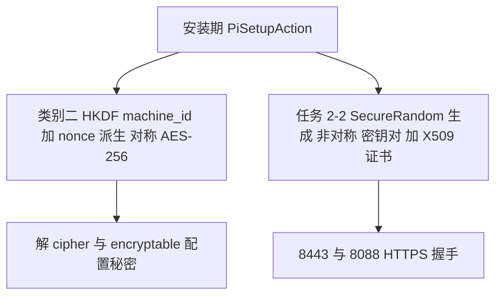
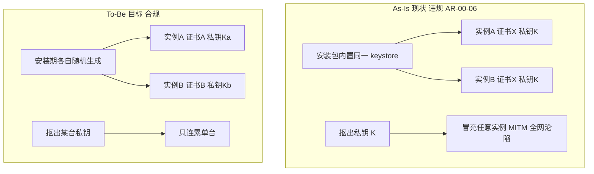
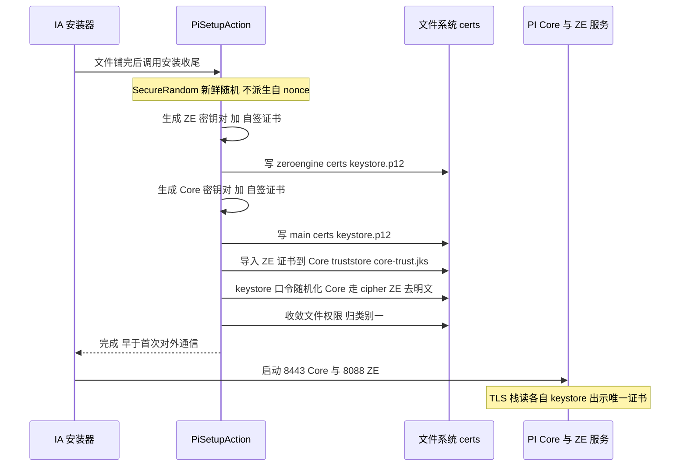
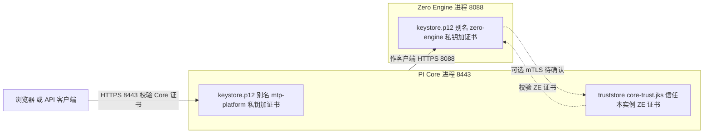

# PI TLS 证书唯一性解决方案（任务 2-2 / #58 / AR-00-06）

> 最后更新：2026-07-23
> 对应任务：[类别二 · 任务 2-2 TLS 证书唯一](../01-remediation-task-ledger.md)。
> 需求定义：[secure-requirements-definitions.md](../requirements/secure-requirements-definitions.md)（AR-00-06 密钥对/证书每实例唯一；批准算法白名单 §6.1）。
> 原始问题：[issue-58](../issues/issue-58-ar00-06-non-unique-tls-cert.md)。
> 背景原理（TLS 握手 / X.509 / SAN / mTLS / 证书生命周期 / 生成工具）见 [background/tls-and-certificate-primer.md](background/tls-and-certificate-primer.md)。
> 姊妹文档：对称密钥/明文凭据（HKDF、`{cipher}`、口令）见 [crypto-key-management-solution.md](crypto-key-management-solution.md)——本文与它**逻辑独立**（证书是非对称密钥对，≠ 对称密钥）。

---

## 0. 目标与范围

| 项 | 内容 |
|----|------|
| 合规项 | **AR-00-06**：平台用于安全通信的密钥对/证书应**每套安装唯一**，避免单一私钥泄露危及所有部署 |
| 核心目标 | TLS 证书/密钥对**每实例唯一** |
| 范围 | PI 本体 + Zero Engine 两侧 TLS 证书（同机）；`taf-core-installer` 的 keystore/证书生成环节 |
| 关联 issue | #58（High，due 2026-09-30） |
| 边界 | 不考虑集群；升级迁移由 U1；SAN 本轮保留原状（见 §3） |

> **为什么与对称密钥方案分开**：类别二的 HKDF 方案派生的是**一把对称密钥（AES-256）**，用于加密配置里的秘密；TLS 需要的是**一对非对称密钥（私钥+公钥）+ 一张 X.509 证书**。二者是**不同的密码学对象**，AES 密钥当不了 TLS 服务器私钥，所以证书唯一性是**独立工作项**。同事的"密钥安全存储设计"只把 keystore 的**口令**加密成 `{cipher}`，不解决证书唯一性。

**图 T-D · 两条线区分（对称密钥 vs 证书）**：两者同挂 `PiSetupAction`，但一条走对称派生、一条走非对称生成，逻辑独立、勿混。

## 1. 现状（两张静态自签证书）

据三平台审计 + 本机（Windows PI4.0）keytool 实测，PI 用**两张静态自签证书**随包分发，每套安装指纹一致：

| | PI Core（8443） | Zero Engine（8088） |
|---|---|---|
| keystore | `main\certs\keystore.p12` | `main\zeroengine\certs\keystore.p12` |
| 别名 | `mtp-platform` | `zero-engine` |
| 主体/签发者 | `CN=MTP Platform,OU=Vertiv,O=Vertiv,L=Sunrise,ST=FL,C=US`（自签，链长1） | `CN=Zero Engine,OU=Vertiv,…`（自签，链长1） |
| 有效期 | 2024-06-25 → 2034-06-23（10y） | 2024-12-10 → 2034-12-08（10y） |
| 算法 | RSA-2048 / SHA256withRSA | RSA-2048 / SHA256withRSA |
| 指纹 SHA-256 | `A5:A6:DB:D5:BE:5E:73:15:…:52:E2:4A:53`（= #58 证据） | `72:7B:A7:63:A7:64:B7:3F:…:24:1A:9D:8B` |
| SAN | **无**（仅 SubjectKeyIdentifier 扩展） | **无** |
| keystore 口令 | 外置 config 未含（藏在打包 properties） | **明文** `ZeroEngine@7775W`（本身是明文密钥触点，归 2-1 整改） |
| client-auth | `want`（PI 侧，可选 mTLS） | 未设（默认 none） |

- **用途**：PI Core 走 `server.port=8443` 的 HTTPS（`server.ssl.key-store=…\main\certs\keystore.p12`）；Zero Engine 走 `server.port=8088`（`server.ssl.enabled=true`）。PI Core 作为客户端连本机 Zero Engine（`zero.engine.service.address=localhost`）。
- **病灶（#58 / AR-00-06）**：每套安装私钥都相同 → 谁从包里抠出私钥即可**冒充任意 PI/ZE 实例（MITM）**；在 RSA 握手下还能解掉录下的历史流量。初始化阶段默认发送的凭据尤其危险。

### 图 T-C · As-Is → To-Be 对比

左栏=现状（一份私钥随包分发，一泄全网沦陷）；右栏=目标（每实例随机生成，一泄只连累单台）。

## 2. 解决方案

**核心一句**：安装期（`PiSetupAction`，客户机上、首次对外通信之前）为每套安装生成两对全新随机密钥 + 自签证书，覆盖随包静态那两张；随包静态私钥从产物剔除。

唯一性来自**密钥材料**（私钥/公钥/指纹/序列号各不同），不来自名字——所以两台都叫 `CN=MTP Platform` 也合规。

### 2.1 生成（编程式）

- **方式**：`KeyPairGenerator`（生密钥对）+ BouncyCastle（自签、复用现状 DN）+ `KeyStore`（写 PKCS12）；不走 keytool/openssl 外部进程。
- **随机源**：`SecureRandom` 现取现用，**新鲜随机、不从 nonce 派生**（非对称密钥派生脆且无收益，原理见 [primer §7](background/tls-and-certificate-primer.md)）。
- **DN/SAN**：沿用现状 DN（`CN=MTP Platform` / `CN=Zero Engine`），**SAN 保留原状不加**（见 §3）。
- **序列号**：随机（避免撞现状 `4eef9640`）。
- **幂等**：仅当不存在实例证书时生成；重装/重跑或显式轮换才重建，正常启动不动它。
- **时机**：`PiSetupAction`，且**必须早于第一次对外通信**（否则初始化窗口仍用旧证书）。

### 2.2 两张证书 + 本地互信引导（关键）

两侧都在**同一台机器**，`PiSetupAction` 一次搞定、无跨机分发难题：

1. 生成 ZE 密钥对+证书 → 写 `zeroengine\certs\keystore.p12`。
2. 生成 Core 密钥对+证书 → 写 `main\certs\keystore.p12`。
3. **把 ZE 证书导入 Core 的 truststore**（`core-trust.jks`）——Core 作客户端连 ZE:8088，须信任本实例 ZE 证书。
4. 若确认 PI↔ZE 双向校验，再把 Core 证书导入 ZE 的 truststore（待实施时查，见 §5）。

**图 T-A · 安装期证书生成时序**：在哪一步、按什么顺序、产出哪些文件（均早于首次对外通信）。

**图 T-B · 运行期证书与信任拓扑**：谁出示什么证书、谁信任谁（mTLS 虚线为待确认项，见 §5）。

### 2.3 keystore 口令一并整改

- Core：口令改**安装期随机生成 + `{cipher}`**（用类别二机器绑定派生密钥加密，见 [crypto §1.5](crypto-key-management-solution.md)），不再依赖打包内固定值。
- ZE：现状 `ZeroEngine@7775W` **明文** → 同样改随机 + 加密存储（归 2-1 明文口令整改的接线点）。

### 2.4 算法 / 有效期档位

- **Baseline**：RSA-2048 / SHA256withRSA（与现状一致，最稳）。**Enhanced**：RSA-3072 或 ECDSA-P384（跟 [crypto K-8 档位](crypto-key-management-solution.md)）。档位**直接影响本证书密钥长度**。
- **有效期**：保留长有效期（~10 年）。#58 要唯一性不是短寿命；自签轮换要客户端重新信任，故不做频繁例行——轮换/续期作为能力保留（原理见 [primer §8](background/tls-and-certificate-primer.md)）。

### 2.5 清理 / 加固 / 容灾

- **删静态**：把随包的两张 `keystore.p12`（及 `core-trust.jks` 静态条目）从产物剔除或安装时覆盖，确保**不再出厂任何静态私钥**。
- **文件权限**：两个 keystore 由**类别一**统一收敛（同 `machine.properties`，见 [runtime-permission-solution.md](runtime-permission-solution.md)）。
- **DR**：两个 keystore 纳入 `machine.properties` 那个原子备份集一起备份/恢复（见 [crypto §2.7](crypto-key-management-solution.md)）。

### 2.6 边界与不做

- **SAN**：本轮不加（见 §3）；作为后续增强项。
- **CA 签发证书**：不强制；保留"运维后续换成企业 CA 证书"的能力（3.0.0+ 已支持替换）。
- **外部系统若信任了旧静态证书**：唯一化后需重新信任——这是 #58 的必然代价，属迁移注意项。

## 3. SAN 保留原状的决定

现状两张证书**都无 SAN**，现代浏览器本就按名字判失败（自签需点继续，故没暴露）。本轮**只解决唯一性，SAN 维持现状不加**：

- 可用性与今天一致（仍是自签 + 名字不匹配，浏览器点继续）；
- 不缩小、也不扩大浏览器支持范围；
- 加 SAN（写对访问主机名/IP）作为**后续可选增强**——因 PI 是产品、安装点在客户机，生成时可读本机 hostname/IP，但对外访问名（DNS 别名/反代/VIP）机器未必知道，需可配置覆盖，留待后续。

（SAN 原理与"不写 SAN 的后果"见 [primer §3](background/tls-and-certificate-primer.md)。）

## 4. 决策登记

> 2026-07-23 讨论：K-7 主决策方向确定，若干子决策敲定；实施细节列为待调研。

| # | 待决 | 结论 | 状态 |
|---|------|------|:---:|
| K-7 | TLS 唯一证书生成方式（#58） | **安装期 `PiSetupAction` 编程式为每实例生成唯一自签证书**，覆盖随包静态；两侧（Core+ZE）都做、本地互信引导 | ✅ 方向已定 |
| K-7a | 生成方式 | **编程式** `KeyPairGenerator`+BouncyCastle+`KeyStore`（不走 keytool/openssl） | ✅ 关闭 |
| K-7b | SAN | **保留原状不加**（本轮），加 SAN 作后续增强 | ✅ 关闭（本轮） |
| K-7c | 范围 | **两张证书**（Core 8443 + ZE 8088） | ✅ 关闭 |
| K-7d | 有效期 | 保留长有效期；轮换作为能力，不做频繁例行 | ✅ 关闭 |
| K-7e | 算法档位 | Baseline RSA-2048（Enhanced 3072/P384，跟 K-8） | ✅ 关闭 |

## 5. 开放 / 待实施调研

以下留到具体实施 2-2 时处理：

1. 两张 `keystore.p12` 当前**怎么进安装目录**——静态拷贝 vs IA/脚本放置？源在 `taf-core-installer` 还是发布包/WAR？
2. **PI ↔ Zero Engine 是否真双向校验证书**（ZE 是否要 PI 出示客户端证书、PI 的 `client-auth=want` 实际是否被用）——决定 §2.2 第 4 步做不做、客户端证书要不要唯一化。
3. **BouncyCastle 是否已是 PI 依赖**（没有需加 provider 依赖）。
4. Zero Engine 明文 keystore 口令 `ZeroEngine@7775W` 归入 2-1 明文口令整改的接线点。

## 6. 改动落地索引（high-level，本轮不改代码）

| 区域 | 改动项 | 类型 |
|------|--------|------|
| 安装器 customcode | `PiSetupAction` 内新增证书生成模块：`KeyPairGenerator`+BouncyCastle 为 Core/ZE 各生成唯一密钥对+自签证书，写各自 `keystore.p12`，互导 truststore | 新增（独立） |
| `taf-core-installer`（IA） | 安装期/首启生成每实例唯一 TLS 证书（keystore 生成环节）；删随包静态 keystore | 新增（独立） |
| `taf-core-installer`（IA） | keystore 口令改随机 + 加密（Core `{cipher}`；ZE 去明文 `ZeroEngine@7775W`） | 修改 |
| 类别一 | 两个 keystore 文件权限收敛 + 纳入 DR 备份集 | 复用 |

---

## 附：关联

- 对应 [任务 2-2](../01-remediation-task-ledger.md)（TLS 证书唯一 #58）。
- 原理背景：[background/tls-and-certificate-primer.md](background/tls-and-certificate-primer.md)。
- 姊妹方案：[crypto-key-management-solution.md](crypto-key-management-solution.md)（对称密钥/明文凭据）、[runtime-permission-solution.md](runtime-permission-solution.md)（文件权限/DR）。
- 关联 issue：[#58](../issues/issue-58-ar00-06-non-unique-tls-cert.md)。
