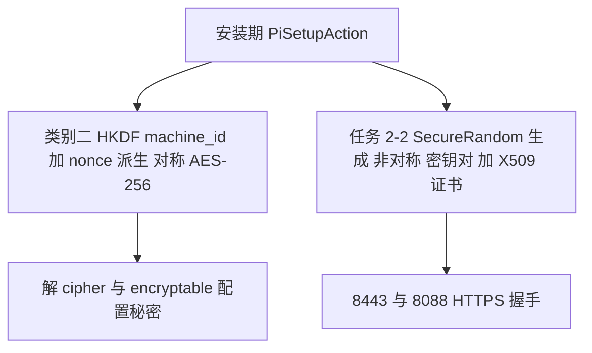
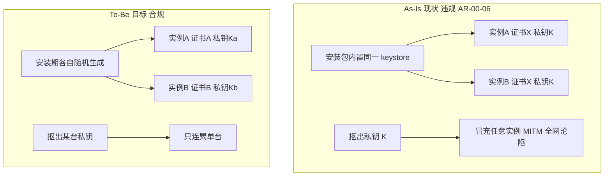
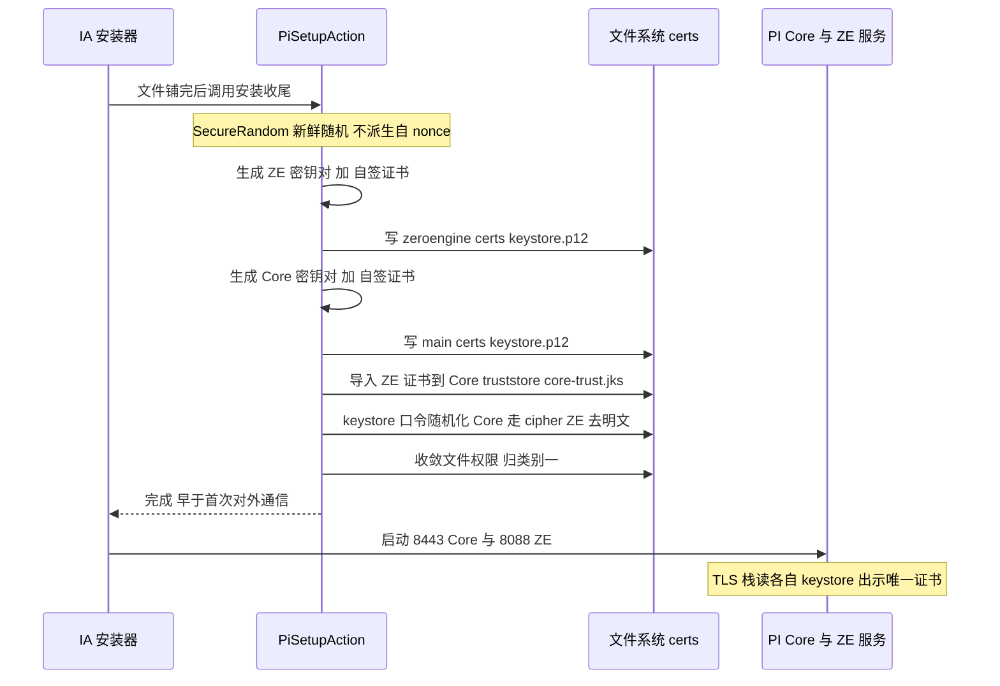
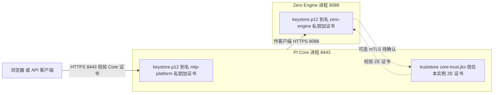
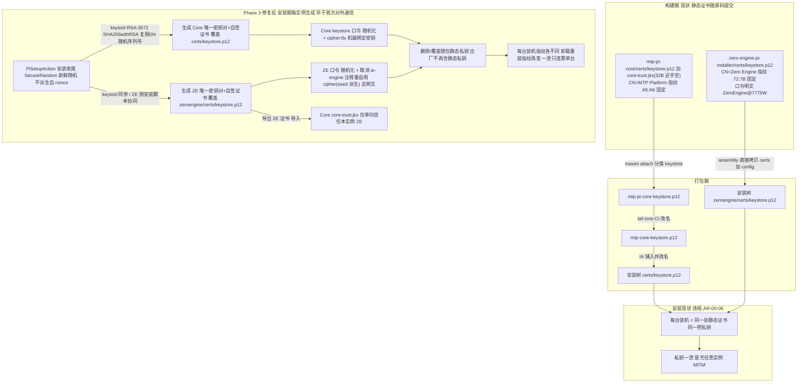
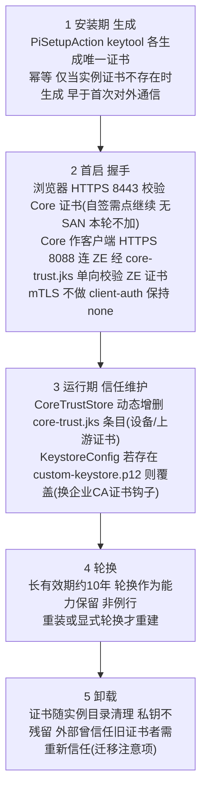

# PI TLS 证书唯一性解决方案（任务 2-2 / #58 / AR-00-06）

> 最后更新：2026-08-10（Phase 3 已落地并 Win11+Server2022+Server2025 三机 + Linux（Ubuntu/RHEL）实机验证：重装/跨机指纹全变、RSA-3072/SHA256withRSA、8443/8088 TLS1.3；进度真源见 [roadmap](../02-implementation-roadmap.md)）
> 对应任务：[类别二 · 任务 2-2 TLS 证书唯一](../01-remediation-task-ledger.md)。
> 需求定义：[secure-requirements-definitions.md](../requirements/secure-requirements-definitions.md)（AR-00-06 密钥对/证书每实例唯一；批准算法白名单 §6.1）。
> 原始问题：[issue-58](../issues/issue-58-ar00-06-non-unique-tls-cert.md)。
> 背景原理（TLS 握手 / X.509 / SAN / mTLS / 证书生命周期 / 生成工具）见 [background/tls-and-certificate-primer.md](background/tls-and-certificate-primer.md)。
> 姊妹文档：对称密钥/明文凭据（HKDF、`{cipher}`、口令）见 [crypto-key-management-solution.md](crypto-key-management-solution.md)——本文与它**逻辑独立**（证书是非对称密钥对，≠ 对称密钥）。
>
> 🟢 **落地状态（2026-08-03）**：本方案 Phase 3 代码已落地并单机实机验证（重装指纹全变、RSA-3072/SHA256withRSA、8443/8088 TLS1.3）。**下文若干「计划/待调研」表述已被实现取代**，关键差异：① **ZE keystore 口令改 option-1 运行时派生注入、不落盘**（非 §2.3 的「随机+`{cipher}`写盘」，见 §2.3 落地标注）；② **`core-trust.jks` 导入判定为 no-op**（N-14：DB 驱动重建 + PI→ZE trust-all，见 §2.2 标注）；③ **ZE 收敛到 PI HKDF、seed/docker 已废**（K-10，见 §2.3/§5-4）；④ 新增 **3-7 打包剔除**（`zeengine.war` 去 `-prod/-dev/keystore.p12`）。逐项状态以 [roadmap 阶段3 + N-14/N-15](../02-implementation-roadmap.md) 为准。

---

## 0. 目标与范围

| 项 | 内容 |
|----|------|
| 合规项 | **AR-00-06**：平台用于安全通信的密钥对/证书应**每套安装唯一**，避免单一私钥泄露危及所有部署 |
| 核心目标 | TLS 证书/密钥对**每实例唯一** |
| 范围 | PI 本体 + Zero Engine 两侧 TLS 证书（同机）；`taf-core-installer` 的 keystore/证书生成环节 |
| 关联 issue | #58（High，due 2026-09-30） |
| 边界 | 不考虑集群；升级迁移由 U1；SAN 本轮保留原状（见 §3） |

> **为什么与对称密钥方案分开**：类别二的 HKDF 方案派生的是**一把对称密钥（AES-256）**，用于加密配置里的秘密；TLS 需要的是**一对非对称密钥（私钥+公钥）+ 一张 X.509 证书**。二者是**不同的密码学对象**，AES 密钥当不了 TLS 服务器私钥，所以证书唯一性是**独立工作项**。同事的"密钥安全存储设计"只把 keystore 的**口令**加密成 `{cipher}`，不解决证书唯一性。

**图 T-D · 两条线区分（对称密钥 vs 证书）**：两者同挂 `PiSetupAction`，但一条走对称派生、一条走非对称生成，逻辑独立、勿混。

```mermaid
flowchart TB
  root["安装期 PiSetupAction"]
  root --> sym["类别二 HKDF machine_id 加 nonce 派生 对称 AES-256"]
  root --> asym["任务 2-2 SecureRandom 生成 非对称 密钥对 加 X509 证书"]
  sym --> symuse["解 cipher 与 encryptable 配置秘密"]
  asym --> asymuse["8443 与 8088 HTTPS 握手"]
```

## 1. 现状（两张静态自签证书）

据三平台审计 + 本机（Windows PI4.0）keytool 实测，PI 用**两张静态自签证书**随包分发，每套安装指纹一致：

| | PI Core（8443） | Zero Engine（8088） |
|---|---|---|
| keystore | `main\certs\keystore.p12` | `main\zeroengine\certs\keystore.p12` |
| 别名 | `mtp-platform` | `zero-engine` |
| 主体/签发者 | `CN=MTP Platform,OU=Vertiv,O=Vertiv,L=Sunrise,ST=FL,C=US`（自签，链长1） | `CN=Zero Engine,OU=Vertiv,…`（自签，链长1） |
| 有效期 | 2024-06-25 → 2034-06-23（10y） | 2024-12-10 → 2034-12-08（10y） |
| 算法 | RSA-2048 / SHA256withRSA | RSA-2048 / SHA256withRSA |
| 指纹 SHA-256 | `A5:A6:DB:D5:BE:5E:73:15:…:52:E2:4A:53`（= #58 证据） | `72:7B:A7:63:A7:64:B7:3F:…:24:1A:9D:8B` |
| SAN | **无**（仅 SubjectKeyIdentifier 扩展） | **无** |
| keystore 口令 | 外置 config 未含（藏在打包 properties） | **明文** `ZeroEngine@7775W`（本身是明文密钥触点，归 2-1 整改） |
| client-auth | `want`（PI 侧，可选 mTLS） | 未设（默认 none） |

- **用途**：PI Core 走 `server.port=8443` 的 HTTPS（`server.ssl.key-store=…\main\certs\keystore.p12`）；Zero Engine 走 `server.port=8088`（`server.ssl.enabled=true`）。PI Core 作为客户端连本机 Zero Engine（`zero.engine.service.address=localhost`）。
- **病灶（#58 / AR-00-06）**：每套安装私钥都相同 → 谁从包里抠出私钥即可**冒充任意 PI/ZE 实例（MITM）**；在 RSA 握手下还能解掉录下的历史流量。初始化阶段默认发送的凭据尤其危险。

### 图 T-C · As-Is → To-Be 对比

左栏=现状（一份私钥随包分发，一泄全网沦陷）；右栏=目标（每实例随机生成，一泄只连累单台）。

```mermaid
flowchart TB
  subgraph asis [As-Is 现状 违规 AR-00-06]
    pkg1["安装包内置同一 keystore"] --> a1["实例A 证书X 私钥K"]
    pkg1 --> b1["实例B 证书X 私钥K"]
    leak1["抠出私钥 K"] --> mitm["冒充任意实例 MITM 全网沦陷"]
  end
  subgraph tobe [To-Be 目标 合规]
    gen["安装期各自随机生成"] --> a2["实例A 证书A 私钥Ka"]
    gen --> b2["实例B 证书B 私钥Kb"]
    leak2["抠出某台私钥"] --> one["只连累单台"]
  end
```

## 2. 解决方案

**核心一句**：安装期（`PiSetupAction`，客户机上、首次对外通信之前）为每套安装生成两对全新随机密钥 + 自签证书，覆盖随包静态那两张；随包静态私钥从产物剔除。

唯一性来自**密钥材料**（私钥/公钥/指纹/序列号各不同），不来自名字——所以两台都叫 `CN=MTP Platform` 也合规。

### 2.1 生成（编程式）

- **方式（2026-07-28 改定）**：**优先 `keytool`**（打包 JRE 自带，一条命令生密钥对+自签+写 PKCS12，复用现状 DN，**免新增依赖**）；**备选**编程式 `KeyPairGenerator`+BouncyCastle+`KeyStore`（须新增 BC 依赖，仅当需在 JVM 内签发时用）。〔原定"编程式+BC、不走 keytool"已被此决定推翻，理由见 [roadmap 0-2](../02-implementation-roadmap.md)：三工程均无 BC，keytool 更省。〕
- **随机源**：`SecureRandom` 现取现用，**新鲜随机、不从 nonce 派生**（非对称密钥派生脆且无收益，原理见 [primer §7](background/tls-and-certificate-primer.md)）。
- **DN/SAN**：沿用现状 DN（`CN=MTP Platform` / `CN=Zero Engine`），**SAN 保留原状不加**（见 §3）。
- **序列号**：随机（避免撞现状 `4eef9640`）。
- **幂等**：仅当不存在实例证书时生成；重装/重跑或显式轮换才重建，正常启动不动它。
- **时机**：`PiSetupAction`，且**必须早于第一次对外通信**（否则初始化窗口仍用旧证书）。

### 2.2 两张证书 + 本地互信引导（关键）

两侧都在**同一台机器**，`PiSetupAction` 一次搞定、无跨机分发难题：

1. 生成 ZE 密钥对+证书 → 写 `zeroengine\certs\keystore.p12`。
2. 生成 Core 密钥对+证书 → 写 `main\certs\keystore.p12`。
3. **把 ZE 证书导入 Core 的 truststore**（`core-trust.jks`）——Core 作客户端连 ZE:8088，须信任本实例 ZE 证书。
4. 若确认 PI↔ZE 双向校验，再把 Core 证书导入 ZE 的 truststore（待实施时查，见 §5）。

> 🟢 **落地更正（N-14，2026-08-03）**：第 3 步 `importZeCertIntoCoreTrust()` 已实现但**当前为 no-op**——运行期 `TrustSynchronizer` 按 DB 重建 `core-trust.jks`，且 PI→ZE 主通道 `taf-plugin-pi-zeadapter` 的 `RestTemplate` 为 **trust-all**（不查 truststore、认证走 `X-API-KEY`）。故保留代码但不影响信任链；仅未来收紧 TLS 校验时才成真任务（正解=信任 DB + 改 `PluginConfiguration`）。第 4 步（mTLS）**已定不做**。详见 [roadmap N-14](../02-implementation-roadmap.md)。
>
> 🟢 **再更正（N-34，2026-08-26）**：`core-trust.jks` 本身的**生产方式已变**——随包静态 `InstallFile` 已删除，改由 `PiSetupAction` **独家生产、每机派生口令**（仿 `keystore.p12`）；`importZeCertIntoCoreTrust()` 现在是"新建 JKS + 原子 move"，口令为机器绑定 TLS 派生（非出厂 `HoneyBadger@7775W`）。N-14 讲的是**内容** no-op，N-34 修的是**口令 boot 加载**层（属性↔文件口令须一致，否则 `tafsvc` 起不来）。三平台实机验证通过。详见 [roadmap N-34](../02-implementation-roadmap.md)。

**图 T-A · 安装期证书生成时序**：在哪一步、按什么顺序、产出哪些文件（均早于首次对外通信）。

```mermaid
sequenceDiagram
  participant IA as IA 安装器
  participant PSA as PiSetupAction
  participant FS as 文件系统 certs
  participant SVC as PI Core 与 ZE 服务
  IA->>PSA: 文件铺完后调用安装收尾
  Note over PSA: SecureRandom 新鲜随机 不派生自 nonce
  PSA->>PSA: 生成 ZE 密钥对 加 自签证书
  PSA->>FS: 写 zeroengine certs keystore.p12
  PSA->>PSA: 生成 Core 密钥对 加 自签证书
  PSA->>FS: 写 main certs keystore.p12
  PSA->>FS: 导入 ZE 证书到 Core truststore core-trust.jks
  PSA->>FS: keystore 口令随机化 Core 走 cipher ZE 去明文
  PSA->>FS: 收敛文件权限 归类别一
  PSA-->>IA: 完成 早于首次对外通信
  IA->>SVC: 启动 8443 Core 与 8088 ZE
  Note over SVC: TLS 栈读各自 keystore 出示唯一证书
```

**图 T-B · 运行期证书与信任拓扑**：谁出示什么证书、谁信任谁（mTLS 虚线为待确认项，见 §5）。

```mermaid
flowchart LR
  browser["浏览器 或 API 客户端"]
  subgraph core [PI Core 进程 8443]
    coreKS["keystore.p12 别名 mtp-platform 私钥加证书"]
    coreTS["truststore core-trust.jks 信任本实例 ZE 证书"]
  end
  subgraph ze [Zero Engine 进程 8088]
    zeKS["keystore.p12 别名 zero-engine 私钥加证书"]
  end
  browser -->|"HTTPS 8443 校验 Core 证书"| coreKS
  core -->|"作客户端 HTTPS 8088"| zeKS
  coreTS -.->|"校验 ZE 证书"| zeKS
  zeKS -.->|"可选 mTLS 待确认"| coreTS
```

### 2.3 keystore 口令一并整改

- Core：口令改**安装期随机生成 + `{cipher}`**（用类别二机器绑定派生密钥加密，见 [crypto §1.5](crypto-key-management-solution.md)），不再依赖打包内固定值。
- ZE：现状 `ZeroEngine@7775W` **明文** → 同样改随机 + 加密存储（归 2-1 明文口令整改的接线点）。

**ZE 侧落地计划（2026-07-31，K-10 ✅ 已定=收敛到 PI HKDF；见 [crypto §2.10](crypto-key-management-solution.md)）**——**弃用 ZE 的 PBKDF2-seed+自研混淆，改接 PI 的 `MachineKeyProvider`（每节点独立派生 + `MachineKeyPurpose` 分域）**：
1. **移植 HKDF 到 ZE**：把 `MachineKeyProvider`+`MachineKeyPurpose` **复制 parity 副本**引入 `ie-engine`（**暂不抽共享库**，K-10/Q2 定）；`CryptoUtils.KEY` 来源从 `deriveKeyFromSeed(seed)` 改为 `MachineKeyProvider.getKey(purpose)`（密文格式 AES-256-GCM 已一致，drop-in）；`CryptoManager`（PBKDF2/seed/混淆）废弃。
2. **nonce 落地（替代 seed）**：ZE nonce = `zeroengine/config/machine.properties`（文件名同 PI、**独立一份**、权限同 PI nonce 但基于 ZE 自身，D-ZE-nonce 定）；**证书/nonce/`{cipher}` 统一由 `PiSetupAction` 生成（Core+ZE、双平台，Q3 定）**，`ze-install.sh` 仅留调用点/占位；不再依赖 docker `/run/secrets/seed` 与打包静态 `seed.key`。**Linux 须落实时序**：PiSetupAction 在 ZE 目录铺好（`ze-install.sh` 跑完）之后执行。
3. **取消注释、接 HKDF**：`DockerSecretsEnvironmentPostProcessor`（改名/泛化）用 nonce 派生密钥 `CryptoUtils.setKey(...)`；重启用 `EnvironmentTextCryptListener` 解 `{cipher}`。
4. **keystore 口令 `{cipher}`**：安装期（Phase 3 生成 ZE 证书时）把**随机 keystore 口令**用 ZE 派生密钥加密 → 写 `application-prod.properties: server.ssl.key-store-password={cipher}…` → **去掉明文 `ZeroEngine@7775W`**；删打包静态 `seed.key`/`ze.pass`。
5. **顺带**：SNMP `encryptable`（`DeviceContext.encrypt/decryptCommunicationProfile` 取消注释）一并启用；**密钥用途 = `GENERAL`（非专用 `SNMP` 子钥，N-26 定不做专用钥、维持 GENERAL 已达标）**；DB 口令 on-prem 用 SQLite 无口令、可不做（见 [crypto §2.10.1](crypto-key-management-solution.md)）。运行时采样加解密**已实机验证（2026-08-12）**。
> 🟢 **落地更正（option-1，2026-08-03）**：上表 step 4 的「随机 keystore 口令 + `{cipher}` 写盘 `application-prod.properties`」**已被 option-1 取代**——`PiSetupAction` 早于 ZE 负载执行、写盘会被负载覆盖；改为 keystore 口令由机器绑定 **TLS 密钥（HKDF）确定派生**（`keystorePasswordFromKey`），`PiSetupAction` 生成 `keystore.p12` 时用之、ZE 启动由 `MachineKeyEnvironmentPostProcessor` 重新派生并注入 `server.ssl.key-store-password`（最高优先级），**全程不落盘**；`application-prod.properties` 留空+注释。step 2/3 的 `DockerSecretsEnvironmentPostProcessor` 已改名 `MachineKeyEnvironmentPostProcessor`、seed 机制废弃改读 ZE nonce。提交 TAF `d4aa131`/ie-engine `2a1fb76`/zero-engine `d7dc99c`。详见 [roadmap 3-3/3-5](../02-implementation-roadmap.md)。
>
> SNMP 跨组件**不共钥**（PI 与 ZE **各自的机器绑定 GENERAL 钥**、各自 nonce 天然互异，非独立 `-snmp-v1` 子钥；TLS 保传输），见 [crypto §2.3 / §2.10.4 / N-26](crypto-key-management-solution.md)。

### 2.4 算法 / 有效期档位

- ✅ **已定 Baseline（2026-07-28；2026-07-30 证书由 RSA-2048 上调为 RSA-3072）**：RSA-3072 / SHA256withRSA（Baseline 批准集内，且已同时达到 Enhanced 的 RSA≥3072 门槛）。仅政府/FIPS 客户升 **Enhanced**：ECDSA-P384 / SHA-384 哈希（跟 [crypto K-8 档位](crypto-key-management-solution.md)）。档位**直接影响本证书密钥长度**。
- **有效期**：保留长有效期（~10 年）。#58 要唯一性不是短寿命；自签轮换要客户端重新信任，故不做频繁例行——轮换/续期作为能力保留（原理见 [primer §8](background/tls-and-certificate-primer.md)）。

### 2.5 清理 / 加固 / 容灾

- **删静态**：把随包的两张 `keystore.p12`（及 `core-trust.jks` 静态条目）从产物剔除或安装时覆盖，确保**不再出厂任何静态私钥**。（🟢 已落地：mtp-core `aec8d381a`/taf `0e812aa` 去 Core keystore；zero-engine `6aa9a33` 删静态 ZE keystore。**3-7 新增**：`zeengine.war` 经 `packagingExcludes` 再剔 `application-{prod,dev}.properties` + WAR 内 `keystore.p12`，见 [roadmap 3-7](../02-implementation-roadmap.md)）
- **文件权限**：两个 keystore 由**类别一**统一收敛（同 `machine.properties`，见 [runtime-permission-solution.md](runtime-permission-solution.md)）。
- **DR**：两个 keystore 纳入 `machine.properties` 那个原子备份集一起备份/恢复（见 [crypto §2.7](crypto-key-management-solution.md)）。

### 2.6 边界与不做

- **SAN**：本轮不加（见 §3）；作为后续增强项。
- **CA 签发证书**：不强制；保留"运维后续换成企业 CA 证书"的能力（3.0.0+ 已支持替换）。
- **外部系统若信任了旧静态证书**：唯一化后需重新信任——这是 #58 的必然代价，属迁移注意项。

### 2.7 供应链与全生命周期总览（图 T-E / 图 T-F）

#### 图 T-E · 证书供应链 + 安装期生成（As-Is 静态 → To-Be 每实例唯一）

回答"证书从哪来、怎么进包、装机时怎么从静态变唯一"（源路径已 2026-07-31 哈希实证，见 §5-1）：

```mermaid
flowchart TB
  subgraph BUILD["构建期 现状 静态证书随源码提交"]
    mc["mtp-pi-core/certs/keystore.p12 加 core-trust.jks(32B 近乎空)<br/>CN=MTP Platform 指纹 A5:A6 固定"]
    ze["zero-engine-pi-installer/certs/keystore.p12<br/>CN=Zero Engine 指纹 72:7B 固定<br/>口令明文 ZeroEngine@7775W"]
  end
  subgraph PKG["打包期"]
    mc -->|"maven attach 分类 keystore"| a1["mtp-pi-core-keystore.p12"]
    a1 -->|"taf-core CI 改名"| a2["mtp-core-keystore.p12"]
    a2 -->|"IA 铺入并改名"| coreInstall["安装树 certs/keystore.p12"]
    ze -->|"assembly 直接拷贝 certs 加 config"| zeInstall["安装树 zeroengine/certs/keystore.p12"]
  end
  subgraph ASIS["安装现状 违规 AR-00-06"]
    coreInstall --> bad1["每台装机 = 同一张静态证书 同一把私钥"]
    zeInstall --> bad1
    bad1 --> bad2["私钥一泄 冒充任意实例 MITM"]
  end
  subgraph TOBE["Phase 3 修复后 安装期每实例生成 早于首次对外通信"]
    psa["PiSetupAction 安装收尾 SecureRandom 新鲜随机 不派生自 nonce"]
    psa -->|"keytool RSA-3072 SHA256withRSA 复用DN 随机序列号"| gCore["生成 Core 唯一密钥对+自签证书 覆盖 certs/keystore.p12"]
    psa -->|"keytool 同参 / ZE 侧安装脚本协同"| gZE["生成 ZE 唯一密钥对+自签证书 覆盖 zeroengine/certs/keystore.p12"]
    gCore --> pwCore["Core keystore 口令 随机化 + cipher:tls 机器绑定密钥"]
    gZE --> pwZE["ZE 口令 随机化 + 取消 ie-engine 注释重启用 cipher(seed 派生) 去明文"]
    gZE -->|"导出 ZE 证书 导入"| trust["Core core-trust.jks 仅单向信任本实例 ZE"]
    pwCore --> done["删除/覆盖随包静态私钥 出厂不再含静态私钥"]
    pwZE --> done
    done --> good["每台装机指纹各不同 卸载重装指纹再变 一泄只连累单台"]
  end
```

#### 图 T-F · 证书全生命周期时间线（安装→首启→运行→轮换→卸载）

```mermaid
flowchart TB
  L1["1 安装期 生成<br/>PiSetupAction keytool 各生成唯一证书<br/>幂等 仅当实例证书不存在时生成 早于首次对外通信"]
  L2["2 首启 握手<br/>浏览器 HTTPS 8443 校验 Core 证书(自签需点继续 无SAN 本轮不加)<br/>Core 作客户端 HTTPS 8088 连 ZE 经 core-trust.jks 单向校验 ZE 证书<br/>mTLS 不做 client-auth 保持 none"]
  L3["3 运行期 信任维护<br/>CoreTrustStore 动态增删 core-trust.jks 条目(设备/上游证书)<br/>KeystoreConfig 若存在 custom-keystore.p12 则覆盖(换企业CA证书钩子)"]
  L4["4 轮换<br/>长有效期约10年 轮换作为能力保留 非例行<br/>重装或显式轮换才重建"]
  L5["5 卸载<br/>证书随实例目录清理 私钥不残留 外部曾信任旧证书者需重新信任(迁移注意项)"]
  L1 --> L2 --> L3 --> L4 --> L5
```

## 3. SAN 保留原状的决定

现状两张证书**都无 SAN**，现代浏览器本就按名字判失败（自签需点继续，故没暴露）。本轮**只解决唯一性，SAN 维持现状不加**：

- 可用性与今天一致（仍是自签 + 名字不匹配，浏览器点继续）；
- 不缩小、也不扩大浏览器支持范围；
- 加 SAN（写对访问主机名/IP）作为**后续可选增强**——因 PI 是产品、安装点在客户机，生成时可读本机 hostname/IP，但对外访问名（DNS 别名/反代/VIP）机器未必知道，需可配置覆盖，留待后续。

（SAN 原理与"不写 SAN 的后果"见 [primer §3](background/tls-and-certificate-primer.md)。）

## 4. 决策登记

> 2026-07-23 讨论：K-7 主决策方向确定，若干子决策敲定；实施细节列为待调研。

| # | 待决 | 结论 | 状态 |
|---|------|------|:---:|
| K-7 | TLS 唯一证书生成方式（#58） | **安装期 `PiSetupAction` 编程式为每实例生成唯一自签证书**，覆盖随包静态；两侧（Core+ZE）都做、本地互信引导 | ✅ 方向已定 |
| K-7a | 生成方式 | **改定（2026-07-28）：优先 `keytool`（JRE 自带，免依赖）**；编程式 `KeyPairGenerator`+BouncyCastle 为备选（须加 BC 依赖）。〔**推翻原"编程式+BC、不走 keytool"的原因**：① 已核查 `taf-core-installer`/`mtp-pi-core`/`TAF-InstallerCustomCode` 三工程**均无 BC 依赖**，编程式路线须新增 `bcprov`/`bcpkix`（增打包体积/维护/合规审查面）；② `keytool` 随打包 JRE 自带，一条命令即可生密钥对+自签+写 PKCS12，**免依赖免代码**；③ 安装器本就大量 shell 外部命令，keytool 契合现有模式。详见 [§5-3](#) 与 [roadmap 0-2](../02-implementation-roadmap.md)〕 | ✅ 关闭 |
| K-7b | SAN | **保留原状不加**（本轮），加 SAN 作后续增强 | ✅ 关闭（本轮） |
| K-7c | 范围 | **两张证书**（Core 8443 + ZE 8088） | ✅ 关闭 |
| K-7d | 有效期 | 保留长有效期；轮换作为能力，不做频繁例行 | ✅ 关闭 |
| K-7e | 算法档位 | Baseline RSA-3072（2026-07-30 由 2048 上调；Enhanced P384/SHA-384，跟 K-8） | ✅ 关闭 |

## 5. 开放 / 待实施调研

以下留到具体实施 2-2 时处理：

1. ~~两张 `keystore.p12` 当前**怎么进安装目录**~~ —— ✅ **已查清（2026-07-31，哈希实证）**：
   - **Core（8443）源**：`mtp-pi-core/certs/keystore.p12`（仓库内提交的**静态**文件，CN=MTP Platform，指纹 A5:A6…）+ `core-trust.jks`（**仅 32B，近乎空**，运行期由 `CoreTrustStore` 动态写条目）。由 `mtp-pi-core/webapp/pom.xml:424-431` 作构建产物 `mtp-pi-core-keystore.p12` 挂出 → `taf-core-installer/.gitlab-ci.yml:44-45` 改名 `mtp-core-keystore.p12` → IA(`TAFCore.iap_xml` L28943-28955) 铺进 `certs/keystore.p12`。
   - **ZE（8088）源**：`zero-engine-pi-installer/certs/keystore.p12`（SHA-256 `1BD899…78C3` **= 装机侧逐字节一致**），ZE 安装器是脚本/assembly 式（`ze-install.sh` + `package/assembly-{linux,windows}.xml`），certs 原样拷贝。
   - **运行期换证钩子**：`mtp-pi-core` 的 `KeystoreConfig` 若发现同目录存在 `custom-keystore.p12` 则覆盖 `server.ssl.key-store`（3.0.0+「装后换企业 CA 证书」能力，Phase 3 保留）。
   - **别误碰的旧副本**：`idea_workspace\core`、`mtp-core`、`zero-eingine-installer`（typo 旧目录）、`ieengine - demo` 均含 keystore，非 PI4.0 活跃链路。
2. ~~**PI ↔ Zero Engine 是否真双向校验证书**~~ —— ✅ **已定（2026-07-28，用户拍板）：本轮不做 mTLS**。即 §2.2 第 4 步（把 Core 证书导入 ZE truststore）**不做**、客户端证书**不唯一化**、PI 侧 `client-auth` 维持 `none`（§4 表）。TLS 仅单向：Core 作客户端信任本实例 ZE 证书（§2.2 第 3 步 truststore 互导中**只保留 ZE→Core 一向**）。图 T-B 中"可选 mTLS 待确认"虚线**判定为不启用**。
3. ~~**BouncyCastle 是否已是 PI 依赖**~~ —— ✅ **已核查 + 改定（2026-07-28）**：三工程（`taf-core-installer` / `mtp-pi-core` / `TAF-InstallerCustomCode`）**均无 BC**。故证书生成**改走 `keytool`（JRE 自带、免依赖）为主路**；仅当需 JVM 内编程式签发时才加 `bcprov-jdk18on`+`bcpkix-jdk18on`。见 [roadmap 0-2](../02-implementation-roadmap.md)。
4. ~~Zero Engine 明文 keystore 口令 `ZeroEngine@7775W` 归入 2-1 明文口令整改的接线点~~ —— ✅ **已查清（2026-07-31）**：
   - **读取点**：`zero-engine-pi-installer/config/application-prod.properties:31 server.ssl.key-store-password=ZeroEngine@7775W`（明文、外置可改，非编进二进制）。
   - **ZE 有现成 `{cipher}` 架子（当前被注释停用，注释写"等新密码体系"）**：`ie-engine` 里 `DockerSecretsEnvironmentPostProcessor`（读 seed → `CryptoManager.getKeyFromSeedFile` → `CryptoUtils.setKey`，并注入 `server.ssl.key-store-password={cipher}…`）+ `EnvironmentTextCryptListener`（启动期解 `{cipher}`）+ `CryptoUtils`（AES-256-GCM，与 PI 同密文格式）+ `CryptoManager`（**PBKDF2-HmacSHA256 / 600k / 固定 APP_SALT，从 seed 派生**）。
   - **缺口**：现有 seed 走 **docker** `/run/secrets/seed`，**on-prem PI 安装无此路径** → Phase 3 ZE 侧须补「安装期生成 32B 随机 seed → 混淆存 root-only 文件」的 on-prem seed 落地（见 §2.3 ZE 侧计划）。
   - **附带**：`zero-engine-pi-installer/ci-settings.xml:62 jarsigner.storepass=Passw0rd`（`taf-release` profile 的**打包签名 keystore 口令**明文，属 CI/构建期密钥，非运行时安装口令，另行处置）。

> 🟢 **落地更正（K-10，2026-08-03）**：上述「docker seed 缺口 / on-prem seed 落地」**已不适用**——K-10 已把 ZE 收敛到 PI HKDF：废 `CryptoManager`(PBKDF2-seed)/`seed.key`/`ze.pass`，改由 ZE nonce（`zeroengine/config/machine.properties`）经 `MachineKeyProvider` 派生；`{cipher}` 由启动期 `EnvironmentTextCryptListener`（ie-engine parity 副本）解密。已落地并实机验证（ie-engine `fa0b89f`，见 [roadmap 3-5/N-15](../02-implementation-roadmap.md)）。

## 6. 改动落地索引（high-level，本轮不改代码）

| 区域 | 改动项 | 类型 |
|------|--------|------|
| 安装器 customcode | `PiSetupAction` 内新增证书生成模块：**优先 `keytool`**（JRE 自带）为 Core/ZE 各生成唯一密钥对+自签证书写各自 `keystore.p12`、互导 truststore；编程式 `KeyPairGenerator`+BouncyCastle 为备选 | 新增（独立） |
| `taf-core-installer`（IA） | 安装期/首启生成每实例唯一 TLS 证书（keystore 生成环节）；删随包静态 keystore | 新增（独立） |
| `taf-core-installer`（IA） | keystore 口令改随机 + 加密（Core `{cipher}`；ZE 去明文 `ZeroEngine@7775W`） | 修改 |
| 类别一 | 两个 keystore 文件权限收敛 + 纳入 DR 备份集 | 复用 |

---

## 附：关联

- 对应 [任务 2-2](../01-remediation-task-ledger.md)（TLS 证书唯一 #58）。
- 原理背景：[background/tls-and-certificate-primer.md](background/tls-and-certificate-primer.md)。
- 姊妹方案：[crypto-key-management-solution.md](crypto-key-management-solution.md)（对称密钥/明文凭据）、[runtime-permission-solution.md](runtime-permission-solution.md)（文件权限/DR）。
- 关联 issue：[#58](../issues/issue-58-ar00-06-non-unique-tls-cert.md)。
