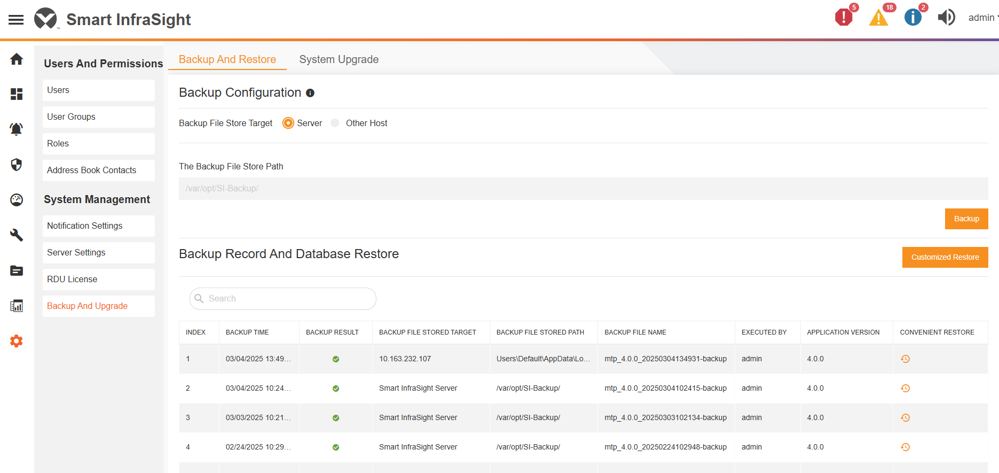
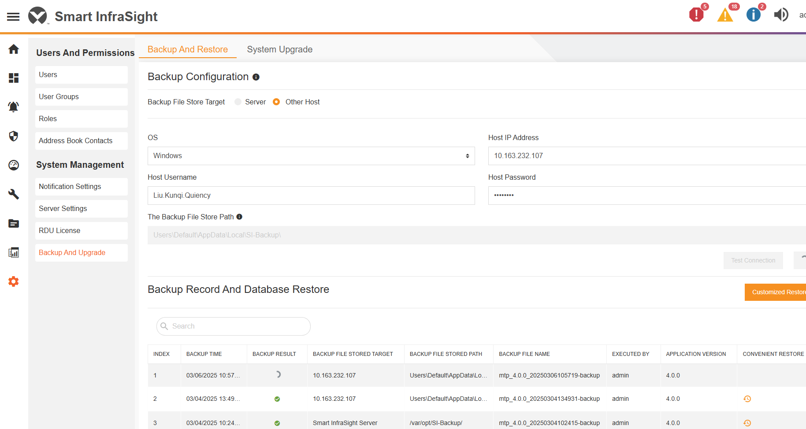
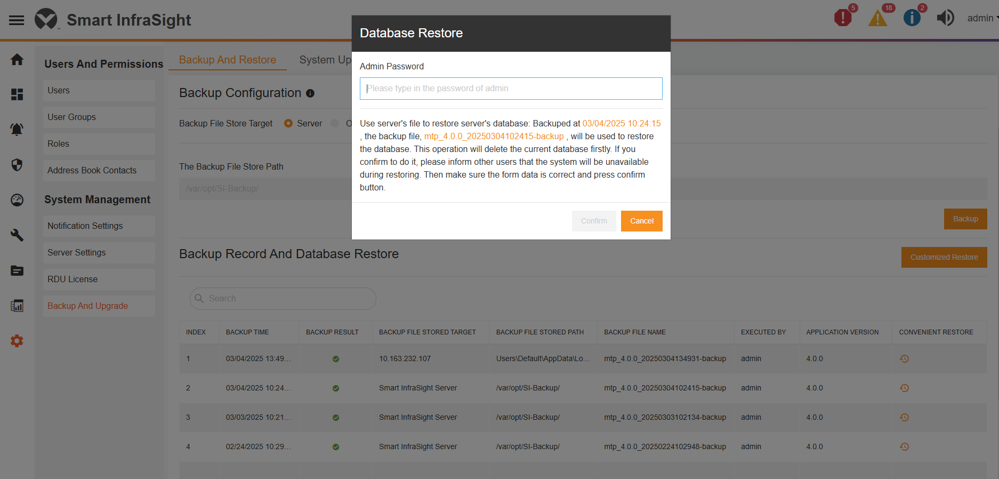
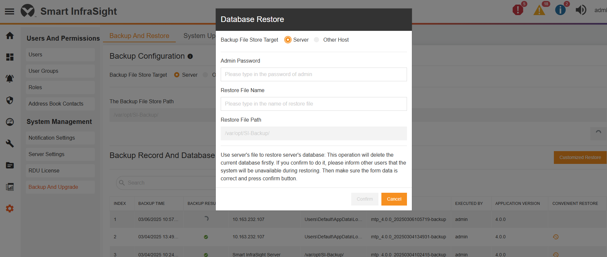
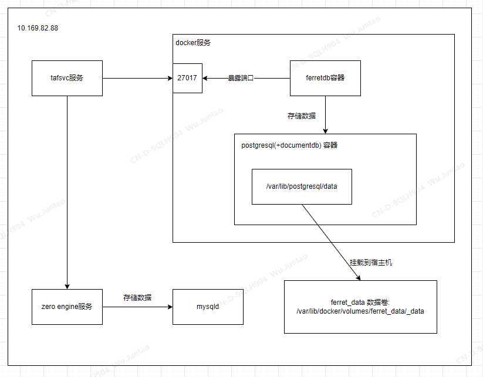
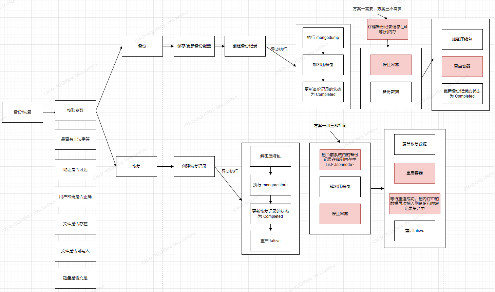
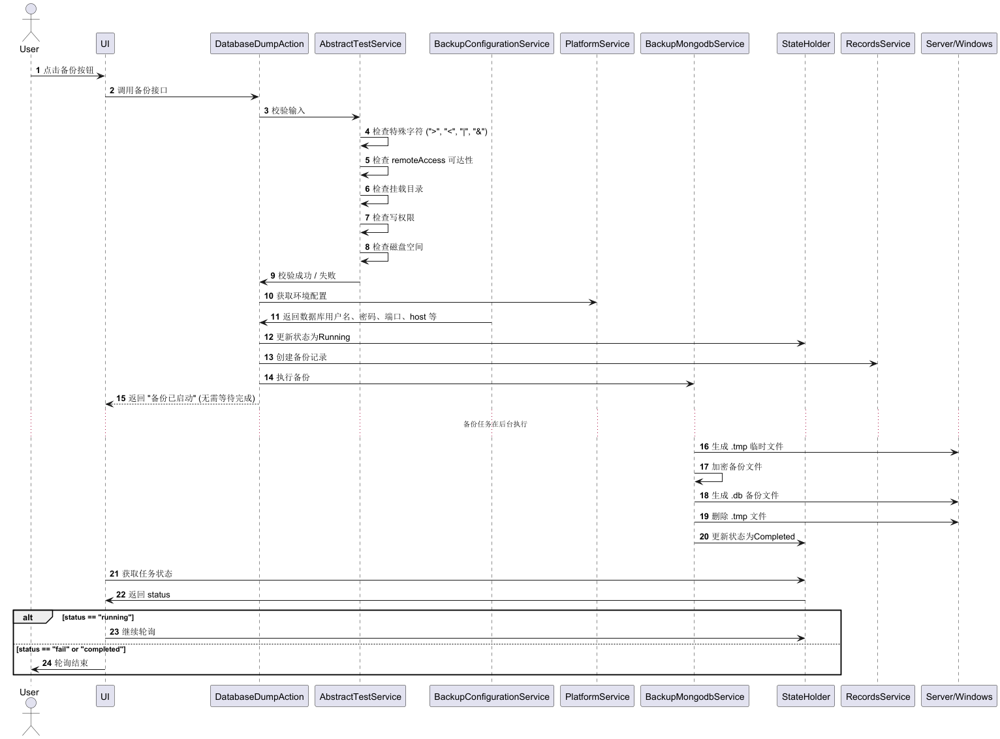
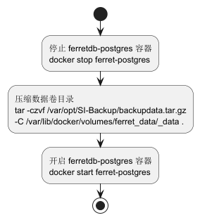
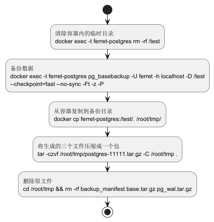
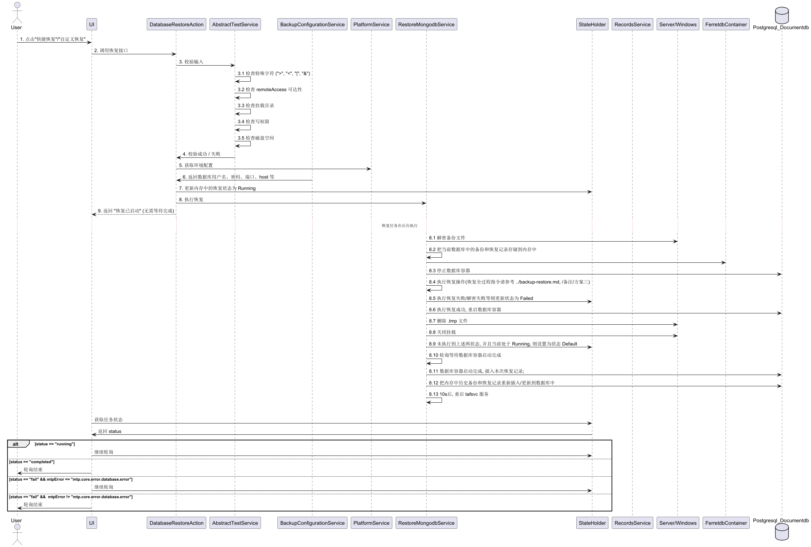

# SI4.0-备份功能兼容开发

## 修订记录

| 版本 | 时间     | 作者              | 备注     |
| ---- | -------- |-----------------| -------- |
| 1.0  | 2025.3.5 | Quiency, juntao | 初始版本 |

## 需求描述

- SI4.0 用户需要继续使用数据备份和恢复功能

## 需求背景

在 SI4.0 把数据库从 mongodb 切换为 ferretdb(用postgresql + documentdb扩展存储数据), mongodump 和 mongorestore 指令不能使用, 
仍然需要保持备份和恢复业务可用, 期望效果和之前保持一致, 所以需要对原功能进行代码改造。

## 需求功能

​	和原有的备份还原功能保持一致

## 功能描述

1. 直接备份到服务器（备份记录2所示）

2. 备份到另一台windows机器上，（备份记录1所示）

3. 快捷恢复（快捷恢复备份记录2所示）

4. 自定义恢复，输入指定的备份文件名，同样可以选择从服务器上恢复还是从另一个windows机器上恢复

## 系统架构
本次不考虑 zero engine的备份与恢复。 

## 接口
备份还原中涉及的是三个核心接口：

> /api/rest/v1/dump
>
> /api/rest/v1/restore
> 
> /api/rest/v1/backuprecovery/statelistener

## 详细设计
### 备份和恢复方案
|      | 方案一                                                                                                                         | 方案二                                  | 方案三                                                                                                                               | 
|------|-----------------------------------------------------------------------------------------------------------------------------|--------------------------------------|-----------------------------------------------------------------------------------------------------------------------------------|
| 内容   | 直接压缩挂载宿主机的数据目录来备份,  解压覆盖数据目录来恢复                                                                                          | pg_dump备份, pg_restore恢复              | pg_basebackup备份, 解压覆盖数据目录来恢复                                                                                                      |
| 备份方式 | 物理备份                                                                                                                        | 逻辑备份                                 | 物理备份                                                                                                                              |
| 主要指令 | docker(stop/start)、tar                                                                                                      | docker(exec)、pg_dump、pg_restore、psql | docker(stop/start/exec)、pg_basebackup、tar                                                                                         |
| 备份内容 | .tar.gz文件(Postgresql数据目录)                                                                                                   | .dump文件(表结构、数据等)                     | 压缩包:manifest(元数据)、base(全部数据)、pg_wal(事务日志等)                                                                                        |
| 恢复方式 | 解压覆盖原数据卷                                                                                                                    | pg_restore 逐表导入                      | 解压 & 复制覆盖                                                                                                                         |
|  业务影响  | 备份和还原均需重启数据库服务, 期间服务不可用                                                                                                     | 不需要重启数据库服务         | 还原时需重启数据库服务, 期间服务不可用                                                                                                              | 
| 风险   | 1. 不保证一致性,如果数据库正在运行， 可能备份到不完整数据  2. 存储占用大（包括索引、日志等） 3. 跨版本恢复可能失败（PostgreSQL 版本不兼容时可能无法恢复） 4. 不适合增量备份（每次都要完整备份）  |  1. 备份 & 恢复较慢（数据量大时，SQL 导入导出慢）。 2. 索引需重建（恢复时需要重建索引，耗时）。 3. 结构变更可能导致恢复失败（如 schema 变化）。 | 1. 需要 PostgreSQL 关闭恢复（可能需要停机）。 2. 不适用于跨版本迁移（不同版本的 PostgreSQL 可能不兼容）。 3. 备份文件较大（但比方案 1 轻量）。 4. 依赖 pg_wal 归档日志，可能需要额外存储管理。 |
| 适用性  | 1. 适用于小型数据库，业务可停机备份时使用。 2. 适用于容器内数据持久化存储，但不适用于 Kubernetes。 3. 操作简单, 不需要 PostgreSQL 命令    |  1. 适用于小到中型数据库（GB 级别）。 2. 跨平台 / 跨版本迁移（PostgreSQL、FerretDB）。 3. Kubernetes / 容器环境推荐使用。 4. 适用于跨版本恢复（PostgreSQL 兼容性好）。 5. 支持增量备份（可以按表、按库备份）。    | 1. 大数据量（TB 级）备份恢复。 2. 适用于 PostgreSQL 版本保持一致的情况。 3. 适用于灾难恢复（完整物理恢复）。                                                         |

### 方案性能对比
测试环境: 10.169.82.35, 物理机(4核CPU, Intel(R) Xeon(R) E-2124 CPU @ 3.30GHz, 15GB内存, 1.5T机械硬盘) 
SI环境: develop分支整包, 删除 report.tsd 四个索引, 保留原来的 _id 索引, tafsvc 服务停止状态下插入数据和测试备份恢复的性能  
数据库环境: docker容器 ferret-postgres(postgres-documentdb17) + ferretdb(ferretdb-v2.0.0), 配置都是默认值, 未经过参数调优  
测试步骤: 加入两个RDU，10.146.102.16和10.169.88.5，在少量数据下测试三个方案的性能 
(以下的 40s 为 ferret-postgres容器重启, 到被 ferretdb容器连接上, 能正常查询的平均时间, 固定值) 

|        | 备份时间  | 还原时间  |
| ------ | --------- | --------- |
| 方案一 | 42s + 40s | 10s + 40s |
| 方案二 | 54s       | 2m35s     |
| 方案三 | 22s       | 6s + 40s  |

分别插入1kw，2kw，4kw数据，三个方案的时间对比：

|                | 1025w数据   | 2025w数据     | 4167w数据   |
| -------------- | ----------- |-------------| ----------- |
| 方案一备份时间 | 2m43s + 40s | 4m5s + 40s  | 8m21s + 40s |
| 方案二备份时间 | 3m17s       |             |             |
| 方案三备份时间 | 1m42s       | 4m1s        | 8m23s       |
|                |             |             |             |
| 数据包大小     | 1.3G        | 1.8G        | 2.9G        |
|                |             |             |             |
| 方案一还原时间 | 2m13s + 40s | 3m40s + 40s | 8m16s + 40s |
| 方案二还原时间 | 10m52s      |             |             |
| 方案三还原时间 | 1m21s + 40s | 3m45s + 40s | 7m58s + 40s |

结论: 选择方案三  
理由:
1. 在 1kw 的数据量下, 并且在历史数据集合(report.tsd) 去除索引的情况下, 方案二的还原时间为 10m52s, 比其他方案多很多; 
2. 并且假如索引不删除的情况, pg_restore 需要重建索引, 2kw数据量重建索引需要 13分钟, 数据量越大时间需要越长, 排除方案二; 
3. 方案三的备份指令是 postgresql 提供的, 比方案一自己去手动压缩数据目录更加可靠; 
4. 方案三在 1kw 到 4kw 的备份中比方案一用时更短, 差距的主要来源在于重启容器时间, 方案三可以不关闭容器进行备份, 业务影响相对更小一点; 

本次备份和还原只改动原先 mongodump 和 mongorestore 处的逻辑, 对于其他旧逻辑不引入额外处理; 详细见以下设计

### 备份
备份和恢复相比原来的逻辑变动如下:  

备份的全流程如下图所示（其中需要更改的流程是执行备份的具体命令）

备份使用方案1的流程 

备份使用方案3的流程 

### 还原
还原的流程如下, 其中使用方案一和三对还原流程设计无区别

## 升级

## 影响点

## 性能参考
机器规格: 物理机(4核CPU, Intel(R) Xeon(R) E-2124 CPU @ 3.30GHz, 15GB内存, 1.5T机械硬盘) 

备份恢复数据量及时间:

|      | 4kw   | 1.2e  | 10e     |
|------|-------|-------|---------|
| 备份时间 | 10min | 28min | 3h32min |
| 还原时间 | 10min | 20min | 3h35min |

1.2E数据的备份和还原在程序上的执行时间： 
使用机器：10.146.102.24（R250），相比R350，CPU较弱，但硬盘速度略优 
备份用时：28m（备份到服务器本机） 
还原用时：20m（从点击还原到服务重启完成） 
备份文件的大小：8.8G 
备份和还原过程中一共占用的磁盘大小约为：18G 
索引情况：所有集合所有索引都在 

10E数据直接使用命令备份和还原的执行时间： 
使用机器：10.169.82.35（R350） 
备份用时：3h31m (纯指令操作耗时) 
还原用时：3h33m (纯指令操作耗时) 
备份文件的大小：56.1G 
备份和还原过程中一共占用的磁盘大小约为：112G 
索引情况：report.tsd 只有_id一个索引, 其他四个索引删除 

## 备注
### 方案命令示例

方案一：

> 备份：
>
> docker stop ferret-postgres （停止容器）
>
> tar -czvf /var/opt/SI-Backup/data-22.tar.gz  -C /var/lib/docker/volumes/ferret_data/_data . （压缩数据卷到指定目录）
>
> docker start ferret-postgres（重启容器）

> 恢复：
>
> docker stop ferret-postgres（先停止容器）
>
> tar -zxvf /var/opt/SI-Backup/data-22.tar.gz -C /var/lib/docker/volumes/ferret_data/_data/.（将备份的文件解压到数据卷的data目录下）
>
> docker start ferret-postgres（重启容器）

---

方案二：

> 备份：
>
> docker exec -it ferret-postgres pg_dump -h localhost -U ferret -d postgres -F c -f /test/backup.pg（备份业务数据）
>
> docker exec -it ferret-postgres psql -U ferret -d postgres -c "\COPY documentdb_api_catalog.collections TO '/test/collections_backup.csv' WITH CSV HEADER"（备份 collections）
>
> docker exec -it ferret-postgres psql -U ferret -d postgres -c "\COPY documentdb_api_catalog.collection_indexes TO '/test/collection_indexes_backup.csv' WITH CSV HEADER"（备份collections的索引）

> 恢复：
>
> docker exec -it ferret-postgres pg_restore -h localhost -U ferret -d postgres -c /test/backup.pg（恢复业务数据）
>
> docker exec -it ferret-postgres psql -U ferret -d postgres -c "\COPY documentdb_api_catalog.collections FROM '/test/collections_backup.csv' WITH CSV HEADER"（恢复collections）
>
> docker exec -it ferret-postgres psql -U ferret -d postgres -c "\COPY documentdb_api_catalog.collection_indexes FROM '/test/collection_indexes_backup.csv' WITH CSV HEADER"（恢复索引）

---

方案三：

> 备份：
>
> docker exec -t ferret-postgres rm -rf /test（清除容器内的临时目录）
>
> docker exec -t ferret-postgres pg_basebackup -U ferret -h localhost -D /test --checkpoint=fast --no-sync -Ft -z -P（备份数据）
>
> docker cp ferret-postgres:/test/. /root/tmp/（从容器复制到备份目录）
>
> tar -czvf /root/tmp/postgres-11111.tar.gz -C /root/tmp . && rm -f /root/tmp/backup_manifest /root/tmp/base.tar.gz /root/tmp/pg_wal.tar.gz（将生成的三个文件压缩成一个包）

> 还原：
> 
> 1.从本地服务器恢复:
> 
> rm -rf /var/opt/SI-Backup/unzip
>
> mkdir /var/opt/SI-Backup/unzip
>
> tar -zxvf /var/opt/SI-Backup/mtp_4.0.0_20250320101657-backup.dbtmp -C /var/opt/SI-Backup/unzip
>
> docker stop ferret-postgres
>
> /bin/sh -c rm -rf /var/lib/docker/volumes/ferret_data/_data/*
>
> tar -xzvf /var/opt/SI-Backup/unzip/base.tar.gz -C /var/lib/docker/volumes/ferret_data/_data
>
> /bin/sh -c rm -rf /var/lib/docker/volumes/ferret_data/_data/pg_wal/*
>
> tar -xzvf /var/opt/SI-Backup/unzip/pg_wal.tar.gz -C /var/lib/docker/volumes/ferret_data/_data/pg_wal
>
> rm -rf /var/opt/SI-Backup/unzip
>
> docker start ferret-postgres
>
> 2.从远程 windows 上恢复:
> 
> rm -rf /var/opt/trellissmartinfrasight/mount-backup-share/unzip
>
> mkdir /var/opt/trellissmartinfrasight/mount-backup-share/unzip
>
> tar -zxvf /var/opt/trellissmartinfrasight/mount-backup-share/mtp_4.0.0_20250320161804-backup.dbtmp -C /var/opt/trellissmartinfrasight/mount-backup-share/unzip
>
> docker stop ferret-postgres
>
> /bin/sh -c rm -rf /var/lib/docker/volumes/ferret_data/_data/*
>
> tar -xzvf /var/opt/trellissmartinfrasight/mount-backup-share/unzip/base.tar.gz -C /var/lib/docker/volumes/ferret_data/_data
>
> /bin/sh -c rm -rf /var/lib/docker/volumes/ferret_data/_data/pg_wal/*
>
> tar -xzvf /var/opt/trellissmartinfrasight/mount-backup-share/unzip/pg_wal.tar.gz -C /var/lib/docker/volumes/ferret_data/_data/pg_wal
>
> rm -rf /var/opt/trellissmartinfrasight/mount-backup-share/unzip
>
> docker start ferret-postgres
>
