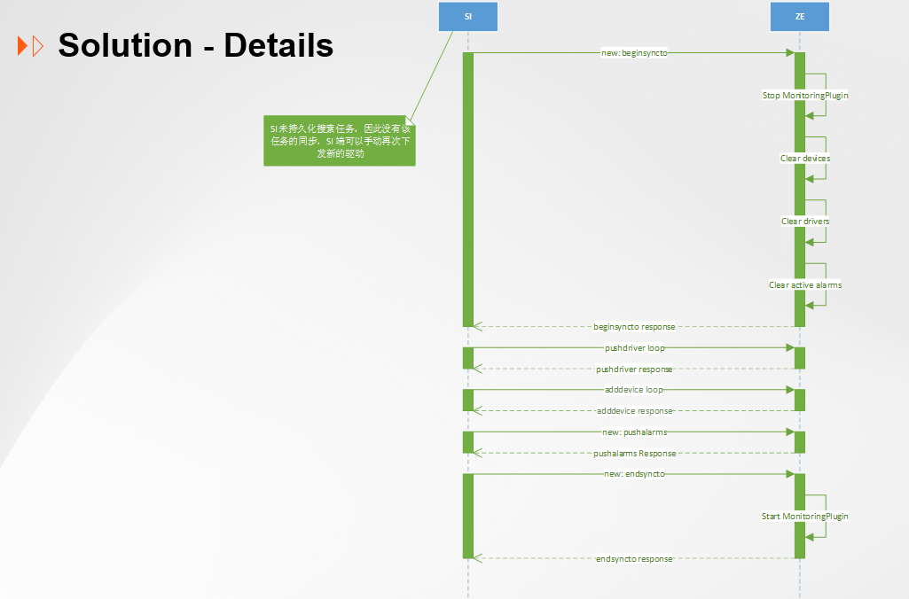

# SI4.0-备份功能兼容开发


## 修订记录


| 版本  | 时间        | 作者                     | 备注 |
|-----|-----------|------------------------|--|
| 1.1 | 2025.8.26 | juntao, quiency, james |  |


## 需求描述

在 backup-restore#1.md 的基础上, 需要支持以下功能
1. SI4.0.1 需要在恢复的时候, 支持恢复 zero engine端的相关数据
2. SI4.0.1 需要支持在 ferret+postgresql 环境下, 用备份包进行跨机器恢复

需求背景/需求功能/功能描述模块同 backup-restore#1.md


## 需求背景


## 需求功能


## 功能描述

## 系统架构


## 接口
备份还原中涉及的是三个核心接口：

> /api/rest/v1/dump
>
> /api/rest/v1/restore
>
> /api/rest/v1/backuprecovery/statelistener


## 详细设计
### 备份
#### 过程
1. 校验请求(文件名/参数/可达/密码/文件可读/磁盘充足等)
2. 执行备份指令
3. 加密备份包

#### 指令
```shell
// 1. 在容器内清理并创建临时目录
/usr/bin/docker exec ferret-postgres sh -c 'rm -rf /tmp/pg_backup && mkdir -p /tmp/pg_backup'

// 2. 执行 pg_basebackup 获取数据库备份
/usr/bin/docker exec ferret-postgres pg_basebackup -U postgres -h localhost -D /tmp/pg_backup --checkpoint=fast --wal-method=stream --max-rate=100M -Ft -z

// 3. 删除主机上的临时目录
/bin/sh -c sudo /usr/bin/rm -rf /var/opt/back-temp

// 4. 在主机上创建临时目录
/bin/sh -c sudo /usr/bin/mkdir -p /var/opt/back-temp

// 5. 从容器复制备份文件到主机
/bin/sh -c sudo /usr/bin/docker cp ferret-postgres:/tmp/pg_backup/. /var/opt/back-temp

// [new] 6. 保存当前机器的数据库配置文件
/bin/sh -c sudo cp /etc/opt/trellissmartinfrasight/ferret/.ferret_password /var/opt/back-temp

// 7. 清理容器内的临时目录
/usr/bin/docker exec ferret-postgres rm -rf /tmp/pg_backup

// 8. 更改主机上临时目录的所有权
/bin/sh -c sudo /usr/bin/chown -R si_app:si /var/opt/back-temp

// 9. 将备份文件压缩到目标目录
/usr/bin/tar -czvf /backups/backup_20231201_123045.tar.gz -C /var/opt/back-temp .

// 10. 清理主机上的临时目录
/bin/sh -c sudo /usr/bin/rm -rf /var/opt/back-temp
```

### 还原
#### 过程
backuprecovery 插件:
1. 校验请求(文件名/参数/可达/密码/文件可读/磁盘充足等)
2. [new] 在当前机器新建并且把当前数据库的备份和还原记录写入临时文件(/var/opt/trellissmartinfrasight/smartInfrasight_recovery_file)
3. 解密 .dbsi 文件
4. 执行恢复指令(包括重启 ferretdb([new]), ferret-postgres)
5. [修改顺序] 重启 tafsvc (zero engine 不需要重启)


si-portal(最后一个业务插件) 重启的时候:
1. [new] 检测是否存在临时文件(/var/opt/trellissmartinfrasight/smartInfrasight_recovery_file), 存在则执行以下逻辑
2. [new] 读取文件, 并且把文件里面的备份 && 恢复记录插入/更新到数据库
2. [new 接口] 依次清除 zero engine 里面的设备(数据库+缓存), 驱动(清除三元组,但产品模板, 检测任务, 搜索树不删除), 活跃告警(数据库+缓存) && 停止监控后端插件(不再采集/接收告警等)
3. [new] 依次获并组装取驱动(三元组+产品模板), snmp设备(下发任一设备失败,则下面逻辑不走), snmp设备的活跃告警数据, 由 SI 通过接口下发到 zero engine
4. [new] 不管下发成功或失败, 都删除临时文件
5. [new 接口] 不管下发成功或失败, 都启动监控插件等
6. 出现异常时, 以上所有逻辑都会把异常捕获住, 打印日志, 不影响 si-portal 和 SI 的启动


#### 指令
```shell
// 1. 删除还原临时目录
rm -rf /var/opt/SI-Backup/unzip

// 2. 新建还原临时目录
mkdir /var/opt/SI-Backup/unzip

// 3. 解压备份包(代码已经解密完) <br
tar -zxvf /var/opt/SI-Backup/mtp_4.0.1_20250822150454-backup.dbtmp -C /var/opt/SI-Backup/unzip

// 4. 停止数据库
docker stop ferret-postgres

// 5. 删除数据库数据目录
/bin/sh -c sudo /usr/bin/rm -rf /opt/trellissmartinfrasight/data/

// 6. 新建数据库数据目录
/bin/sh -c sudo /usr/bin/mkdir /opt/trellissmartinfrasight/data/

// 7. 把数据库数据文件解压到目录下
sudo /usr/bin/tar -xzvf /var/opt/SI-Backup/unzip/base.tar.gz -C /opt/trellissmartinfrasight/data

// 8. 删除数据库的事务日志目录
/bin/sh -c sudo /usr/bin/rm -rf /opt/trellissmartinfrasight/data/pg_wal/

// 9. 新建数据库的事务日志目录
/bin/sh -c sudo /usr/bin/mkdir /opt/trellissmartinfrasight/data/pg_wal/

// 10. 把数据库事务日志解压到目录下
sudo /usr/bin/tar -xzvf /var/opt/SI-Backup/unzip/pg_wal.tar.gz -C /opt/trellissmartinfrasight/data/pg_wal

// 11. 授予数据库数据目录权限
sudo /usr/bin/chown -R si_db:si /opt/trellissmartinfrasight/data
sudo /usr/sbin/restorecon -R /opt/trellissmartinfrasight/data

// [new] 12. 覆盖原机器上的 ferretdb 密码
/bin/sh cp /var/opt/SI-Backup/unzip/.ferret_password  /etc/opt/trellissmartinfrasight/ferret/.ferret_password
/bin/sh -c "NEW_PASSWORD=$(cat \"/etc/opt/trellissmartinfrasight/ferret/.ferret_password\") && sed -i \"s#^\\(taf\\.db\\.password={cipher}\\).*#\\1$NEW_PASSWORD#\" \"/etc/opt/trellissmartinfrasight/application-prod.properties\"

// 13. 删除所有临时文件
rm -rf /var/opt/SI-Backup/unzip

// 14. 重启 postgresql 数据库
docker start ferret-postgres
[new] docker restart ferretdb

```

#### 从 SI 下发数据到 zero engine(代替 zero engine备份/恢复)
1. 通讯配置+设备实例: <br> 
从数据库获取到设备及其使用的通讯配置, 基于 BatchAddDevicesAction(si-portal) 异步, 线程池添加设备逻辑, 复制出来一个新方法, 主逻辑修改为只添加设备到 zero engine, 其他逻辑都不需要 <br>

2. 活跃告警: <br>
从数据库获取到snmp设备的活动告警(alarms), 调用接口下发数据到 zero engine <br>
需新增接口(zeadapter, zero engine) (请求入参为 cid(deviceId 需替换为 zero engine的), 告警等级, 时间戳) <br>

3. 驱动数据: <br>
从数据库获取到驱动三元组后, 循环调用 zeadapter 相应 action, 全部走新增驱动逻辑, <br> 
不走更新/删除(因为前面开启下发的接口已经把 zero engine 里面的驱动清空了); <br>

设备发现相关(搜索树&&检测任务)在 SI 端没有初始化, 没数据下发到 zero engine, 不能保持两端一致性 !!!<br>
目前有两个方案: <br>
 a. 保存为客户新增/更新驱动时候的压缩包, 这边保存下来, 然后在界面恢复完之后, 再手动按照顺序上传这些驱动压缩包 <br>
    如果客户没做过新增/更新驱动, 则因为上面开启下发的接口, 会把驱动删除, 但是设备发现的相关的表不会删除, 还保留着, 则无影响 <br>
    如果客户做过删除默认驱动, 则在删除的时候就会同步删除设备发现的表, 无影响 <br>
 b. 在备份的时候, 请求 zero engine 获取设备发现的相关表数据, 存储为两个 json 文件, 一起放到备份包中; 然后在恢复的时候, 再把数据通过接口下发到 zero engine. <br>
    这样的话, 需要在 zero engine, zeadapter 都新增两个接口(获取/插入设备发现的表) <br>
    
   
 但这样引申出另外一个做法(目前考虑到 zero engine是节点, 不做): 要不全量备份 zero engine 的数据库数据到备份包里面? 然后再还原到 zero engine 的数据库 mysql? <br>
    这样的话, 上面 2~4 都不用做; <br>

基于目前情况, 选用方案a
    


还原过程 5-7 图如下: <br>



## 升级


## 影响点
性能: 备份/恢复时长? <br>
      改动前后, 对于备份所需要的时间基本没啥变化 <br>
      改动前, 恢复的主要耗时在解压数据库数据到目录这里; <br>
      改动后, 恢复耗时需要再加上下发设备(时间和设备数量有关,但单个处理所需时间应该很短), <br> 
      驱动(循环调用对应接口下发, 时间和驱动数量有关, 除非数量很多, 否则时间应该也不长), <br>
      活跃告警(从 SI 获取所有活跃告警后调用一次接口批量下发, 时间应该很短) <br>

功能: license 滥用, 买一个高等级的 license, 可以再到低等级的 license 机器上还原, 目前不考虑<br>

## 日志
```shell
//1. /var/opt/trellissmartinfrasight/recovery_file 文件不存在，打印日志
File not exist, do not need to push date to zero engine


//2. 数据库不存在 zero engine 配置
Zero Engine does not exits.

//3. 开始下发逻辑
Start to clear the datas in zero engine
Finish to clear the datas in zero engine


// 开始下发过程中出现错误
Start sync to zero engine failed, {error message}


//4. 开始下发驱动
Start to push driver to zero engine
Finish to push driver to zero engine


// SI 数据库不存在 snmp 驱动可供下发
Not exist any snmp driver to push to zero engine


// 下发某个驱动失败
{driverName} : push driver to zero engine failed, {error message}


//5. 开始下发设备
Start to push device to zero engine
Finish to push device to zero engine


// SI 数据库不存在 snmp 设备可供下发
Not exist any snmp device to push to zero engine


// 下发某个设备失败
{deviceName} : push device to zero engine failed, {error message}


// 下发设备失败
Push devices to zero engine failed: {error message}


//6. 开始下发活跃告警
Start to push active alarms to zero engine
Finish to push active alarms to zero engine


// SI 数据库不存在 snmp 设备的活跃告警可供下发
Not exist any snmp active alarm to push to zero engine


// 下发活跃告警失败
Push alarms to zero engine failed, {error message}


//7. 整个流程下发成功
Push data to zero engine successfully


//8. 删除文件失败
Delete recovery_file failed


//9. 开始结束下发
Start to end sync response to zero engine
Finishto end sync response to zero engine


// 结束下发失败
End sync to zero engine failed, {error message}
```
