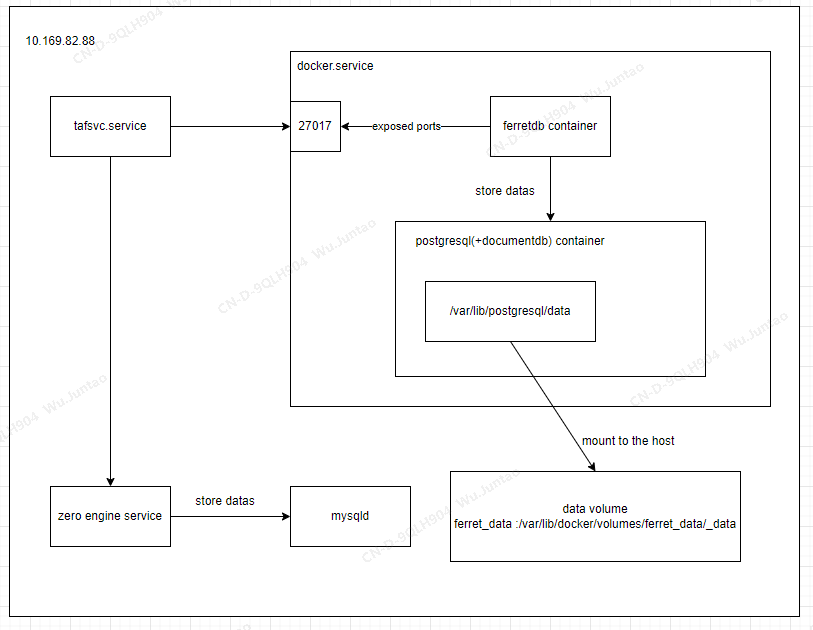
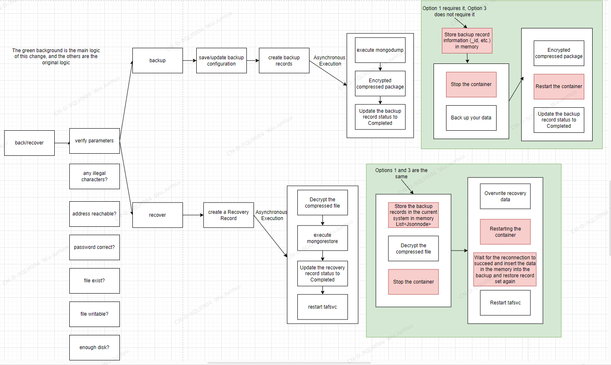
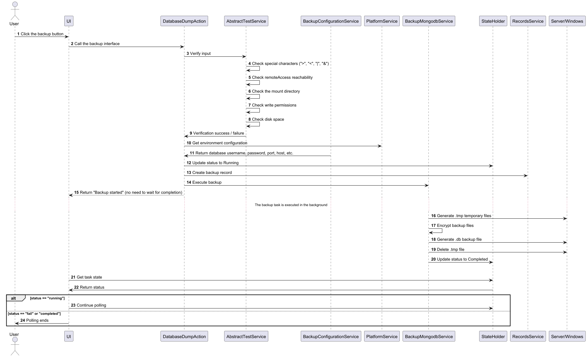
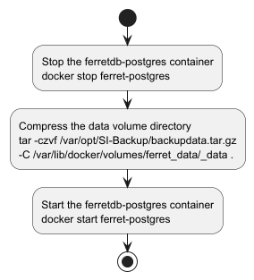
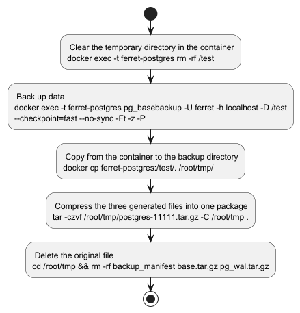
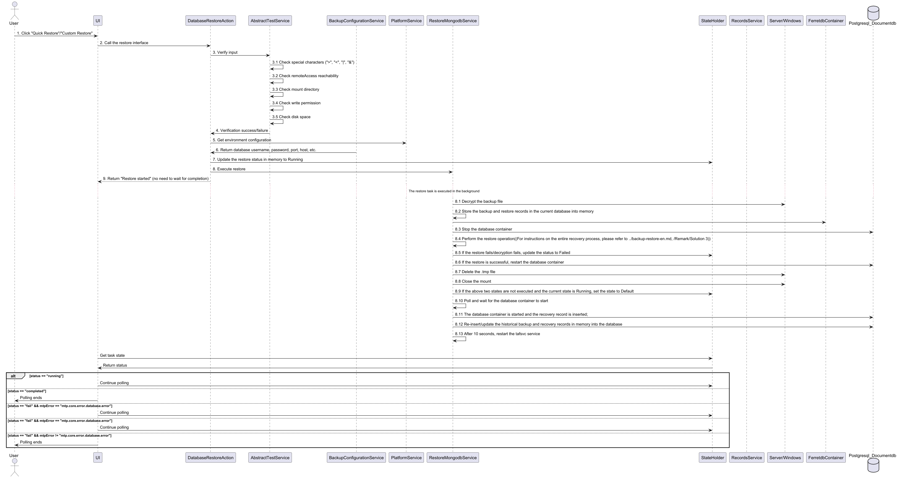

# SI4.0-Backup function compatible development

## Revision History

| version | date-time | author          | tips |
|---------|-----------|-----------------|------|
| 1.0     | 2025.3.5  | Quiency, juntao | Initial release |

## Requirement Description

- SI4.0 users need to continue to use the data backup and restore function

## Demand background

In SI4.0, the database is switched from mongodb to ferretdb (using postgresql + documentdb extension to store data), and the mongodump and mongorestore commands cannot be used.
The backup and recovery services still need to be available, and the expected effect should be the same as before, so the original functions need to be recoded.

## Request function

​	Keep consistent with the original backup and restore function

## Functional Description

1. Back up directly to the server (as shown in backup record 2)

2. Back up to another Windows machine (as shown in backup record 1)

3. Quick restore (as shown in Quick restore backup record 2)

4. Custom recovery, enter the specified backup file name, and you can also choose to restore from the server or from another Windows machine.

## System Architecture
The backup and recovery of zero engine is not considered this time.。 

## Interface
Three interfaces involved in backup and restore:

> /api/rest/v1/dump
>
> /api/rest/v1/restore
> 
> /api/rest/v1/backuprecovery/statelistener

## Detailed Design
### Backup and recovery solutions
|                   | Solution 1                                                                                                                                                                                                                                                                                                                                                  | Solution 2                                                                                                                                                                                                                                                                                                                                                     | Solution 3                                                                                                                                                                                                                                                                                                                              | 
|-------------------|-------------------------------------------------------------------------------------------------------------------------------------------------------------------------------------------------------------------------------------------------------------------------------------------------------------------------------------------------------------|----------------------------------------------------------------------------------------------------------------------------------------------------------------------------------------------------------------------------------------------------------------------------------------------------------------------------------------------------------------|-----------------------------------------------------------------------------------------------------------------------------------------------------------------------------------------------------------------------------------------------------------------------------------------------------------------------------------------|
| Content           | Directly compress and mount the host's data directory to back up,  unzip and overwrite the data directory to restore                                                                                                                                                                                                                                     | pg_dump backup, pg_restore recovery                                                                                                                                                                                                                                                                                                                            | pg_basebackup backup, unzip and overwrite the data directory to restore                                                                                                                                                                                                                                                                 |
| Backup method     | Physical backup                                                                                                                                                                                                                                                                                                                                             | Logical backup                                                                                                                                                                                                                                                                                                                                                 | Physical backup                                                                                                                                                                                                                                                                                                                         |
| Main instructions | docker(stop/start)、tar                                                                                                                                                                                                                                                                                                                                      | docker(exec)、pg_dump、pg_restore、psql                                                                                                                                                                                                                                                                                                                           | docker(stop/start/exec)、pg_basebackup、tar                                                                                                                                                                                                                                                                                               |
| Backup Content    | .tar.gz file (Postgresql data directory)                                                                                                                                                                                                                                                                                                                    | .dump file (table structure, data, etc.)                                                                                                                                                                                                                                                                                                                       | Compressed package: manifest (metadata), base (all data), pg_wal (transaction log, etc.)                                                                                                                                                                                                                                                |
| Recovery method   | Decompress and overwrite the original data volume                                                                                                                                                                                                                                                                                                           | pg_restore import table by table                                                                                                                                                                                                                                                                                                                               | Decompress & copy and overwrite                                                                                                                                                                                                                                                                                                         |
| Business impact   | Both backup and restore require restarting the database service, and the service is unavailable during this period                                                                                                                                                                                                                                          | No need to restart the database service                                                                                                                                                                                                                                                                                                                        | Restore requires restarting the database service, and the service is unavailable during this period                                                                                                                                                                                                                                     | 
| Risks             | 1. Consistency is not guaranteed. If the database is running, incomplete data may be backed up  2. Large storage usage (including indexes, logs, etc.) 3. Cross-version recovery may fail (may not be able to recover when the PostgreSQL version is incompatible) 4. Not suitable for incremental backup (full backup is required every time)  | 1. Backup & recovery is slow (SQL import and export are slow when the data volume is large).  2. Indexes need to be rebuilt (indexes need to be rebuilt during recovery, which is time-consuming).  3. Structural changes may cause recovery failure (such as schema changes).                                                                           | 1. PostgreSQL needs to be shut down for recovery (may require downtime).  2. Not suitable for cross-version migration (different versions of PostgreSQL may be incompatible).  3. The backup file is large (but lighter than solution 1).  4. Depends on pg_wal archive logs, which may require additional storage management. |
| Applicability     | 1. Applicable to small databases, and can be used when the business can be shut down for backup.  2. Applicable to persistent storage of data in containers, but not applicable to Kubernetes.  3. Simple operation, no PostgreSQL commands required                                                                                                  | 1. Applicable to small to medium-sized databases (GB level).  2. Cross-platform/cross-version migration (PostgreSQL, FerretDB).  3. Recommended for Kubernetes/container environments.  4. Applicable to cross-version recovery (PostgreSQL has good compatibility).  5. Supports incremental backup (can be backed up by table or database).   | 1. Backup and recovery of large data volumes (TB level).  2. Applicable to situations where the PostgreSQL version is consistent.  3. Applicable to disaster recovery (complete physical recovery).                                                                                                                               |

### Solution performance comparison
Test environment: 10.169.82.35, physical machine (4-core CPU, Intel(R) Xeon(R) E-2124 CPU @ 3.30GHz, 15GB memory, 1.5T mechanical hard disk) 
SI environment: develop branch package, delete the four indexes of report.tsd, keep the original _id index, insert data and test the performance of backup and recovery when the tafsvc service is stopped  
Database environment: docker container ferret-postgres(postgres-documentdb17) + ferretdb(ferretdb-v2.0.0), the configurations are all default values, and no parameter tuning has been done  
Test steps: Add two RDUs, 10.146.102.16 and 10.169.88.5, and test the performance of the three solutions with a small amount of data  
(The following 40s is the time from the restart of the ferret-postgres container to the time it is restarted. The average time it takes for a ferretdb container to be queried normally (fixed value) 

|            | Backup time | Restore time |
|------------|-------------|--------------|
| Solution 1 | 42s + 40s   | 10s + 40s    |
| Solution 2 | 54s         | 2m35s        |
| Solution 3 | 22s         | 6s + 40s     |

Insert 1kw, 2kw, and 4kw data respectively, and compare the time of the three solutions:

|                         | 1025w datas | 2025w datas | 4167w datas |
|-------------------------|-------------|-------------|-------------|
| Solution 1 Backup time  | 2m43s + 40s | 4m5s + 40s  | 8m21s + 40s |
| Solution 2 Backup time  | 3m17s       |             |             |
| Solution 3 Backup time  | 1m42s       | 4m1s        | 8m23s       |
|                         |             |             |             |
| Packet size             | 1.3G        | 1.8G        | 2.9G        |
|                         |             |             |             |
| Solution 1 Restore time | 2m13s + 40s | 3m40s + 40s | 8m16s + 40s |
| Solution 2 Restore time | 10m52s      |             |             |
| Solution 3 Restore time | 1m21s + 40s | 3m45s + 40s | 7m58s + 40s |

Conclusion: Choose Solution 3  
Reasons:
1. With 1kw of data, and when the index is removed from the historical data set (report.tsd), the restore time of Option 2 is 10m52s, which is much longer than other options; 
2. And if the index is not deleted, pg_restore needs to rebuild the index. It takes 13 minutes to rebuild the index for 2kw of data. The larger the data volume, the longer it takes, so Option 2 is excluded; 
3. The backup instructions of Option 3 are provided by postgresql, which is more reliable than Option 1 to manually compress the data directory; 
4. Option 3 takes less time than Option 1 in the backup from 1kw to 4kw. The main source of the difference is the time to restart the container. Option 3 can be backed up without shutting down the container, and the business impact is relatively smaller; 

This backup and restore only changes the logic of the original mongodump and mongorestore, and no additional processing is introduced for other old logic; See the following design for details

### Backup
The backup and recovery logic has changed as follows compared to the original logic:  

The entire backup process is shown in the figure below (the process that needs to be changed is the specific command to perform the backup)

Backup process for solution 1 

Backup process for solution 3 

### Recovery
The restoration process is as follows. There is no difference in the restoration process design between Scheme 1 and Scheme 3.

## Upgrade

## Impact Points

## Performance Reference
Machine specifications: physical machine (4-core CPU, Intel(R) Xeon(R) E-2124 CPU @ 3.30GHz, 15GB memory, 1.5T mechanical hard disk)

Backup and recovery data volume and time:

|              | 4kw   | 1.2e  | 10e     |
|--------------|-------|-------|---------|
| Backup time  | 10min | 28min | 3h32min |
| Recover time | 10min | 20min | 3h35min |

tip:
1.2E data backup and restore execution time in the program: 
Used machine: 10.146.102.24 (R250), compared with R350, the CPU is weaker, but the hard disk speed is slightly better 
Backup time: 28m (backup to the server) 
Restore time: 20m (from clicking restore to service restart) 
Backup file size: 8.8G 
The total disk size occupied during the backup and restore process is approximately: 18G 
Index situation: All collections and all indexes are 

10E data direct command backup and restore execution time: 
Used machine: 10.169.82.35 (R350) 
Backup time: 3h31m (pure instruction operation time) 
Restore time: 3h33m (Pure command operation takes time) 
Backup file size: 56.1G 
The total disk size occupied during backup and restore is approximately: 112G 
Index situation: report.tsd has only one index, _id, and the other four indexes are deleted 

## Remark
### Solution Command Examples

Solution 1：

> Backup：
>
> docker stop ferret-postgres （stop db）
>
> tar -czvf /var/opt/SI-Backup/data-22.tar.gz  -C /var/lib/docker/volumes/ferret_data/_data . （Compress the data volume to the specified directory）
>
> docker start ferret-postgres（start db）

> Recovery：
>
> docker stop ferret-postgres（stop db）
>
> tar -zxvf /var/opt/SI-Backup/data-22.tar.gz -C /var/lib/docker/volumes/ferret_data/_data/.（Unzip the backup file to the data directory of the data volume）
>
> docker start ferret-postgres（start db）

---

Solution 2：

> Backup：
>
> docker exec -it ferret-postgres pg_dump -h localhost -U ferret -d postgres -F c -f /test/backup.pg（Backup business data）
>
> docker exec -it ferret-postgres psql -U ferret -d postgres -c "\COPY documentdb_api_catalog.collections TO '/test/collections_backup.csv' WITH CSV HEADER"（Backup collections）
>
> docker exec -it ferret-postgres psql -U ferret -d postgres -c "\COPY documentdb_api_catalog.collection_indexes TO '/test/collection_indexes_backup.csv' WITH CSV HEADER"（Backup collections indexes）

> Recovery：
>
> docker exec -it ferret-postgres pg_restore -h localhost -U ferret -d postgres -c /test/backup.pg（recover business data）
>
> docker exec -it ferret-postgres psql -U ferret -d postgres -c "\COPY documentdb_api_catalog.collections FROM '/test/collections_backup.csv' WITH CSV HEADER"（recover collections）
>
> docker exec -it ferret-postgres psql -U ferret -d postgres -c "\COPY documentdb_api_catalog.collection_indexes FROM '/test/collection_indexes_backup.csv' WITH CSV HEADER"（recover index）

---

Solution 3：

> Backup：
>
> docker exec -t ferret-postgres rm -rf /test（Clear the temporary directory inside the container）
>
> docker exec -t ferret-postgres pg_basebackup -U ferret -h localhost -D /test --checkpoint=fast --no-sync -Ft -z -P（Backup datas）
>
> docker cp ferret-postgres:/test/. /root/tmp/（Copy from container to backup directory）
>
> tar -czvf /root/tmp/postgres-11111.tar.gz -C /root/tmp . && rm -f /root/tmp/backup_manifest /root/tmp/base.tar.gz /root/tmp/pg_wal.tar.gz（Compress the three generated files into one package）

> recover：
>
> 1.Restore from local server:
> 
> rm -rf /var/opt/SI-Backup/unzip
>
> mkdir /var/opt/SI-Backup/unzip
>
> tar -zxvf /var/opt/SI-Backup/mtp_4.0.0_20250320101657-backup.dbtmp -C /var/opt/SI-Backup/unzip
>
> docker stop ferret-postgres
>
> /bin/sh -c rm -rf /var/lib/docker/volumes/ferret_data/_data/*
>
> tar -xzvf /var/opt/SI-Backup/unzip/base.tar.gz -C /var/lib/docker/volumes/ferret_data/_data
>
> /bin/sh -c rm -rf /var/lib/docker/volumes/ferret_data/_data/pg_wal/*
>
> tar -xzvf /var/opt/SI-Backup/unzip/pg_wal.tar.gz -C /var/lib/docker/volumes/ferret_data/_data/pg_wal
>
> rm -rf /var/opt/SI-Backup/unzip
>
> docker start ferret-postgres
>
> 2.Restore from remote windows:
> 
> rm -rf /var/opt/trellissmartinfrasight/mount-backup-share/unzip
>
> mkdir /var/opt/trellissmartinfrasight/mount-backup-share/unzip
>
> tar -zxvf /var/opt/trellissmartinfrasight/mount-backup-share/mtp_4.0.0_20250320161804-backup.dbtmp -C /var/opt/trellissmartinfrasight/mount-backup-share/unzip
>
> docker stop ferret-postgres
>
> /bin/sh -c rm -rf /var/lib/docker/volumes/ferret_data/_data/*
>
> tar -xzvf /var/opt/trellissmartinfrasight/mount-backup-share/unzip/base.tar.gz -C /var/lib/docker/volumes/ferret_data/_data
>
> /bin/sh -c rm -rf /var/lib/docker/volumes/ferret_data/_data/pg_wal/*
>
> tar -xzvf /var/opt/trellissmartinfrasight/mount-backup-share/unzip/pg_wal.tar.gz -C /var/lib/docker/volumes/ferret_data/_data/pg_wal
>
> rm -rf /var/opt/trellissmartinfrasight/mount-backup-share/unzip
>
> docker start ferret-postgres
>