# AI Agent 工作流平台 · 技术规格说明书

> 版本：v3 · 受众：研发 / 架构 / SRE · 配套源码：`packages/{engine,runner,server,worker,shared,web}`

本文档以源码为依据，逐层拆解平台的架构、调度算法、容器隔离、可靠性与扩展性设计。所有关键论点均会附上对应的源码位置（`package:path:line`）以便溯源。

---

## 目录

1. [系统总体架构](#1-系统总体架构)
2. [模块拓扑与运行进程](#2-模块拓扑与运行进程)
3. [数据模型（ER 与状态机）](#3-数据模型er-与状态机)
4. [DAG 工作流引擎原理](#4-dag-工作流引擎原理)
5. [隔离与安全设计](#5-隔离与安全设计)
6. [可靠性工程](#6-可靠性工程)
7. [API 与扩展性](#7-api-与扩展性)
8. [关键源码索引](#8-关键源码索引)

---

## 1. 系统总体架构

平台采用 **「消息总线 + 状态机 + 容器化执行器」** 的三层异步架构。其设计目标是：在保证工作流可被人类介入、回退和审计的前提下，实现高并发的 AI Agent 调度。

```mermaid
flowchart LR
    subgraph Client["客户端层"]
        Web["React Web UI<br/>(@xyflow/react + shadcn)"]
        SDK["REST / SDK 调用方"]
    end

    subgraph Gateway["API 网关层"]
        Server["Server (Express)<br/>:4000"]
        WS["Socket.io 网关<br/>命名空间 /workflow"]
    end

    subgraph Engine["调度引擎层 (engine 包)"]
        Dispatcher["Dispatcher (tickRun)"]
        Intents["Intent Handler"]
        Guards["Guards<br/>(CircuitBreaker / Recovery)"]
        Prompt["Prompt Assembler"]
    end

    subgraph Bus["消息与队列层"]
        BullMQ[("BullMQ Job Queue<br/>(Redis)")]
        DBMsg[("Message 表<br/>(PostgreSQL)")]
    end

    subgraph Worker["执行进程层"]
        WorkerProc["Worker 进程<br/>(BullMQ Consumer)"]
        ContainerMgr["ContainerManager"]
        StreamCol["StreamCollector"]
        ResultRd["ResultReader"]
    end

    subgraph Sandbox["容器隔离层 (Docker)"]
        AgentC["Runner Container<br/>(cursor-agent)"]
        ShellC["Shell Container<br/>(alpine)"]
        Volume["Shared Volume<br/>/shared/&lt;runId&gt;"]
    end

    subgraph State["状态存储层"]
        PG[("PostgreSQL<br/>Prisma ORM")]
        Redis[("Redis<br/>BullMQ + Pub/Sub")]
        FS[("Host FS<br/>storage/logs/*.jsonl")]
    end

    Web -->|REST /api/*| Server
    Web <-->|订阅 run:{id}| WS
    SDK --> Server

    Server -->|读写状态| PG
    Server -->|emitFlow / clonePlan| Dispatcher
    Server <-->|kill-containers / human-respond| WS

    Dispatcher -->|消费 + 持久化| DBMsg
    Dispatcher -->|enqueueExecute| BullMQ
    Dispatcher --> Guards
    Dispatcher --> Intents
    Intents --> DBMsg

    BullMQ -->|consume| WorkerProc
    WorkerProc --> Prompt
    WorkerProc --> ContainerMgr
    ContainerMgr -->|dockerode API| AgentC
    ContainerMgr -->|dockerode API| ShellC
    AgentC <-.读写.-> Volume
    ShellC <-.读写.-> Volume

    AgentC -.stdout/stderr.-> ContainerMgr
    ContainerMgr --> StreamCol
    StreamCol -->|append| FS
    StreamCol -->|emit| WorkerProc
    WorkerProc -->|socket worker-event| WS
    WS -->|event| Web

    WorkerProc -->|更新 NodeExecution| PG
    BullMQ <--> Redis
```

**关键观察点**：
*   **Dispatcher 与 Worker 解耦**：Dispatcher 仅负责"决策下一步做什么"（写入 `Message` 表 + 入 BullMQ 队列），Worker 仅负责"执行已分配的任务"。两者通过 Redis 队列异步通讯，可水平扩展。
*   **状态机持久化在 PostgreSQL**：任何节点状态流转都必须经过事务，保证崩溃后可恢复（详见 §6.2）。
*   **日志双链路**：实时链路走 Socket.io 推送给前端；归档链路写入 `storage/logs/<runId>/<execId>.jsonl`，供事后审计。

---

## 2. 模块拓扑与运行进程

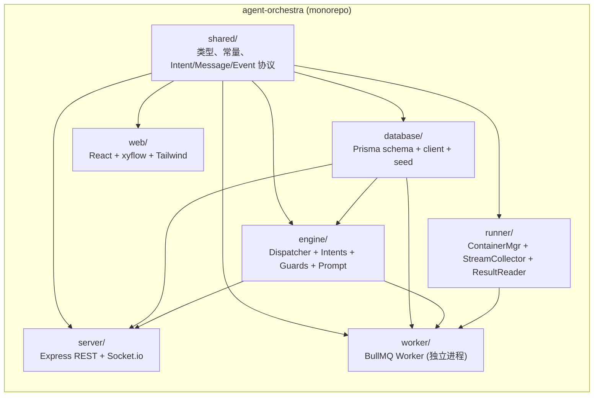

### 2.1 运行时进程拓扑

| 进程 | 端口 | 启动命令 | 职责 |
|------|------|----------|------|
| `server` | 4000 | `npm run dev:server` | REST API、Socket.io 网关、转发 worker-event |
| `worker` | – | `npm run dev:worker` | 消费 BullMQ、调用 engine handler、操作 Docker |
| `web` | 5173 | `npm run dev`（内含 wait-for-web） | React 前端，xyflow 可视化编排 |
| `ao-postgres` | 5432 | `docker compose up` | 状态持久化 |
| `ao-redis` | 6379 | `docker compose up` | BullMQ 队列 + Pub/Sub |

> 注：`server` 与 `worker` 共享同一 Prisma 数据库连接，但**不直接 RPC**，所有跨进程通讯均通过 Redis（BullMQ）和 Socket.io 完成（见 `packages/worker/src/index.ts:32-38`）。

---

## 3. 数据模型（ER 与状态机）

平台的数据模型分为 **模板层（Workflow）** 和 **运行时层（Run/Plan）**。每次 `POST /api/runs` 时引擎会将 `Workflow → RunPlan` 做一次深拷贝，保证模板不被运行时污染（见 `engine/src/dispatcher/dispatcher.ts:412-456` 的 `clonePlanFromTemplate`）。

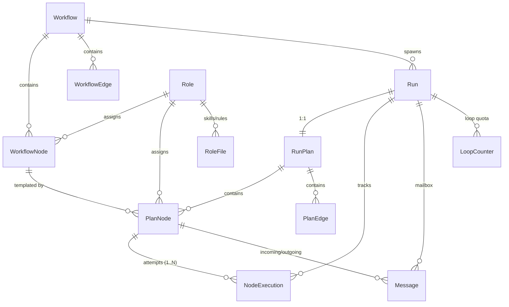

### 3.1 Run 状态机

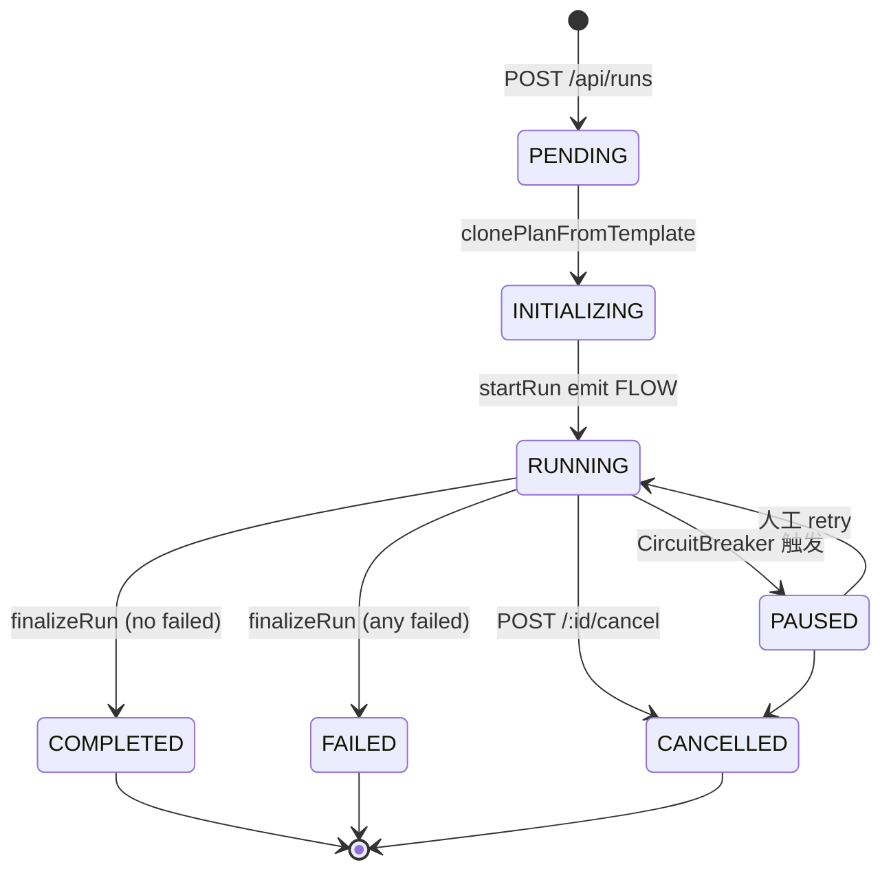

### 3.2 NodeExecution 状态机（关键）

> 一个 `PlanNode` 可以拥有多个 `NodeExecution`（attempt 1..N）。一次 Loopback 不复用旧记录，而是将旧记录置为 `SUPERSEDED` 并创建新的 `NodeExecution`——这是平台「可回退」与「可审计」的核心机制。

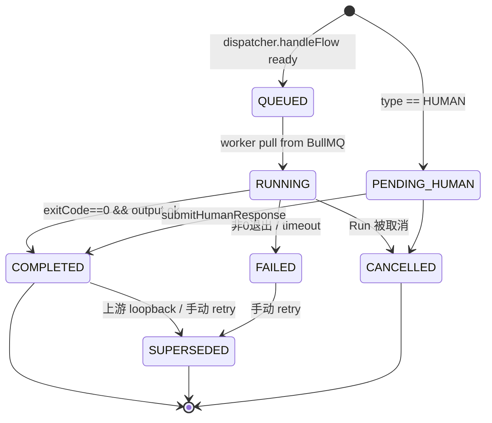

**`SUPERSEDED` 的设计意图**：保留所有历史尝试在数据库中，方便审计回放，但调度时这些记录不再参与 `upstream ready` 判定。

---

## 4. DAG 工作流引擎原理

### 4.1 消息总线驱动模型

引擎不直接调用节点函数，而是把节点间的依赖关系建模成 **Message 邮箱**。所有调度决策都通过消费 `Message` 表中 `consumed=false` 的记录来推动（见 `engine/src/dispatcher/dispatcher.ts:36-96`）。

支持四种消息类型：

| MessageKind | 触发时机 | 处理函数 | 副作用 |
|-------------|---------|----------|--------|
| `FLOW` | 上游节点完成 / 启动 Run | `handleFlow` | 检查 ready，创建 `NodeExecution` |
| `LOOPBACK` | LLM 输出 loopback intent / CONDITION back-edge | `handleLoopback` | `SUPERSEDED` 子树 + 注入 feedback |
| `ESCALATE` | 循环超限 / 节点失败 | `handleEscalate` | 动态生成 HUMAN 节点 |
| `EDIT_REQUEST` | 人工修改节点配置 | `handleEditRequest` | 合并 `configOverride` |

### 4.2 Tick 主循环时序

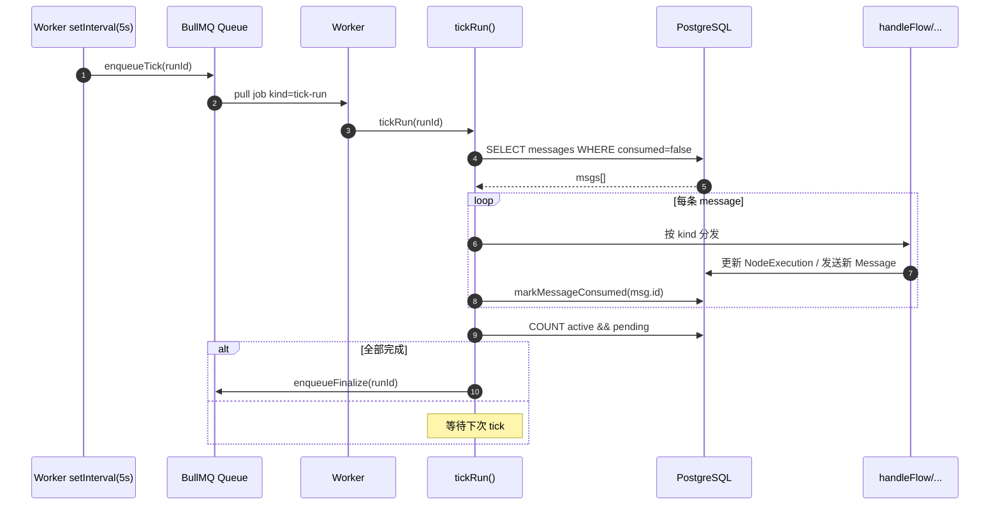

实现要点：
*   **幂等性**：BullMQ jobId（`exec-${executionId}`）做天然去重；消息消费后立即 `markMessageConsumed`，配合数据库事务保证 at-least-once 不会变成 at-many-times（`engine/src/dispatcher/messages.ts:77`）。
*   **周期性兜底**：Worker 启动后每 5 秒主动 enqueueTick 所有 RUNNING 的 Run（`worker/src/index.ts:93-104`），防止消息漏触发。

### 4.3 串行依赖与并行扇出（Fan-out / Merge）

**Merge（汇聚）逻辑**位于 `handleFlow`（`engine/src/dispatcher/dispatcher.ts:135-203`）：

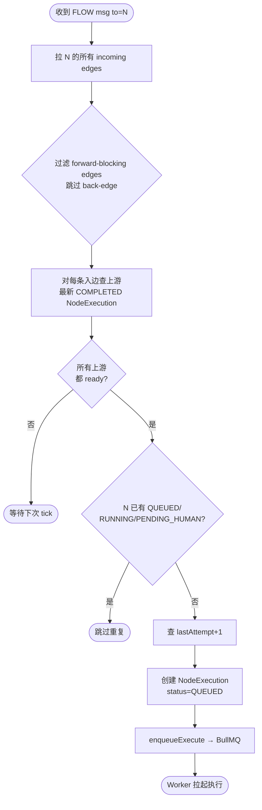

**Fan-out（扇出）逻辑**位于 `processIntents`（`engine/src/handlers/intents.ts:90-189`）。一个节点完成后，引擎会同时考虑：
1. **FLOW 出边**：始终广播（side-effect 边，如通知、日志）。
2. **CONDITION 出边**：根据 LLM 输出的 `data._branch.label` 选择唯一一条匹配。

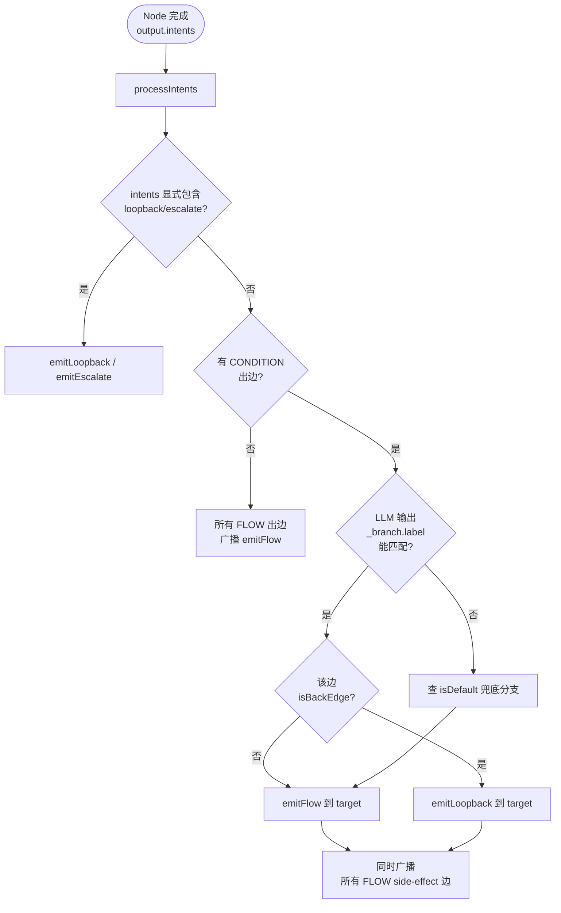

### 4.4 Loopback 打回循环（核心创新）

这是平台区别于普通工作流引擎的核心能力。其难点在于：**如何在打回时清除"脏中间产物"，同时保留可审计的历史？**

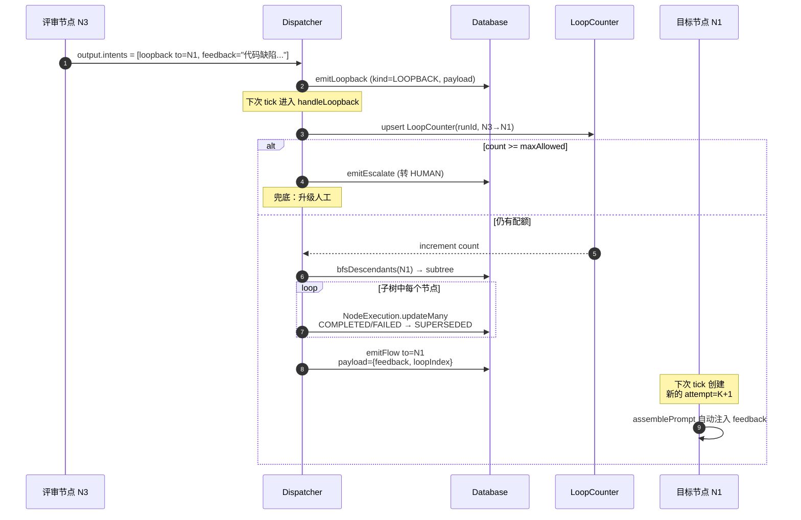

**三层防御**：
1. **`LoopCounter` 边粒度配额**：每条 `from→to` 对独立计数（`engine/src/dispatcher/dispatcher.ts:217-234`）。
2. **超限自动 ESCALATE**：达到 `maxLoops` 后转人工，避免死循环（`dispatcher.ts:236-255`）。
3. **`SUPERSEDED` 子树清理**：用 BFS（`engine/src/dag/graph.ts:25-39`）找到 `N1` 的严格下游，将其所有 `COMPLETED/FAILED` 状态置为 `SUPERSEDED`，但**跳过 `from`**（避免自环）。

**Prompt 反馈注入**：当 N1 重跑时，`assemblePrompt`（`engine/src/prompt/assembler.ts:113-121`）会自动从 FLOW message 中读取最近 5 条 `feedback`，以如下格式拼接到 user prompt 头部：

```
=== PREVIOUS ATTEMPT FEEDBACK (Loop 1 from N3) ===
代码缺陷...

=== INSTRUCTION ===
Address the feedback above and resubmit.

=== USER PROMPT ===
<原始 prompt>
```

### 4.5 Prompt Assembler 设计

```mermaid
flowchart LR
    Start([assemblePrompt]) --> LoadNode[加载 PlanNode + Role]
    LoadNode --> BFSAncestors[沿 FLOW 边反向 BFS<br/>跳过 HUMAN/CONDITION]
    BFSAncestors --> CollectOutputs[聚合祖先<br/>NodeExecution.outputPayload.summary]
    CollectOutputs --> LoadFeedback[拉最近 20 条 FLOW msg<br/>过滤 payload.feedback]
    LoadFeedback --> Substitute[占位符替换<br/>vars/output/role/files]
    Substitute --> InjectFeedback{有反馈?}
    InjectFeedback -- 是 --> PrependBlock[反馈块前置到 user prompt]
    InjectFeedback -- 否 --> Skip
    PrependBlock --> InjectRouting[拼接 CONDITION 出边<br/>生成 ROUTING block]
    Skip --> InjectRouting
    InjectRouting --> Return[返回 NodeExecutionPayload]
```

支持的占位符：

| 占位符 | 含义 | 替换源 |
|--------|------|--------|
| `{{vars.x}}` | 工作流变量 | `Run.variables` |
| `{{output.<Label>}}` | 祖先节点 summary | `NodeExecution.outputPayload.summary` |
| `{{files.<Label>}}` | 祖先共享目录 | `/shared/<ancestorPlanNodeId>` |
| `{{role.systemPrompt}}` | 角色提示词 | `Role.systemPrompt` |
| `{{secrets.KEY}}` | 加密密钥 | `SystemConfig` AES-256-GCM 解密 |

---

## 5. 隔离与安全设计

### 5.1 Docker 容器生命周期

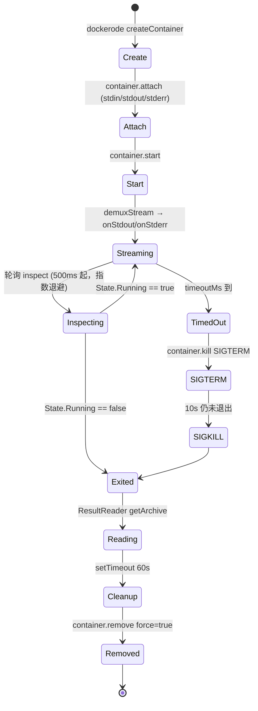

源码：`packages/runner/src/container-manager.ts:33-170`。

**关键设计点**：
*   **`waitForExit` 用 poll inspect 替代 `container.wait()`**：避免 Windows Docker Desktop 上 `wait()` 永不返回的 bug（`container-manager.ts:33-55`）。
*   **双信号退出**：先 `SIGTERM`，10 秒缓冲期后 `SIGKILL`，保证容器内进程有机会清理。
*   **60 秒 Debug 窗口**：容器退出后保留 60 秒以便 `ResultReader` 通过 `docker getArchive` 抓取 `/workspace/output/result.json`（`container-manager.ts:160-168`）。

### 5.2 资源配额（HostConfig）

| 限制项 | 默认值 | 配置变量 | 防护目标 |
|--------|--------|----------|----------|
| `Memory` | 2 GiB | `memoryBytes` | OOM 影响宿主机 |
| `CpuQuota / CpuPeriod` | 100% × 1 核 | `cpuQuota / cpuPeriod` | CPU 占满 |
| `PidsLimit` | 256 | `pidsLimit` | Fork 炸弹 |
| `NetworkMode` | `RUNNER_NETWORK` 桥接 | env | 切断敏感网段访问 |
| `AutoRemove` | `false` | 硬编码 | 保留 Debug 窗口 |

### 5.3 节点环境互不污染

每个节点执行都启动一个**全新的容器实例**，并通过以下机制保证隔离：

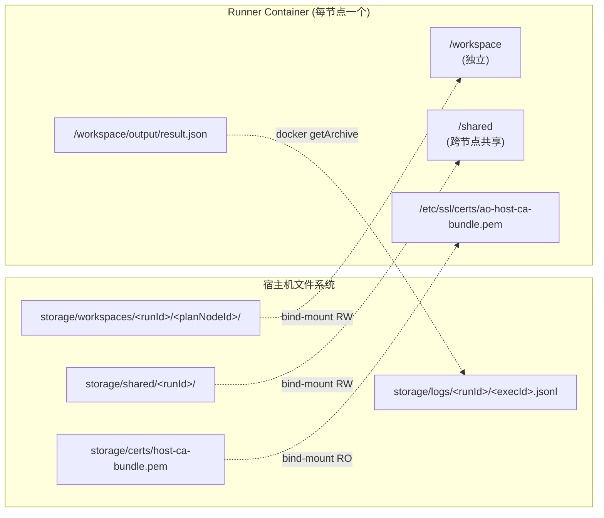

源码：`packages/worker/src/index.ts:177-220`。

**隔离原则**：
*   **私有 workspace**：`storage/workspaces/<runId>/<planNodeId>/` 仅挂给当前节点容器，节点 A 看不到节点 B 的文件。
*   **显式共享通道**：跨节点产物交换必须显式写入 `/shared/<sourcePlanNodeId>/`，下游通过 `{{files.<Label>}}` 显式引用，符合"零信任 + 按需共享"原则。
*   **只读 CA bundle**：宿主机 CA 证书以 `:ro` 挂载，容器无法篡改信任链。
*   **基础镜像预热**：`VolumeManager.createBaseImage` 在 Run 启动时把 `git clone + npm install` 烤成一个 `agent-orchestra/base:run-<runId>` 镜像（`runner/src/volume-manager.ts:43-81`），后续每个节点都基于此镜像启动，**不在节点内重复拉取依赖**。

### 5.4 Secret 安全注入

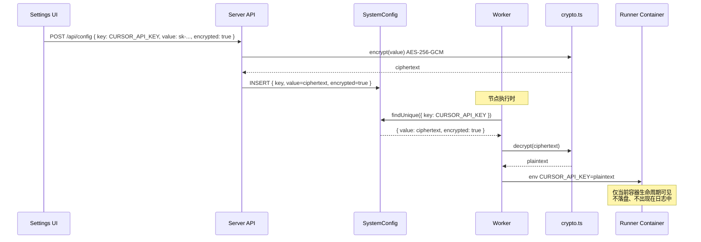

源码：`packages/worker/src/index.ts:415-425` + `packages/worker/src/crypto.ts`。

---

## 6. 可靠性工程

### 6.1 实时日志透传链路

实时日志走 **6 段管道**，从容器内 `stdout` 字节流一路推送到浏览器：

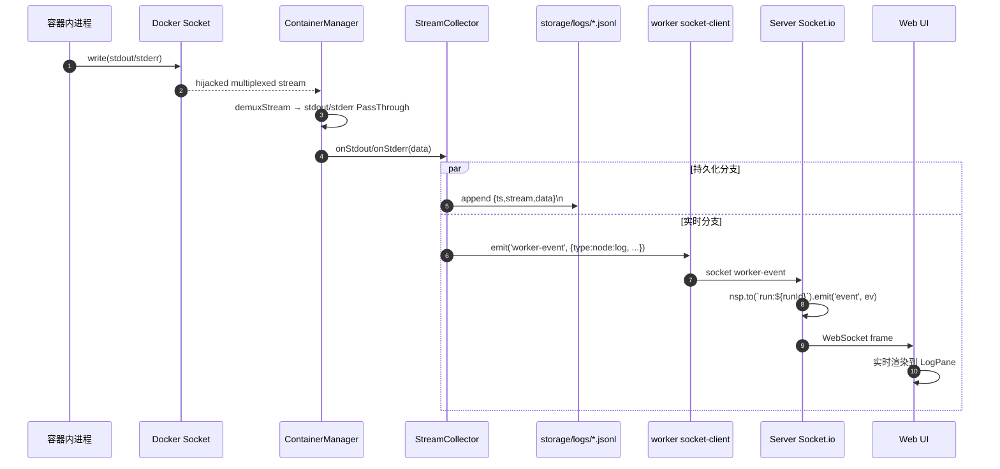

关键源码：
*   容器流拆分：`runner/src/container-manager.ts:97-111`（`modem.demuxStream`）
*   收集与持久化：`runner/src/stream-collector.ts:30-38`
*   日志限流：`worker/src/index.ts:131-148`（`MAX_LOG_CHUNK=2048`，单条 > 2KB 自动截断防止前端撑爆）
*   命名空间订阅：`server/src/socket.ts:22-38`

### 6.2 崩溃恢复（Crash Recovery）

**心跳机制 + 容器对账** 是平台从崩溃中恢复的核心：

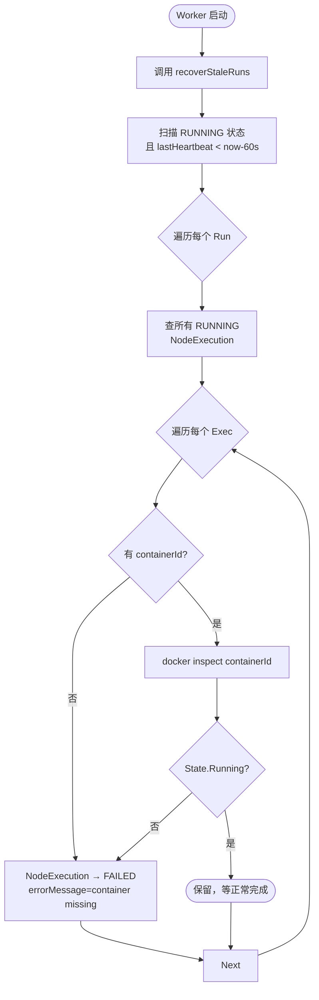

源码：`engine/src/guards/recovery.ts:3-47`，调用入口：`worker/src/index.ts:81-90`。

**心跳更新**：`tickRun` 每 5 秒被周期性触发一次（`worker/src/index.ts:93-104`），其内会更新 `Run.lastHeartbeat`（`engine/src/dispatcher/dispatcher.ts:45-48`）。

**从上一个成功节点重试**：用户可通过 `POST /api/runs/:id/plan-nodes/:nodeId/retry`（`server/src/routes/runs.ts:199-260`）触发：
1. 合并 `configOverride`；
2. 当前节点的历史 `COMPLETED/FAILED` 执行置 `SUPERSEDED`；
3. 注入一条 `FLOW` 消息让 Dispatcher 创建新的 attempt；
4. 把 `Run.status` 拨回 `RUNNING`，重新激活。

### 6.3 熔断机制（Circuit Breaker）

熔断器是平台的"成本与时间总开关"。它在**每次节点入队前**被强制检查：

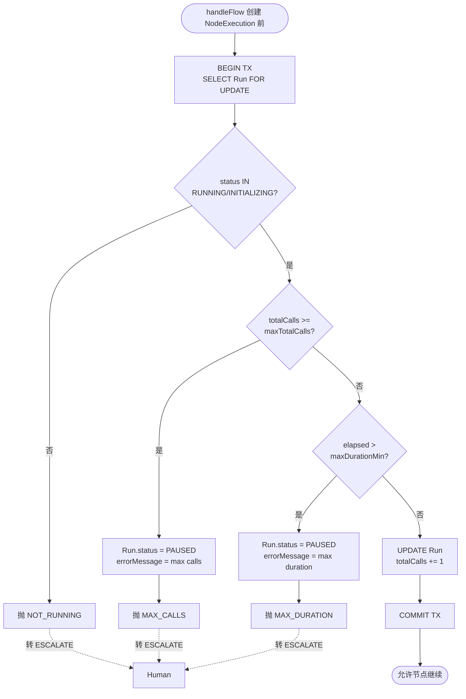

源码：`engine/src/guards/circuit-breaker.ts:17-63`。

**两层熔断条件**：
1. **`maxTotalCalls`**（默认 50）：限制单 Run 的节点调度总次数，防止失控扇出 / 死循环耗尽 LLM Token。
2. **`maxDurationMin`**（默认 480 分钟）：限制单 Run 的最大墙钟时长，防止长尾任务阻塞队列。

**触发后**：Run 状态变为 `PAUSED`，由 `errorMessage` 记录原因，并通过 `emitEscalate` 触发人工介入消息，等待运维确认。

### 6.4 取消传播（Cancel Propagation）

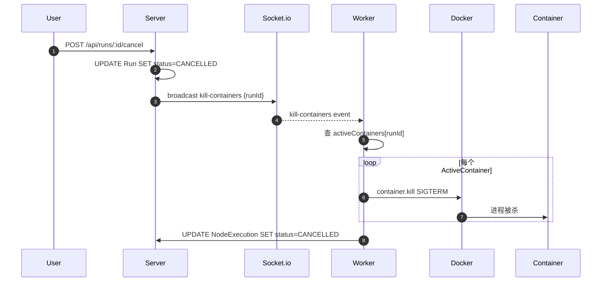

源码：`worker/src/index.ts:36-73` 维护内存级 `activeContainers` 注册表，`server/src/routes/runs.ts:109-129` 触发广播。

---

## 7. API 与扩展性

### 7.1 REST API 一览

> 完整路由：`packages/server/src/app.ts:30-35` + `packages/server/src/routes/*.ts`

| Method | Path | 作用 | 关键源码 |
|--------|------|------|----------|
| `POST` | `/api/runs` | 启动一个 Run | `runs.ts:78-107` |
| `GET` | `/api/runs/:id` | 拉 Run 详情（含 plan + executions） | `runs.ts:55-76` |
| `POST` | `/api/runs/:id/cancel` | 取消 Run，杀死容器 | `runs.ts:109-129` |
| `POST` | `/api/runs/:id/human-respond` | 提交人工审核结果 | `runs.ts:139-152` |
| `PATCH` | `/api/runs/:id/plan-nodes/:nodeId` | 运行时编辑节点配置 | `runs.ts:162-196` |
| `POST` | `/api/runs/:id/plan-nodes/:nodeId/retry` | 单节点重试 | `runs.ts:199-260` |
| `GET` | `/api/runs/:id/logs/:executionId?tail=N` | 拉历史日志 | `runs.ts:263-283` |
| `*` | `/api/workflows` | 工作流模板 CRUD | `routes/workflows.ts` |
| `*` | `/api/roles` | Role / Skill 管理 | `routes/roles.ts` |
| `*` | `/api/config` | Secret / 系统配置 | `routes/config.ts` |
| `*` | `/api/models` | LLM 模型注册 | `routes/models.ts` |
| `GET` | `/health` | 健康检查 | `app.ts:26-28` |

### 7.2 Socket.io 事件协议

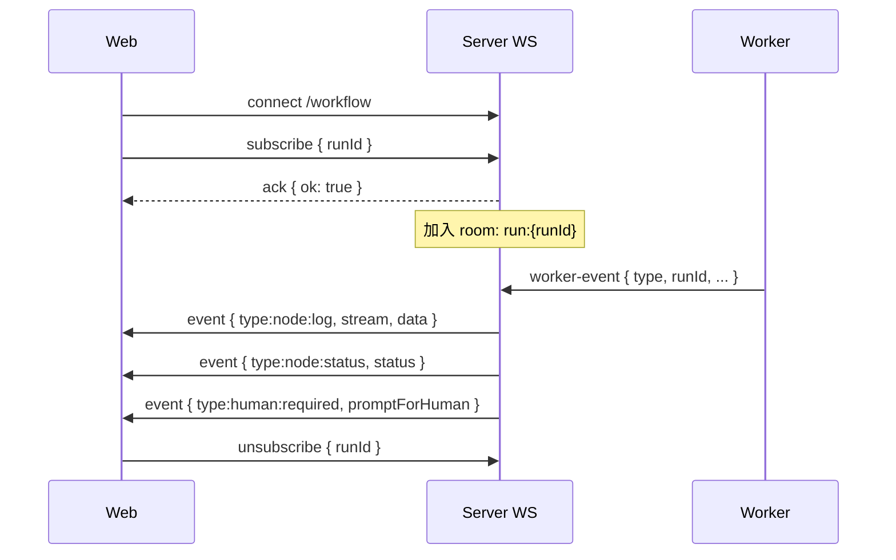

事件类型（`packages/shared/src/types/events.ts`）：
*   `node:log`：日志流（stdout/stderr/trace）
*   `node:status`：节点状态变更
*   `human:required`：需要人工介入
*   `run:status`：Run 整体状态变更

### 7.3 扩展点

| 扩展场景 | 扩展方式 | 入口位置 |
|----------|---------|----------|
| 新增节点类型 | 实现 handler + 在 worker dispatch | `engine/src/handlers/` |
| 新增 Intent | 在 `Intent` union 添加类型 + `processIntents` 分支 | `shared/src/types/intents.ts` + `engine/src/handlers/intents.ts` |
| 新增 Condition 操作符 | 在 `evalExpression` 添加 case | `engine/src/dispatcher/condition.ts:22-54` |
| 接入新 LLM 供应商 | 在 Runner 镜像内适配 + `/api/models` 注册 | `runner/Dockerfile` |
| 集成 MCP | 节点 config 声明 `mcp: ['figma', ...]` | `worker/src/index.ts:188-193` |

### 7.4 路线图 TODO

| 项 | 说明 | 状态 |
|----|------|------|
| **LLM 节点 MCP 多选 UI** | 工作流 Inspector / Run 重试对话框勾选内置 `figma` / `playwright`，写入 `config.mcp` | ✅ 已实现 |
| **MCP 市场 / 目录** | 平台维护可注册 MCP 列表（id、label、requiredSecrets、Runner 镜像层）；用户从目录勾选，**不可**任意填写 `command`/`args`；Worker/Runner 按注册表启动 stdio 服务 | 📋 TODO |
| **通用 Secrets 映射** | 除 Cursor/GitLab/Figma 外，支持 MCP 目录声明的密钥字段 | 📋 TODO（依赖 MCP 市场） |

MCP 市场设计要点（待实施）：

1. 管理员注册 MCP：`{ id, label, npmPackage?, command?, args?, secrets[] }`
2. 用户节点 config：`mcp: ['figma']` 或未来 `mcpCatalog: ['gitlab-assistant']`
3. Runner 镜像分层：基础镜像 + 可选 `runner-mcp-*` 扩展层，或运行时 `npx -y`（需网络与 CA）
4. 安全：禁止终端用户自由配置 shell 命令；仅白名单 MCP

---

## 8. 关键源码索引

### 8.1 引擎核心

| 文件 | 行数 | 职责 |
|------|------|------|
| `packages/engine/src/dispatcher/dispatcher.ts` | 459 | `tickRun` / `handleFlow` / `handleLoopback` / `handleEscalate` / `clonePlanFromTemplate` |
| `packages/engine/src/dispatcher/messages.ts` | 82 | `emitFlow` / `emitLoopback` / `emitEscalate` / `markMessageConsumed` |
| `packages/engine/src/dispatcher/queue.ts` | 67 | BullMQ Queue / Worker 工厂 |
| `packages/engine/src/dispatcher/condition.ts` | 73 | CONDITION 边表达式求值 |
| `packages/engine/src/dag/graph.ts` | 65 | `bfsDescendants` / `topologicalOrder` |
| `packages/engine/src/handlers/intents.ts` | 206 | 节点输出路由（Fan-out / 分支选择） |
| `packages/engine/src/handlers/llm.ts` | 80 | LLM 节点执行（调用 cursor-agent） |
| `packages/engine/src/handlers/shell.ts` | 87 | SHELL 节点执行 |
| `packages/engine/src/handlers/human.ts` | 48 | 人类响应处理 |
| `packages/engine/src/prompt/assembler.ts` | 196 | Prompt 装配 + 反馈注入 + ROUTING 注入 |
| `packages/engine/src/guards/circuit-breaker.ts` | 63 | 多层熔断 |
| `packages/engine/src/guards/recovery.ts` | 47 | 崩溃恢复 |

### 8.2 Runner & Worker

| 文件 | 行数 | 职责 |
|------|------|------|
| `packages/runner/src/container-manager.ts` | 175 | 容器生命周期、资源限制、超时强杀 |
| `packages/runner/src/volume-manager.ts` | 112 | Base Image 烤制、共享 Volume、隔离网络 |
| `packages/runner/src/stream-collector.ts` | 45 | 日志 jsonl 落盘 + 实时回调 |
| `packages/runner/src/result-reader.ts` | 93 | 从容器读 `result.json` / `verdict.json` |
| `packages/worker/src/index.ts` | 431 | Worker 主循环、容器编排、CA bundle 同步 |
| `packages/worker/src/crypto.ts` | – | AES-256-GCM Secret 解密 |

### 8.3 Server

| 文件 | 行数 | 职责 |
|------|------|------|
| `packages/server/src/app.ts` | 40 | Express 路由装配 |
| `packages/server/src/socket.ts` | 51 | Socket.io 网关 / room 订阅 |
| `packages/server/src/routes/runs.ts` | 285 | Run 生命周期 REST API |
| `packages/server/src/routes/workflows.ts` | – | 模板 CRUD |
| `packages/server/src/routes/config.ts` | – | 加密 Secret 管理 |
| `packages/server/src/lib/crypto.ts` | – | 加密/解密、Master Key 自举 |

### 8.4 数据契约

| 文件 | 职责 |
|------|------|
| `packages/database/prisma/schema.prisma` | 全部数据模型 + 枚举 |
| `packages/shared/src/types/intents.ts` | Intent / Condition / NodeOutput 协议 |
| `packages/shared/src/types/messages.ts` | Message payload 定义 |
| `packages/shared/src/types/events.ts` | Socket.io 事件协议 |
| `packages/shared/src/types/execution.ts` | NodeExecutionPayload（Prompt 装配产物） |

---

## 附录 A · 一次完整 Run 的数据库快照（示例）

某个 LLM → HUMAN → LLM 三节点工作流，触发一次 loopback 后的数据库状态：

```
Run #r1
├── status: COMPLETED
├── totalCalls: 4
└── plan #p1
    ├── PlanNode #n1 (LLM "Draft")
    │   ├── exec #e1 attempt=1 status=SUPERSEDED  ← loopback 重做前的旧结果
    │   └── exec #e2 attempt=2 status=COMPLETED   ← 重做后的成功结果
    ├── PlanNode #n2 (HUMAN "Review")
    │   ├── exec #e3 attempt=1 status=COMPLETED   ← 第一次审核：打回
    │   └── exec #e4 attempt=2 status=COMPLETED   ← 第二次审核：通过
    └── PlanNode #n3 (LLM "Publish")
        └── exec #e5 attempt=1 status=COMPLETED

LoopCounter
└── (r1, n2→n1) count=1 maxAllowed=3   ← 用过 1 次配额

Message (consumed=true)
├── #m1 FLOW null→n1
├── #m2 FLOW n1→n2  (e1 完成后)
├── #m3 LOOPBACK n2→n1  (人工打回)
├── #m4 FLOW null→n1 payload.feedback="..."  (handleLoopback 注入)
├── #m5 FLOW n1→n2  (e2 完成后)
├── #m6 FLOW n2→n3  (人工通过后)
└── ...
```

整个执行轨迹完全可追溯：你可以从 `Message` + `NodeExecution` 表回放任何一次 Run 的全部决策路径。这就是"可审核、可回退"的工程化落地。
