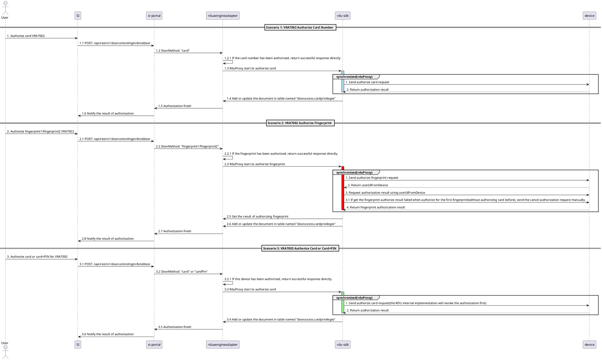

# SCID Detailed Design Document
## audit record

| version | timestamp | author | notes       |
|---------|-----------|--------|-------------|
| 1.0.0   | 2026.1.23 | juntao | since SI4.1 |

## business background
1. SI4.1 接入 SCID
2. SCID 需要支持 Fath厂商的两款锁: VRA7002 和 VRA7003

## requirement description
### business requirement && function description
1. User Story: https://rally1.rallydev.com/#/811782628449d/dashboard?detail=%2Fuserstory%2F831469773659%2Fdetails
2. Requirement Discussion Document: [SCID-RDD](SCID-RDD.md)

### figma
https://www.figma.com/design/lOfuSSMW64Ho5fTTw8Zgpa/Smart-InfraSight-v4.1?node-id=21373-1400&p=f&t=lji0Cn9ICelHTFHj-0

## detailed design
### Authorize Process


### Cancel Authorize
1. RDU 方面无提供针对 VRA7002 和 VRA7003 的取消授权的新协议
2. 和之前的取消授权流程一样, 接口入参和响应均不变


### 涉及改动的接口(摘要)
1. /api/rest/v1/doorcontrolmgm/updatecard
   1. 新增处理 TanLock 的授权逻辑
   2. 需要在响应里增加返回哪些锁更新授权成功, 哪些更新授权失败 (/api/rest/v1/newabelengines/updatecard 也需要)
2. /api/rest/v1/doorcontrolmgm/cancelcardauth
   1. 新增取消 TanLock 的授权逻辑
   2. 需要在响应里增加返回哪些锁取消授权成功, 哪些取消授权失败 (/api/rest/v1/newabelengines/cancelcardauth 也需要)
3. /api/rest/v1/dooraccesscontroller/getdoors
   1. 响应新增属性 doorMethod, 字符串数组, 值范围为 ["--", "card", "cardPin", "fingerPrint1", "fingerPrint2"]
   2. ~~响应新增属性 userIdFromDevice, 字符串~~
4. /api/rest/v1/dooraccesscontroller/getsitetree
   1. 对于 TanLock, 设置响应的 originalType 为 "VRA7002" 或 "VRA7003"
5. /api/rest/v1/doorcontrolmgm/binddoor
   1. 新增处理 TanLock 的授权逻辑
   2. 请求入参新增属性 doorMethod, 字符串, 值范围为 ["--", "card", "cardPin", "fingerPrint1", "fingerPrint2"]
   3. ~~请求入参新增属性 userIdFromDevice, 字符串~~
   4. 批量授权包含 VRA7002 或 VRA7003 时, doorMethod 值只能是 "card"
6. /api/rest/v1/doorcontrolmgm/unbinddoor
   1. 新增取消 TanLock 的授权逻辑
7. /api/rest/v1/doorcardprivileges?query={query}&size=1000
   1. 表结构新增属性 "doorMethod", 非必填, 字符串数组, 值范围为 ["--", "card", "cardPin", "fingerPrint1", "fingerPrint2"]
   2. 表结构新增属性 "userIdFromDevice", 非必填, 字符串, 且目前只在 VRA7002 授权后才有值, 代表设备侧的 userId
8. RDU 采集信号时, 新增针对 TanLock 获取具体型号和回写逻辑
   1. SI 在第一次获取到某个实时信号值后, 回写进 baseobjects 表记录的 "correlations[0].data.originalSubType(新增属性, 但因为没有校验, 不需要改动 schema 定义)";
   2. 实时信号: accTanlocksnmp_7_DoorLockType, Oid: 1.3.6.1.4.1.13400.3.7.7020.1.1.7, Syntax: INTEGER{vra7002(0), vra7003(1)}

注:
1. 详情可见 [detail](#notes)
2. 整包基于 SI_4.1.0 拉取项目组分支 SI_4.1.0_Sustaining, 与其他项目组无代码或功能依赖

## interface doc
### 1. /api/rest/v1/dooraccesscontroller/getdoors
#### payload
{"cardId":"6964eb825f349acd52c078b3"}

#### response
```json5
[
   {
      "groupType": "Group0",
      "siteId": "696753145f349acd52c0b77d",
      "siteName": "RDU_10.243.224.18",
      "type": "SmartAisle",
      "deviceId": "696753145f349acd52c0b787",
      "deviceName": "ACC_CHD2100J3A_1222", // J5
      "doorNo": 0,
      "originalType": "CHD2100J3",
      "communicationStatus": "Normal",
      "engineId": "696752fc5f349acd52c0b777",
      "engineName": "RDU_10.243.224.18",
      "address": "10.243.224.18",
      "engineType": "RduaEngine",
      "doorMethod": [
         "--"
      ]
   },
   {
      "groupType": "GroupNone",
      "siteId": "6967535c5f349acd52c12f57",
      "siteName": "RDU_10.243.224.22",
      "type": "SmartAisle",
      "deviceId": "6967535d5f349acd52c12f62",
      "deviceName": "ACC_ES5200DoorMgmt_1", // ES5200
      "doorNo": 0,
      "originalType": "ES5200",
      "communicationStatus": "NotCommunicating",
      "engineId": "696753565f349acd52c12f2e",
      "engineName": "RDU_10.243.224.22",
      "address": "10.243.224.22",
      "engineType": "RduaEngine",
      "doorMethod": [
         "--"
      ]
   },
   {
      "groupType": "GroupNone",
      "siteId": "696753145f349acd52c0b77d",
      "siteName": "RDU_10.243.224.18",
      "type": "SmartAisle",
      "deviceId": "696f14a25f349acd52c45364",
      "deviceName": "door_1",  // IP门禁
      "doorNo": 1,
      "originalType": "CHD806",
      "communicationStatus": "Normal",
      "engineId": "696f14855f349acd52c4532d",
      "engineName": "ACC_IP门禁_10.243.224.24",
      "address": "10.243.224.24",
      "engineType": "NewabelEngine",
      "doorMethod": [
         "--"
      ]
   },
   {
      "groupType": "Group0",
      "siteId": "696753145f349acd52c0b78d",
      "siteName": "RDU_10.243.224.20",
      "type": "SCID",
      "deviceId": "696753145f349acd52c0b787",
      "deviceName": "ACC_VRA7002_1",  // VRA7002
      "doorNo": 0,
      "originalType": "VRA7002",
      "communicationStatus": "Normal",
      "engineId": "696752fc5f349acd52c0b997",
      "engineName": "RDU_10.243.224.20",
      "address": "10.243.224.20",
      "engineType": "RduaEngine",
      "doorMethod": [  // 新增属性
         "card", "fingerPrint1", "fingerPrint2"
      ],
      "userIdFromDevice": "xxx" // 新增属性 // 2026/2/3 去除, 不再在响应里面返回, 由后端内部处理
   },
   {
      "groupType": "Group0",
      "siteId": "696753145f349acd52c0b79d",
      "siteName": "RDU_10.243.224.21",
      "type": "SCID",
      "deviceId": "696753145f349acd52c0b799",
      "deviceName": "ACC_VRA7003_1",  // VRA7003
      "doorNo": 0,
      "originalType": "VRA7003",
      "communicationStatus": "Normal",
      "engineId": "696752fc5f349acd52c0b997",
      "engineName": "RDU_10.243.224.21",
      "address": "10.243.224.21",
      "engineType": "RduaEngine",
      "doorMethod": [ // 新增属性, [card, cardPin] 只存在一个, 没有同时存在的情况
         "card", "cardPin"
      ]
   },
   {
      "groupType": "GroupNone",
      "siteId": "696753145f349acd52c0b79d",
      "siteName": "RDU_10.243.224.21",
      "type": "SCID",
      "deviceId": "696753145f349acd52c0b899",
      "deviceName": "ACC_VRA7002_3_1",  // VRA7003 || VRA7002
      "doorNo": 0,
      "originalType": "VRA7003",
      "communicationStatus": "Normal",
      "engineId": "696752fc5f349acd52c0b997",
      "engineName": "RDU_10.243.224.21",
      "address": "10.243.224.21",
      "engineType": "RduaEngine",
      "doorMethod": [ // VRA7002 和 VRA7003 未授权时, doorMethod 返回 ["--"]
         "--"
      ]
   }
]
```

### 2. /api/rest/v1/doorcardprivileges?query={query}&size=1000
#### payload
query=%7B%22deviceId%22:%22696753145f349acd52c0b787%22%7D&size=1000 <br>
[转义前: query={"deviceId":"696753145f349acd52c0b787"}&size=1000]

#### response
```json5
{
    "_embedded": {
        "doorcardprivileges": [
           {
              "_id": "6973049867c85efd5eb24489",
              "cardId": "6964ef3a5f349acd52c07999",
              "engineId": "696752fc5f349acd52c0b771",
              "deviceId": "696753145f349acd52c0b712",
              "groupType": "Group0",
              "_type": "DoorCardPrivilege",
              "doorMethod" : [
                 "--"
              ]
           }, 
           {
                "_id": "6973049867c85efd5eb2445e",
                "userIdFromDevice": "xxx", // 新增设备侧的 userId
                "cardId": "6964ef3a5f349acd52c07954",
                "engineId": "696752fc5f349acd52c0b777",
                "deviceId": "696753145f349acd52c0b787",
                "groupType": "Group1",
                "_type": "DoorCardPrivilege",
                "doorMethod" : [ // VRA7002
                   "card", "fingerprint1", "fingerprint2"
                ]
            },
            {
                "_id": "6973094867c85efd5eb245e6",
                "cardId": "6964eb825f349acd52c078b3",
                "engineId": "696752fc5f349acd52c0b777",
                "deviceId": "696753145f349acd52c0b787",
                "groupType": "Group1",
                "_type": "DoorCardPrivilege",
                "doorMethod" : [ // VRA7003, [card, cardPin] 值只出现一个, 没有同时出现的场景
                  "card", "cardPin"
                ]
            } // [交互] 未授权过的卡, 不会在这个响应里面显示出来, 需要前端做逻辑判断并且设置 "Door Method" 列
        ]
    },
    "page": {
        "size": 1000,
        "totalElements": 3,
        "totalPages": 1,
        "number": 0
    }
}
```

### 3. /api/rest/v1/doorcontrolmgm/binddoor
#### payload
```json5
{
    "cardId": [
        "6964ef3a5f349acd52c07954", "6964ef3a5f349acd52c07966"
    ],
    "deviceId": [
        "696753145f349acd52c0b781"
    ],
    "groupType": "Group0",
    "fromCard": false,
    "engineId": "696752fc5f349acd52c0b777",
    "doorMethod": "card" // 字符串, 取值为 ["card", "fingerprint1", "fingerprint2", "cardPin"], 且批量授权的时候只能为 "card"
}
```

#### response
```json5
{
    "6964ef3a5f349acd52c07954": "Success",
    "6964ef3a5f349acd52c07966": "Failed"
}
```

### 4. /api/rest/v1/doorcontrolmgm/updatecard && /api/rest/v1/newabelengines/updatecard
#### payload
```json5
{
    "cardId": "698c1c0c8449bb02a61e4c45",
    "cardNo": "3333333333",
    "password": "1256",
    "validDate": "2031-02-11",
    "fingerprints": []
}
```

#### response
##### success response
```json5
{
    "cardNo": "3333333333", // 新增属性
    "status": "Success", // 修改赋值逻辑; 当且仅当 results 里面的所有 failedDeviceList 为空时, 才赋值为 success; 即所有锁都更新成功的情况;
    "statusMessage": "Success", // 修改赋值逻辑; 同 status 赋值逻辑
    "results": [  // 新增属性
       {
          "siteName": "RDU_10.243.224.20",
          "successDeviceList": [
             {
                "deviceName": "frontLock"
             },
             {
                "deviceName": "endLock"
             }
          ],
          "failedDeviceList": []
       },
       {
          "siteName": "RDU_10.243.224.21",
          "successDeviceList": [
             {
                "deviceName": "frontLock"
             },
             {
                "deviceName": "endLock"
             }
          ],
          "failedDeviceList": []
       }
    ]
}
```

##### failed response

```json5
{
    "cardNo": "3333333333", // 新增属性
    "status": "Failed",
    "statusMessage": "Failed",
    "results": [  // 新增属性
       {
          "siteName": "RDU_10.243.224.20",
          "successDeviceList": [
             {
                "deviceName": "frontLock"
             },
             {
                "deviceName": "endLock"
             }
          ],
          "failedDeviceList": []
       },
       {
          "siteName": "RDU_10.243.224.18",
          "successDeviceList": [
             {
                "deviceName": "ES5200_1"
             }
          ],
          "failedDeviceList": [
             {
                "deviceName": "J5_1",
                "cause": "..."
             }
          ]
       },
       {
          "siteName": "RDU_10.243.224.19",
          "successDeviceList": [
          ],
          "failedDeviceList": [
             {
                "deviceName": "IP门禁_door_1",
                "cause": "..."
             },
             {
                "deviceName": "IP门禁_door_2",
                "cause": "..."
             }
          ]
       } 
    ]
}
```

### 5. /api/rest/v1/newabelengines/cancelcardauth && /api/rest/v1/doorcontrolmgm/cancelcardauth
#### payload
```json5
{
    "cardId": "698c1c028449bb02a61e4c43",
    "cardNo": "2222222222"
}
```

#### response
1. 同 [updatecard](#4-apirestv1newabelenginesupdatecard--apirestv1newabelenginesupdatecard)

## data model
### dooraccess.cardprivileges
```json5
{
   "id": "http://avocent.com/schemas/dooraccesscontroller/door-card-privilege-schema-v1",
   "$schema": "http://avocent.com/schemas/core-schema-v1",
   "version": "1.0.0",
   "type": "object",
   "definitionType": "model",
   "modelConfiguration": {
      "modelType": "DoorCardPrivilege"
   },
   "required": [
      "cardId",
      "engineId",
      "deviceId",
      "groupType"
   ],
   "properties": {
      "cardId": {
         "description": "The door device id.",
         "type": "string"
      },
      "engineId": {
         "description": "The door access engine id.",
         "type": "string"
      },
      "deviceId": {
         "description": "The door device id.",
         "type": "string"
      },
      "groupType": {
         "description": "The group type in the CHD806D4.",
         "type": "string",
         "enum": [
            "Group0",
            "Group1",
            "Group2",
            "Group3",
            "Group4"
         ],
         "enumDescriptions": {
            "Group0": "The time group 0#",
            "Group1": "The time group 1#",
            "Group2": "The time group 2#",
            "Group3": "The time group 3#",
            "Group4": "The time group 4#"
         }
      },
      "doorMethod": {
         "description": "The door method of card to authorize lock",
         "type": "array",
         "item": {
            "type": "string"
         }
      },
      "userIdFromDevice": {
         "description": "The id of user stored in device",
         "type": "string"
      }
   }
}
```

### security requirement
无

## performance requirement
待定

## upgrade
不考虑从 SI4.1 之前的版本升级到 SI4.1

## affection
无

## risk
无

## notes
### Card Management
#### Update Card
1. 更新密码/指纹等
2. POST: /api/rest/v1/newabelengines/updatecard
   1. 如果有纽贝尔的锁使用了这张卡, 则更新密码/指纹/有效时间
   2. [新增] 需要在响应里增加返回哪些锁更新授权成功, 哪些更新授权失败
   3. 接口示例 [request](#4-apirestv1newabelenginesupdatecard--apirestv1newabelenginesupdatecard)
3. POST: /api/rest/v1/doorcontrolmgm/updatecard
   1. 如果是通过 RDU接上来的锁, 则更新卡上的 ES5200(7001) 和 J5(7008,7016) 类型锁的授权
   2. [新增] 需要增加对于 TanLock 两种锁的授权更新逻辑
   3. [新增] 需要在响应里增加返回哪些锁更新授权成功, 哪些更新授权失败
   4. 接口示例 [request](#4-apirestv1newabelenginesupdatecard--apirestv1newabelenginesupdatecard)
4. PATCH: /api/rest/v1/doorcards/{id}
   1. 更新数据库表 dooraccess.cards 里面的记录
   2. [修改][交互] 前两个接口有更新授权成功的话, 则直接更新数据库卡记录
5. [交互] 更新密码时, 如果密码任何一位的值超过 1-4 范围, 则请求 /api/rest/v1/dooraccesscontroller/getdoors 接口获取卡已授权的锁列表
   1. 如果锁列表中包括 VRA7003 且 doorMethod = 'cardPin', 则弹出提示该卡已经被授权给了哪些站点下的 VRA7003 锁, 且不允许下发更改密码, 不请求授权接口
   2. 如果不满足条件, 则不弹窗, 继续请求授权接口

#### Delete Card
1. 删除卡
2. POST: /api/rest/v1/newabelengines/cancelcardauth
   1. 如果有纽贝尔的锁使用了这张卡, 则删除授权
   2. [新增] 需要在响应里增加返回哪些锁取消授权成功, 哪些取消授权失败
   3. 接口示例 [request](#5-apirestv1newabelenginescancelcardauth--apirestv1doorcontrolmgmcancelcardauth)
3. POST: /api/rest/v1/doorcontrolmgm/cancelcardauth
   1. 如果是通过 RDU接上来的锁, 则删除 ES5200(7001) 和 J5(7008,7016) 类型锁的授权
   2. [新增] 需要增加对于 TanLock 两种锁的取消授权逻辑
   3. [新增] 需要在响应里增加返回哪些锁取消授权成功, 哪些取消授权失败
   4. 接口示例 [request](#5-apirestv1newabelenginescancelcardauth--apirestv1doorcontrolmgmcancelcardauth)
4. DELETE: /api/rest/v1/doorcards/{id}
   1. 删除数据库表 dooraccess.cards 里面的记录
   2. [修改][交互] 只有取消授权对应锁都成功了, 才去数据库删除卡记录
5. Update Card && Delete Card && Batch Delete Card
   1. [测试] [测试范围] 新交互-弹窗(两种, 详见 [User Story](SCID-RDD.md), "User Story 内容" 模块的 "卡管理页面" 交互), 
      1. 改动只涉及响应, 处理流程并没有变化, 所以只需要测试效果和基本功能是否正常即可
      2. 对于 ES5200/J5/IP门禁, 只需在一种工作方式(比如: 独立工作)下验证更新卡(密码, 有效期, 指纹), 删除卡, 批量删除卡 是正常的即可
      3. 对于 VRA7002/VRA7003 则根据需求验证
   
#### Display "Authority Door Access Card" Table
1. 进入卡->授权界面
2. POST: /api/rest/v1/dooraccesscontroller/getdoors
   1. 获取所有锁设备和该卡授权情况
   2. [新增] [交互] 响应添加属性 
      1. doorMethod, 字符串数组, 值范围为 ["--", "card", "cardPin", "fingerPrint1", "fingerPrint2"], 可以同时出现多个
         1. 根据响应里面的 originalType 属性值, 进行处理
            1. 如果值为 "VRA7002", 则根据 doorMethod 把 "Door Method" 列显示为三个按钮, 并且对应按钮置灰
            2. 如果值为 "VRA7003", 则根据 doorMethod 把 "Door Method" 列显示为下拉框, 并且选中对应项
            3. 如果值为 "VRA7002" 或 "VRA7003", 且未授权过, 则 doorMethod 返回 ["--"], 前端根据设备类型和 doorMethod 为 "--" 将 "Door Method" 全置灰
            4. 其他类型的锁, 则根据 doorMethod 把 "Door Method" 列统一显示文本 "--", 且不可编辑
      2. ~~userIdFromDevice, 字符串, VRA7002 已授权后, 再进行指纹授权时候, 需要作为 binddoor 接口属性下发给到后端~~~~
      3. userIdFromDevice 不再由前端传递下来, 由后端在接口逻辑中查询数据库, 进行判断和处理
   3. 接口示例 [request]( #1-apirestv1dooraccesscontrollergetdoors)

#### Authorize Lock
1. 为锁进行授权/批量授权
2. POST: /api/rest/v1/doorcontrolmgm/binddoor
   1. 为几个设备批量授权卡, 调用几次这个接口
   2. 更新卡上的 ES5200(7001), J5(7008,7016), J2Z(7013) 类型锁的授权
   3. [新增] 需要增加对于 TanLock 两种锁的授权逻辑

#### Cancel Authorize Lock
1. 取消授权/批量取消授权卡
2. POST: /api/rest/v1/doorcontrolmgm/unbinddoor
   1. 批量取消几个设备的卡授权, 调用几次这个接口
   2. 取消 ES5200(7001), J5(7008,7016), J2Z(7013) 类型锁的授权
   3. [新增] 需要增加对于 TanLock 两种锁的取消授权逻辑

### Door Access Monitoring
#### Batch Authorize/Cancel Authorize Lock
1. 对一个设备进行操作的, 只调用一次接口
2. 批量授权/批量取消授权: 需改动的已经包含在上面里面了

#### Pop-up Display
1. 锁->授权弹窗
2. GET: /api/rest/v1/dooraccesscontroller/getsitetree
   1. 进入 "Door Access Monitoring" 菜单时, 查询 RDU 下的所有控制器和锁信息
   2. [新增] 在为 VRA7002 或 VRA7003 时, 设置响应的 originalType 为 "VRA7002" 或 "VRA7003"
3. GET: /api/rest/v1/doorcards?page=0&query={query}&size={size}&sort=
   1. 查询 dooraccess.cards 表
4. GET: /api/rest/v1/doorcardprivileges?query={query}&size=1000
   1. 查询 dooraccess.cardprivileges 表
   2. [新增] 表结构新增属性 "doorMethod", 非必填, 字符串数组, 值范围为 ["--", "card", "cardPin", "fingerPrint1", "fingerPrint2"], 可以同时出现多个
      1. [交互] 根据查询表结果和锁所属类型, 对 "Door Method" 列显示不同的情况
         1. 锁类型取 getsitetress 接口响应里面的 [i].engines[i].devices[i].originalType
         2. VRA7002 或 VRA7003 设备, 对于未授权的卡, "Door Method" 不可编辑; 其他类型锁则统一显示为文本 "--", 不可编辑
      2. 接口示例 [request](#2-apirestv1doorcardprivilegesqueryquerysize1000)
      3. 表结构见 [schema](#dooraccesscardprivileges)
   3. [新增] 表结构新增属性 "userIdFromDevice", 非必填, 字符串, 且目前只在 VRA7002 授权后才有值, 代表设备侧的 userId
      1. 在对已经授权过的 VRA7002 锁再进行授权指纹的时候, 由前端传递值下来

#### VRA7002 && VRA7003 Authorize
1. 锁->授权弹窗
2. POST: /api/rest/v1/doorcontrolmgm/binddoor
   1. [新增] [交互] 在这两种类型锁的时候, 请求入参新增属性:
      1. "doorMethod", 字符串, 取值范围为 ["card", "fingerprint1", "fingerprint2", "cardPin"]
      2. ~~VRA7002 时, 额外新增 "userIdFromDevice" 入参属性~~
         1. ~~在卡未被授权时, 值为 ""; 在卡已被授权过, 想要继续授权指纹的情况下, 值取 doorcardprivileges 表的属性 "userIdFromDevice"值~~
   2. 批量授权时, "doorMethod"属性值只能是 "card"
   3. 接口示例 [request](#3-apirestv1doorcontrolmgmbinddoor)

#### VRA7002 && VRA7003 Cancel Authorize
1. 锁->授权弹窗
2. POST: /api/rest/v1/doorcontrolmgm/unbinddoor
   1. 请求入参和响应保持原样, 不用变动
   2. [新增] 需要新增对于 TanLock的取消授权逻辑

## TanLock
### originDeviceTypeId 来区分 TanLock的具体型号
1. VRA7002 和 VRA7003 在 RDU 里面存储的 deviceTypeId 都是 7020, 尽管这两款锁的授权方式差别很大;
2. 把这款锁加入到 SI 的监控后, 无法区分哪一款是 VRA7002, 哪款是 VRA7003;
3. 加上 RDU 那边开发流程已结束, 要再区分为不同的 deviceTypeId, 他们那边的工作量很大;
4. 所以经过讨论协商后, 他们会新增一个实时信号来表示当前锁的型号;
5. 实时信号: accTanlocksnmp_7_DoorLockType, Oid: 1.3.6.1.4.1.13400.3.7.7020.1.1.7, Syntax: INTEGER{vra7002(0), vra7003(1)}
6. SI 在第一次获取到这个实时信号值后, 回写进 baseobjects 表记录的 "correlations[0].data.originalSubType(新增属性, 但因为没有校验, 不需要改动 schema 定义)";
   1. 在解析实时信号报文的时候, 设备类型不为 "DOOR" 的直接返回
   2. 设备 deviceTypeId 不为 "7020" 的直接返回
   3. 信号id 不为 "30006" 的时候直接返回
   4. 获取 si-portal 里面对应设备信息的相关缓存, originalSubType 为空或者与实时信号值不一致则更新; 先更新数据库, 再更新缓存;
7. SI 改动的相关代码逻辑在 com.avocent.taf.plugin.siPortal.task.SubscribeSignalJob.SampleJob#run