# SCID Requirement Discussion Document

## Concept
1. SCID: Smart Cabinet ID Product.
2. Fath: The TanLock product developed by Fath, which is an IoT security device designed for high-security physical access points.
3. HMI: Human-Machine Interface, specifically refers to the touch screen used with SCID.

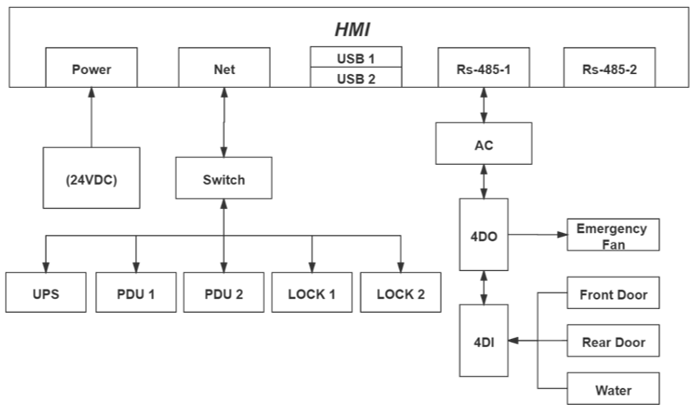

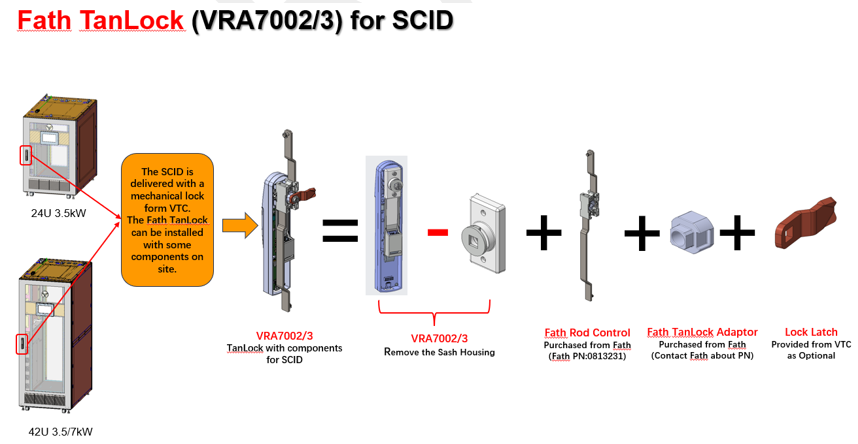

## TanLock
### RDU设计文档: "0922-SCID Intelligent Locks Upgrade Software Design Specification"
#### 硬件介绍和限制("3.2 Hardware Limitations")
1. TanLock 包含 VRA7002 和 VRA7003 型号
2. 这两种类型的锁都支持 SNMPv2 协议, 提供 restful API 响应功能, 并允许在 HTTP 和 HTTPS 模式之间切换
3. VRA7002 支持通过卡片和指纹认证解锁
4. VRA7003 支持通过 卡片 或 卡片+PIN码 认证解锁(其中 PIN 码仅作为辅助验证方式, 而非主要的解锁方式)
   1. PIN 由 4-6 位整数组成, 每位取值范围为 1-4;
5. 最大可授权 64 个门禁卡, 其中指纹信息隶属于门禁卡号, 即使仅授权指纹的用户, 也会占用一个门禁卡数量; 一个锁最多可授权32个指纹。
   1. 在 SI 上针对这个场景提示用户授权失败的原因, 结合 SCID 那边提供的接口协议, 需要在授权失败后, 再调用一个接口去获取已经授权的指纹/卡数据, 再去判断, 逻辑不可靠
   2. 且之前别的类型的锁也存在限制, 如[IP门禁: 最多6w张卡, ES5200: 1700, J5: 512], 在满授权时候再进行授权也没有主动提示用户授权失败的原因
   3. SCID 页面在这种场景下也没有提示具体信息
   4. 结论: 不做提示内容, 只在使用手册里面为用户提到存在这种授权失败场景

#### 对于 TanLock 已经实现的功能("4.2. FR002_SCID: WEB UI")
1. [门禁卡管理] 显示当前门禁卡列表，包括卡序列号、卡ID、卡别名和授权状态查询。允许根据卡信息（卡ID和别名）添加/修改/删除门禁卡对象。如果锁类型为VRA7003，则支持PIN码输入。
2. [门禁授权] 允许选择门锁对象并执行授权操作，以授予/撤销特定门禁卡的开锁权限。在VRA7002锁上配置时，支持指纹解锁。支持批量用户授权管理。
3. [指纹解锁] 使用VRA7002时，允许用户通过指纹认证解锁门禁系统。
4. [历史事件] 允许查询门锁对象的历史访问事件，包括授权记录和开锁操作。提供查询结果下载入口。
5. [重置授权] 允许指定锁清除授权信息。
6. [远程控制] 提供当前可操作的锁列表，并允许远程解锁门禁设备。

### RDU 需求文档: "SCID Intelligent Locks Scoping Document V2 1.docx"
#### 要求 SI 必须支持的功能("2. Scope of Work #SI_WEB_UI")
1. 提供锁的状态（锁定或解锁）- 必须
2. 提供远程控制以解锁（打开）锁 - 必须
3. 报警和历史记录 - 必须（RDU 需要与 Fath 确认协议）

## SI && TanLock
### SI 与 RDU支持的功能对比

|        | VRA7002                                                                                           | VRA7003                                                                    | SI                                                                                  | Affect                                                                                                                                                                                                      |
|--------|---------------------------------------------------------------------------------------------------|----------------------------------------------------------------------------|-------------------------------------------------------------------------------------|-------------------------------------------------------------------------------------------------------------------------------------------------------------------------------------------------------------|
| 解锁方式1  | 卡                                                                                                 | 卡                                                                          |                                                                                     |                                                                                                                                                                                                             |
| 解锁方式2  | 指纹(最多两个)                                                                                          | 先刷卡, 再输入 PIN                                                               | 表单无 PIN 字段, 但是有 Password(非必填)                                                       | 1. 是否新增 PIN 字段？  2. 使用 Password 字段？ SI 上密码限制长度为 4位, 且每位的值无限制  - 不新增 PIN 字段, 使用 Password 字段, 新增提示信息, 由用户确保输入值正确                                                                                      |
| 卡      | 1. 卡号需要在范围 [1, 4294967293] 内;   2. 能获取使用卡鉴权的锁列表;   3. 能修改卡的别名                             | 1. 卡号需要在范围 [1, 4294967293] 内;   2. 能获取使用卡鉴权的锁列表;   3. 能修改卡的别名和 PIN | 目前无第二点这一功能; 没有卡别名的这一字段;                                                             | 1. 第二点功能和别名, 是否需要在 SI 上实现?   - 不实现  2. 卡号, 当前字段值限制为必须10位, 且最大值不设限, 与 SCID 规定取值不一致;  - 新增提示信息, 由用户确保输入值正确   2-1. 怎么在页面上兼容旧的锁和 TanLock? 是否影响旧业务?  - 卡页面保持不区分专属某种类型的锁;                       |
| 指纹/PIN | 需要有两个人配合录入, 不支持从应用层(SI)下发到设备                                                                      | PIN 由 4-6 位整数组成, 每位取值范围为 1-4;  可以从应用层下发 PIN 到设备, 同时支持修改                | VRA7002 的录入指纹流程和现在的不一致                                                              | UI 界面怎么设计? 前后端开发实现是否技术难题？   - 需要设计新交互, 实现看起来可行                                                                                                                                                          |
| 取消授权   | 1. 删除卡时会自动移除卡上的鉴权;  2. 在授权界面移除, 卡不会被删除, 但是指纹会被删除(如果有的话);  3. 在授权页面取消勾选;                   | 1. 删除卡时会自动移除卡上的鉴权;  2. 在授权页面取消勾选;                                      | 当前 SI 的取消授权应该能满足这些情况                                                                | 无                                                                                                                                                                                                           |
| 解锁方式切换 | 无需切换, 两种解锁方式可以同时存在                                                                                | 在授权页面切换单选框(当前卡无 PIN, 则解锁方式 "Card+PIN" 不可选中)                                | 当前 SI 并没有为某张卡设置鉴权模式的相关实现, 且会在新增卡的时候为没有填密码的, 强制赋值默认密码"1234", 这会导致 VRA永远是 卡+PIN 的解锁方式 | 1. 去除默认密码, 是否会影响其他类型的锁？  ~~- 页面去除强设默认值逻辑, 由后端处理保证与之前效果一致~~  - 前端保留强设默认值逻辑, 不影响之前其他类型的锁; 结合VRA7003支持切换卡和 (卡+PIN), 已经通过页面设计兼容情况   2. 怎么设计/实现 为某张卡指定鉴权方式?  3. 切换鉴权方式这一功能需要么？  - 需要, 同时需要设计交互 |
| 历史记录   | 展示, 搜索, 下载 [远程开门, 指纹解锁, 卡解锁, 未经授权的刷卡行为, 授权成功, 取消授权] 类型历史记录                                        | 同 VRA7002                                                                  | 当前 SI 没有提供下载日志功能                                                                    | 下载日志的功能是否需要实现？   - 不实现                                                                                                                                                                                  |
| 其他功能   | 1. 支持批量授权;  2. 支持清除锁里面的所有授权(不可逆);  3. 支持远程开门;  4. 不支持配置只能在某一时间段开门;  5. 不支持为卡设置过期时间 | 同 VRA7002                                                                  | 当前 SI 不支持第四五点, 且添加卡的时候, 需要选择必填项[过期时间, 卡持有者], 还有非必填项[手机号,部门], 这些在 TanLock 时界面怎么处理？   | 1. 页面怎么兼容？  - 页面不处理, 保留属性   2. 第四五点对于 TanLock 是否需要支持？是否需要在应用层SI处理, 之前是设备端处理的?   - 第四点: SI 对于这种机柜上的锁, 也是只能设置能不能开锁, 和这两款锁一致, 不存在这个问题;   - 第五点: 硬件支持(很复杂), 但是目前 RDU 不支持, SI 不处理                |

### 2026/1/14: 会议决策

|                 | VRA7002                 | VRA7003                       | SI 现状                                                     | SI 变动点                                                 |
|-----------------|-------------------------|-------------------------------|-----------------------------------------------------------|--------------------------------------------------------|
| 指纹解锁            | 需要有两个人配合, 不支持从应用层(SI)下发 | -                             | 在 SI 采集后下发指纹到设备                                           | 需要设计新交互                                                |
| PIN解锁           | -                       | 长度为 4-6位, 每位取值范围为 [1,4]       | SI 无直接 PIN 属性, 但有 "Password" 属性, 且长度只能为 4位, 每位取值范围为 [0,9] | SI 的卡不区分是哪种类型锁的专属, 页面针对这次的 PIN 添加提示信息, 不限制, 由用户确保输入值正确 |
| 卡号              | 取值范围为 [1, 4294967293]   | 取值范围为 [1, 4294967293]         | SI 限制卡必须10位, 且最大最小值无限制                                    | SI 的卡不区分是哪种类型锁的专属, 页面针对这次的 卡号 添加提示信息, 不限制, 由用户确保输入值正确  |
| 卡别名             | 可以设置/修改卡别名              | 可以设置/修改卡别名                    | 有 CardHolder(卡持有者, 必填属性)                                  | CardHolder 属性包含在卡别名的功能里面, 不再单独新增卡别名属性                  |
| 获取被某张卡授权的锁列表    | 支持                      | 支持                            | 无此功能                                                      | 不处理, 不新增这个功能                                           |
| 切换解锁方式          | 无需切换                    | 卡 和 (卡+PIN(填了的话)) 这两种方式可以相互切换 | 目前 SI 不支持只对某张卡进行切换解锁方式                                    | 需要新增这个功能和设计新交互                                         |
| 下载锁的操作日志        | 支持                      | 支持                            | 无此功能                                                      | 不处理, 不新增这个功能                                           |
| 批量授权            | 支持                      | 支持                            | 除批量授权指纹外的情况, SI 目前都能支持                                    | 不处理批量授权 VRA7002 的指纹                                    |
| 为卡设置只能在某个时间段内解锁 | 不支持                     | 不支持                           | SI 对于这种机柜上的锁, 也是只能设置能不能开锁, 和这两款锁一致                        | 无                                                      |
| 为卡设置过期时间        | 硬件支持(很复杂), 但是目前 RDU 不支持 | 硬件支持(很复杂), 但是目前 RDU 不支持       | 支持此功能                                                     | SI 对于这两款锁不处理                                           |
| 清除锁里面的所有授权      | 支持                      | 支持                            | 不支持                                                       | 之前 RDU 的其他类型锁的时候也有这个功能, 但是 SI 没有做这个需求; 保持现状, 不处理;      |

### VRA7003 解锁方式切换:
#### 背景知识
1. SI 中分为两种使用场景的锁
2. 一种是放在过道/通道等上面的锁, 类似大门的锁, 为这种类型的锁授权卡的时候, 可以设置按时间段开门的权限, 包括以下情况:
   1. 没有权限(No Permission), 即卡开不了锁
   2. 特权(Privilege), 即这张卡在任何时间段都可以开锁
   3. 指定时间段(Group1-4), 即这种卡只能在某个时间段内才能开锁, 不在时间段范围内则开不了锁
   4. 上面的三种情况的值[No Permission, Privilege, Group1-4] 均是在授权过程中的 "Permission Group" 下拉框的值
3. 一种是放在机柜上面的锁, 为这种类型的锁授权卡的时候, 只能设置能开锁, 或者不能开锁; 且这次新增的 TanLock 锁就属于是机柜锁
   1. 没有权限(No Permission), 即卡开不了锁
   2. 特权(Privilege), 即这张卡在任何时间段都可以开锁
4. SI 中对于锁进行授权有两个入口
   1. 一个是在 "Security" 菜单的 "Door Access Monitoring" 中, 选中 RDU站点下的锁进行授权, 会弹窗, 里面包含所有的卡
   2. 一个是在 "Security" 菜单的 "Card Management" 中, 选择某一张卡进行授权, 会进到一个新的页面, 展示满足条件的 RDU下的设备
   3. 这两种方式都是跟着锁的类型走的
      1. 即在锁->授权 中, "Permission Group" 只会展示 [No Permission, Privilege, Group1-4] 或者只展示 [No Permission, Privilege]
      2. 但在卡->授权 中, "Permission Group" 可能会同时展示 [No Permission, Privilege, Group1-4] 和 [No Permission, Privilege]
      3. 如下图:

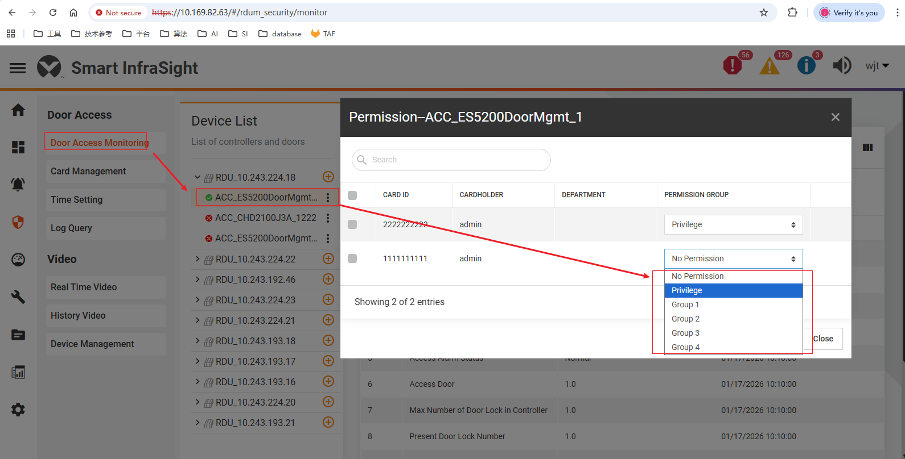

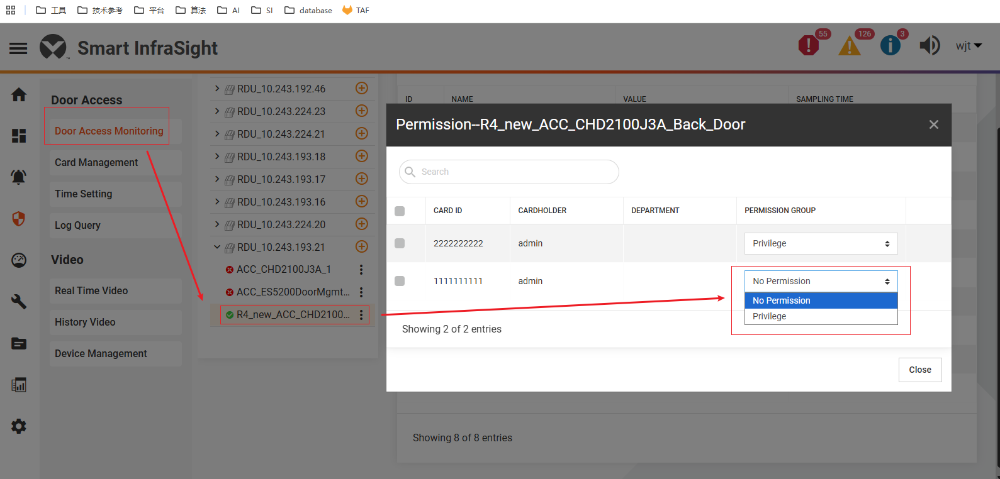

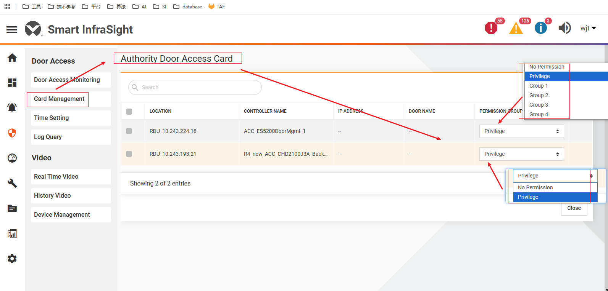

以下的几种, 都是针对 VRA7003 才做的变化, 其他类型的锁的授权页面保持不变

|         | 方案一                                                                                                                                                                        | 方案二                                                                                                                       | 方案三                                                                                                            | 方案四                                                    | 方案五 |
|---------|----------------------------------------------------------------------------------------------------------------------------------------------------------------------------|---------------------------------------------------------------------------------------------------------------------------|----------------------------------------------------------------------------------------------------------------|--------------------------------------------------------|-----|
| 锁->授权弹窗 | 不提供切换, 由卡当前是否存在密码来确定                                                                                                                                                       | 改动 "Permission Group" 下拉框值                                                                                                | 新增列 ~~"Authorization Type"~~ "Door Method"                                                                     | 同方式三, 但在 卡->授权页面过滤掉这两款锁                                | ？   |
| 详细      | 1. 如果卡存在密码则授权后,锁必须用卡+PIN才能解锁;   2. 如果不存在密码则锁可以只用卡解锁;(SI无此情况, 因为不管页面怎么处理都有密码)                                                                                           | 1. 保留 "No Permission";   2. 去除 "Privilege";   3.新增 "Card", "Card+PIN"                                             | 1. "Permission Group" 保留 "No Permission" 和 "Privilege";   2. 新增一列 "Door Method", 下拉框, 值为 [Card, Card+PIN]  |                                                        |     |
| 卡->授权页面 | 无变化                                                                                                                                                                        | 和锁->授权弹窗的改动一致                                                                                                             | 页面需要新增一列, 在有 VRA7003的情况下统一多显示一列                                                                                |                                                        |     |
| 影响      | 1. 前端对这个功能点无工作量;   2. 但 VRA7003锁授权之后, 只能是(卡+PIN)解锁, 且不管怎么做都切换不到只用卡就能解锁(因为SI中的密码永远有值);  2.1 如果要去掉默认密码, 可能会影响其他类型的锁(是否都需要测试一遍?);   2.2 且就算能去掉, 用户使用的时候就得理解这个隐含逻辑 | 1. 因为添加的下拉框值更偏向于锁的解锁方式, 是不是不应该放在 "Permission Group" 下, 且如果放进去了, 是不是用户理解起来很难?   1.1 是否需要直接把 "Permission Group" 列名改个名字? | 1. 对于非 VRA7003的锁, 在卡->授权页面显示新增的一列, 怎么显示, 其下拉框值显示什么? 是否也可以操作? 操作后怎么处理?                                          | 过滤掉之后, 宣称这款锁只能从 锁->授权页面进行操作, 不支持从 卡->授权页面进行操作(添加个提示信息) |     |

2026/1/19: 选择方案三

### VRA7002 和当前 SI 录入指纹的区别
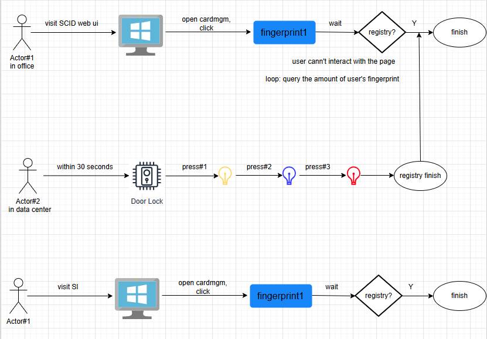

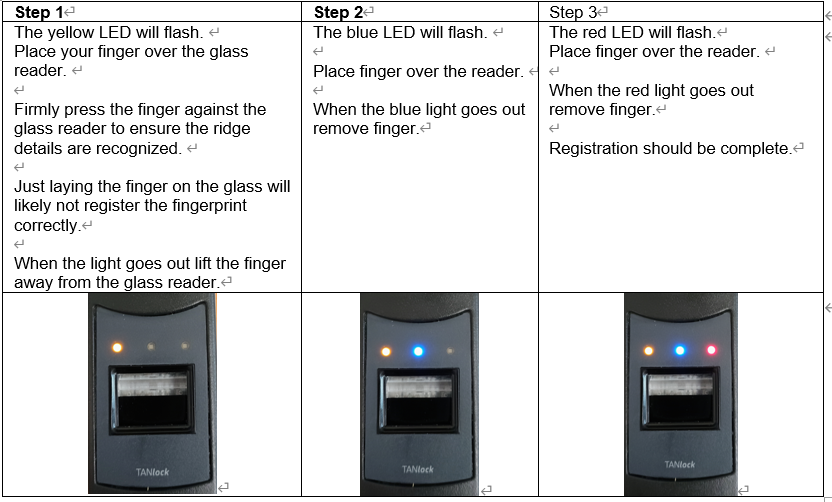

### VRA7002 取消授权
1. 锁支持录入两个指纹, 但并不区分哪个是指纹1, 哪个是指纹2;
2. 取消授权的时候, 锁会把里面的卡号, 指纹数据(有的话, 且不能指定只删除某个指纹), 都会全部清除; 这时候, 如果需要再用授权指纹的话, 需要再到数据中心里面录入一次指纹;
3. 而 SI 对于之前的某些锁可以支持下发, 在数据库会存储指纹数据, 所以取消授权后, 再下发一次就行, 不需要再重新录入指纹;
4. 对于这种情况, 需要在取消授权的时候给用户提示么？(目前 SCID 的 web 界面是没有做类似二次确认的)
5. 2026/1/19 不添加二次确认的提示

### RDU同步:

|   | 修改内容                                         | SI 同步结果          |
|---|----------------------------------------------|------------------|
| 1 | 锁设备名称                                        | 正常, 能同步修改        |
| 2 | 信号名称                                         | 正常, 能同步修改        |
| 3 | 信号值(枚举)名称                                    | 正常, 能同步修改        |
| 4 | 告警等级                                         | 正常, 能生效          |
| 5 | 1. pdu 数量: 2->1  2. ups 设备类型: gxt5->none | 正常, 但设备配置还是存在    |
| 6 | 切换锁类型, 比如从 VRA7003 切换成 VRA7002               | 正常, 但是授权相关内容依然保留 |

备注:
1. RDU: 切换锁类型这场景在客户现场不存在(概率很小), 发生后, 建议重现烧写 SCID 固件和配置;  
2. SI: 切换锁类型, 建议先在 SCID 清除锁授权, 再在 SI 上重新监控相应 SCID

## User Story 内容
添加门禁卡页面:  
Card ID: 提示图标和内容保留; 常显内容添加: "提示: Fath 锁具要求卡号必须在 4,294,967,293以内。"  
Password: 去除提示图标和内容, 添加常显内容 "限 4 位数字。Fath 锁具每位限填 1-4。未输入则默认为 1234。"  
Expiry Date: 无提示图标; 添加常显内容 "Fath 锁具暂不支持" 

锁->授权弹窗:
VRA7002:
1. "Permission Group" 展示 "No Permission", "Privilege"
   1. 默认选中/切换到 "No Permission" 时, 三个按钮为不可选中
   2. 切换到 "Privilege", "Door Method" 的三个按钮才变为可选中
   3. 切换到 "No Permission", "Door Method" 的三个按钮才变为不可选中
2. 表单新增一列 "Door Method", 包含三个按钮 "Card", "Fingerprint1", "Fingerprint2"
   1. 点击 "Card" 时, 校验卡号范围是否在 [1, 4294967293], 不满足则在 "Card" 按钮下提示 "卡号不能超过 4294967293", 只在校验通过才进行授权请求
   2. 点击 "Fingerprint1" 或 "Fingerprint2" 时, 进行指纹授权(可不授权卡号, 设备端需要有人处理), 过程一般会持续 35秒左右
   3. 授权过程中, 只在 "Door Method" 处显示进度条, 以及把授权结果在后面显示(保持和现在一样);
   4. 卡号授权, 指纹1或者指纹2被录入后对应按钮置灰, 不可选中
3. "Permission  Group" 选中 "No Permission", 则会删除卡号授权和指纹数据, 同时 Card & Fingerprint1 & Fingerprint2 重置为不可选中

VRA7003:
1. Permission Group 展示 "No Permission", "Privilege"
   1. 默认选中/切换到 "No Permission"时, "Door Method" 下拉框不可编辑
   2. 切换到 "Privilege", "Door Method" 下拉框才可编辑
2. 表单新增一列 "Door Method", 下拉框, 值为: [Card,  Card+PIN]
   1. 点击/切换 "Card" 时, 校验卡号范围是否在 [1, 4294967293], 不满足则在 "Card" 按钮下提示 "卡号不能超过 4294967293", 只在校验通过才进行授权请求
   2. 点击/切换 "Card+PIN",
      1. 校验卡号范围, 规则和错误信息同 "Card"
      2. 校验 PIN 的每位范围在 [1-4], 不满足则提示 "PIN 每位限填 1-4", 校验过才能请求授权接口 (不校验位数(4-6位), SI 只支持4位)
      3. 授权过程中, 只在 "Door Method" 处显示进度条, 以及把授权结果在后面显示(保持和现在一样);
      4. 卡号和 PIN的错误信息, 显示在下拉框处
3. "Permission  Group" 选中 "No Permission", 清楚授权数据, 且 "Door Method" 设置为不可编辑

ES5200/J5/IP门禁:
1. 新增显示显示一列, "Door Method", 值为 "--"

批量操作:
1. 从锁进来的弹窗, 这个时候可以获取唯一的锁类型,VRA7002/VRA7003/ES5200/J5/IP门禁
2. VRA7002 和 VRA7003 在批量授权时的 "Permission Group" 还是使用 [No Permission, Privilege]
   1. 选择 "No Permission", 则批量取消授权
   2. 选择 "Privilege", 则进行批量授权卡, 选择的所有卡必须满足对应的校验规则, 否则不去请求授权
3. VRA7002 批量授权
   1. 允许批量取消授权/授权卡号
   2. 因指纹授权和当前SI的常规流程不一致, 不支持批量授权指纹(SCID和SI都做不到)
4. VRA7003 批量授权
   1. 允许批量取消授权/授权卡号
   2. 不支持批量授权为 "卡+PIN"
      1. 可以做, 协议也支持, SCID Web UI 做了(页面和交换和SI不一样), 但这边暂时不做
      2. 因为当前批量授权的都是基于 "Permission Group" 做的, 而 "卡+PIN" 属于开门方式(Door Method)
      3. 要做的话需要新增个专门为 VRA7003 进行判断和处理的下拉框, 改动(两次授权入口的前端界面, 后端接口入参等)比较大
      4. 同时需要考虑在 卡->授权界面的时候, 批量授权也需要兼容同时存在以上5种锁的情况
5. VRA7002 和 VRA7003 一次批量授权/取消授权最多四张卡(锁->授权弹窗), 一张卡一次批量授权/取消授权最多四个机柜锁(卡->授权页面), 保持与之前机柜锁批量操作一致
6. 总结: 从锁->授权进来的弹窗, 对于目前的五种锁类型, 批量操作的前端组件不需要改动, 保留原样

卡->授权界面:
1. 从卡进来的授权页面, 这个时候可能存在所有的锁类型, VRA7002/VRA7003/ES5200/J5/IP门禁
2. 页面新增显示显示一列, "Door Method"
3. 判断锁的类型后,
   1. ES5200/IP门禁/J5, "Door Method" 值显示为 "--", 其他保持和之前一致;
   2. VRA7002
      1. "Door Method" 不显示为下拉框, 显示为三个按钮, 按照是否已经授权过选择是否可编辑; 
      2. "IP ADDRESS" 和 "Door Name" 显示为 "--";
   3. VRA7003
      1. "Door Method" 值按照实际显示为 Card 或者 Card+PIN, 可以修改; 
      2. "IP ADDRESS" 和 "Door Name" 显示为 "--";
   4. 授权时需要和上述一致, 按需校验卡号和PIN;
4. VRA7002 和 VRA7003 的批量授权同上
   1. 都只支持批量取消授权/授权卡号
   2. VRA7002 不支持批量授权指纹; VRA7003 不支持批量授权为 "Card+PIN"

批量授权相关前端组件:
1. 保持与之前一致, 不需要改动, 且只能批量设置 Permission Group 的值
2. 对于 VRA7002 和 VRA7003来说
   1. 选择 "No Permission" 后则批量取消授权
   2. 选择 "Privilege" 则默认只批量授权卡号
   3. 对 VRA7002 锁, 进行批量授权 "Privilege", 在接口逻辑里面判断卡号是否已经被授权, 已授权则直接接口返回, 不进行下发授权
      1. 因为锁本身不允许重复授权, 且如果先取消授权再进行授权, 可能会把已经授权的指纹去掉(有的话)
      2. 并且对于 VRA7002 来说, 是卡号, 指纹1, 指纹2是可以各自单独存在和授权的

统一修改:
1. 锁->授权弹窗, 卡->授权页面, 单个/批量操作时(授权/取消授权), 对应卡/设备的 "Permission Group" 不可编辑, 即禁止对同一卡/设备并发操作
2. 授权/取消授权进度条统一修改为在 "Door Method" 处显示
3. VRA7002 和 VRA7003 进行第一次授权时, 如果失败了, 则 "Permission Group" 选中 "No Permission", 且 "Door Method"列的按钮/下拉框置为不可编辑

卡管理页面:
1. 更新卡:
   1. 可更新卡的 密码/有效时间/指纹
   2. 输入新密码后, 点击 save 按钮, 判断当前卡的新密码的每位值是否超过 1-4, 和是否授权过 VRA7003 类型锁的 CardPin 开门方式
      1. 如果都满足, 则弹窗A提示用户该卡已经被授权给了哪些站点下的 VRA7003 锁, 且不允许下发更改密码, 不请求授权接口
      2. 如果任一不满足, 则不弹窗A, 继续请求授权接口, 和现状保持一致
      3. 只要有一个锁修改授权成功, 则去更新数据库里面卡的密码
   3. 更新授权后, 页面弹窗B提示用户, 哪些锁修改授权成功, 哪些锁修改授权失败(全部成功则不弹窗)
2. 删除卡:
   1. 移除对应锁的授权, 弹窗B提示用户, 哪些锁移除开门的权限成功, 哪些锁移除开门的权限失败(全部成功则不弹窗)
   2. 只有所有锁移除授权成功, 才去删除数据库里面卡的记录
3. 批量删除卡:
   1. 移除对应锁的授权, 弹窗B提示用户, 哪些锁移除开门的权限成功, 哪些锁移除开门的权限失败(全部成功则不弹窗)
   2. 对于某张卡, 只有所有锁移除授权成功, 才去删除数据库里面对应记录
4. 更新/删除卡的时候, 如果该卡未被授权给任何设备, 不弹窗A/B, 只弹出更新结果消息, 保留和之前一样

   
手册: (todo 待补充)
1. VRA7002 锁可授权卡号/指纹1/指纹2, 且三种方式可独立存在
2. VRA7002 清除授权后, 会把设备里面的所有数据(用户/卡号/指纹1/指纹2) 全部删除, 如需使用指纹解锁则需重新录入和授权
3. VRA7003 锁可授权卡号/卡号+PIN, 只能存在一种方式;
4. VRA7003 锁支持4-6位 PIN码(即密码, 但受限于 SI, 只允许输入4位); 且每位密码的值在 1-4 范围内(超出范围则因无按钮而开不了门, 硬件限制);
5. 卡密码更新: 
   1. 如果该卡密码用于 VRA7003 且开门方式为 card+PIN, 则需要注意新密码每位的值应该在 1-4 之间, 否则可能会部分成功部分失败
6. RDU同步
   1. 如果是更新设备名称/信号名称/信号值/告警等级/PDU数量/UPS设备类型等, 可以通过 "RDU同步" 更新最新变化
   2. 如果是切换锁类型, 则建议用户在 SCID 清除锁授权, 再在 SI 重新监控相应 SCID

## notes
### SI4.0.1: Security
#### 添加卡
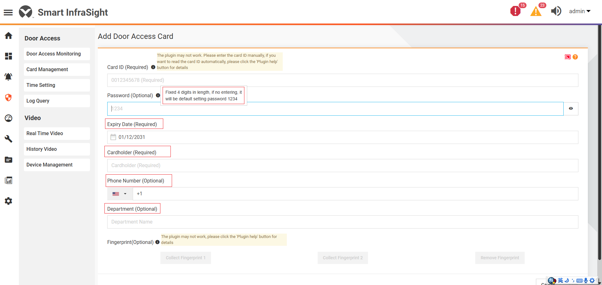

#### 批量授权/取消授权
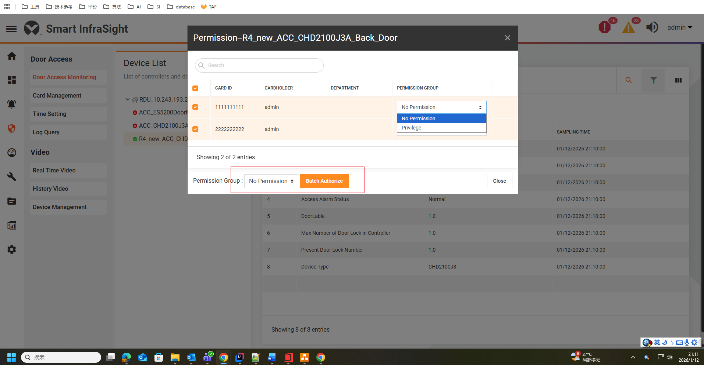

### RDU: SCID
#### 适用于 VRA7002 的卡管理
##### 新增(1)/修改(2)/删除(3)/查询当前卡被授权到了哪些锁(4)
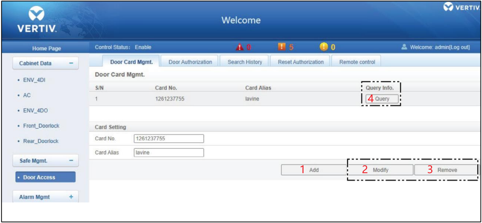

##### 授权
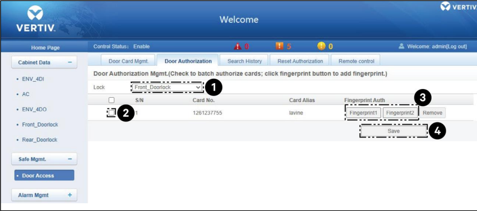

#### 适用于 VRA7003 的卡管理
##### 新增(1)/修改(2)/删除(3)/查询当前卡被授权到了哪些锁(4)
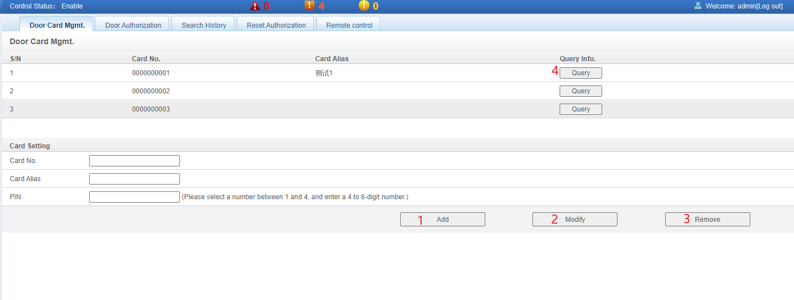

##### PIN 校验
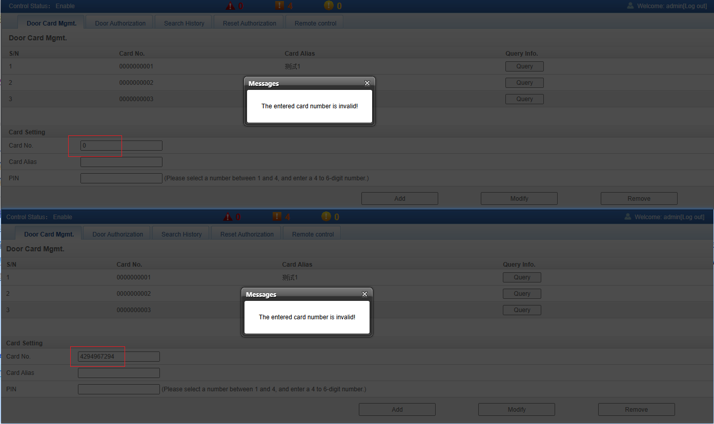

##### 授权
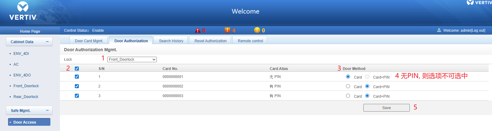

#### 查询历史
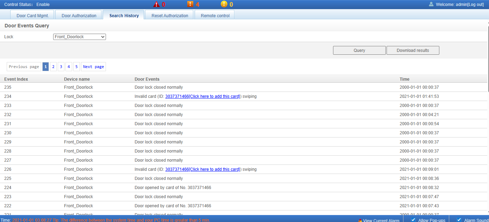

#### 清除锁授权
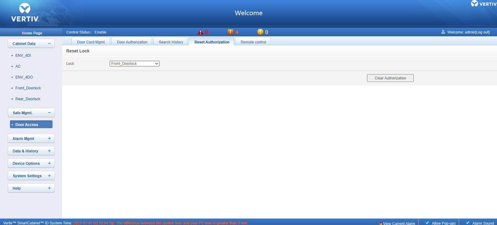

#### 远程开锁
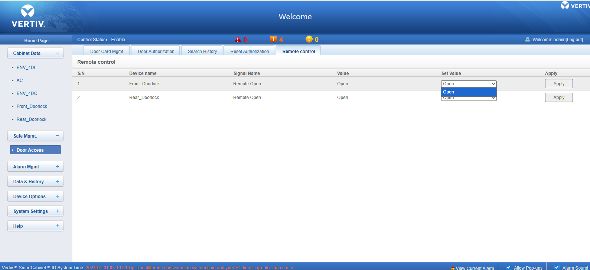