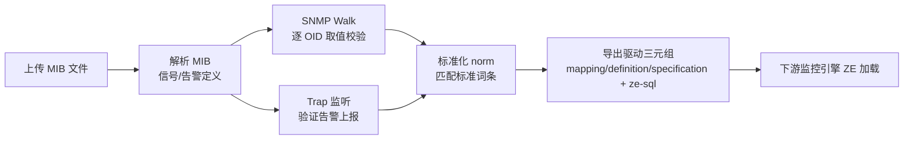
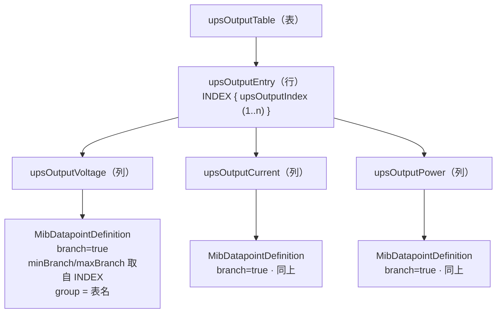
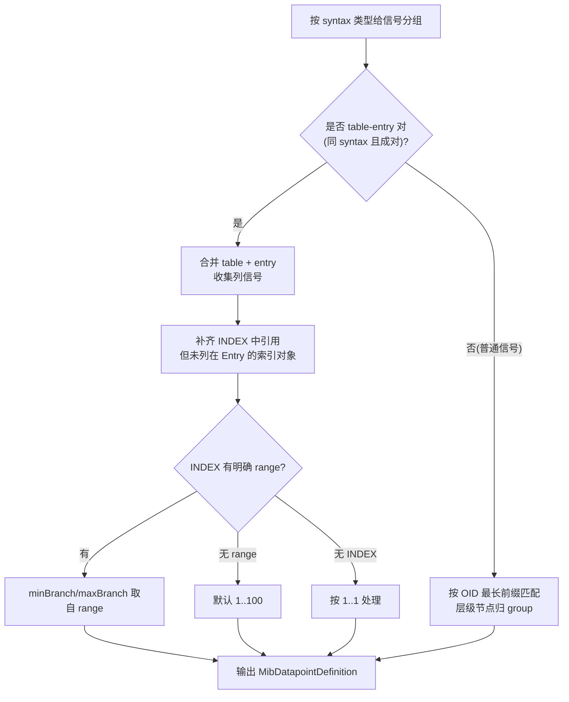
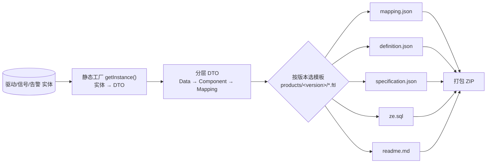

<!-- 标签:[整] —— 用户整理稿(自己梳理过,可作简历/面试素材) -->

# DriverHub（内部驱动开发工具）

## 一、背景与价值

- **痛点**：Vertiv 设备型号众多（UPS / PDU / 服务器等），每新增一个型号，驱动开发人员都要手工配置 OID 表、SNMP 数据类型、信号/告警采集逻辑，过程繁琐、极易出错，且缺乏统一的开发与调试工具，效率低、bug 多。
- **工具定位**：把「MIB 文件 → 设备驱动三元组」的全流程做成可视化、可测试、可导出的内部工具，覆盖 **解析 MIB → SNMP 取值验证 → Trap 验证 → 标准化(norm) → 导出驱动包** 的闭环。
- **成果**：`[TODO: 驱动开发端到端耗时下降 N%]`、`[TODO: 团队 N 名驱动开发人员日常使用]`。

## 二、整体架构

### 2.1 技术栈

- Spring Boot 3.5.6 / Java 21
- Spring Security（API Key 过滤器鉴权）
- MyBatis-Plus + MySQL
- snmp4j 3.9.4 + SNMP4J-SMIPro（MIB 编译：`com.agentpp.mib` / `com.snmp4j.smi`）
- FreeMarker（驱动模板渲染）、EasyExcel（导入导出）、knife4j / springdoc（OpenAPI 文档）

### 2.2 模块划分（基于 IEngine 的插件化架构）

| 模块 | 职责 |
|---|---|
| `webapp` | 宿主启动、安全(API Key)、Swagger、插件装配 |
| `td-core` | 公共能力：FreeMarker 生成基类、工具类、校验 |
| `td-plugin-entity` | 全部实体 / Mapper / Service（MIB、驱动、字典、关系、Trap 日志、项目） |
| `td-plugin-driver-manager` | MIB 管理、设备驱动管理、SNMP walk、Trap 监听、GDD 辅助、ZE 迁移、项目 |
| `td-plugin-export` | MIB 解析、驱动导出(FreeMarker)、Excel 导入导出、项目导入导出 |
| `td-plugin-provider` | 数据字典（标准化词条） |
| `td-plugin-report` | 驱动统计报表 |

> 注：另有 `desktop` 模块已禁用（打包时注释）。

### 2.3 端到端数据流

**核心数据模型**：MIB 定义（datapoint 信号 / event 告警）→ 驱动三元组（mapping / definition / specification）→ 供 ZE 使用的 SQL。

---

## 三、负责的内容（核心模块）

### 3.1 解析 MIB —— `ResolveMibService`（本人核心产出，重点）

将上传的多个 MIB 文件编译为 DriverHub 的「信号(datapoint) / 告警(event)」定义。

**① SMI 类型 → 内部类型映射（"什么转成什么"）**

| 原始 SMI 语法 | valueType | valueCategory |
|---|---|---|
| `INTEGER` / `Integer32` / `Unsigned32` / `Counter(32/64)` / `Gauge(32)` / `TimeTicks` / `TimeStamp` / `TruthValue` / `RowStatus` … | `INTEGER` | `NUMERIC` |
| `OCTET STRING` / `DisplayString` / `SnmpAdminString` / `OBJECT IDENTIFIER` / `IpAddress` / `MacAddress` / `DateAndTime` / `Opaque` … | `STRING` | `TEXT` |
| 带枚举 `enum` 的语法 | `INTEGER` | `ENUMERATION` |
| 带 2 元 `range` 的语法（如 `INTEGER (0..100)`） | `INTEGER` | `NUMERIC` |

> 厂家自定义类型（TEXTUAL-CONVENTION）会先解引用到基础类型，再按上表映射；无法识别的 access/syntax 会被标记为"不支持"并剔除。

**② access 权限归一**

| 原始 access | 归一后 |
|---|---|
| `read-only` | `Read` |
| `read-write` / `read-create` | `ReadWrite` |
| `write-only` | `Write` |

> 仅保留 `Read / Write / ReadWrite` 的信号，其余视为不支持。

**③ 多文件依赖编译**

- 一次可上传多个相互依赖的 MIB，统一 `compileAndLoadMib` 编译加载。
- 识别"缺失依赖 MIB"的错误码 `1100 (IMPORT_UNKNOWN)` / `1111 (MISSING_IMPORT)`，友好返回"缺少依赖 MIB: XXX"，而不是抛原始编译错误。
- `lookForTopLevelMib`：用**直接依赖计数**找出顶层 MIB（依赖别人最多的那个）。
  - 局限：只算直接依赖，不处理间接/循环依赖；对 MIB 场景够用，后续有问题再按实际调整。

**④ 分支（表）信号解析**

MIB 中的表类信号结构为 `xxxTable（表） → xxxEntry（行） → {col1, col2, …}（多列）`。

- 识别 table / entry / 普通信号三类，合并 table 与 entry，并补齐定义在 INDEX 中但未在 Entry 列出的索引对象。
- 由 INDEX 对象的 range 推算分支范围 `minBranch / maxBranch`；
  - 无明确 range 时，默认 `1..100`；无 INDEX 时按 `1..1` 处理。
- 普通（非分支）信号：按 OID **最长前缀匹配**层级节点，归入对应 group。

**图 A：MIB 表结构 → 定义（结构）**

以公有 UPS-MIB 的输出表为例（`upsOutputIndex` 的 range 为 `1..n`）：

**图 B：分支解析算法流程**

> 注：单个 syntax 类型处理失败会被 try-catch 跳过，不中断整体解析。

**⑤ 健壮性**

- 过滤 `deprecated` / `obsolete` 等已废弃的点（只保留 `current` / `mandatory`）。
- 单个类型处理失败不中断整体解析（try-catch 隔离，记录日志继续）。

**入口**：`POST /import/mib/resolve`（multipart 上传多个 MIB）。

### 3.2 SNMP Walk —— `DeviceMibManager.walk`

对已解析出的信号地址，逐个发起 SNMP 请求，把真实设备返回值回填到定义中，用于校验 OID 配置是否正确。

- **最小示例**：对 UPS-MIB 的 OID `1.3.6.1.2.1.33.1.2.4`（电池剩余时间）发送 PDU，拿到返回值后更新该地址的 `value` 字段；若有错误状态，则记录 `errorStatusText`。
- `CommunityTarget` 配置：SNMP 版本、`readCommunity`、端口、默认超时与重试次数。
- 入参地址先做 IPv4 校验。
- **实现演进**：初版（本人，2025-07）用子树遍历 `TreeUtils.walk` + `TreeListener`；后由同事于 2026-01 **因网络原因弃用子树 walk，改为对已知地址集逐点 GET**（代码保留了 walk 版本的注释）。子树 walk 底层是 `GETNEXT/GETBULK` 连续遍历，对网络时延/连续性敏感，现场易超时；目标 OID 集合本就已知，逐点 GET 更稳、可控。

**入口**：`POST /mibs/walk`。

### 3.3 SNMP Trap Receiver —— `MibTrapLogResponder`

启动一个 SNMP Trap 监听器，接收设备主动上报的告警，入库供验证。

- 监听地址 `0.0.0.0/162`（SNMP Trap 标准端口）。
- 实现 snmp4j 的 `CommandResponder`，区分 **V1TRAP** 与 **V2C Trap**。
- **字段转换示例**：
  - `sysUpTime` → 毫秒时间戳
  - `snmpTrapOID` → `TRAP_OID`
  - V1 额外解析 `enterprise` / `genericTrap` / `specificTrap`
  - 其余变量绑定按 `OID → 值` 原样记录
- **落库**：一条 trap → 一行日志（`mibName` / `trapOid` / `source` 源 IP / 完整 JSON 详情）。
- **设计约束**：同一时刻只允许一个 MIB 开启 Trap 监听（`startTrap` 时若已有监听则报错）；原因是 162 端口为单实例占用，按属性区分来源成本高，当前场景一次只调一个足够。

**入口**：`POST /mibs/{mibName}/startTrap`、`POST /mibs/{mibName}/stopTrap`、`GET /mibs/trapLogs`。

### 3.4 导出驱动（FreeMarker）—— `DriverGenerator` + 数据建模 ★本人独立设计与实现

> 这是本人在 DriverHub 中**独立设计并实现**的另一个核心模块，和 3.1 的 MIB 解析并列为两大亮点。
> 对应的「通用设计范式（去业务）」见：[FreeMarker 实战范式](../../../../tech-stack/template/freemarker.md) 与 [设计模式·组合案例](../../../../tech-stack/design_patterns/design-patterns.md)。

**① 问题背景（业务）**

一个驱动需要同时产出多种格式的产物，供下游不同系统使用：

- `xxx.mapping.json` / `xxx.definition.json` / `xxx.specification.json`——即「驱动三元组」
- `ze.sql`——供下游监控引擎 Zero Engine 使用的 SQL
- `readme.md`——说明文件
- 以上统一打包成 ZIP 下载

难点在于：**产物格式会随产品版本演进**（`SI_V400 / SI_V401 / SI_V410`）。若用 Java 硬拼字符串，格式一变就要改代码、极易出错，多版本并存时更难维护。

**② 设计方案**

核心思想是**数据与表现分离**：Java 只负责把数据库实体组装成干净的数据模型，输出格式完全交给 FreeMarker 模板。

落地的设计点：

- **模板方法（Template Method）**：抽象基类 `FreemarkerGenerator`（`td-core`）封装 FreeMarker `Configuration`（UTF-8 / 关闭缓存 / 按目录加载）与 `doGenerate` 渲染骨架；子类 `DriverGenerator` 只定制「按版本选哪个模板」（`getTemplateName`）。
- **静态工厂 + 分层聚合**：`DriverDefinitionData.getInstance` → `DriverDefinitionComponent.getInstance` → `DriverDefinitionMapping.getInstance`，逐层把实体装配成与领域同构的 DTO 树；复杂构造逻辑收敛在 `getInstance` 内，调用方清爽。
- **一模型多产出（DRY）**：同一份 datapoint / event 定义，用 `isDefinition` / `isSpecification` 标志位过滤，复用于 definition、specification、ze-sql 三种产物。
- **版本化模板目录**：模板按 `products/<版本>/*.ftl` 组织，常量收口在 `ExportConstant`；**新增一个产品版本 = 加一个模板目录，Java 代码零改动**。

**③ 取舍与可改进点（诚实记录）**

- `DriverSqlData.getInstance` 在静态方法里用 `ApplicationContext.getBean(DriverGenerator.class)` 取 Bean——属 **Service Locator**，让数据类耦合了 Spring 容器、不利单测；更好的做法是把 `DriverGenerator` 作为参数传入（内部的 `buildDriverDefinition` 已经是传参，入口这层没贯彻）。
- `driver.getName().split("-")[1]` 这种按「-」取段的命名解析在多处重复、强耦合命名规范，较脆弱；可抽 `DriverNameParser` 统一。
- FreeMarker 模板**没有编译期校验**，靠约定 + 测试样例兜底；空值用 `!` / `??` 防御。

**④ 成果**

- 新增产品版本 / 输出格式几乎 **零 Java 改动**，扩展成本从「改代码」降为「加模板」。
- `[TODO: 支撑 N 个产品版本 / 导出耗时]`。

**⑤ 面试一分钟讲法**

> 需求是「一份驱动数据要导出成多种格式、还要随版本演进」。我没有用 Java 拼字符串，而是做了**数据与表现分离**：Java 用静态工厂把实体组装成分层 DTO，格式交给按版本组织的 FreeMarker 模板；基类用模板方法封装渲染骨架，子类只管选模板。这样加版本/加格式只改模板、不动代码。代价是模板缺编译期检查，我用测试样例和空值防御兜底；另外早期在数据对象里反向取了容器 Bean，是个可以改进的耦合点。

**入口**：`POST /export/drivers`。

---

## 四、配套能力（同组协作，非本人重点，简述）

- **设备驱动管理**：驱动 CRUD、克隆、改名、`mib → driver` 迁移、命名规则生成（如 `Liebert-GXT5-Rdu101 → LIEBERTGXT5-GENERIC`）。
- **标准化(norm)**：用 `TextSimilarity` 多算法（Levenshtein / NGram / Jaccard / Cosine / JaroWinkler）做名称相似度匹配，把设备点匹配到标准词条。
- **其他**：GDD 标准定义辅助、数据字典、Excel 导入导出、项目导入导出、从 ZE 迁移驱动、驱动统计报表。

---

## 五、简历 / 面试素材

**一句话亮点**：设计并实现内部工具 DriverHub，打通「MIB 解析 → SNMP walk/trap 验证 → 标准化 → 导出驱动包」全流程；其中独立负责 **MIB 解析引擎**（分支表结构解析、多文件依赖编译、SMI 类型体系映射）、**Trap 接收**与 **FreeMarker 驱动导出**。

**高频追问预案**：
- 为什么 walk 用逐点 GET 而不是子树 walk？（原为子树 walk，后因网络原因改逐点 GET；地址集合已知，GET 更稳可控）
- Trap 为什么只允许单个 MIB 监听？（162 端口单实例，按来源区分成本高）
- 分支表的 branch 范围怎么来的？（INDEX 的 range 推算，无 range 则默认 1..100）
- 依赖缺失怎么处理？（识别错误码 1100/1111 友好提示缺哪个 MIB）

## 六、待补充 / 存疑

- `[TODO]` 补齐效率提升、使用人数等量化数据。
- `[结论]` walk 改逐点 GET 的动机 = **网络原因**（子树 `GETNEXT/GETBULK` 遍历易超时），由同事于 2026-01 重构；本人初版（2025-07）为子树 walk。
